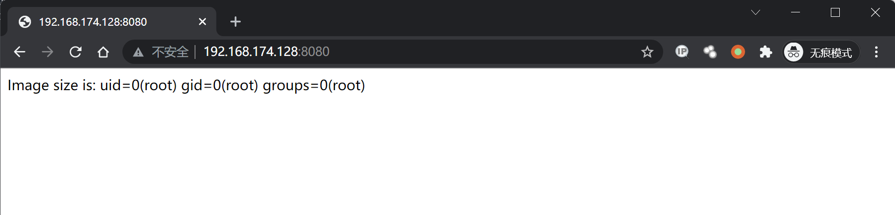
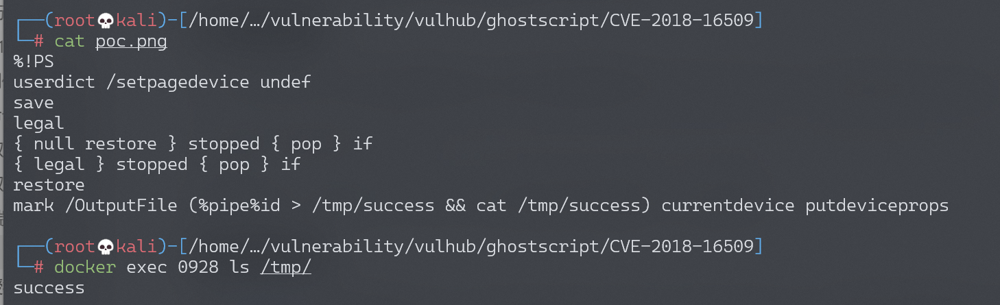

# GhostScript 沙箱绕过（命令执行）漏洞 CVE-2018-16509

<!-- vulwiki-editorial:start -->
## 校订与适用边界

- 适用前提：旧Ghostscript实验9.23、ImageMagick允许对应解释器处理攻击文件
- 证据范围：只给PoC文件链接和结果图，非内嵌代码；与65同Vulhub核心步骤，65补原始PS但损坏

### 本次正文校订

- 按实际内容修正 1 处代码围栏语言标记，保留其中方法与请求内容。

### 尚未解决的证据缺口

以下限制仍适用于后文历史材料；相关版本、结果或修复结论不能据此视为已验证：

- 最新版9.23是当时实验描述，必须改为固定测试版本
- 库默认按内容调用Ghostscript依政策/版本/格式，不能覆盖所有PIL/ImageMagick部署
- 需补完整受影响/修复范围与环境目录

本页为文本校订，未执行代码、PoC 或目标请求；原图仅保留引用，未据此确认复现成功。
<!-- vulwiki-editorial:end -->

## 技术正文与历史材料

## 漏洞描述

Ghostscript是一套建基于Adobe、PostScript及可移植文档格式（PDF）的页面描述语言等而编译成的免费软件。

8 月 21 号，Tavis Ormandy 通过公开邮件列表，再次指出 GhostScript 的安全沙箱可以被绕过，通过构造恶意的图片内容，将可以造成命令执行、文件读取、文件删除等漏洞：

- http://seclists.org/oss-sec/2018/q3/142
- https://bugs.chromium.org/p/project-zero/issues/detail?id=1640

GhostScript 被许多图片处理库所使用，如 ImageMagick、Python PIL 等，默认情况下这些库会根据图片的内容将其分发给不同的处理方法，其中就包括 GhostScript。

## 环境搭建

Vulhub执行如下命令启动漏洞环境（其中包括最新版 GhostScript 9.23、ImageMagick 7.0.8）：

```shell
docker-compose up -d
```

环境启动后，访问`http://your-ip:8080`将可以看到一个上传组件。

## 漏洞复现

上传[poc.png](https://github.com/vulhub/vulhub/blob/master/ghostscript/CVE-2018-16509/poc.png)，将执行命令`id > /tmp/success && cat /tmp/success`。



进入容器，可以看到/tmp/success已被创建。




---

> 来源：Threekiii/Awesome-POC
