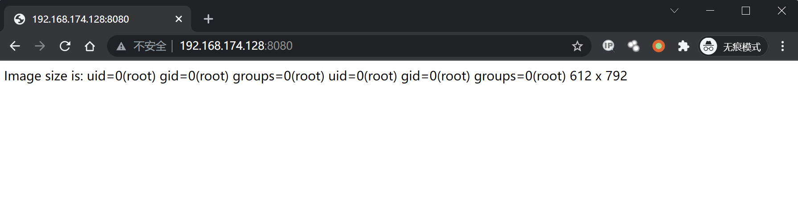
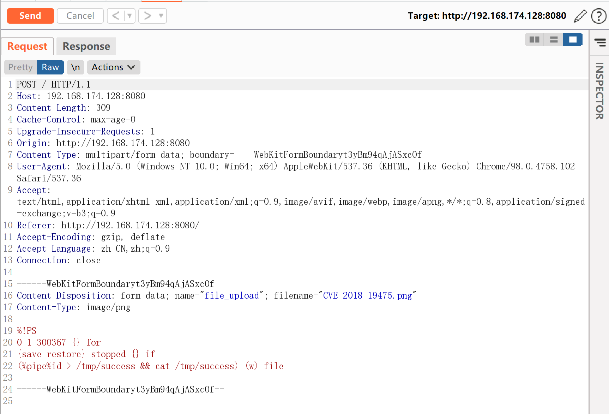
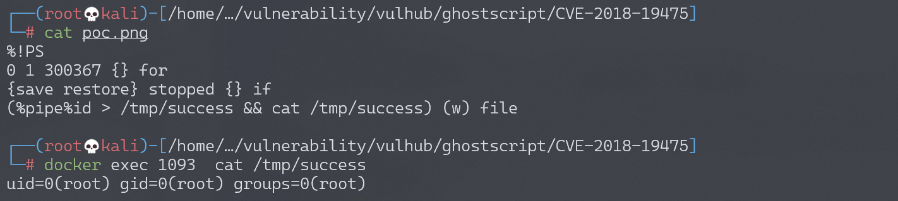

# GhostScript 沙箱绕过（命令执行）漏洞 CVE-2018-19475

<!-- vulwiki-editorial:start -->
## 校订与适用边界

- 适用前提：Ghostscript<9.26、实验9.25和ImageMagick7.0.8-20、允许解释恶意PS
- 证据范围：步骤完全依PoC文件/截图，但PoC没有实际链接或内容；66补HTTP+PS片段，两者应合并保全

### 本次正文校订

- 按实际内容修正 1 处代码围栏语言标记，保留其中方法与请求内容。

### 尚未解决的证据缺口

以下限制仍适用于后文历史材料；相关版本、结果或修复结论不能据此视为已验证：

- 缺PoC资源链接，独立复现不完整
- 鉴权/上传来自实验Web应用而非Ghostscript固有API
- 无带外回连不等于安全，应记录检测局限

本页为文本校订，未执行代码、PoC 或目标请求；原图仅保留引用，未据此确认复现成功。
<!-- vulwiki-editorial:end -->

## 技术正文与历史材料

## 漏洞描述

2018年底来自Semmle Security Research Team的Man Yue Mo发表了CVE-2018-16509漏洞的变体CVE-2018-19475，可以通过一个恶意图片绕过GhostScript的沙盒，进而在9.26以前版本的gs中执行任意命令。

参考链接：

- https://blog.semmle.com/ghostscript-CVE-2018-19475/
- https://bugs.ghostscript.com/show_bug.cgi?id=700153

## 环境搭建

Vulhub执行如下命令启动漏洞环境（其中包括 GhostScript 9.25、ImageMagick 7.0.8-20）：

```shell
docker-compose up -d
```

环境启动后，访问`http://your-ip:8080`将可以看到一个上传组件。

## 漏洞复现

将POC作为图片上传，执行命令`id > /tmp/success && cat /tmp/success`：




Burpsuite抓包查看执行命令：



进入容器，可以看到/tmp/success已被创建，`id`命令执行结果也被成功写入文件。



真实环境下通常无法直接回显漏洞执行结果，你需要使用带外攻击的方式来检测漏洞。


---

> 来源：Threekiii/Awesome-POC
