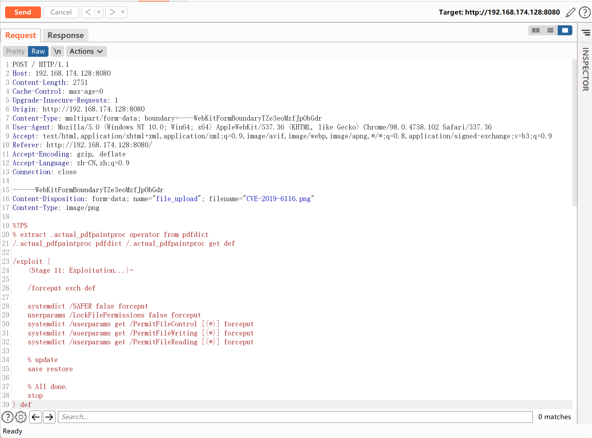

# GhostScript 沙箱绕过（命令执行）漏洞 CVE-2019-6116

<!-- vulwiki-editorial:start -->
## 校订与适用边界

- 适用前提：实验Ghostscript9.26、ImageMagick7.0.8-27并允许PS处理
- 证据范围：PoC外链与执行结果图完整可定位，67有内嵌PS解释，应关联合并而保留代码细节

### 本次正文校订

- 修正正文中的 ghostscriptf → ghostscript 转录错误，资源路径保持原样。
- 按实际内容修正 1 处代码围栏语言标记，保留其中方法与请求内容。

### 尚未解决的证据缺口

以下限制仍适用于后文历史材料；相关版本、结果或修复结论不能据此视为已验证：

- 最新版9.26需改历史实验版本
- 影响版本及修复版本未明确
- ghostscriptf拼写错误，调用链默认性须受policy配置限定

本页为文本校订，未执行代码、PoC 或目标请求；原图仅保留引用，未据此确认复现成功。
<!-- vulwiki-editorial:end -->

## 技术正文与历史材料

## 漏洞描述

2019年1月23日晚，Artifex官方在ghostscript的master分支上提交合并了多达6处的修复。旨在修复 CVE-2019-6116 漏洞，该漏洞由 Google 安全研究员 Tavis 于2018年12月3日提交。该漏洞可以直接绕过 ghostscript 的安全沙箱，导致攻击者可以执行任意命令/读取任意文件。

GhostScript 被许多图片处理库所使用，如 ImageMagick、Python PIL 等，默认情况下这些库会根据图片的内容将其分发给不同的处理方法，其中就包括 GhostScript。

参考链接：

- https://bugs.chromium.org/p/project-zero/issues/detail?id=1729&desc=2
- https://www.anquanke.com/post/id/170255

## 环境搭建

Vulhub执行如下命令启动漏洞环境（其中包括最新版 GhostScript 9.26、ImageMagick 7.0.8-27）：

```shell
docker-compose up -d
```

环境启动后，访问`http://your-ip:8080`将可以看到一个上传组件。

## 漏洞复现

作者给出了[POC](https://github.com/vulhub/vulhub/blob/master/ghostscript/CVE-2019-6116/poc.png)，上传这个文件，即可执行`id > /tmp/success`：



进入容器，可以看到/tmp/success已被创建，`id`命令执行结果也被成功写入文件。


---

> 来源：Threekiii/Awesome-POC
