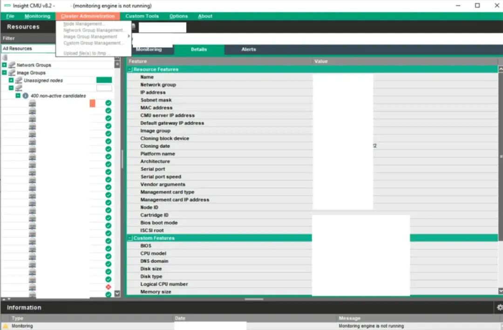
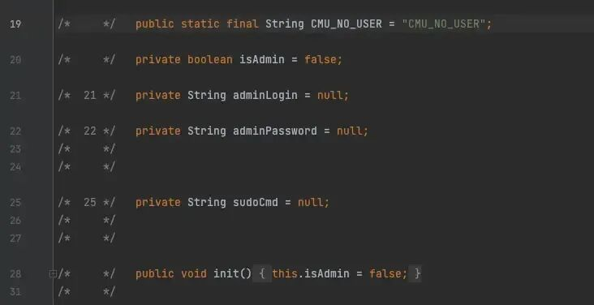
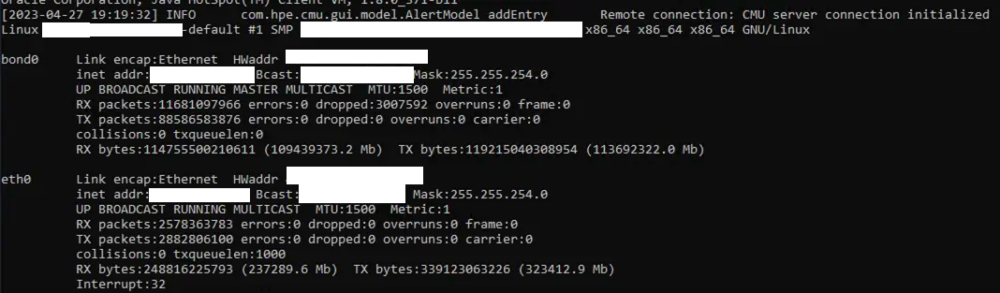

# 惠普HPE CMU曝高危漏洞：攻击者可绕过认证执行远程命令

<!-- vulwiki-editorial:start -->
## 校订与适用边界

- 适用前提：CMUv8.2后端RMI可达，无需原有凭据；可修改客户端
- 证据范围：executeCmdLine直接从客户端调用说明服务端授权问题；代码返回isAdmin不变，重点是调用本身非简单return true

### 尚未解决的证据缺口

以下限制仍适用于后文历史材料；相关版本、结果或修复结论不能据此视为已验证：

- 只有v8.2实验未列完整影响范围
- EOL不修补结论需HPE公告支持
- ifconfig回显本身不证明root，需要身份输出或服务配置
- JNLP客户端与后端RMI端口/网络限制应明确

本页为文本校订，未执行代码、PoC 或目标请求；原图仅保留引用，未据此确认复现成功。
<!-- vulwiki-editorial:end -->

## 技术正文与历史材料

 FreeBuf   2025-04-01 18:15  
  
  
  
  
HPE Insight集群管理工具（CMU）v8.2版本中存在一个关键的无认证远程代码执行漏洞（CVE-2024-13804），攻击者可利用该漏洞绕过认证机制，在后端服务器上以root权限执行任意命令。  
  
  
  
  
  
该高危漏洞影响用于管理高性能计算集群的工具，可能导致攻击者完全控制整个计算环境。漏洞根源在于CMU应用程序在实现客户端授权检查时存在根本性设计缺陷，缺乏有效的服务端验证机制。  
  
  
  
  
应用程序匿名访问情况（来源：Navigating The Shadows）  
  
  
攻击者可通过篡改Java客户端应用程序来突破安全限制，获取管理员权限。该漏洞利用无需任何认证凭证，对暴露在公网的系统威胁尤为严重。  
  
  
**漏洞技术分析**  
  
  
  
安全研究团队Navigating The Shadows（0xbad53c）发现，该漏洞存在于应用程序的Java网络启动协议（JNLP）客户端架构中。研究人员通过反编译应用程序的JAR文件并修改关键授权检查代码，可将客户端武器化，通过远程方法调用（RMI）向服务器发送特权命令。  
  
  
由于HPE已将该软件标记为生命周期终止（End-of-Life）产品，意味着不会发布安全补丁，进一步放大了漏洞危害。仍在使用该软件的组织建议实施严格的网络级隔离作为主要缓解措施。  
  
  
**漏洞利用细节**  
  
  
  
漏洞利用过程始于下载并反编译CMU客户端应用程序（cmugui_standalone.jar），该程序通过1099端口连接后端服务器。  
  
  
  
  
isadmin验证机制（来源：Navigating The Shadows）  
  
  
分析反编译代码发现，存在多处客户端"isAdmin"授权检查，通过简单修改以下函数即可绕过：  
```
public Boolean isUserAdmin() {
    try {
        CMUResponse cmuResponse;
        String output = "";
        cmuResponse = ModelDispatcher.getRMIModel().executeCmdLine("ifconfig");
        output = (String)cmuResponse.getData("stdout");
        System.out.println(output);
    } catch (IOException e) {
        e.printStackTrace();
        return this.isAdmin;
    }
    return this.isAdmin;
}
```  
  
  
重新编译修改后的客户端后，攻击者可通过ModelDispatcher.getRMIModel().executeCmdLine()方法以root权限在服务器上执行任意命令，图中展示了成功执行"ifconfig"命令的情况。  
  
  
  
  
成功执行ifconfig命令（来源：Navigating The Shadows）  
  
  
该漏洞最初于2023年5月报告给HPE，但经过与多家安全机构多次跟进后，直到2025年1月才获得CVE编号，凸显了漏洞披露流程中存在的挑战。  
  
  
【  
FreeBuf粉丝交流群招新啦！  
  
在这里，拓宽网安边界  
  
甲方安全建设干货；  
  
乙方最新技术理念；  
  
全球最新的网络安全资讯；  
  
群内不定期开启各种抽奖活动；  
  
FreeBuf盲盒、大象公仔......  
  
扫码添加小蜜蜂微信回复「加群」，申请加入群聊】  
  
  
  
  
  
  
  
  
  
  
  
  
  
  
[](https://mp.weixin.qq.com/s?__biz=MjM5NjA0NjgyMA==&mid=2651312407&idx=1&sn=60289b6b056aee1df1685230aa453829&token=1964067027&lang=zh_CN&scene=21#wechat_redirect)  
  
  
  


---

> 来源：gelusus/wxvl（微信公众号漏洞文章自动归档，原文见文首链接）
