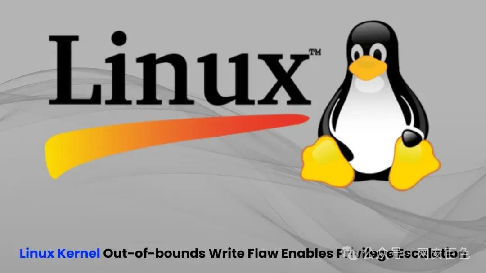
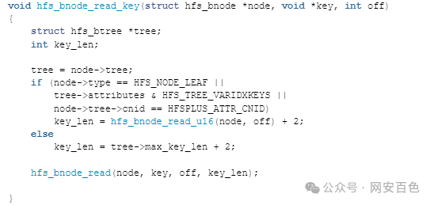

## 2026-10-03 编号核验

CVE-2025-0927 已被撤销。官方理由是：对于只能由初始用户命名空间 CAP_SYS_ADMIN 权限挂载的文件系统，由损坏镜像引起的文件系统缺陷不作为该 CVE 收录，包括委托挂载情形。本页 HFS+ 路径分析与 udisks2 / polkit 活动会话主张保留；后者的具体部署边界尚未获得独立核验，不能把该主张或撤销决定扩大成对所有配置的结论。

# Linux 内核越界写入漏洞（ CVE-2025-0927 ）

<!-- vulwiki-editorial:start -->
## 校订与适用边界

- 适用前提：本地用户可挂载恶意HFS+镜像并触发相应扩展属性路径；udisks2/polkit活动会话配置是关键
- 证据范围：区分通常挂载需特权与桌面本地会话路径，根因函数/利用阶段摘要尚可但无源码/PoC

### 尚未解决的证据缺口

以下限制仍适用于后文历史材料；相关版本、结果或修复结论不能据此视为已验证：

- 函数hfs_bnode_read_key与HFS+路径命名需原研究核对
- 最高6.12.0/Ubuntu多个发行版缺修复包和分支矩阵，不能无限期应用
- 内核版本-generic被翻译通用
- 相同表格字段重复，缺原始研究和Ubuntu公告链接

本页为文本校订，未执行代码、PoC 或目标请求；原图仅保留引用，未据此确认复现成功。
<!-- vulwiki-editorial:end -->

## 技术正文与历史材料

 网安百色   2025-03-22 19:35  
  
  
  
点击上方  
蓝字  
关注我们吧~  
  
  
  
近二十年来，Linux 内核中的一个严重漏洞一直未被发现，该漏洞允许本地用户获得受影响系统的 root 权限。  
  
这个名为 CVE-2025-0927 的 Linux 内核的 HFS+ 文件系统驱动程序中的越界写入漏洞会影响运行最高版本 6.12.0 的内核的系统，其中带有 Linux 内核 6.5.0-18-generic 的 Ubuntu 22.04 被确认为易受攻击。  
  
Linux 内核越界写入漏洞  
  
根据 SSD 公告，该漏洞存在于 HFS+ 驱动程序中，该驱动程序支持 Apple 的传统文件系统格式，该格式是主要的 MacOS X 文件系统，直到 2017 年被 APFS 取代。  
  
自 2005 年初始 git 存储库构建 1da177 以来，该漏洞一直存在，自 2.6.12-rc2 版本以来，在 Linux 内核中一直未被检测到。  
  
此漏洞的核心是 B 树节点处理中的缓冲区溢出。fs/hfsplus/bnode.c 中易受攻击的函数hfs_bnode_read_key无法正确验证有关密钥大小的边界条件：  
  
  
  
在此代码中，该函数未实现适当的边界检查，从而允许攻击者触发可能损坏内核内存的越界写入。  
<table><tbody><tr style="box-sizing: border-box;background-color: rgb(240, 240, 240);"><td style="box-sizing: border-box;padding: 2px 8px;border: 1px solid rgba(0, 0, 0, 0);word-break: break-word;"><strong msttexthash="14330498" msthash="150" style="box-sizing: border-box;font-weight: bold;">风险因素</strong></td><td style="box-sizing: border-box;padding: 2px 8px;border: 1px solid rgba(0, 0, 0, 0);word-break: break-word;"><strong msttexthash="3259074" msthash="151" style="box-sizing: border-box;font-weight: bold;">详</strong></td></tr><tr style="box-sizing: border-box;"><td style="box-sizing: border-box;padding: 2px 8px;border: 1px solid rgba(0, 0, 0, 0);word-break: break-word;"><section>受影响的产品</section></td><td style="box-sizing: border-box;padding: 2px 8px;border: 1px solid rgba(0, 0, 0, 0);word-break: break-word;"><section>– Linux 内核最高版本 6.12.0- Ubuntu 22.04 LTS 与 Linux 内核 6.5.0-18-通用 - Ubuntu 20.04 LTS、22.04 LTS、24.04 LTS、24.10</section></td></tr><tr style="box-sizing: border-box;background-color: rgb(240, 240, 240);"><td style="box-sizing: border-box;padding: 2px 8px;border: 1px solid rgba(0, 0, 0, 0);word-break: break-word;"><section>冲击</section></td><td style="box-sizing: border-box;padding: 2px 8px;border: 1px solid rgba(0, 0, 0, 0);word-break: break-word;"><section>权限提升</section></td></tr><tr style="box-sizing: border-box;"><td style="box-sizing: border-box;padding: 2px 8px;border: 1px solid rgba(0, 0, 0, 0);word-break: break-word;"><section>利用先决条件</section></td><td style="box-sizing: border-box;padding: 2px 8px;border: 1px solid rgba(0, 0, 0, 0);word-break: break-word;"><section>能够挂载特制的 HFS+ 文件系统，本地用户访问</section></td></tr><tr style="box-sizing: border-box;background-color: rgb(240, 240, 240);"><td style="box-sizing: border-box;padding: 2px 8px;border: 1px solid rgba(0, 0, 0, 0);word-break: break-word;"><section>CVSS 3.1 分数</section></td><td style="box-sizing: border-box;padding: 2px 8px;border: 1px solid rgba(0, 0, 0, 0);word-break: break-word;"><section>8.8 （高）</section></td></tr></tbody></table>  
  
冲击	权限提升  
  
利用先决条件	能够挂载特制的 HFS+ 文件系统，本地用户访问  
  
CVSS 3.1 分数	8.8 （高）  
  
使此漏洞特别令人担忧的是它对标准用户的可访问性。  
  
虽然挂载文件系统通常需要提升的权限，但 Ubuntu 等现代 Linux 发行版带有默认的 polkit 规则，允许具有活动本地会话的用户通过 udisks2 服务挂载文件系统。  
  
利用此漏洞的攻击者将：  
  
创建特制的 HFS+ 文件系统，其中包含故意格式错误的 B 树结构。  
  
使用标准用户权限挂载此恶意文件系统。  
  
通过设置扩展属性（使用 setxattr）来触发漏洞。  
  
使用复杂的堆作技术来实现内存损坏。  
  
通过泄漏内核地址来绕过 KASLR（内核地址空间布局随机化）。  
  
最终通过覆盖敏感的内核结构（如 modprobe_path）来实现权限提升。  
  
缓解措施  
  
此漏洞会影响许多运行易受攻击内核版本的 Linux 发行版。具有活动本地会话的用户可以利用它来获得 root 权限，从而可能危及整个系统。  
  
Ubuntu 发布了 CVE-2025-0927 的安全公告和修复程序。强烈建议系统管理员立即应用所有可用的安全更新。  
  
这个新发现的漏洞代表了 Linux 系统的重大安全问题。用户和管理员应确保他们的系统使用最新的安全补丁进行更新，以减轻这种威胁。  
  
**免责声明**  
：  
  
本公众号所载文章为本公众号原创或根据网络搜索下载编辑整理，文章版权归原作者所有，仅供读者学习、参考，禁止用于商业用途。因转载众多，无法找到真正来源，如标错来源，或对于文中所使用的图片、文字、链接中所包含的软件/资料等，如有侵权，请跟我们联系删除，谢谢！  
  
  
  
  

---

> 来源：gelusus/wxvl（微信公众号漏洞文章自动归档，原文见文首链接）
