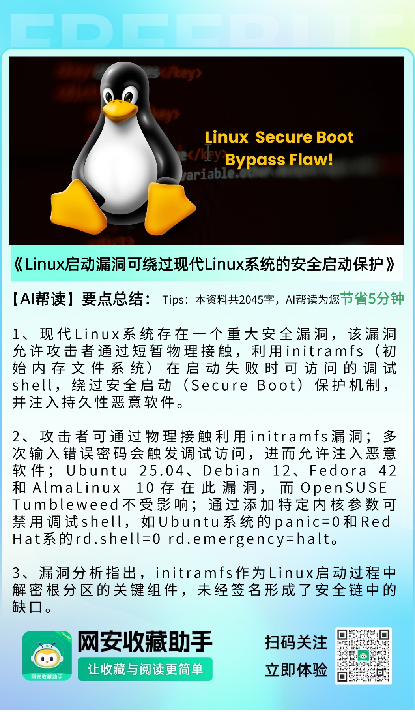
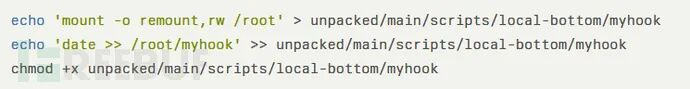

# Linux启动漏洞可绕过现代Linux系统的安全启动保护

<!-- vulwiki-editorial:start -->
## 校订与适用边界

- 适用前提：短暂物理接触、相应恢复shell、可修改未验证启动分区/镜像，之后合法用户解锁根分区
- 证据范围：应定位启动链配置/设计风险而非所有Linux同一版本漏洞；不同发行版步骤与测试条件只新闻摘要

### 尚未解决的证据缺口

以下限制仍适用于后文历史材料；相关版本、结果或修复结论不能据此视为已验证：

- TPM记录PCR度量本身不是强制拒绝启动，需策略绑定/密钥封存或验证机制
- panic=0禁恢复shell依赖具体initramfs实现，不可作通用内核保证
- SSD原生加密不能无条件替代启动链完整性
- OpenSUSE免疫应限测试默认配置，不是产品永远不受影响
- 缺原研究/发行版官方缓解验证

本页为文本校订，未执行代码、PoC 或目标请求；原图仅保留引用，未据此确认复现成功。
<!-- vulwiki-editorial:end -->

## 技术正文与历史材料

 FreeBuf   2025-07-08 11:03  
  
  
  
  
  
  
  
现代Linux发行版存在一个重大漏洞，攻击者通过短暂物理接触即可利用initramfs（初始内存文件系统）操控绕过安全启动（Secure Boot）保护机制。  
  
  
该攻击利用系统启动失败时可访问的调试shell，注入持久性恶意软件，这些恶意软件可在系统重启后继续存活，即使用户输入了加密分区的正确密码仍能维持访问权限。  
  
  
**Part01**  
## 核心要点  
  
  
1. 攻击者通过物理接触可利用initramfs在启动失败时的调试shell绕过安全启动保护  
  
  
2. 多次输入错误密码会触发调试访问，允许向未签名的initramfs组件注入持久性恶意软件  
  
  
3. Ubuntu 25.04、Debian 12、Fedora 42和AlmaLinux 10存在漏洞；OpenSUSE Tumbleweed不受影响  
  
  
4. 添加内核参数可禁用调试shell（Ubuntu系统使用panic=0，Red Hat系使用rd.shell=0 rd.emergency=halt）  
  
  
**Part02**  
## Linux initramfs漏洞分析  
  
  
据Alexander Moch指出，该漏洞的核心在于初始内存文件系统（initramfs）——这是Linux启动过程中用于解密根分区的关键组件。  
  
  
与内核镜像和模块不同，initramfs本身通常未经签名，在安全链中形成了可被利用的缺口。当用户多次输入加密根分区的错误密码后，多数发行版会在超时后自动进入调试shell。  
  
  
攻击者可通过该调试shell挂载包含专用工具和脚本的外部USB驱动器。攻击流程包括：使用unmkinitramfs命令解包initramfs，将恶意钩子注入scripts/local-bottom/目录，然后重新打包修改后的initramfs。  
  
  
Moch研究中展示的关键脚本如下：  
  
  
  
  
  
该恶意钩子会在根分区解密后执行，将文件系统重新挂载为可写状态并建立持久性访问。由于攻击遵循常规启动流程且未修改已签名的内核组件，因此能规避传统防护机制。  
  
  
**Part03**  
## 各发行版受影响情况  
  
  
多发行版测试显示不同程度的易受攻击性：  
  
- Ubuntu 25.04仅需三次错误密码尝试即可获得调试shell访问  
  
- Debian 12可通过长按RETURN键约一分钟触发  
  
- Fedora 42和AlmaLinux 10的默认initramfs缺少usb_storage内核模块，但攻击者可通过Ctrl+Alt+Delete触发重启并选择救援条目绕过限制  
  
值得注意的是，OpenSUSE Tumbleweed因其默认启动分区加密实现方式而对此攻击免疫。安全专家将该漏洞归类为"邪恶女仆"攻击场景，需要短暂物理接触目标系统。  
  
  
**Part04**  
## 缓解措施  
  
  
有效防护方案包括：  
  
  
1. 修改内核命令行参数：  
- Ubuntu系添加panic=0  
  
- Red Hat系添加rd.shell=0 rd.emergency=halt 这些参数强制系统在启动失败时直接停止而非提供调试shell  
  
2. 其他防护措施：  
- 配置引导加载程序密码要求  
  
- 启用SSD原生加密  
  
- 对启动分区实施LUKS加密  
  
3. 高级解决方案：  
- 统一内核镜像（UKI）：将内核与initramfs合并为单一签名二进制文件  
  
- 可信平台模块（TPM）：将initramfs完整性度量值存入平台配置寄存器（PCR）  
  
**参考来源：**  
  
Linux Boot Vulnerability Allows Bypass of Secure Boot Protections on Modern Linux Systems  
  
https://cybersecuritynews.com/linux-boot-vulnerability-allows-bypass-of-secure-boot-protections/  
  
  
###   
###   
###   
  
**推荐阅读**  
  
  
  
### 电台讨论  
  
****  
  
  
  
  
  
   
  

---

> 来源：gelusus/wxvl（微信公众号漏洞文章自动归档，原文见文首链接）
