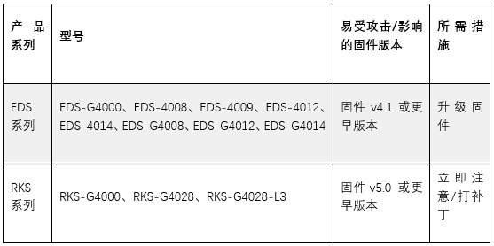

# OpenSSH 严重漏洞可导致 Moxa 以太网交换机易受RCE攻击

<!-- vulwiki-editorial:start -->
## 校订与适用边界

- 适用前提：ssh-agent转发至攻击者可控系统且存在可利用PKCS#11库加载链，<9.3p2依赖；设备型号/固件具体条件仅图
- 证据范围：正文提代理转发前提但首段说任意未认证远程直接设备RCE，易误导为sshd服务端暴露漏洞

### 尚未解决的证据缺口

以下限制仍适用于后文历史材料；相关版本、结果或修复结论不能据此视为已验证：

- 主CVE缺元数据
- 受影响设备表仅未视检图片，需文本型号与固件范围及Moxa官方链接
- CWE-428未加引号路径与PKCS#11不可信搜索路径机制可能不符，需CNA/官方核对
- EDS4.1.58/RKS5.0.4不能无型号匹配泛用

本页为文本校订，未执行代码、PoC 或目标请求；原图仅保留引用，未据此确认复现成功。
<!-- vulwiki-editorial:end -->

## 技术正文与历史材料

Abinaya  代码卫士   2026-01-14 10:48  
  
  
    
聚焦源代码安全，网罗国内外最新资讯！  
  
**编译：代码卫士**  
  
**Moxa 公司发布安全公告，提醒注意OpenSSH中的一个严重漏洞CVE-2023-38408影响多款工业以太网交换机型号。**  
  
****  
****  
  
**该漏洞的CVSS 3.1评分为9.8，可导致未经身份验证的远程攻击者在无需用户交互的情况下，直接在受影响的设备上执行任意代码。该漏洞的根源在于OpenSSH的ssh-agent组件（9.3p2之前版本）中，其PKCS#11功能模块存在不可靠的搜索路径问题。**  
  
**该漏洞（CWE-428）被归类为“未加引号的搜索路径”问题。当SSH代理被转发到攻击者控制的系统时，此问题可导致远程代码执行。它是因此前CVE-2016-10009漏洞的修复不完整造成的。攻击者可以利用该漏洞实现完整的系统入侵，包括破坏数据的机密性、完整性和可用性。**  
  
****  
****  
**受影响产品**  
  
****  
  
****  
  
****  
**该漏洞影响 Moxa 多个交换机系列：**  
  
  
  
**Moxa建议用户立即联系技术支持团队以获取最新的安全补丁。对于受影响EDS系列设备，用户应将固件升级至4.1.58版本；而RKS系列用户则应升级至5.0.4版本。**  
  
**在补丁部署完成前，Moxa建议实施严格的网络访问控制措施，例如配置防火墙和访问控制列表，将设备通信范围限定于可信网络。用户应通过VLAN划分或物理隔离方式将生产运营网络与企业网络进行隔离，关闭不必要的网络服务，并避免将设备直接暴露在互联网环境中。部署多因素认证机制、基于角色的访问控制，并对网络流量实施持续监测以发现异常活动，这些措施能够进一步强化安全防护。定期进行漏洞评估并严格执行固件更新计划，是构建全面防御策略必不可少的关键环节。**  
  
****  
  
 开源  
卫士试用地址：  
https://oss.qianxin.com/#/login  
  
  
 代码卫士试用地址：https://sast.qianxin.com/#/login  
  
  
  
  
  
  
  
  
  
**推荐阅读**  
  
[OpenSSH 新漏洞使SSH服务器易受中间人和DoS 攻击](https://mp.weixin.qq.com/s?__biz=MzI2NTg4OTc5Nw==&mid=2247522278&idx=1&sn=7cfb4b23ad311c542e16a6d9517313ce&scene=21#wechat_redirect)  
  
  
[OpenSSH 易受RCE新漏洞影响](https://mp.weixin.qq.com/s?__biz=MzI2NTg4OTc5Nw==&mid=2247520029&idx=2&sn=b58737a69aeafc6a694ae82500739603&scene=21#wechat_redirect)  
  
  
[堪比 Log4Shell：数百万台 OpenSSH 服务器易受 regreSSHion 远程攻击](https://mp.weixin.qq.com/s?__biz=MzI2NTg4OTc5Nw==&mid=2247519949&idx=1&sn=c2f44f54f4920efad56874aada444bc2&scene=21#wechat_redirect)  
  
  
[Terrapin 攻击可降低 OpenSSH 连接的安全性](https://mp.weixin.qq.com/s?__biz=MzI2NTg4OTc5Nw==&mid=2247518446&idx=2&sn=97a0cfc5e54ab41c3e6241a76bd6a019&scene=21#wechat_redirect)  
  
  
[OpenSSH 修复预认证双重释放漏洞](https://mp.weixin.qq.com/s?__biz=MzI2NTg4OTc5Nw==&mid=2247515493&idx=1&sn=10c488e3633714016c305152a77ee339&scene=21#wechat_redirect)  
  
  
  
  
  
**原文链接**  
  
https://cybersecuritynews.com/moxa-ethernet-switches-openssh/  
  
  
题图：Pixa  
bay Licens  
e  
  
  
**本文由奇安信编译，不代表奇安信观点。转载请注明“转自奇安信代码卫士 https://codesafe.qianxin.com”。**  
  
  
  
  
  
  
  
  
**奇安信代码卫士 (codesafe)**  
  
国内首个专注于软件开发安全的产品线。  
  
     
  
   
觉得不错，就点个 “  
在看  
” 或 "  
赞  
” 吧~  
  

---

> 来源：gelusus/wxvl（微信公众号漏洞文章自动归档，原文见文首链接）
