# Prometheus 未授权访问漏洞处理

<!-- vulwiki-editorial:start -->
## 校订与适用边界

- 适用前提：原2.17.1升级3.0.0、Grafana同机调用；需明确网络范围、TLS与认证配置
- 证据范围：真实迁移经验含成功和残留指标问题，应保留为运维加固而非单漏洞复现；明确不保留旧数据属于作者场景选择

### 尚未解决的证据缺口

以下限制仍适用于后文历史材料；相关版本、结果或修复结论不能据此视为已验证：

- Basic Auth不是加密，示例仍HTTP；跨网络需TLS
- touchweb-auth.yml/vimweb-auth.yml缺空格，YAML admin未缩进
- htpasswd/tr命令使用智能引号，不能原样运行
- 2.x直接升3.0及Grafana升级应有兼容/备份/回滚计划，作者主动丢历史数据不可泛化建议
- 部分指标未恢复，不能说整个升级完整验证成功
- 将密码写草稿不应作为安全建议，截图需避免暴露凭据

本页为文本校订，未执行代码、PoC 或目标请求；原图仅保留引用，未据此确认复现成功。
<!-- vulwiki-editorial:end -->

## 技术正文与历史材料

Hai  知微守望   2025-07-07 08:21  
  
# 背景  
  
经常收到甲方的各种安全漏洞通知单，这次就是几年前部署的prometheus未授权访问漏洞。  
# 漏洞现象  
  
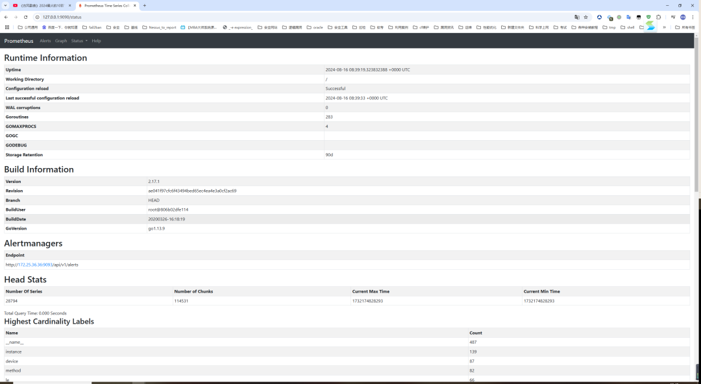  
# 分析  
  
prometheus收集所有exporter的指标数据，汇总后通常由grafana去调用它，界面来展示，类似与kibana。当然也有可能是其他组件来调用，本项目主要只有grafana去调用它，且grafana也部署在本机，其实处理的办法也很简单，防火墙启动起来，只允许本机调用，对外接口不暴露，就能解决问题。但这不是解决问题的初衷。既然是未授权访问，那就加上身份的认证来解决问题。关键参数：Basic Auth。  
通过Basic Auth功能进行加密，在浏览器登录UI的时候需要输入用户密码，访问Prometheus api的时候也需要加上用户密码。  
生产的prometheus版本2.17.1，版本太古老，Prometheus于2.24版本（包括2.24）之后提供Basic Auth功能进行加密访问，因此还需要做个升级。（跨大版本的升级，不考虑历史数据的兼容问题，不保留历史数据）  
# 升级  

```
##下载升级包地址
wget https://github.com/prometheus/prometheus/releases/download/v3.0.0/prometheus-3.0.0.linux-amd64.tar.gz
##解压
tar -zxf prometheus-3.0.0.linux-amd64.tar.gz
cd prometheus-3.0.0.linux-amd64
mv prometheus.yml  prometheus.yml_bak
##拷贝生产prometheus.yml到新版目录下
cp ../prometheus-2.17.1.linux-amd64/prometheus.yml .
##修改systemctl配置文件
vim /etc/systemd/system/multi-user.target.wants/prometheus.service
-----
[Unit]
Description=Prometheus
Documentation=https://prometheus.io/
After=network.target
[Service]
Type=simple
User=prometheus
ExecStart=/usr/local/prometheus-3.0.0.linux-amd64/prometheus \
                   --config.file=/usr/local/prometheus-3.0.0.linux-amd64/prometheus.yml \
                   --storage.tsdb.path=/usr/local/prometheus-3.0.0.linux-amd64/data \
                   --web.console.templates=/usr/local/prometheus-3.0.0.linux-amd64/consoles \
                   --web.console.libraries=/usr/local/prometheus-3.0.0.linux-amd64/console_libraries \
                   --storage.tsdb.retention.time=90d
Restart=on-failure

[Install]
WantedBy=multi-user.target
-----
cd ..
chown -R prometheus:prometheus prometheus-3.0.0.linux-amd64
systemctl daemon-reload
systemctl stop prometheus
systemctl start prometheus

```  
  
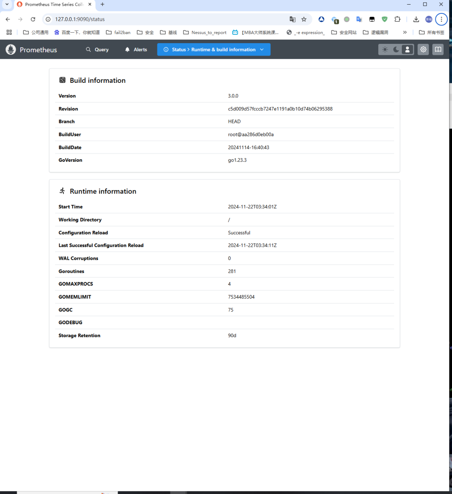  
  
查看targets，收集的指标数据也都上来了（图略）  
# 查阅官方文档  
  
参考：https://prometheus.io/docs/prometheus/latest/configuration/https/  
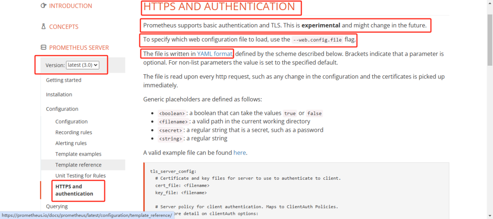  
**意思是说，prometheus是支持这种基础的身份验证的方式和TLS,但这个将来将会改变。需要将配置写到yaml格式的文件里面，再通过--web.config.file来调用文件。**  
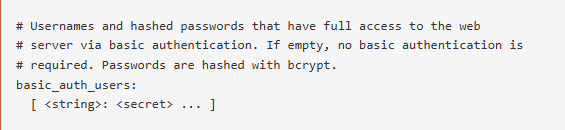  
  
参考：https://prometheus.io/docs/prometheus/latest/command-line/prometheus/  
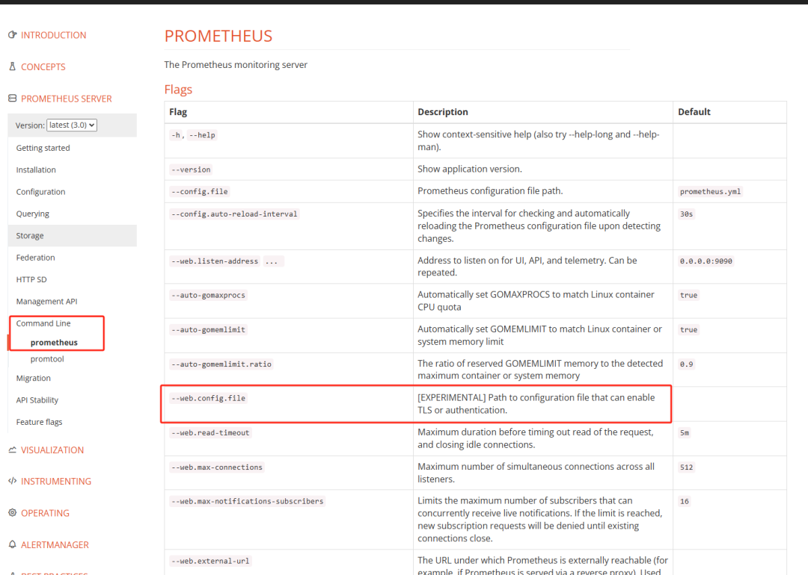  
  
# 配置身份认证  
## 生成bcrypt哈希值  
```
yum -y install httpd-tools
htpasswd -nBC 12 ‘’ | tr -d ‘:\n’
强烈建议密码写到草稿上，再复制粘贴进去两遍

```  
  
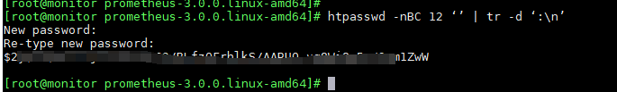  
## 配置密码配置文件  
```
touchweb-auth.yml
vimweb-auth.yml
basic_auth_users:
admin:XXXXXXXXXXXXXXXXXXXXXXXXXXXXXXXXXXXXXXXXXXXXXXXXXXXX

```  
  
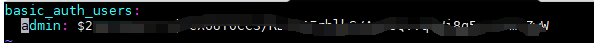  
## 验证文件语法是否正确  
```
./promtool check web-config web-auth.yml

```  
  
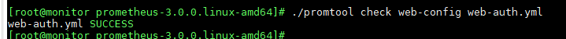  
## 修改systemctl配置文件  
```
vim /etc/systemd/system/multi-user.target.wants/prometheus.service
[Unit]
Description=Prometheus
Documentation=https://prometheus.io/
After=network.target
[Service]
Type=simple
User=prometheus
ExecStart=/usr/local/prometheus-3.0.0.linux-amd64/prometheus \
                   --config.file=/usr/local/prometheus-3.0.0.linux-amd64/prometheus.yml \
                   --storage.tsdb.path=/usr/local/prometheus-3.0.0.linux-amd64/data \
                   --web.console.templates=/usr/local/prometheus-3.0.0.linux-amd64/consoles \
                   --web.console.libraries=/usr/local/prometheus-3.0.0.linux-amd64/console_libraries \
                   --storage.tsdb.retention.time=90d \
                   --web.config.file=/usr/local/prometheus-3.0.0.linux-amd64/web-auth.yml
Restart=on-failure

[Install]
WantedBy=multi-user.target

```  
```
systemctl daemon-reload
systemctl restart prometheus

```  
# 重启服务  
  
服务启动正常  
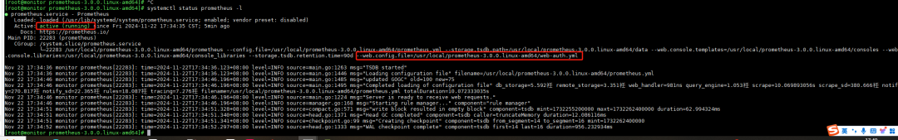  
  
# 验证  
  
http://127.0.0.1:9090/metrics  
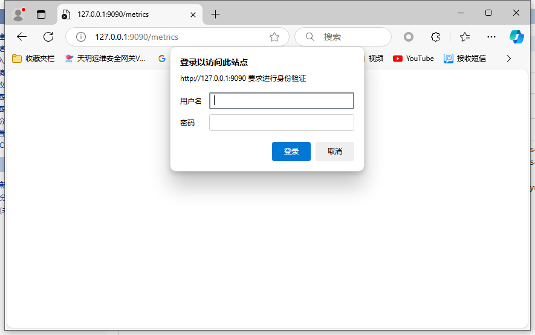  
  
http://127.0.0.1:9090  
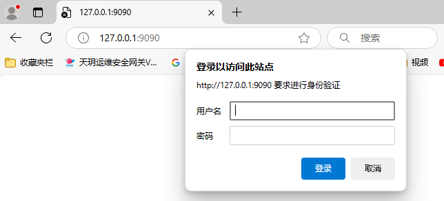  
  
不输入密码提示  
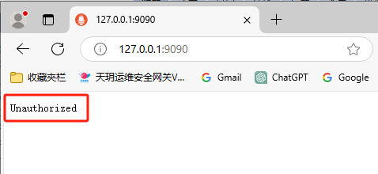  
  
输入密码后：  
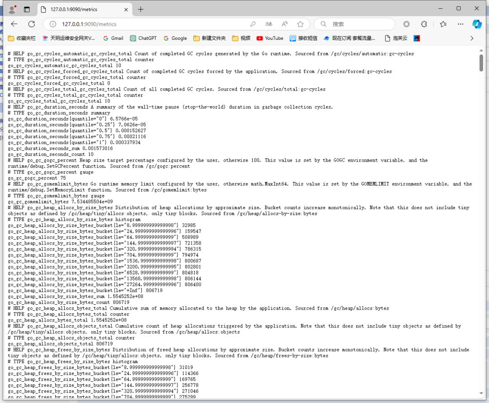  
  
# 适配grafana  
## 配置grafana-yum源  
  
参考https://grafana.com/docs/grafana/latest/setup-grafana/installation/redhat-rhel-fedora/  
```
或者直接执行
sudo yum install -y https://dl.grafana.com/enterprise/release/grafana-enterprise-11.3.0-1.x86_64.rpm
参考https://grafana.com/grafana/download?pg=get&plcmt=selfmanaged-box1-cta1
systemctl restart grafana-server

```  
  
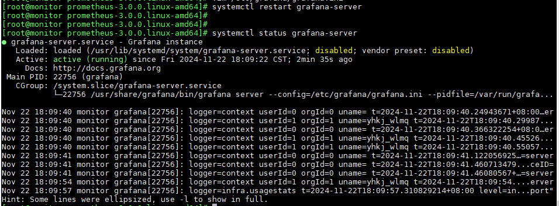  
## 登录grafana页面配置数据源  
  
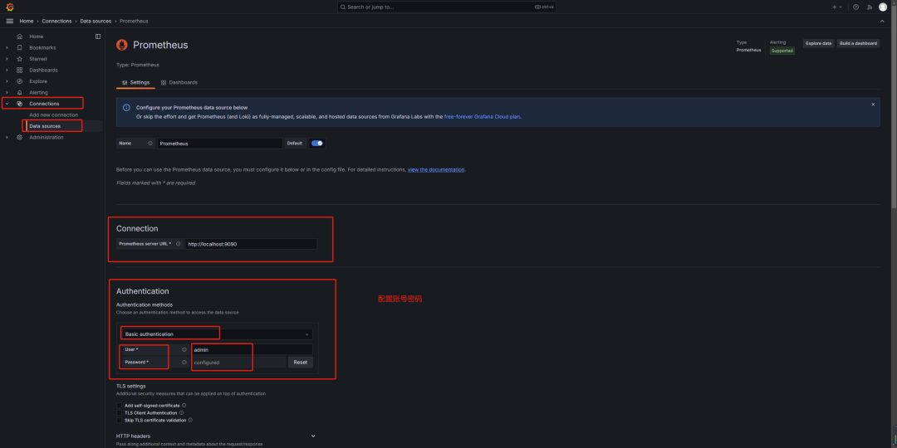  
  
点测试  
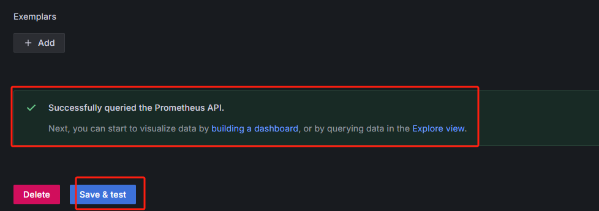  
  
查看面板  
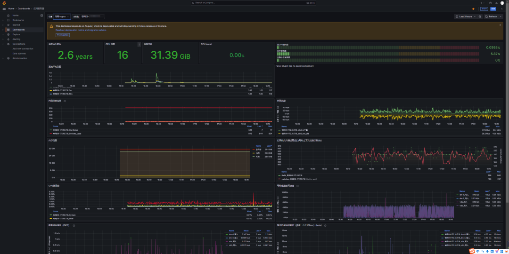  
  
  
数据展示没问题，部分数据库无法正常显示，可能是是node_exporter也需要升级，可能是采集数据的字段有变化，或者grafana的json也需要改，这是后话了，有时间再折腾。  
  
真心感觉自己要学习的知识好多，也有好多大神卧虎藏龙、开源分享。作为初学者，我们可能有差距，不论你之前是什么方向，是什么工作，是什么学历，是大学大专中专，亦或是高中初中，只要你喜欢安全，喜欢渗透，就朝着这个目标去努力吧！有差距不可怕，我们需要的是去缩小差距，去战斗，况且这个学习的历程真的很美，安全真的有意思。但切勿去做坏事，我们需要的是白帽子，是维护我们的网络，安全路上共勉。  
  
  
**本文版权归作者和微信公众号平台共有，重在学习交流，不以任何盈利为目的，欢迎转载。**  
  
****  
**由于传播、利用此文所提供的信息而造成的任何直接或者间接的后果及损失，均由使用者本人负责，文章作者不为此承担任何责任。公众号内容中部分攻防技巧等只允许在目标授权的情况下进行使用，大部分文章来自各大安全社区，个人博客，如有侵权请立即联系公众号进行删除。若不同意以上警告信息请立即退出浏览！！！**  
  
****  
**敲敲小黑板：《刑法》第二百八十五条　【非法侵入计算机信息系统罪；非法获取计算机信息系统数据、非法控制计算机信息系统罪】违反国家规定，侵入国家事务、国防建设、尖端科学技术领域的计算机信息系统的，处三年以下有期徒刑或者拘役。违反国家规定，侵入前款规定以外的计算机信息系统或者采用其他技术手段，获取该计算机信息系统中存储、处理或者传输的数据，或者对该计算机信息系统实施非法控制，情节严重的，处三年以下有期徒刑或者拘役，并处或者单处罚金；情节特别严重的，处三年以上七年以下有期徒刑，并处罚金。**  
  
  
  


---

> 来源：gelusus/wxvl（微信公众号漏洞文章自动归档，原文见文首链接）
