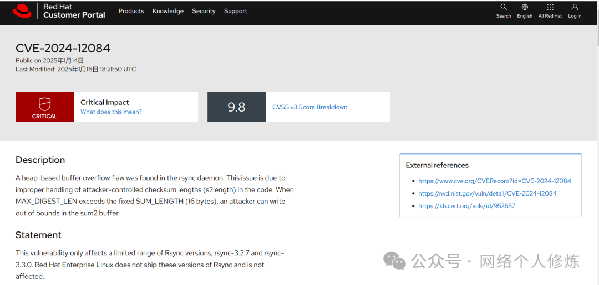
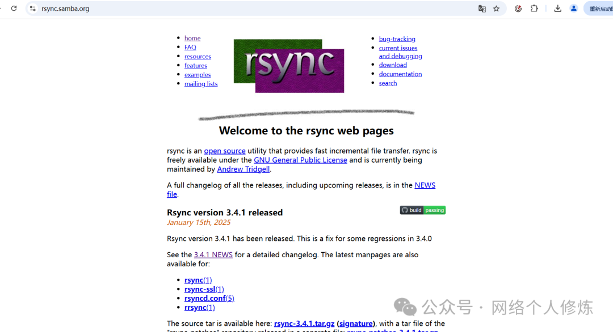
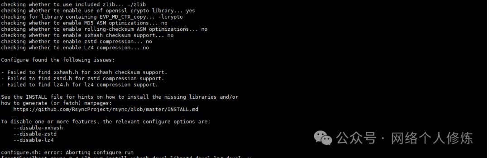
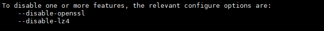
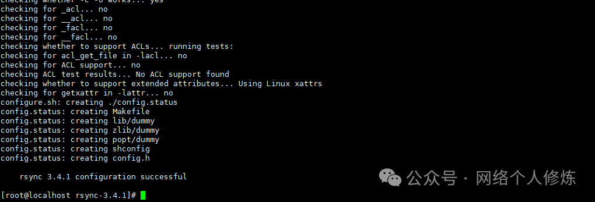
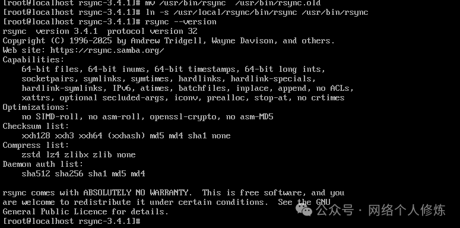

# 修复 Rsync 漏洞 CVE-2024-12084

<!-- vulwiki-editorial:start -->
## 校订与适用边界

- 适用前提：受影响rsync具体构建/角色；文只说3.2.7/3.3.0，无触发条件
- 证据范围：教程展示编译3.4.1并替换二进制，不是漏洞复现；版本输出只验证CLI路径，不能证明运行daemon已更新

### 本次正文校订

- 按实际内容修正 1 处代码围栏语言标记，保留其中方法与请求内容。
- 移除 8 组不含任何正文的空代码围栏；保留全部非空代码。

### 尚未解决的证据缺口

以下限制仍适用于后文历史材料；相关版本、结果或修复结论不能据此视为已验证：

- 仅3.2.7和3.3.0受影响的排他断言需官方范围核对
- 替换/usr/bin包管理文件会破坏维护状态，需优先发行版修复包并记录回滚
- 未说明daemon重启、调用路径和服务验证
- configure依赖补齐后应明确重新configure，不只make
- 空代码围栏和重复启用字样

本页为文本校订，未执行代码、PoC 或目标请求；原图仅保留引用，未据此确认复现成功。
<!-- vulwiki-editorial:end -->

## 技术正文与历史材料

原创 ralap  网络个人修炼   2025-02-10 02:00  
  
Rsync 最近爆出一个重大漏洞（CVE-2024-12084），CVSS 评分为 9.8。该漏洞仅存在于 Rsync 3.2.7 和 3.3.0 版本中。为了解决这一安全问题，建议将 Rsync 升级到 3.4.0 或更高版本。当前最新版本为 3.4.1（官网链接https://rsync.samba.org/）。  
  
  
  
  
  
  
  
  
### 具体安装步骤  
#### 步骤一：下载并解压 Rsync 源码  
  
下载 Rsync 3.4.1 源代码：  
  
```shell
wget https://download.samba.org/pub/rsync/src/rsync-3.4.1.tar.gz
```  
  
  
解压源代码：  
```
tar -zxvf rsync-3.4.1.tar.gz
```  
```
进入解压后的目录：
```  
```
cd rsync-3.4.1
```  
#### 步骤二：配置、编译并安装  
  
创建安装目录：  
```
mkdir /usr/local/rsync
```  
  
配置 Rsync：  
```
./configure --prefix=/usr/local/rsync
```  
  
中间报错提示缺少xxhash-devel、libzstd-devel、lz4、lz4-devel、C编译器,阿里云源缺少相关组件，因此启用**启用 EPEL 仓库，安装依赖库**  
```
yum install epel-release -y
yum install xxhash-devel libzstd-devel lz4-devel gcc -y
```  
  
  
  
  
  
  
  
  
安装完成后重新执行步骤2  
  
```
make && make install
```  
  
  
  
#### 步骤三：替换旧版本的 Rsync  
  
备份旧版本的 Rsync  
  
在替换旧版本之前，建议先备份现有的 Rsync 可执行文件：  
```
mv /usr/bin/rsync /usr/bin/rsync.old
```  
  
创建符号链接指向新版本  
  
创建一个符号链接，使新的 Rsync 版本成为默认版本：  
```
ln -s /usr/local/rsync/bin/rsync /usr/bin/rsync
```  
#### 步骤四：验证安装  
  
检查 Rsync 版本  
  
验证新版本是否已正确安装：  
```
rsync --version
```  
  
  
  
参考链接：  
  
https://avd.aliyun.com/detail?id=AVD-2024-12084&timestamp__1384=WqjOY5YKiIeIxCqGNDQRenx0rXnEe%3DD8BUeD  
  
https://access.redhat.com/security/cve/CVE-2024-12084  
  
  
  
  
  
  
  
  
  
  
  
  
  
  
  
  
  
  
  
  


---

> 来源：gelusus/wxvl（微信公众号漏洞文章自动归档，原文见文首链接）
