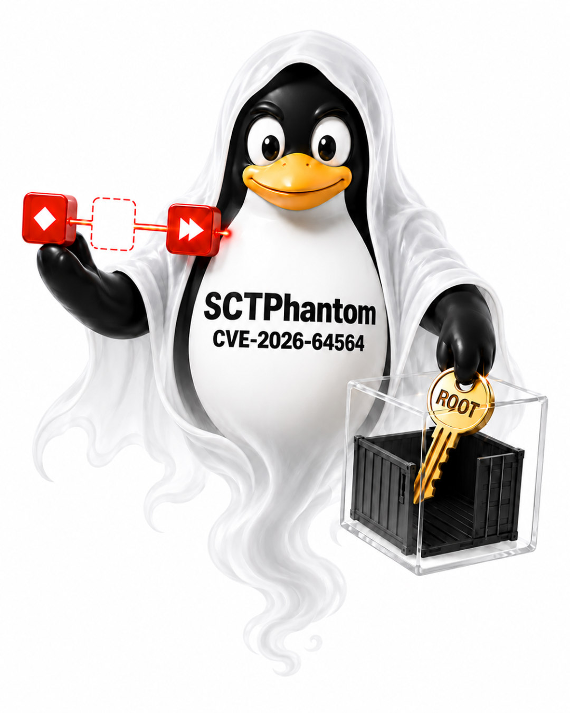
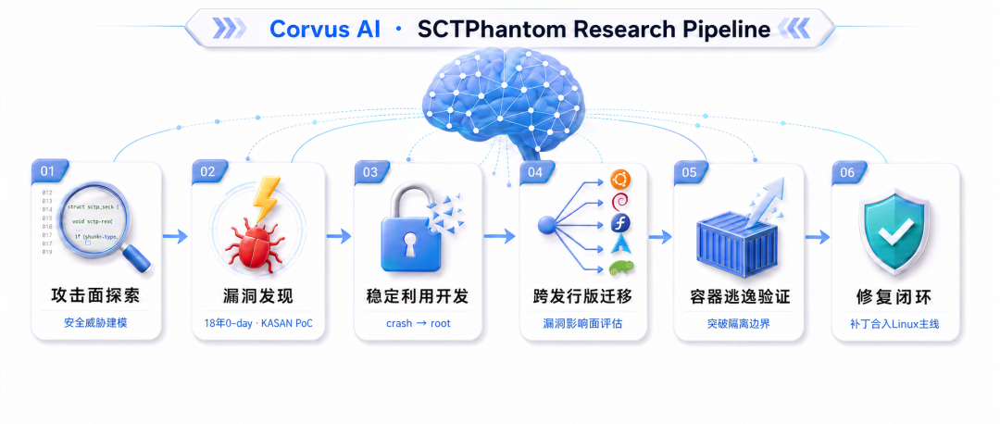
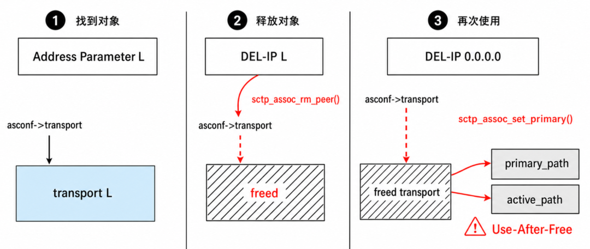
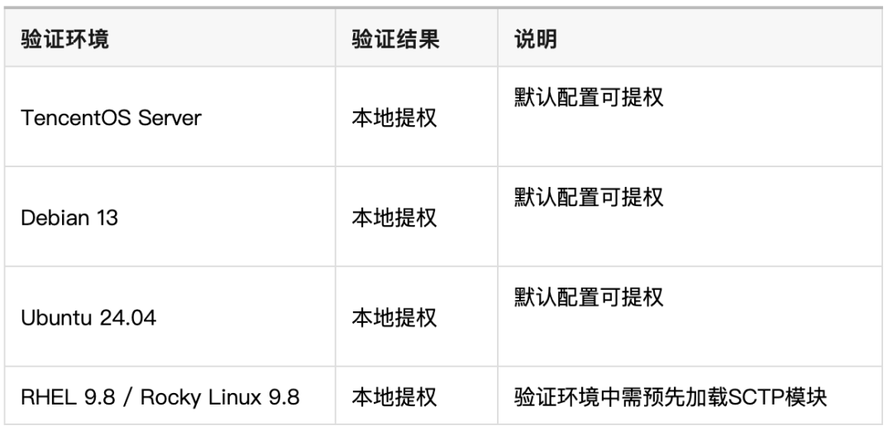
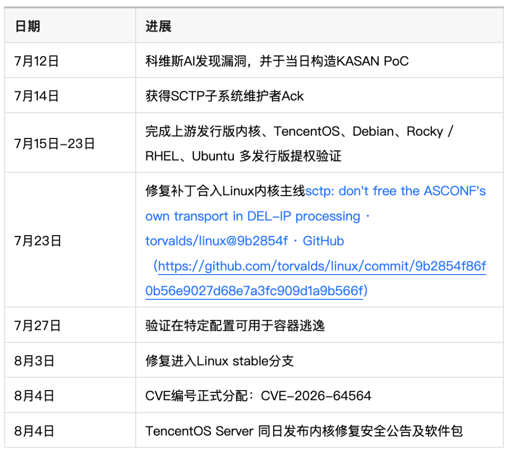

# TencentOS 科维斯AI首秀：SCTPhantom——潜伏18年的Linux内核提权与容器逃逸漏洞

<!-- vulwiki-editorial:start -->
## 校订与适用边界

- 适用前提：本地低权限或特定容器配置、SCTP功能可用；RHEL实验需预加载模块
- 证据范围：明确crash≠可利用、发行版/防护/容器配置边界，研究者报告root验证但未公布完整技术细节；表格和时间线仅图片未视检

### 尚未解决的证据缺口

以下限制仍适用于后文历史材料；相关版本、结果或修复结论不能据此视为已验证：

- 应归Linux内核/SCTP并关联TencentOS，64531是另一漏洞不可合并
- 缺上游commit、各发行版修复包、容器配置的文本记录
- 18年无人发现/Agent对比等宣传性断言不等于可独立验证事实；保留研究者归因

### 操作风险与资料使用

- 含资源消耗、延时或崩溃验证：可能影响服务可用性；限制请求次数、并发与超时，保留无攻击负载的对照结果。

本页为文本校订，未执行代码、PoC 或目标请求；原图仅保留引用，未据此确认复现成功。
<!-- vulwiki-editorial:end -->

## 技术正文与历史材料

朱雀实验室
                    朱雀实验室  腾讯安全应急响应中心   2026-08-05 04:17  
  
2026年7月23日，Linux内核主线合入了一份很短的补丁。  
  
它只改动了6行代码，修复的是一个  
已在Linux内核中存在超过18年的 0day 漏洞（CVE-2026-64564）。攻击者可以利用它从普通用户权限提升到服务器 root 权限；在特定容器配置中，攻击者还可能利用其突破容器隔离，取得宿主机root权限。  
  
在这18年间，Linux内核经历数百个版本迭代，接受全球数千名开发者审阅，被Google syzkaller等顶级fuzzer反复测试，也经无数安全研究者与 Agent 反复审计，却始终无人发现。我们将这个漏洞命名为 SCTPhantom（SCTP 协议栈中长期潜伏的幽灵般漏洞）。  
  
  
  
发现它的，是TencentOS安全团队打造的内核漏洞研究智能体   
—— 科维斯 AI (Corvus AI）。  
  
这是科维斯 AI 的第一次公开亮相。  
  
  
  
  
2026年，AI能够编写代码、分析代码并发现漏洞，已经不再新鲜。  
  
前沿模型能力的持续提升，显著推动了漏洞发现数量的增长，也让AI进入高度专业的漏洞研究领域成为一件可被验证的事。然而，从发现内存错误到构造出稳定可用的利用，仍然是一项复杂的长链路工程。此前实验中，安全研究员观察到 Mythos Preview 能够发现内核中的内存越界写，并将影响推进至宿主机拒绝服务，却未能直接完成一条可在真实环境中稳定生效的完整利用链。  
  
这说明，漏洞发现、根因确认、利用开发与环境适配，必须被组织成可持续运行的完整研究流程。  
  
为此，TencentOS安全团队朱雀实验室构建了科维斯AI，并围绕真实内核漏洞研究流程，打造了支持长链路、多轮次实验的Agent Harness框架。该框架将模型能力与专业安全工具、实验状态管理相结合，使复杂的内核安全研究能够保持连贯性与可验证性。同时，科维斯AI并非依赖单一Agent从头至尾执行，而是将研究过程系统化组织：通过多Agent协同与安全专家研判相结合，在证据充分时推进，在方向不成立时及时调整。只有经过稳定复现与交叉验证的结论，才会进入后续的利用与修复流程。  
  
Agent Harness框架保障长链路研究的连续性，多Agent协同扩大探索与验证能力，安全专家负责方法指导与关键判断。三者结合，将模型能力真正转化为可持续、可验证、可规模化复用的内核漏洞研究能力。  
  
  
  
依靠这套体系，科维斯AI完成了SCTPhantom从漏洞发现、稳定root提权到跨发行版迁移的全链路研究与验证。  
  
  
  
  
SCTPhantom位于Linux内核SCTP协议栈。  
  
SCTP常见于电信、专用通信及部分基础设施场景。与普通TCP连接不同，一个SCTP连接可以同时使用多个网络地址，也允许在连接存续期间动态增加或删除地址。  
  
问题就藏在地址删除逻辑中。   
  
单独执行时，相关操作都符合协议规则；但当三个特定参数按照特定顺序出现在同一条消息中，前一个操作已经释放的内核对象，会被后一个操作继续使用，由此形成内存释放后使用漏洞（Use-After-Free）。  
  
  
  
这类问题难以通过单次函数检查发现。研究者需要同时理解协议状态、参数执行顺序，以及同一个内核对象跨越多个处理阶段的生命周期。   
  
相关代码在2008年进入Linux上游，随v2.6.25发布。此后，它经历了大量版本迭代、代码审计和自动化Fuzzing测试，相关风险却一直没有被发现。  
  
直到科维斯 AI 进入这条此前没有被充分探索的执行路径。  
  
  
  
  
围绕这条路径，科维斯 AI 自主编写 PoC，并在真实内核中反复验证。第一版 PoC 就触发了系统崩溃，但一次 crash 只能证明问题可以发生，还不足以确认它的可利用性和实际危害。  
  
围绕每次运行结果，科维斯 AI 继续参与根因分析和利用验证，与研究员共同研判攻击者能否控制关键内核对象、能否获得所需地址信息，以及能否在真实防护配置下建立稳定利用链。  
  
经过多轮实验和复核，科维斯 AI 最终将一次内核crash推进为稳定本地提权：在 Linux 普通用户权限环境中，成功获得了系统 root 权限。  
  
  
从普通用户权限提权到root的漏洞利用视频  
  
SCTPhantom 属于本地提权漏洞。攻击者先取得服务器上的普通用户权限，或进入满足触发条件的容器。成功利用后，这一有限立足点可以被提升为 root 权限；在已经验证的容器配置中，攻击链还能进一步越过容器边界，取得宿主机 root 权限。  
  
可以把它理解为：坏人原本只有一张普通访客卡，利用这个漏洞后，却可能拿到整栋楼的总钥匙。  
  
  
  
  
能够在一套环境中完成利用，不代表已经掌握漏洞的实际影响。  
  
不同Linux发行版采用的内核版本、编译选项、内存布局和防护配置并不相同。过去，把一套内核利用迁移到另一套发行版，通常需要研究员逐项调试和适配。   
  
为了验证SCTPhantom在不同发行版中的真实危害，团队将TencentOS上的漏洞利用代码交给了科维斯 AI，要求它迁移到Debian默认内核。  
  
科维斯 AI会自动分析两个内核环境之间的差异，重新定位并调整29处内核偏移和符号，再根据编译与运行结果持续修正代码。从接收TencentOS EXP，到在Debian默认配置中再次取得root权限，整个过程约3小时。  
  
这次迁移验证了科维斯 AI 的另一项关键能力：它不只能够找到漏洞，还能将已有研究成果带入新的真实环境，快速回答漏洞在不同产品和发行版中是否具有同等危害。   
  
最终结果显示，SCTPhantom 自 Linux v2.6.25 起长期存在于上游代码中，影响面极大。除了TencentOS 与 Debian，我们还在 Ubuntu 和 RHEL 上完成了提权验证，其中 RHEL 环境需要预先加载 SCTP 模块。Docker 环境中，SCTPhantom 还可以进一步完成容器逃逸并获得宿主机 root 权限。截至目前，已完成以下验证的环境如下：  
  
  
  
需要注意的是这些仅是我们已经完成的真实环境验证，不代表漏洞影响范围仅限于这些版本。实际影响面还和发行版采用的内核代码、补丁状态和SCTP功能配置相关。  
  
  
  
  
Linux内核拥有数千万行代码，覆盖网络、文件系统、虚拟化、驱动和权限管理等多个高复杂度子系统。仅靠研究员手工选择目标，很难形成持续、稳定的漏洞发现能力。  
  
科维斯 AI 面向真实内核研究流程构建。围绕一个研究目标，它可以持续提出漏洞假设、运行验证、分析结果并调整方向，将已经确认的事实、失败路径和待验证问题逐步沉淀下来，直到形成完整的证据链。   
  
同期，科维斯 AI 还在 Linux 内核 Open vSwitch 模块中独立发现了另一项本地提权漏洞 OVSwrap（CVE-2026-64531），并完成稳定root验证。后续披露过程中，朱雀实验室确认该问题已有外部安全研究员早于我们几天报告（撞洞）。  
  
两个漏洞来自不同的内核子系统，形成机制也完全不同；科维斯 AI 均从零出发，完成漏洞发现和真实利用验证。  
  
当前，CyberGym 等 Benchmark 已证明 Agent 能够高效完成给定条件下的漏洞相关任务。不过，这类评测大多聚焦于在提供漏洞描述后生成 PoC，且主要针对用户态应用程序，较少涉及操作系统内核层面的复杂问题。  
  
科维斯AI探索的是一条更具挑战性的路径：在没有漏洞描述、没有触发样例、也没有标准答案的情况下，如何让 Agent 在真实 Linux 内核中规模化发现未知 0-day 漏洞，验证其可被稳定利用，并推动社区与产品侧完成修复。  
  
  
  
  
传统的操作系统漏洞响应，通常从外部CVE开始：收到漏洞信息、判断影响版本、回补补丁、完成测试，再向用户发布更新。  
  
TencentOS安全团队正在把漏洞响应起点向前移动。   
  
当科维斯 AI 完成漏洞发现与危害验证后，TencentOS安全团队会同步启动产品影响研判、补丁回合、内核构建和回归验证。即使CVE编号尚未分配，产品团队也能够依据真实利用证据提前判断风险并推进修复。   
  
SCTPhantom的响应时间线如下：  
  
  
  
从发现到上游合入主线，11 天。CVE 分配当天，TencentOS 的修复包已经就位。  
  
对于研究中发现的安全漏洞，我们坚持负责任披露原则，与Linux内核社区协同推动修复，并已按规定向相关监管部门报送。在主要受影响产品完成修复前，我们不会公开完整利用代码和可复现攻击的细节。  
  
SCTPhantom 是科维斯 AI 的第一份公开答卷，未来我们将持续分享更多新成果。  
  
  
关于  
科维斯AI  
  
科维斯AI（Corvus AI）是由 TencentOS 安全团队构建的 Linux 发行版漏洞研究智能体。面向真实复杂的内核安全场景，系统依托多 Agent 协同架构与 Harness 深度优化，实现了从漏洞挖掘、根因分析、稳定利用构建、跨环境验证到补丁开发的全链路自动化研究。科维斯AI 始终坚持负责任的漏洞披露原则，积极携手上游社区推动协同修复，致力于从源头提升开源 Linux 发行版生态的整体安全水位。  
  

---

> 来源：gelusus/wxvl（微信公众号漏洞文章自动归档，原文见文首链接）
