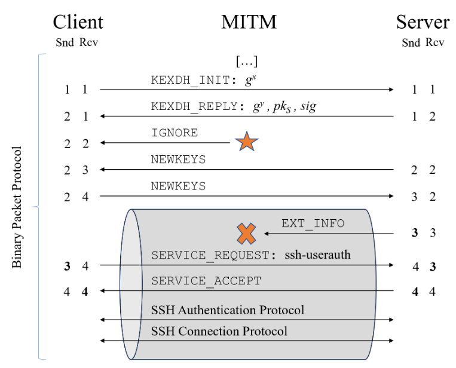

# Terrapin安全漏洞影响SSH的安全性

<!-- vulwiki-editorial:start -->
## 校订与适用边界

- 适用前提：主动网络中间人、特定协商加密/MAC模式；不是单凭暴露SSH端口可利用
- 证据范围：前缀截断与序列号补偿说明基本自洽，AsyncSSH状态机是另加实现漏洞不能泛化所有SSH接管

### 尚未解决的证据缺口

以下限制仍适用于后文历史材料；相关版本、结果或修复结论不能据此视为已验证：

- 连接必须是安全的或通过...明显翻译损坏；CBC还需明确MAC模式
- 序列化应为序列号
- 元数据漏主CVE；缺strict KEX及版本修复说明
- AsyncSSH独立编号和条件未提供，应另核实体

本页为文本校订，未执行代码、PoC 或目标请求；原图仅保留引用，未据此确认复现成功。
<!-- vulwiki-editorial:end -->

## 技术正文与历史材料

 网络安全应急技术国家工程中心   2024-01-03 15:37  
  
SSH是提供网络服务的安全访问的互联网标准，主要用于远程终端登录和文件传输，应用于超过1.5亿服务器。来自德国波鸿鲁尔大学的安全研究人员在SSH协议中发现了一个安全漏洞——Terrapin，攻击者利用该漏洞可以打破SSH协议安全通道的完整性以影响SSH的安全性。  
# Terrapin攻击概述  
  
Terrapin是一种针对SSH协议的前缀截断攻击。具体来说，攻击者可以通过调整握手阶段的序列号来移除客户端或服务器发送任意数量的消息，而不引起服务器或客户端的注意。漏洞CVE编号为CVE-2023-48795，CVSS评分5.9分。  
  
  
  
图 Terrapin攻击流程  
  
Terrapin攻击流程如图所示，攻击者丢弃一个用于协商多个协议扩展的EXT_INFO消息。一般来说，客户端在接收到服务器发送的下一个二进制包之后会检测到包删除，因为序列化会不匹配。为预防该问题，攻击者在握手阶段注入一个可忽略的包来使序列化产生对应的偏移。  
  
此外，研究人员还发现Terrapin攻击可以用于实现漏洞的利用。比如，研究人员发现AsyncSSH服务器的状态机存在安全漏洞，攻击者利用该漏洞可以用其他账户登录受害者客户端而不引发受害者注意。这使得攻击者可以在加密会话中实现中间人攻击。  
  
为实现Terrapin，需要在网络层具有中间人攻击能力，即攻击者需要具备拦截和修改连接流量的能力。比如，连接必须是安全的或通过ChaCha20-Poly1305、CBC模式。  
# 漏洞扫描器  
  
研究人员用Go语言编写了一个简单的应用来检测SSH服务器或客户端是否受到Terrapin攻击的影响。源码参见GitHub：https://github.com/RUB-NDS/Terrapin-Scanner/releases/latest  
  
关于Terrapin攻击的技术报告参见：https://arxiv.org/abs/2312.12422  
  
更多关于Terrapin攻击的技术细节参见：https://terrapin-attack.com/  
  
**参考及来源：**  
  
https://terrapin-attack.com/  
  
  
  
原文来源：  
嘶吼专业版  
  
“投稿联系方式：010-82992251   sunzhonghao@cert.org.cn”  
  
  
  

---

> 来源：gelusus/wxvl（微信公众号漏洞文章自动归档，原文见文首链接）
