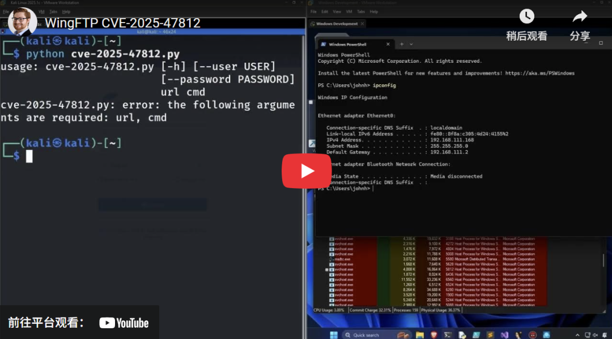

# 黑客正在利用 Wing FTP 服务器中的关键 RCE 漏洞(CVE-2025-47812)

<!-- vulwiki-editorial:start -->
## 校订与适用边界

- 适用前提：匿名登录被启用或有有效用户凭据；Web界面可达，最高权限来自默认服务身份
- 证据范围：主文遗漏匿名配置对免认证说法的关键限制，后面禁用匿名缓解才隐约出现

### 已有来源支持的更正

- 研究以允许anonymous的实例开始，明确其他账号需valid credentials；从匿名只读到root，非任意密码绕过

### 尚未解决的证据缺口

以下限制仍适用于后文历史材料；相关版本、结果或修复结论不能据此视为已验证：

- 未认证RCE必须附匿名账号启用前提；空字节本身不免除真实用户凭据
- 7.4.4修复不包含47811已在文说明应保留
- 攻击失败与可利用尝试需区分，多个IP不必然多个组织
- 尾部大量无关新闻含Fortinet编号污染应移除

### 核验来源

- https://www.rcesecurity.com/2025/06/what-the-null-wing-ftp-server-rce-cve-2025-47812/

### 操作风险与资料使用

- 含落盘脚本或账户创建：会留下持久状态。记录本次生成的路径或账户，测试后清理这些对象并撤销关联令牌；不要删除既有业务对象。

本页为文本校订，未执行代码、PoC 或目标请求；原图仅保留引用，未据此确认复现成功。
<!-- vulwiki-editorial:end -->

## 技术正文与历史材料

会杀毒的单反狗  军哥网络安全读报   2025-07-14 01:01  
  
**导****读**  
  
  
  
漏洞技术细节公开仅一天后，黑客就开始利用 Wing FTP Server 中一个严重级别的远程代码执行漏洞。  
  
  
观察到的攻击运行了多个枚举和侦察命令，然后通过创建新用户来建立持久性。  
  
  
被利用的 Wing FTP 服务器漏洞编号为CVE-2025-47812，该漏洞获得了最高严重性评分（  
10  
分）。漏洞由空字节和 Lua 代码注入组成，允许未经身份验证的远程攻击者以系统最高权限 (root/SYSTEM) 执行代码。  
  
  
Wing FTP Server 是一个强大的管理安全文件传输的解决方案，可以执行 Lua 脚本，广泛应用于企业和 SMB 环境中。  
  
  
6 月 30 日，安全研究员 Julien Ahrens 发布了针对 CVE-2025-47812 的技术文章（  
https://www.rcesecurity.com/2025/06/what-the-null-wing-ftp-server-rce-cve-2025-47812/），解释说该缺陷源于 C++ 中对空终止字符串的不安全处理以及 Lua 中不正确的输入清理。  
  
  
研究人员演示了用户名字段中的空字节如何绕过身份验证检查并将 Lua 代码注入会话文件。  
  
  
当服务器随后执行这些文件时，就可以以 root/SYSTEM 身份执行任意代码。  
  
  
除了 CVE-2025-47812 之外，研究人员还发现了 Wing FTP 中的另外三个缺陷：  
  
  
CVE-2025-27889  
 – 如果用户提交登录表单，则允许通过精心设计的 URL 泄露用户密码，这是由于 JavaScript 变量（位置）中不安全地包含密码所致  
  
  
CVE-2025-47811  
 – Wing FTP 默认以 root/SYSTEM 身份运行，没有沙盒或权限下降，这使得 RCE 更加危险  
  
  
CVE-2025-47813  
 – 提供过长的 UID cookie 会泄露文件系统路径  
  
所有漏洞均影响 Wing FTP 7.4.3 及更早版本。  
  
  
供应商于 2025 年 5 月 14 日发布了 7.4.4 版本，修复了这些问题，但 CVE-2025-47811 除外，该漏洞被认为不重要。  
  
  
托管网络安全平台 Huntress 的威胁研究人员针对 CVE-2025-47812 创建了一个  
PoC  
，并在下面的视频中展示了黑客如何在攻击中利用它：  
  
  
  
  
Huntress 研究人员发现，7 月 1 日，即 CVE-2025-47812 技术细节出现的第二天，至少有一名攻击者利用了该漏洞针对他们的客户。  
  
  
攻击者发送了格式错误的登录请求，其中包含注入了空字节的用户名，目标是“loginok.html”。这些输入创建了恶意会话 .lua 文件，并将 Lua 代码注入服务器。  
  
  
注入的代码旨在对有效负载进行十六进制解码并通过 cmd.exe 执行，使用 certutil 从远程位置下载恶意软件并执行它。  
  
  
Huntress表示，同一个 Wing FTP 实例在短时间内遭到五个不同 IP 地址的攻击，这可能表明多个威胁组织进行了大规模扫描和利用尝试。  
  
  
在这些尝试中观察到的命令用于侦察、获取环境中的持久性以及使用 cURL 工具和 webhook 端点进行数据泄露。  
  
  
Huntress表示，黑客攻击失败“可能是因为他们不熟悉这些漏洞，或者是因为 Microsoft Defender 阻止了部分攻击”。尽管如此，研究人员仍然观察到了对关键 Wing FTP 服务器漏洞的明显利用。  
  
  
即使 Huntress 发现针对其客户的攻击失败，黑客也可能会扫描可访问的 Wing FTP 实例并尝试利用易受攻击的服务器。  
  
  
强烈建议各公司尽快升级到该产品的7.4.4版本。  
  
  
如果无法切换到更新、更安全的版本，研究人员的建议是禁用或限制对 Wing FTP 门户网站的 HTTP/HTTPs 访问、禁用匿名登录，并监控会话目录中是否有可疑添加。  
  
  
漏洞详情：  
  
https://www.rcesecurity.com/2025/06/what-the-null-wing-ftp-server-rce-cve-2025-47812/  
  
  
新闻链接：  
  
https://www.bleepingcomputer.com/news/security/hackers-are-exploiting-critical-rce-flaw-in-wing-ftp-server/  
  
  
  
**今日安全资讯速递**  
  
  
  
**APT事件**  
  
  
Advanced Persistent Threat  
  
印度  
  
DoNot APT 组织利用新型 LoptikMod 恶意软件攻击欧洲政府部门  
  
https://hackread.com/donot-apt-hits-european-ministry-loptikmod-malware/  
  
  
伊朗APT黑客积极攻击运输和制造业  
  
https://cybersecuritynews.com/iranian-apts-hackers-actively-attacking-transportation/  
  
  
黑客攻击针对俄罗斯民转军无人机改装生产系统  
  
https://therecord.media/cyberattack-russia-firmware-blow-hackers  
  
  
朝鲜黑客在 macOS 上部署罕见的基于 Nim 的恶意软件  
  
https://www.techrepublic.com/article/news-north-korea-nimdoor-macos-crypto-attack/  
  
  
APT36  
（透明部落）针对印度广泛采用的 BOSS Linux发行版  
  
https://gbhackers.com/how-apt36-targets-boss-linux/  
  
  
恶意 Firefox 扩展程序使用户面临凭证盗窃和监视的风险  
  
https://gbhackers.com/eight-malicious-firefox-extensions-expose-users/  
  
  
新型 Batavia 间谍软件瞄准俄罗斯工业企业  
  
https://securityaffairs.com/179699/uncategorized/new-batavia-spyware-targets-russian-industrial-enterprises.html  
  
  
  
**一般威胁事件**  
  
  
General Threat Incidents  
  
WordPress GravityForms插件遭黑客攻击  
  
http://cybersecuritynews.com/wordpress-gravityforms-plugin-hacked/  
  
  
利用 Prompt Injection 漏洞绕过 Meta 的 Llama 防火墙  
  
https://cybersecuritynews.com/metas-llama-firewall/  
  
  
黑客攻击 macOS 用户以窃取敏感数据  
  
https://cybersecuritynews.com/infostealers-actively-attacking-macos-users/  
  
  
GitHub APP_KEY 泄露，导致 600 多个 Laravel 应用面临远程代码执行漏洞攻击  
  
https://thehackernews.com/2025/07/over-600-laravel-apps-exposed-to-remote.html  
  
  
**漏洞事件**  
  
  
Vulnerability Incidents  
  
GPUHammer：首次针对 NVIDIA GPU 的 Rowhammer 攻击  
  
https://gbhackers.com/first-ever-rowhammer-attack-targeting-nvidia-gpus/  
  
  
黑客正在利用 Wing FTP 服务器中的关键 RCE 漏洞  
(  
CVE-2025-47812  
)  
  
https://www.bleepingcomputer.com/news/security/hackers-are-exploiting-critical-rce-flaw-in-wing-ftp-server/  
  
  
严重漏洞导致 Fortinet FortiWeb 面临全面接管风险 (CVE-2025-25257)  
  
https://hackread.com/critical-vulnerability-fortinet-fortiweb-cve-2025-25257/  
  
扫码关注  
  
军哥网络安全读报  
  
**讲述普通人能听懂的安全故事**  
  

---

> 来源：gelusus/wxvl（微信公众号漏洞文章自动归档，原文见文首链接）
