# Xlight FTP Server整数溢出漏洞(CVE-2024-46483)分析与复现

<!-- vulwiki-editorial:start -->
## 校订与适用边界

- 适用前提：SSH2虚拟服务启用且可达，认证前算法协商；测试3.9.3.6 Win10，文称<3.9.4.3
- 证据范围：区分32位size+8溢出写与64位校验+0x1a溢出越界读，明确RCE尝试失败；有独立证据应保留

### 尚未解决的证据缺口

以下限制仍适用于后文历史材料；相关版本、结果或修复结论不能据此视为已验证：

- 概述泛称可控堆溢出不适用于正文64位结果
- 不是已实现RCE，不能从crash上升已控制执行
- 关键汇编/堆截图未视检，PoC只外链；认证设置是实验准备不是漏洞需登录

本页为文本校订，未执行代码、PoC 或目标请求；原图仅保留引用，未据此确认复现成功。
<!-- vulwiki-editorial:end -->

## 技术正文与历史材料

原创 烽火台实验室  Beacon Tower Lab   2024-11-08 14:03  
  
**漏洞概述**  
  
  
Xlight FTP Server是Xlight FTP公司的一款高性能且易于使用的FTP服务端软件。Xlight FTP Server支持FTP协议和SSH2协议认证，在使用SSH2进行登录认证时，从客户端算法协商数据包中读取4个字节的数据作为数据的长度，在验证长度和分配所需内存时发生整数溢出，导致可控内容的堆溢出,可以覆盖内存中的其他数据，结合程序中的多线程特性，可能实现远程代码执行。  
  
  
**影响范围**  
  
  
Xlight FTP Server 32和64位版本小于3.9.4.3  
  
  
**复现环境**  
  
  
**操作系统：**Win10 10.0.18363.592  
  
**Xlight FTP Server版本：**32和64位3.9.3.6  
  
  
**SSH协议简介**  
  
  
Secure Shell（SSH）协议是一种用于在不安全网络上安全远程登录和其他安全网络服务的协议。为实现SSH的安全协议，客户端和服务端要经历版本协商、算法协商、密钥交换、身份认证和会话交互等阶段。  
  
  
版本协商。SSH服务端默认使用22号端口，使用TCP连接。客户端与服务端建立连接后，分别向对方发送自己SSH版本信息，然后决定使用的SSH版本。  
  
  
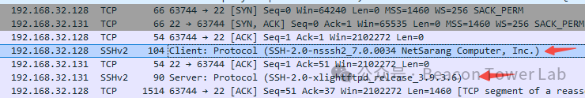  
  
  
算法协商。版本协商成功后，分别向对方发送自己支持的公钥算法列表、加密算法列表、MAC（Message Authentication Code）算法列表、压缩算法列表等，然后根据双方支持的算法列表得出最终使用的算法。  
  
  
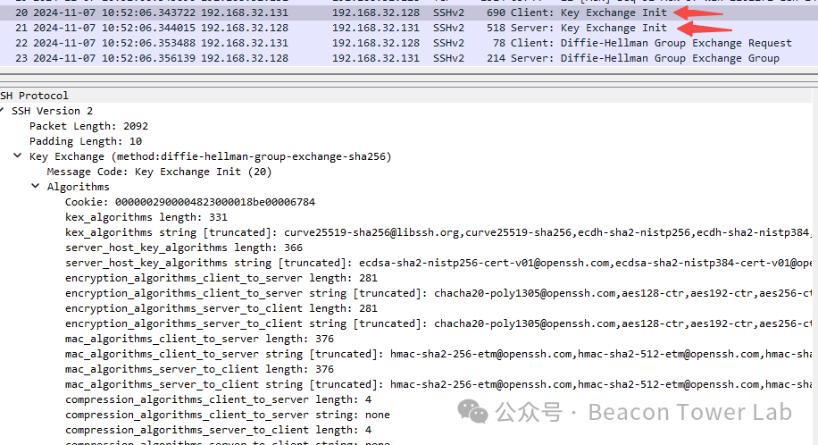  
  
  
密钥交换。算法协商成功后，双方根据密码学算法进行秘钥的交换，最终生成会话密钥、会话ID等。SSH2.0版本一般使用的秘钥交换算法为DH（Diffie-Hellman）交换算法。  
  
  
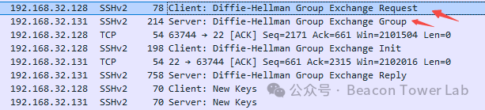  
  
  
身份认证。密钥交换完成后，双方拥有了相同的会话密钥，这个会话密钥用于后续的数据加密。然后客户端将用户名和密码等认证信息加密后发送服务端进行登录认证。  
  
  
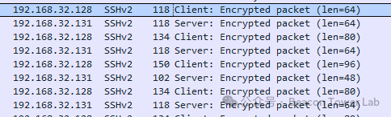  
  
  
会话交互。身份认证成功后，双方进行业务数据通信，比如文件传输，命令执行等。所有的输入命令、输出结果和文件传输等数据都会使用协商的加密算法进行加密，确保即使通信被拦截，攻击者也无法读取或篡改数据。  
  
  
**分析过程**  
  
  
Xlight FTP Server 32位程序启动后，需要先配置FTP相关服务。首先新建一个虚拟服务，协议选择SSH2，其他保持默认。  
  
  
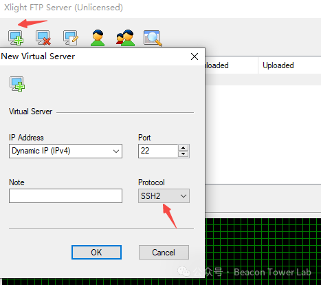  
  
  
FTP协议配置好后，添加登录用户名，密码和主目录。  
  
  
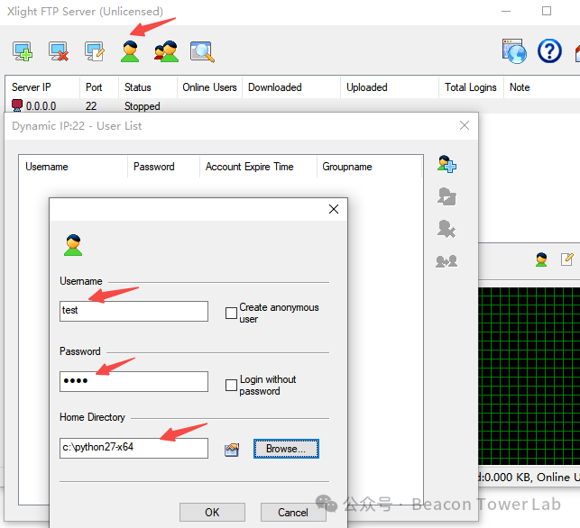  
  
  
用户信息配置好后，点击绿色按钮启用FTP服务。  
  
  
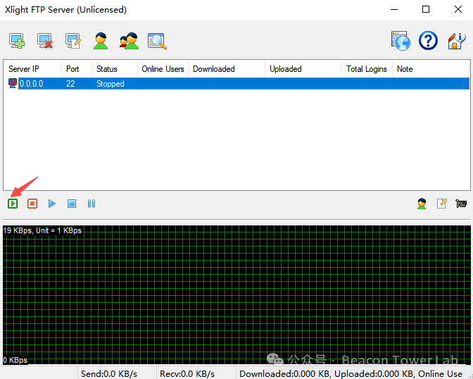  
  
  
FTP服务启动成功后，使用Windbg调试器附加服务端进程，然后执行poc.py。Windbg立刻捕获异常，FTP服务端程序在数据复制汇编代码中，目标地址edi出现非法访问。  
  
  
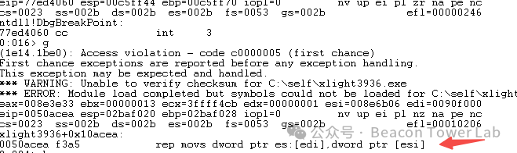  
  
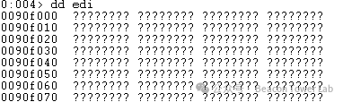  
  
  
根据Windbg中获取的函数调用栈进行回溯，结合IDA中的伪C代码进行分析得知，该异常的目标地址来源于004D0612处申请的堆地址。  
  
  
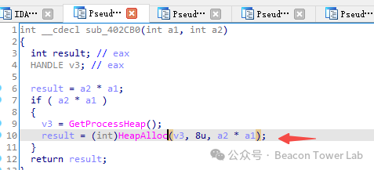  
  
  
继续往上层调用进行分析，发现此次申请的堆地址大小1，而复制数据时的大小却是0xfffffff9，导致堆溢出后，覆盖到非法内存。  
  
  
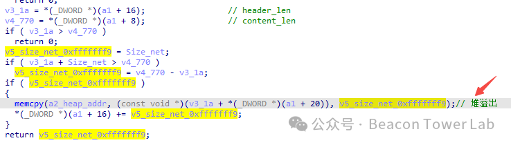  
  
  
对堆地址大小进行分析后发现，FTP服务端程序从客户端的SSH2算法协商数据包中读取4个字节的数据，此时为0xfffffff9，表示数据的长度。  
  
  
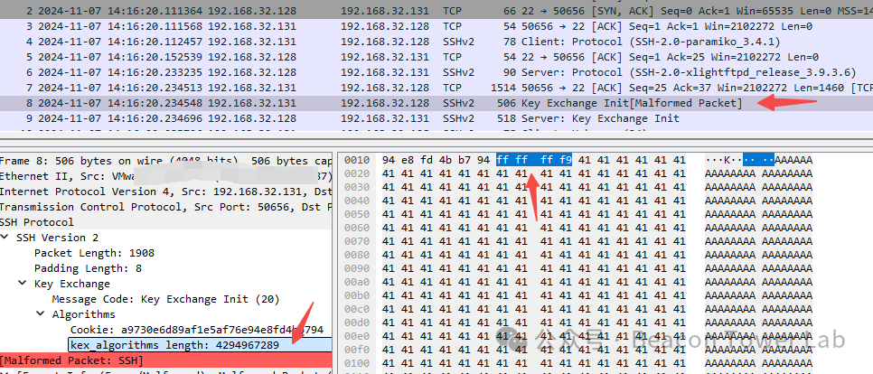  
  
  
然后再加上8，最终的结果再存放到size_t类型的变量中作为堆申请的大小。  
  
  
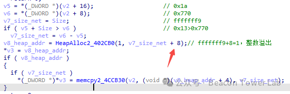  
  
  
在32位程序中，size_t类型也是32位，是无符号整数，而算法协商数据包中的4个字节数据可控，可导致这个无符号整数溢出，超出32位的值将被抛弃，所以最终结果为1，小于从数据中的读取的值0xfffffff9，导致后续复制数据时堆溢出，覆盖到非法内存，产生异常，进程崩溃。当然除了0xfffffff9这个值能导致溢出外，0xfffffff8-0xffffffff均能溢出。  
  
  
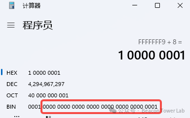  
  
  
在64位程序中，在计算申请堆大小时，仍然从客户端的算法协商数据包中读取4个字节的数据再加上8，最终的结果放在64位寄存器中，所以这里不会溢出。但是在校验这个数据是否比实际数据中携带的数据大时，会加上0x1a，最终结果放在32位寄存器中，可以溢出，导致后续复制数据时读取到携带的数据之外的内存数据，产生异常，进程崩溃。  
  
  
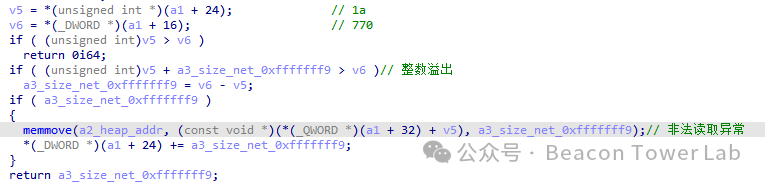  
  
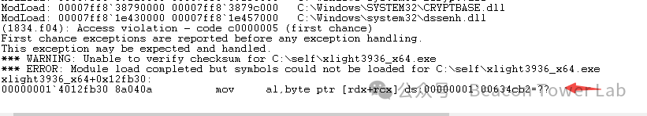  
  
  
**漏洞利用**  
  
  
Windows堆溢出漏洞，一般可覆盖其他堆块的结构，以获得任意地址读写的能力，从而劫持程序EIP，获取任意代码执行能力。或者使用堆喷技术，覆盖大量堆空间，劫持虚函数调用等，从而获取任意代码执行能力。  
  
  
Xlight FTP Server 32位程序整数溢出后，导致堆溢出，堆内容可控。但是在溢出时，即复制堆内容时会覆盖到非法内存，导致异常，进程崩溃，难以利用。况且在溢出覆盖数据时，时间较短，其他线程难以获得CPU时间片执行代码，尝试多线程执行函数调用失败。另外也未找到合适的方法进行堆喷，利用较难。  
  
  
Xlight FTP Server 64位程序整数溢出后，不会导致堆溢出，只会读取到非法内存，导致异常，进程崩溃，利用较难。  
  
  
**参考链接**  
  
```
https://www.xlightftpd.com/
https://github.com/kn32/cve-2024-46483
```  
  
  
**POC**  
  
```
https://www.ddpoc.com/DVB-2024-8428.html
```  
  
  
  
  


---

> 来源：gelusus/wxvl（微信公众号漏洞文章自动归档，原文见文首链接）
