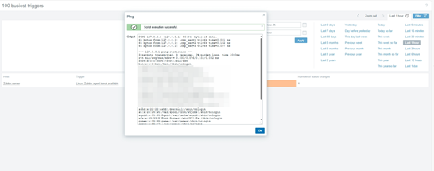
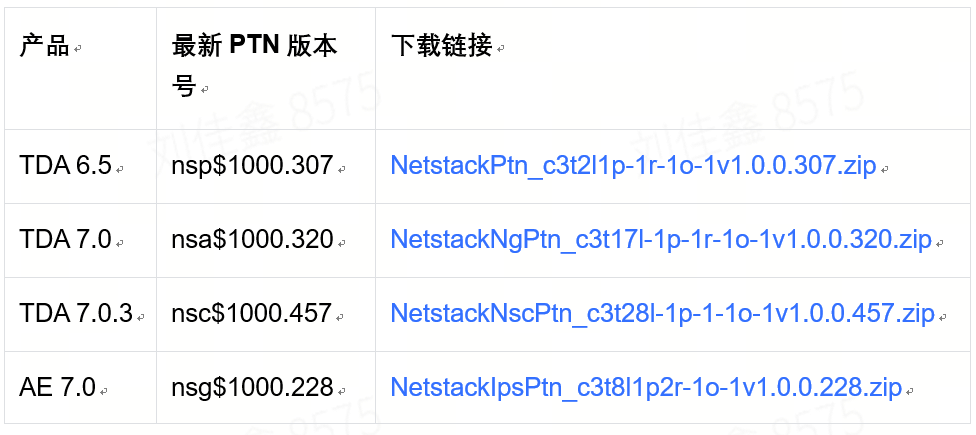

# 【已复现】Zabbix远程执行代码漏洞风险通告

<!-- vulwiki-editorial:start -->
## 校订与适用边界

- 适用前提：受限管理员能新增/修改主机Macros且可执行相关脚本；6.4.0–.15、7alpha1–rc2
- 证据范围：原理与鉴权条件明确；作者复现截图没有文本载荷，不应作为完整复现教程

### 尚未解决的证据缺口

以下限制仍适用于后文历史材料；相关版本、结果或修复结论不能据此视为已验证：

- 将6.4.16rc1/7.0.0rc3称最新版本需改稳定修复版/历史首次修复
- 下载地址后台私信指亚信规则包，不应同厂家Zabbix补丁混淆
- 状态表已复现是来源实验，不是本审计结果；HTML表格与营销可简化

本页为文本校订，未执行代码、PoC 或目标请求；原图仅保留引用，未据此确认复现成功。
<!-- vulwiki-editorial:end -->

## 技术正文与历史材料

你信任的  亚信安全   2024-08-15 17:33  
  
  
  
  
今日，亚信安全CERT监控到安全社区研究人员发布安全通告，披露了Zabbix远程执行代码漏洞(CVE-2024-22116)。该漏洞发生在监控主机部分的脚本执行功能中，由于脚本参数缺乏默认转义，具有受限权限的管理员可以通过 ping 脚本执行任意代码，从而破坏基础架构。  
  
  
目前厂商官方已发布修复版本。亚信安全CERT建议客户将受影响的Zabbix升级至最新版本（6.4.16rc1和7.0.0rc3）。  
  
  
**漏洞编号、类型、等级**  
  
  
  
- CVE-2024-22116  
  
- 远程代码执行漏洞  
  
- 高危  
  
  
  
  
**漏洞复现**  
  
  
  
当前亚信安全天河实验室团队已复现该漏洞，攻击者可以通过添加、修改Host的Macros参数注入命令，进行敏感信息读取、恶意代码执行等攻击。  
  
  
  
  
  
**漏洞状态**  
  
  
  
<table><tbody style="box-sizing: border-box;"><tr opera-tn-ra-comp="_$.pages:0.layers:0.comps:14.classicTable1:0" style="box-sizing: border-box;"><td colspan="1" rowspan="1" opera-tn-ra-cell="_$.pages:0.layers:0.comps:14.classicTable1:0.td@@0" style="border-width: 1px;border-color: rgb(62, 62, 62);border-style: solid;background-color: rgb(145, 145, 145);box-sizing: border-box;padding: 0px;" width="20.0000%"><section style="margin: 5px 0%;box-sizing: border-box;"><section style="text-align: justify;padding: 0px 5px;font-size: 14px;color: rgb(255, 255, 255);box-sizing: border-box;">
<strong style="box-sizing: border-box;">细节</strong>
</section></section></td><td colspan="1" rowspan="1" opera-tn-ra-cell="_$.pages:0.layers:0.comps:14.classicTable1:0.td@@1" style="border-width: 1px;border-color: rgb(62, 62, 62);border-style: solid;background-color: rgb(145, 145, 145);box-sizing: border-box;padding: 0px;" width="20.0000%"><section style="margin: 5px 0%;box-sizing: border-box;"><section style="padding: 0px 5px;font-size: 14px;color: rgb(255, 255, 255);box-sizing: border-box;">
<strong style="box-sizing: border-box;">PoC</strong>
</section></section></td><td colspan="1" rowspan="1" opera-tn-ra-cell="_$.pages:0.layers:0.comps:14.classicTable1:0.td@@2" style="border-width: 1px;border-color: rgb(62, 62, 62);border-style: solid;background-color: rgb(145, 145, 145);box-sizing: border-box;padding: 0px;" width="20.0000%"><section style="margin: 5px 0%;box-sizing: border-box;"><section style="padding: 0px 5px;font-size: 14px;color: rgb(255, 255, 255);box-sizing: border-box;">
<strong style="box-sizing: border-box;">EXP</strong>
</section></section></td><td colspan="1" rowspan="1" opera-tn-ra-cell="_$.pages:0.layers:0.comps:14.classicTable1:0.td@@3" style="border-width: 1px;border-color: rgb(62, 62, 62);border-style: solid;background-color: rgb(145, 145, 145);box-sizing: border-box;padding: 0px;" width="20.0000%"><section style="margin: 5px 0%;box-sizing: border-box;"><section style="padding: 0px 5px;font-size: 14px;color: rgb(255, 255, 255);box-sizing: border-box;">
<strong style="box-sizing: border-box;">在野利用</strong>
</section></section></td><td colspan="1" rowspan="1" opera-tn-ra-cell="_$.pages:0.layers:0.comps:14.classicTable1:0.td@@4" style="border-width: 1px;border-color: rgb(62, 62, 62);border-style: solid;background-color: rgb(145, 145, 145);box-sizing: border-box;padding: 0px;" width="20.0000%"><section style="margin: 5px 0%;box-sizing: border-box;"><section style="padding: 0px 5px;font-size: 14px;color: rgb(255, 255, 255);box-sizing: border-box;">
<strong style="box-sizing: border-box;">复现情况</strong>
</section></section></td></tr><tr opera-tn-ra-comp="_$.pages:0.layers:0.comps:14.classicTable1:1" style="box-sizing: border-box;"><td colspan="1" rowspan="1" opera-tn-ra-cell="_$.pages:0.layers:0.comps:14.classicTable1:1.td@@0" style="border-width: 1px;border-color: rgb(62, 62, 62);border-style: solid;box-sizing: border-box;padding: 0px;" width="20.0000%"><section style="margin: 5px 0%;box-sizing: border-box;"><section style="padding: 0px 5px;font-size: 14px;color: rgb(62, 62, 62);box-sizing: border-box;">
已公开
</section></section></td><td colspan="1" rowspan="1" opera-tn-ra-cell="_$.pages:0.layers:0.comps:14.classicTable1:1.td@@1" style="border-width: 1px;border-color: rgb(62, 62, 62);border-style: solid;box-sizing: border-box;padding: 0px;" width="20.0000%"><section style="margin: 5px 0%;box-sizing: border-box;"><section style="padding: 0px 5px;font-size: 14px;color: rgb(62, 62, 62);box-sizing: border-box;">
已公开
</section></section></td><td colspan="1" rowspan="1" opera-tn-ra-cell="_$.pages:0.layers:0.comps:14.classicTable1:1.td@@2" style="border-width: 1px;border-color: rgb(62, 62, 62);border-style: solid;box-sizing: border-box;padding: 0px;" width="20.0000%"><section style="margin: 5px 0%;box-sizing: border-box;"><section style="padding: 0px 5px;font-size: 14px;color: rgb(62, 62, 62);box-sizing: border-box;">
未公开
</section></section></td><td colspan="1" rowspan="1" opera-tn-ra-cell="_$.pages:0.layers:0.comps:14.classicTable1:1.td@@3" style="border-width: 1px;border-color: rgb(62, 62, 62);border-style: solid;box-sizing: border-box;padding: 0px;" width="20.0000%"><section style="margin: 5px 0%;box-sizing: border-box;"><section style="padding: 0px 5px;font-size: 14px;color: rgb(62, 62, 62);box-sizing: border-box;">
待验证
</section></section></td><td colspan="1" rowspan="1" opera-tn-ra-cell="_$.pages:0.layers:0.comps:14.classicTable1:1.td@@4" style="border-width: 1px;border-color: rgb(62, 62, 62);border-style: solid;box-sizing: border-box;padding: 0px;" width="20.0000%"><section style="margin: 5px 0%;box-sizing: border-box;"><section style="padding: 0px 5px;font-size: 14px;color: rgb(62, 62, 62);box-sizing: border-box;">
已复现
</section></section></td></tr></tbody></table>  
  
  
**受影响版本**  
  
  
  
- 7.0.0alpha1<=Zabbix<=7.0.0rc2  
  
- 6.4.0<=Zabbix<=6.4.15  
  
  
  
  
**产品解决方案**  
  
  
  
目前亚信安全怒狮引擎已新增检测规则，请及时更新TDA、AE产品的特征库到最新版本，更新方式如下：  
  
  
TDA产品在线更新方法：登录系统-》系统管理-》系统升级-》特征码更新；  
  
AE产品在线更新方法：登录系统-》管理-》更新-》特征码更新。  
  
  
TDA、AE产品离线升级PTN包下载链接如下：  
  
  
  
  
（详细下载地址请后台私信获取）  
  
  
**修复建议**  
  
  
  
目前，官方已有相关公告信息修复该漏洞，建议受影响的Zabbix尽快升级至最新版本。  
  
https://support.zabbix.com/browse/ZBX-25016  
  
  
**参考链接**  
  
  
  
- https://cybersecuritynews.com/zabbix-server-vulnerability/  
  
- https://support.zabbix.com/browse/ZBX-25016  
  
- https://nvd.nist.gov/vuln/detail/CVE-2024-22116  
  
  
  
  
本文发布的补丁下载链接均源自各原厂官方网站。尽管我们努力确保官方资源的安全性，但在互联网环境中，文件下载仍存在潜在风险。为保障您的设备安全与数据隐私，敬请您在点击下载前谨慎核实其安全性和可信度。  
  
  
  
  
了解亚信安全，请点击  
**“阅读原文”**  
  

---

> 来源：gelusus/wxvl（微信公众号漏洞文章自动归档，原文见文首链接）
