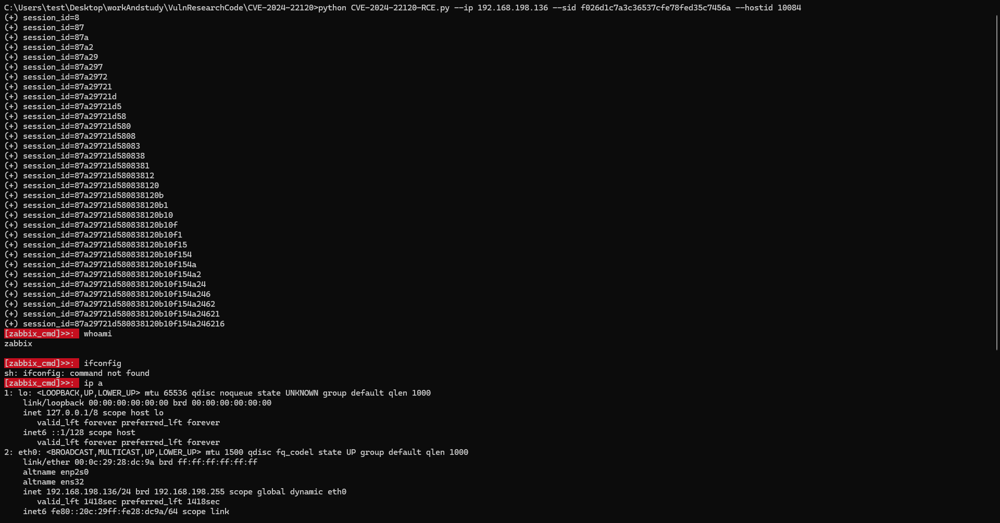

# （CVE-2024-22120）Zabbix Server审计日志SQL注入致远程代码执行漏洞

<!-- vulwiki-editorial:start -->
## 校订与适用边界

- 适用前提：低权限有效会话且能执行脚本/API，盲注可取得仍有效管理员会话，后借内置脚本RCE
- 证据范围：权限升级链分层清晰，给公开工具用法非完整代码；版本标明PoC来源范围并链接官方工单

### 尚未解决的证据缺口

以下限制仍适用于后文历史材料；相关版本、结果或修复结论不能据此视为已验证：

- MySQL FILE权限与OS数据库服务账户可写目录是不同条件，因zabbix用户不可行的概括过粗
- 7.0alpha1范围与正式版修复之间中间预发行版需核对
- session样例需占位；公开PoC输出/截图未独立核验

### 操作风险与资料使用

- 含落盘脚本或账户创建：会留下持久状态。记录本次生成的路径或账户，测试后清理这些对象并撤销关联令牌；不要删除既有业务对象。

本页为文本校订，未执行代码、PoC 或目标请求；原图仅保留引用，未据此确认复现成功。
<!-- vulwiki-editorial:end -->

## 技术正文与历史材料

一、漏洞简介
------------

2024年5月17日披露的 Zabbix Server SQL 注入漏洞（CVE-2024-22120，CVSS 3.1
**9.1**）。Zabbix Server 在对"执行脚本"操作写入审计日志（Audit Log）
时，未对 `clientip` 字段做净化即拼入 SQL，低权限用户可远程注入任意
SQL。公开利用链为：审计日志时间盲注 → 拖出管理员会话 → 会话劫持登录
后台 → 利用 Zabbix 自身的脚本执行功能实现远程代码执行。

二、漏洞影响
------------

-   产品：Zabbix Server（开源监控系统）
-   版本：**6.0.0–6.0.27、6.4.0–6.4.12、7.0.0alpha1**（PoC 仓库标注的影响
    范围；修复版以 Zabbix 官方公告为准）
-   组件/攻击向量：审计日志 `clientip` 字段 SQL 注入，远程
-   前提条件：低权限 Zabbix 账户，且具备执行脚本 / API 权限

三、复现过程
------------

### 漏洞分析

Zabbix Server 执行用户配置的脚本后，会向审计日志写入一条记录；其中
`clientip` 字段未经净化直接参与 SQL 拼接。具备脚本执行权限的低权限
用户可通过构造 `clientip` 触发时间盲注，逐步拖出 `sessions` 表中的
管理员会话 ID；拿到管理员会话后即可劫持登录后台（LoginAsAdmin），再
利用 Zabbix 的脚本执行能力在 server 端执行任意命令，完成 RCE。若
MySQL 账户具备 `FILE` 权限，理论上还可写 webshell，但 PoC 作者注明
多数情况下因执行用户为 `zabbix` 而不可行。

### PoC（来源：https://github.com/W01fh4cker/CVE-2024-22120-RCE，仅限授权测试）

仓库为 PoC 工具包，含三套脚本，README 原文用法如下：

```bash
python -m pip install requests pwntools

# 1. 时间盲注 RCE（先抓包获取低权限用户的 sessionid 与 hostid）
python CVE-2024-22120-RCE.py --ip 192.168.198.136 --sid f026d1c7a3c36537cfe78fed35c7456a --hostid 10084

# 2. 已有管理员会话时尝试写 webshell
python CVE-2024-22120-Webshell.py --ip 192.168.198.136 --aid <管理员session> --hostid 10084 --file shell.php

# 3. 劫持管理员会话直接登录后台
python CVE-2024-22120-LoginAsAdmin.py --ip 192.168.198.136 --sid <低权限session> --hostid 10084
```



*上图：PoC 作者博客中的利用演示截图（来源：W01fh4cker 仓库
README，已本地化保存）。*

四、修复建议
------------

1.  升级到 Zabbix 官方修复版本（6.0.28+ / 6.4.13+ / 7.0 正式版，以官方
    公告为准）；
2.  遵循最小权限原则，回收非必要账户的 API 访问与脚本执行权限；
3.  排查 `sessions` 表与审计日志中的异常会话，确认是否已被劫持。

### 附录

参考链接：

-   公开 PoC：https://github.com/W01fh4cker/CVE-2024-22120-RCE
-   NVD：https://nvd.nist.gov/vuln/detail/CVE-2024-22120
-   Zabbix 工单：https://support.zabbix.com/browse/ZBX-24505
