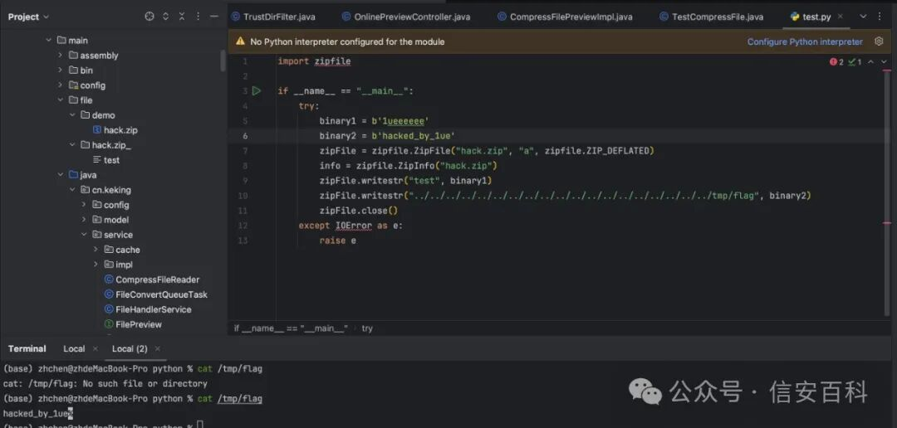

# N/A｜kkFileView 任意文件上传导致远程代码执行漏洞（POC）

<!-- vulwiki-editorial:start -->
## 校订与适用边界

- 适用前提：文列4.2.0–4.4.0-beta，上传/预览开启且目标文件可写，RCE需后续加载
- 证据范围：仅外链PoC与图片，正文没有请求或执行过程；同178/180关联事件

### 尚未解决的证据缺口

以下限制仍适用于后文历史材料；相关版本、结果或修复结论不能据此视为已验证：

- 标题任意上传应精确路径穿越文件覆盖链
- 缺修复commit/版本与鉴权/部署条件
- 推荐CVE不能当本漏洞编号；N/A不是产品名

本页为文本校订，未执行代码、PoC 或目标请求；原图仅保留引用，未据此确认复现成功。
<!-- vulwiki-editorial:end -->

## 技术正文与历史材料

alicy  信安百科   2024-04-20 21:36  
  
**0x00 前言**  
  
  
kkFileView为文件文档在线预览解决方案，该项目使用流行的spring boot搭建，易上手和部署，基本支持主流办公文档的在线预览，如doc,docx,xls,xlsx,ppt,pptx,pdf,txt,zip,rar,图片,视频,音频等。  
  
  
  
**0x01 漏洞描述**  
  
  
受影响版本中的文件上传功能在处理压缩包时存在安全问题，攻击者可以上传恶意的压缩包并覆盖文件，通过调用覆盖文件可以执行任意代码。  
  
  
**0x02 CVE编号**  
  
****  
无  
  
  
  
**0x03 影响版本**  
  
  
4.2.0 <= kkFileView <= 4.4.0-beta  
  
  
  
**0x04 漏洞详情**  
  
  
POC：  
  
https://github.com/luelueking/kkFileView-v4.3.0-RCE-POC  
  
  
  
  
  
  
**0x05 参考链接**  
  
  
https://github.com/kekingcn/kkFileView/issues/553  
  
  
https://github.com/luelueking/kkFileView-v4.3.0-RCE-POC  
  
  
  
  
推荐阅读：  
  
  
[CVE-2024-3431｜EyouCMS 反序列化漏洞（POC）](http://mp.weixin.qq.com/s?__biz=Mzg2ODcxMjYzMA==&mid=2247485179&idx=3&sn=7e7c00bb1564b94d90f6af714f6a58e5&chksm=cea96f22f9dee63499ca667c46ce5bb7c00792acba8068c6064bee8dbecfc616de096f8a2845&scene=21#wechat_redirect)  
  
  
  
[CVE-2024-3273｜D-Link NAS设备存在后门帐户（POC）](http://mp.weixin.qq.com/s?__biz=Mzg2ODcxMjYzMA==&mid=2247485142&idx=1&sn=01ba1dc2f2ccbc5d9711af4bd02beecc&chksm=cea96f0ff9dee6195b10afd3cff3c8db4655bb01d20f0577ce846b0302fdbac633bb1059b9df&scene=21#wechat_redirect)  
  
  
  
[CVE-2024-29202｜JumpServer JINJA2注入代码执行漏洞（POC）](http://mp.weixin.qq.com/s?__biz=Mzg2ODcxMjYzMA==&mid=2247485118&idx=1&sn=71c347bd5af7c9ae26602f892ddbaa97&chksm=cea96f67f9dee6711ccb836b0f407787640eb8609e9688348cd8a19205b80f7de40c3343f78a&scene=21#wechat_redirect)  
  
  
  
  
  
  
Ps：国内外安全热点分享，欢迎大家分享、转载，请保证文章的完整性。文章中出现敏感信息和侵权内容，请联系作者删除信息。信息安全任重道远，感谢您的支持  
  
！！！  
  
  
**本公众号的文章及工具仅提供学习参考，由于传播、利用此文档提供的信息而造成任何直接或间接的后果及损害，均由使用者本人负责,本公众号及文章作者不为此承担任何责任。**  
  
  
  
  

---

> 来源：gelusus/wxvl（微信公众号漏洞文章自动归档，原文见文首链接）
