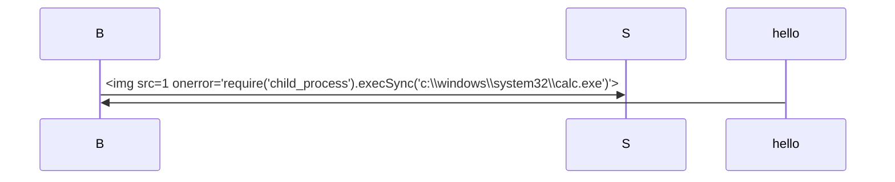
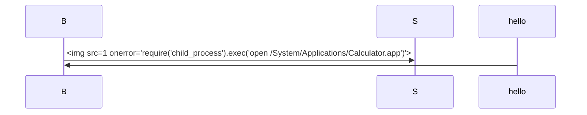
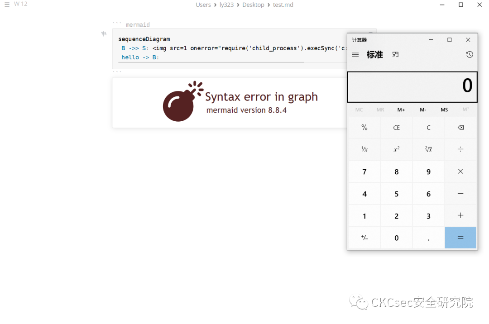

# marktext编辑器XSS触发RCE命令执行

<!-- vulwiki-editorial:start -->
## 校订与适用边界

- 适用前提：用户打开/渲染恶意Markdown、受影响Mermaid/渲染器允许HTML事件且require可用
- 证据范围：Windows/Mac示例意图清楚，但不是服务器远程无交互漏洞；无指定测试版本

### 尚未解决的证据缺口

以下限制仍适用于后文历史材料；相关版本、结果或修复结论不能据此视为已验证：

- 归类服务器软件错误，应客户端编辑器
- 所有版本受影响无日期/证据且过宽
- 嵌套三反引号导致代码块截断，文档payload不完整
- 仅清理代码块语言输入与实际Mermaid图内容注入不匹配，需要根因/补丁链接

本页为文本校订，未执行代码、PoC 或目标请求；原图仅保留引用，未据此确认复现成功。
<!-- vulwiki-editorial:end -->

## 技术正文与历史材料

<meta name="referrer" content="no-referrer"/>

> 本文由 [简悦 SimpRead](http://ksria.com/simpread/) 转码， 原文地址 [mp.weixin.qq.com](https://mp.weixin.qq.com/s/rOOO8RSUr_dqXU1wHL4-cg)


**点击蓝字** 关注我们


---------------------------------------------------------------------------------------------------------------------------------------------------------------------------------------------------------------------------------------------------------------------------------------------------------------------------------------------------------------------------------------------

  

**_声明  
_**

本文作者：CKCsec安全研究院  
本文字数：316

阅读时长：3 分钟

项目/链接：文末获取

**本文属于【CKCsec安全研究院】原创文章，未经许可禁止转载**

marktext编辑器XSS触发RCE命令执行  

==========================

遵纪守法
----

任何个人和组织使用网络应当遵守宪法法律，遵守公共秩序，尊重社会公德，不得危害网络安全，不得利用网络从事危害国家安全、荣誉和利益

漏洞描述
----

marktext编辑器XSS触发RCE命令执行

风险等级
----

高危

影响版本
----

marktext目前所有版本均受影响

资产确定
----

https://marktext.app/

漏洞验证
----

**「windows」**

```


**「mac」**

```




修复方案
----

防护代码块的语言输入应在呈现之前进行清理

另外关注公众号后台回复“**0112**”可免费获取代码审计教程，后台回复“**0110**”获取[红队攻防内部手册](http://mp.weixin.qq.com/s?__biz=MzkxMTIyMjg0NQ==&mid=2247488677&idx=1&sn=f0d52096bc9b7a6a34d1ad0fb9d73727&chksm=c11e25f7f669ace128a38a07e22e3988e41dd03fb1deb4ce6f793231f95c8c91ba038d766eb3&scene=21#wechat_redirect)。

  ** CKCsec安全研究院 ** 专注于网络安全的公众号，分享最新的Red Team、APT等高级攻击技术、以及最新的漏洞威胁刨析。 29篇原创内容   公众号

由于传播、利用此文所提供的信息而造成的任何直接或者间接的后果及损失，均由使用者本人负责，CKCsec安全研究院以及文章作者不为此承担任何责任。  
  

CKCsec安全研究院有对此文章的修改和解释权。如欲转载或传播此文章，必须保证此文章的完整性，包括版权声明等全部内容。未经允许，不得任意修改或者增减此文章内容，不得以任何方式将其用于商业目的。

---

> 来源：MrWQ/vulnerability-paper（https://github.com/MrWQ/vulnerability-paper）
