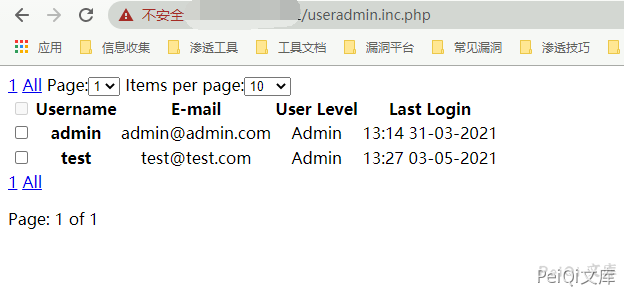

# rConfig useradmin.inc.php 信息泄露漏洞

> 版本字段校订（2026-10-04）：误填的版本字段原值逐字保存到对应 `previous_*` 字段。当前值区分正文声称的影响范围、实验环境与尚未知的范围；后文对该元数据误填的旧说明只描述校订前状态，未据此升级来源结论。

<!-- vulwiki-editorial:start -->
## 校订与适用边界

- 适用前提：文件可直接Web访问、包含文件/全局路由未代为鉴权、数据库可用
- 证据范围：所贴完整列表源码展示邮箱/用户名/角色/登录时间，不展示密码；鉴权缺失判断需包含依赖和路由上下文

### 尚未解决的证据缺口

以下限制仍适用于后文历史材料；相关版本、结果或修复结论不能据此视为已验证：

- version只写rConfig不是版本，影响范围空泛
- PHP require ../classes暗示实际目录可能不是根，/useradmin.inc.php路径需核对
- 代码片段没有权限检查不自动证明所有部署未经认证可达
- 应归运维/网络配置管理产品类别

### 操作风险与资料使用

- 含落盘脚本或账户创建：会留下持久状态。记录本次生成的路径或账户，测试后清理这些对象并撤销关联令牌；不要删除既有业务对象。

本页为文本校订，未执行代码、PoC 或目标请求；原图仅保留引用，未据此确认复现成功。
<!-- vulwiki-editorial:end -->

## 技术正文与历史材料

## 漏洞描述

rConfig useradmin.inc.php 存在信息泄露漏洞，通过访问文件获取用户邮箱信息和登录名

## 漏洞影响

```
rConfig
```

## 网络测绘

```
app="rConfig"
```

## 漏洞复现

出现漏洞的文件

```php
<?php
/* Includes */
require_once("../classes/db2.class.php");
include_once('../classes/paginator.class.php');

/* Instantiate DB Class */
$db2 = new db2();

// get timezone for later
$db2->query("SELECT timeZone FROM settings");
$result = $db2->resultsetCols();
$timeZone = $result[0];
date_default_timezone_set($timeZone);

/* Get Row count from users where NOT deleted */
$db2->query('SELECT COUNT(*) AS total FROM users WHERE status = 1');
$row = $db2->resultsetCols();
$result["total"] = $row[0];
/* Instantiate Paginator Class */
$pages = new Paginator;
$pages->items_total = $result['total'];
$pages->mid_range = 7; // Number of pages to display. Must be odd and > 3
$pages->paginate();
echo $pages->display_pages();
echo "<span class=\"\">" . $pages->display_jump_menu() . $pages->display_items_per_page() . "</span>";

/* GET all nodes records from DB */
$db2->query("SELECT id, username, userlevel, email, timestamp FROM users WHERE status = 1 $pages->limit");
$resultSelect = $db2->resultset();
// push rows to $itesm array
$items = array();
foreach ($resultSelect as $row) {
    array_push($items, $row);
}
/* Create Multidimensional array for use later */
$result["rows"] = $items;
$i = 0; # row counter  to enable alternate row coloring
?>

<table id="userAddTbl" class="tableSimple">
    <thead>
    <th rowspan="2"><input type="checkbox" disabled="disabled"/></th>
    <th rowspan="2">Username</th>
    <th rowspan="2">E-mail</th>
    <th rowspan="2">User Level</th>
    <th rowspan="2">Last Login</th>
</thead>
<tbody>
    <?php
    foreach ($result['rows'] as $rows):
        $id = $rows['id'];
        /* This bit just updates the class='row' bit with an alternating 1 OR 0 for alternative row coloring */
        echo '<tr class="row' . ($i++ % 2) . '">';
        ?>
    <td align="center"><input type="checkbox" name="tablecheckbox" id="<?php echo $id; ?>"/></td>
    <td align="center"><strong><?php echo $rows['username'] ?></strong></td>
    <td align="center"><?php echo $rows['email'] ?></td>
    <td align="center">
        <?php
        // quick check if userlevel =9 user is admin else, user is a User
        if ($rows['userlevel'] == 9) {
            $userlevel = "Admin";
        } else {
            $userlevel = "User";
        }
        echo $userlevel;
        ?></td>
    <td align="center">
        <?php
        // quick convert unix TimeStamp to normal times
        $lastLogin = date('H:i d-m-Y', $rows['timestamp']);
        echo $lastLogin;
        ?>
    </td>
    </tr>
<?php endforeach; ?>
</tbody>
</table>

<?php
echo $pages->display_pages();
echo "<div class=\"spacer\"></div>";
echo "<p class=\"paginate\">Page: $pages->current_page of $pages->num_pages</p>\n";
```

文件没有设定权限，任何人可以访问泄露信息

漏洞验证的Url为

```plain
/useradmin.inc.php
```



泄露用户信息

---

> 来源：Threekiii/Vulnerability-Wiki（https://github.com/Threekiii/Vulnerability-Wiki）
