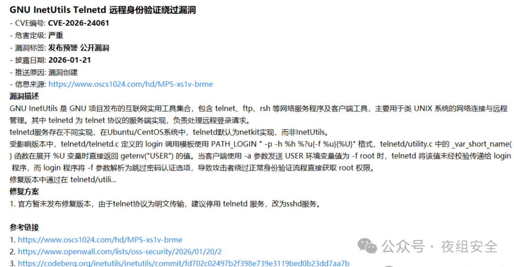
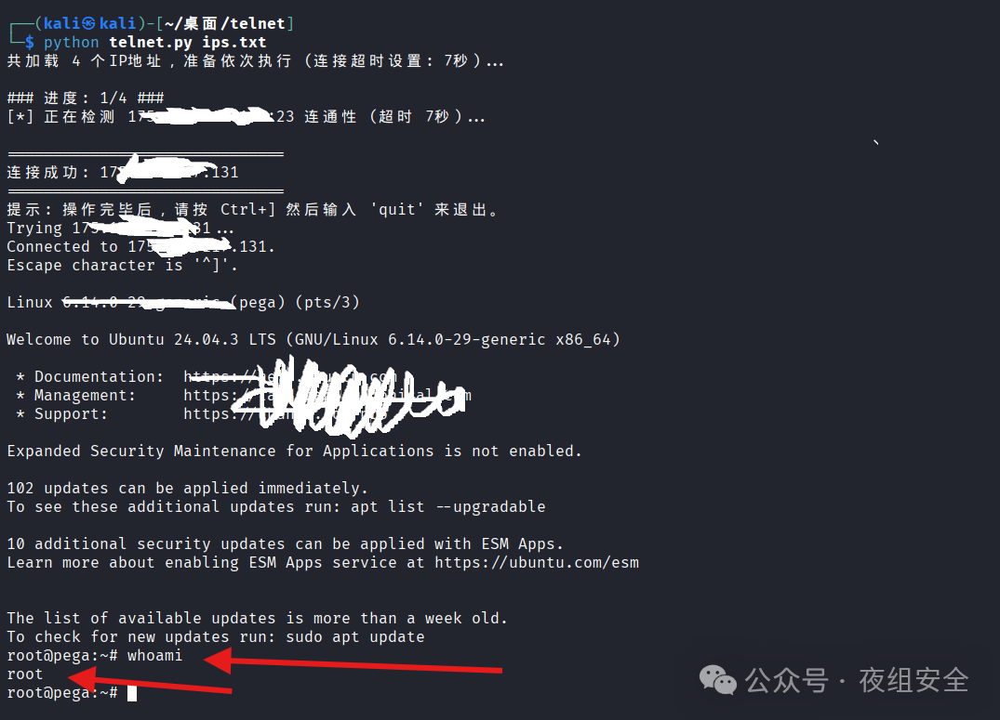
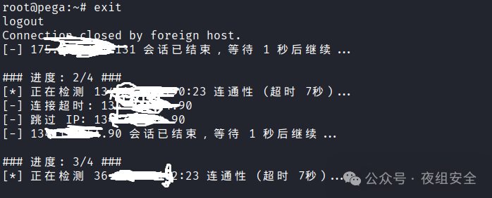

# CVE-2026-24061 telnet远程认证绕过漏洞批量检测工具

<!-- vulwiki-editorial:start -->
## 校订与适用边界

- 适用前提：受影响GNU telnetd、NEW-ENVIRON USER可传到login且支持-f语义；服务网络可达
- 证据范围：介绍真实登录尝试型工具，正文没有源码；不是被动版本检测

### 本次正文校订

- 按实际内容修正 1 处代码围栏语言标记，保留其中方法与请求内容。

### 尚未解决的证据缺口

以下限制仍适用于后文历史材料；相关版本、结果或修复结论不能据此视为已验证：

- 默认ips.txt与使用ip_list.txt矛盾
- IP列表和四条命令换行丢失黏连
- 缺影响/修复版本和成功判定细节；root取决于目标账户/服务条件
- 归其他组件可规范到GNU Inetutils并关联已有研究

本页为文本校订，未执行代码、PoC 或目标请求；原图仅保留引用，未据此确认复现成功。
<!-- vulwiki-editorial:end -->

## 技术正文与历史材料

 黑白之道   2026-01-30 01:18  
  
  
  
## 工具介绍  
  
**Tell Me Root（基于cve-2026-24061 telnet远程认证绕过漏洞的批量检测工具）**  
  
CVE-2026-24061 是 GNU inetutils telnetd中的未授权访问漏洞。简单来说，telnetd 会把客户端传递的 USER 环境变量直接交给 login程序，而 login 有个 -f 参数可以免密登录指定用户。攻击者只要注入 USER='-f root'，就能让目标机器执行 login -f root，直接拿到 root 权限。  
  
  
## 功能特性  
- **批量处理**  
：支持从文本文件（默认 ips.txt  
）批量导入目标 IP。  
  
- **智能预检**  
：在启动 Telnet 客户端前，先通过 Socket 进行端口存活检测，避免因 IP 不通导致的无效等待。  
  
- **自动payload检查**  
：内置 payloads，自动尝试登录目标服务器。直接在当前窗口拿到权限。  
  
- **实时进度监控**  
：清晰展示当前处理进度（例如 ### 进度: 3/10 ###  
）。  
  
- **容错处理**  
：自动跳过超时、连接被拒绝或不可达的 IP，并继续执行下一个任务。  
  
## 工具使用  
### 1. 准备目标列表  
  
在脚本同级目录下创建 ip_list.txt  
 也可以自定义名称，每行输入一个 IP 地址。支持使用 #  
 进行注释：  
```
192.168.1.1192.168.1.102# 暂时跳过该服务器# 10.0.0.5
```  
### 2. 直接运行脚本  
```shell
python tell_me_root.py或python3 tell_me_root.py或python tell_me_root.py 自己的ip列表文件或python3 tell_me_root.py 自己的ip列表文件
```  
## 运行示例  
  
  
  
  
  
  
## 工具获取  
  
  
https://github.com/parameciumzhang/Tell-Me-Root  
  
> **文章来源：夜组安全**  
  
  
  
黑白之道发布、转载的文章中所涉及的技术、思路和工具仅供以安全为目的的学习交流使用，任何人不得将其用于非法用途及盈利等目的，否则后果自行承担！  
  
如侵权请私聊我们删文  
  
  
**END**  
  
  


---

> 来源：gelusus/wxvl（微信公众号漏洞文章自动归档，原文见文首链接）
