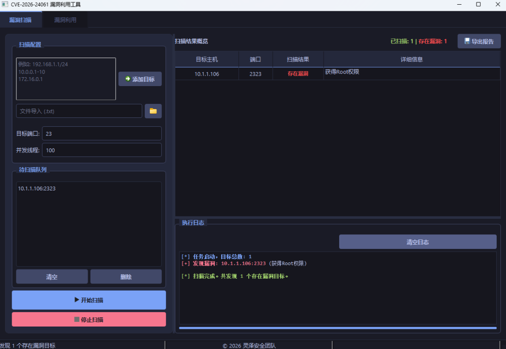
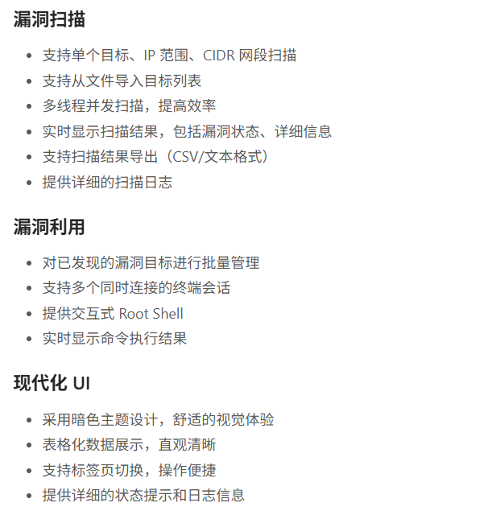
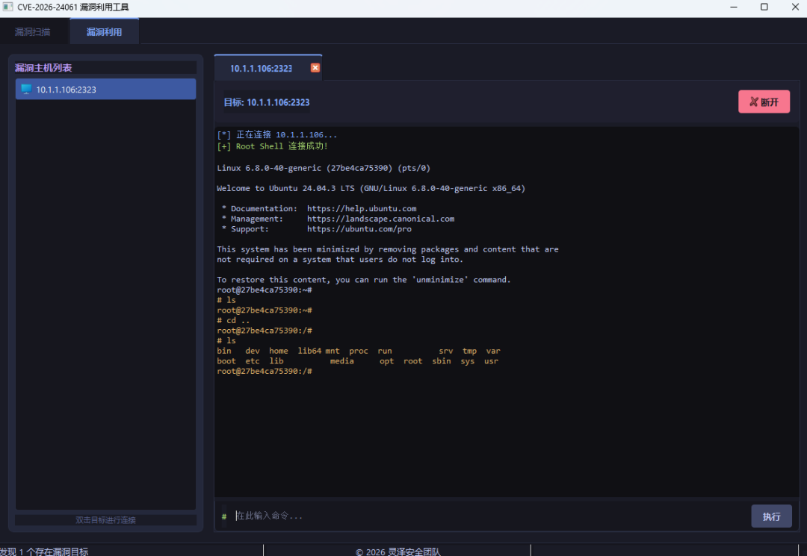

# GUI | CVE-2026-24061 telnetd 身份验证绕过漏洞检测与利用工具

<!-- vulwiki-editorial:start -->
## 校订与适用边界

- 适用前提：底层GNU telnetd受影响及login配置；GUI本身条件未给
- 证据范围：特性全靠截图且下载公众号回复门槛，无源码/公开下载/测试机制；无法独立审工具准确性

### 尚未解决的证据缺口

以下限制仍适用于后文历史材料；相关版本、结果或修复结论不能据此视为已验证：

- 无用户名密码却默认root的条件未完整说明
- 缺版本、修复、PoC和可访问工具来源
- 调整超时/重复扫描不能替代正确成功判据；广告与推荐尾部占多

本页为文本校订，未执行代码、PoC 或目标请求；原图仅保留引用，未据此确认复现成功。
<!-- vulwiki-editorial:end -->

## 技术正文与历史材料

Lingzesec
                    Lingzesec  夜组安全   2026-01-28 00:00  
  
免责声明  
  
由于传播、利用本公众号夜组安全所提供的信息而造成的任何直接或者间接的后果及损失，均由使用者本人负责，公众号夜组安全及作者不为此承担任何责任，一旦造成后果请自行承担！如有侵权烦请告知，我们会立即删除并致歉。谢谢！  
**所有工具安全性自测！！！VX：**  
**NightCTI**  
  
朋友们现在只对常读和星标的公众号才展示大图推送，建议大家把  
**夜组安全**  
“**设为星标**  
”，  
否则可能就看不到了啦！  
  
  
  
  
## 工具介绍  
  
这是一个用于检测和利用 CVE-2026-24061 漏洞的 GUI 工具。该漏洞是 GNU Inetutils telnetd 身份验证绕过漏洞，允许攻击者无需用户名和密码即可获取 root 权限。  
  
  
## 功能特性  
  
  
  
  
  
  
## 常见问题  
### Q: 扫描结果显示"连接超时"是什么原因？  
  
A: 可能是目标系统未开放 Telnet 端口，或者网络连接不稳定，建议检查目标系统的网络设置和 Telnet 服务状态。  
### Q: 为什么扫描速度较慢？  
  
A: 扫描速度受多种因素影响，包括网络带宽、目标系统响应速度、并发线程数等。可以尝试调整并发线程数来优化扫描速度。  
### Q: 连接终端时提示"连接被拒绝"是什么原因？  
  
A: 可能是目标系统的 Telnet 服务已关闭，或者防火墙阻止了连接。建议检查目标系统的 Telnet 服务状态和防火墙设置。  
### Q: 如何提高扫描准确性？  
  
A: 建议在网络稳定的环境中进行扫描，适当调整超时时间，避免误判。对于重要目标，可以进行多次扫描确认结果。  
### 免责声明  
  
本工具仅供学习和合法的安全测试使用，请勿用于非法用途。使用本工具造成的任何后果，由使用者自行承担。作者不承担任何法律责任。  
### 版权信息  
  
© 2026 灵泽安全团队  
  
保留所有权利。  
  
## 工具获取  
  
  
  
点击关注下方名片  
进入公众号  
  
回复关键字【  
260128  
】获取  
下载链接  
  
  
## 往期精彩  
  
  
[自动化代码审计，支持PHP、Java、Python、Go、Node.js等多种语言项目环境搭建、漏洞分析、漏洞验证、报告产出2026-01-27](https://mp.weixin.qq.com/s?__biz=Mzk0ODM0NDIxNQ==&mid=2247496187&idx=1&sn=24eae57023d0e2318a74064f4395c0b2&scene=21#wechat_redirect)  
[那些只可意会不可言传的互联网黑话，你了解吗？2026-01-26](https://mp.weixin.qq.com/s?__biz=Mzk0ODM0NDIxNQ==&mid=2247496177&idx=1&sn=cb26038422e32a7dee598782a2895b92&scene=21#wechat_redirect)  
[CVE-2026-24061 telnet远程认证绕过漏洞批量检测工具2026-01-23](https://mp.weixin.qq.com/s?__biz=Mzk0ODM0NDIxNQ==&mid=2247496176&idx=1&sn=e958be1492140a42d339f90a9796e60c&scene=21#wechat_redirect)  
[新Shiro反序列化漏洞一站式综合利用工具2026-01-22](https://mp.weixin.qq.com/s?__biz=Mzk0ODM0NDIxNQ==&mid=2247496167&idx=1&sn=233a0b85e6a95a8ce91122c9ccdac697&scene=21#wechat_redirect)  
[【红队】一款专业的多协议漏洞利用与攻击模拟平台2026-01-21](https://mp.weixin.qq.com/s?__biz=Mzk0ODM0NDIxNQ==&mid=2247496145&idx=1&sn=38b1287a667573c09ed4f056afc64b4c&scene=21#wechat_redirect)  
  
  
  
  

---

> 来源：gelusus/wxvl（微信公众号漏洞文章自动归档，原文见文首链接）
