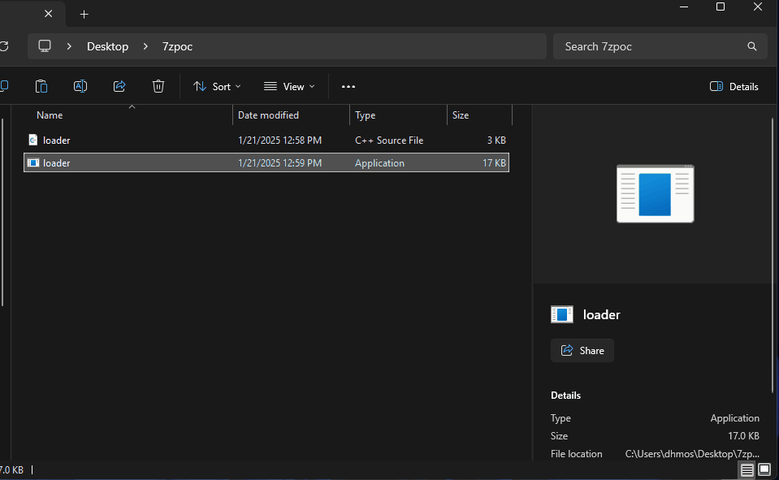
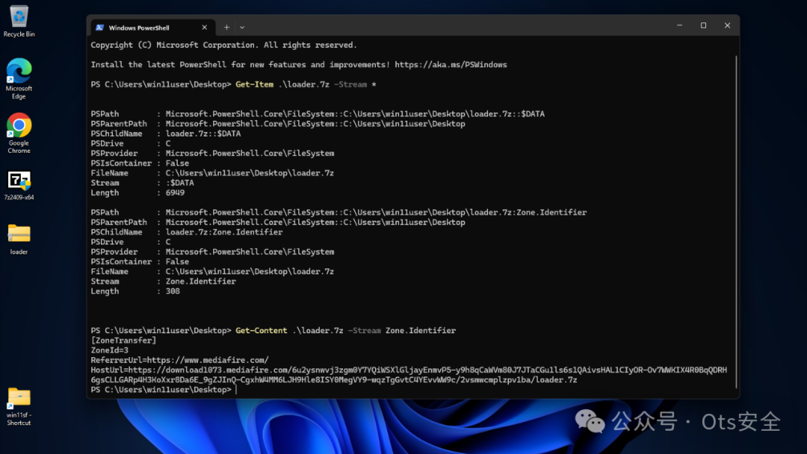

#  7-Zip Mark-of-the-Web 绕过漏洞 [CVE-2025-0411] - POC   

<!-- vulwiki-editorial-rebuild:system-misc -->
## 条目范围与校订

- 本文对象：7-Zip on Windows
- 文献类型：MotW绕过PoC演示摘要
- 版本、权限及部署边界：24.07与修复24.09对照；带MotW双层压缩包且受害者解压后执行载荷；用户交互必需
- 核验状态：仅重建文本校订；未执行文中代码、PoC 或扫描，未把截图或转载声明记为本站复现

### 具体结论与待核项

以下为原归档的逐项勘误与证据缺口；可由文本确定的问题已在下文订正，仍缺来源的事实保持待核。

1. NVD参考URL错为CVE-2025-0441，与全文0411不符，应纠正引用而非新增漏洞
2. 安全标记不传播是主效果，后续用户运行加载器的代码执行不是7-Zip直接内存RCE，摘要需保留区分
3. 声称24.09之前所有版本过宽需原公告版本下限/平台行为核对；精确24.07/24.09实验可保留
4. 源ZDI和dhmosfunk源码齐全但未固定提交，主要证据GIF未视检；网站访问本身与打开/运行阶段关系需写清
5. 送货等机翻标题和装饰尾部清理，补7-Zip官方版本公告

### 操作风险

原文技术操作的实际副作用未复现核验；按其请求/代码评估状态变更、凭据暴露和业务影响

技术请求、代码与实验方法按原文保留；其中的破坏性动作仅限授权、可恢复的隔离环境。缺失代码、参数或版本事实不猜补。

### 来源追溯

- 原文参考链接（未重新核验）：<https://www.zerodayinitiative.com/advisories/ZDI-25-045/>
- 原文参考链接（未重新核验）：<https://nvd.nist.gov/vuln/detail/CVE-2025-0441>
- 原文参考链接（未重新核验）：<https://securityonline.info/cve-2025-0411-7-zip-security-vulnerability-enables-code-execution-update-now/>
- 原文参考链接（未重新核验）：<https://github.com/dhmosfunk/7-Zip-CVE-2025-0411-POC>
- 原始披露 URL 未确认；既有归档来源标签保留，不能替代原始公告

### 归档技术正文

 Ots安全   2025-01-23 05:04  
  
  
  
**CVE-2025-0411 详细信息**  
  
“此漏洞（CVSS SCORE 7.0）允许远程攻击者绕过受影响的 7-Zip 安装上的 Mark-of-the-Web 保护机制。利用此漏洞需要用户交互，即目标必须访问恶意页面或打开恶意文件。特定缺陷存在于存档文件的处理中。从带有 Mark-of-the-Web 的精心设计的存档中提取文件时，7-Zip 不会将 Mark-of-the-Web 传播到提取的文件中。攻击者可以利用此漏洞在当前用户的上下文中执行任意代码。”  
  
**存在漏洞的版本**  
- 24.09之前的所有版本都存在漏洞。  
  
**缓解措施**  
- “更新 7-Zip：从官方 7-Zip 网站下载并安装 24.09 或更高版本。”  
  
- “谨慎对待不受信任的文件：避免打开来自未知或可疑来源的文件，尤其是压缩档案。”  
  
- “利用安全功能：确保您的操作系统和安全软件配置为检测和阻止恶意文件。”  
  
**概念验证**  
  
作为 POC 的一部分，实现了 calc.exe 的一个简单加载器。  
  
**武器化**  
  
该方法是双重压缩触发漏洞的可执行文件。  
  
  
  
**送货**  
  
接下来，将双重压缩的 7Zip 文件上传到有效载荷传送服务器（在本例中为 MediaFire），并通过提供恶意 URL 的网络钓鱼电子邮件传送给受害者。下载文件后，可以看到“MotW”（Zone.Identifier - 下载来源）：  
  
  
  
**执行**  
  
作为执行的一部分，受害者需要点击压缩文件并运行可执行文件。      
  
**修补版本**  
  
在这种情况下，使用 7Zip 24.09 版本（已修补），它显示 Windows SmartScreen 警告，该文件来自不受信任的来源（因为它包含 MotW）。  
  
  
  
**存在漏洞的版本**  
  
在这种情况下，使用 7Zip 24.07 版本（易受攻击），它允许直接执行可执行文件而不显示任何警告（因为它不包含 MotW）。  
  
  
  
**参考**  
- https://www.zerodayinitiative.com/advisories/ZDI-25-045/  
  
- https://nvd.nist.gov/vuln/detail/CVE-2025-0441  
  
- https://securityonline.info/cve-2025-0411-7-zip-security-vulnerability-enables-code-execution-update-now/  
  
**项目地址：**  
  
https://github.com/dhmosfunk/7-Zip-CVE-2025-0411-POC  
  
  
  
感谢您抽出  
  
  
  
.  
  
  
  
.  
  
  
  
来阅读本文  
  
  
  
**点它，分享点赞在看都在这里**  
  
  

---

> 来源：gelusus/wxvl（微信公众号漏洞文章自动归档，原始披露 URL 尚未确认，现有链接按来源追溯区分别标注）
