# CVE-2024-11477 7Zip 中的“代码执行”漏洞 Writeup

<!-- vulwiki-editorial-rebuild:system-misc -->
## 条目范围与校订

- 本文对象：7-Zip 自带Zstandard解码器 ZStdDec.c
- 文献类型：7-Zip漏洞探索译文/负面利用结果
- 版本、权限及部署边界：作者限定24.05/24.06并比较24.07/24.08；Linux gdb源码构建、特定64位load/preload宏，处理恶意.zstd
- 核验状态：仅重建文本校订；未执行文中代码、PoC 或扫描，未把截图或转载声明记为本站复现

### 具体结论与待核项

以下为原归档的逐项勘误与证据缺口；可由文本确定的问题已在下文订正，仍缺来源的事实保持待核。

1. 结尾明确仅达无界堆写/segfault，作者未找到RCE且对可利用性存疑，必须保留不确定性；不能把本文当RCE成功或据此断言CVE不可利用
2. 产品是7-Zip解码实现，不要因Facebook Zstandard介绍归为上游zstd通用漏洞；压缩误译加密应修正
3. 作者多次编辑纠正of_code/matchLen及AT&T/Intel操作数，应整理最终正确叙述并保留勘误，单波浪删除线未正确排版
4. 所有代码段开头反复ounter(line噪声，CopyPrepare按位对齐注释strip to1byte错误，应说明按16字节边界
5. 说在GDB直接rs却未启用record/reverse支持，示例依赖不完整；segfault.zstd称附件但无链接
6. 缺原作者源文/PoC/7-Zip公告，只有RFC和Twitter，截图未视检；版本结论需官方修复变更核对

### 操作风险

原文技术操作的实际副作用未复现核验；按其请求/代码评估状态变更、凭据暴露和业务影响

技术请求、代码与实验方法按原文保留；其中的破坏性动作仅限授权、可恢复的隔离环境。缺失代码、参数或版本事实不猜补。

### 来源追溯

- 原文参考链接（未重新核验）：<https://datatracker.ietf.org/doc/html/rfc8878>
- 原文参考链接（未重新核验）：<https://x.com/LowLevelTweets>
- 原始披露 URL 未确认；既有归档来源标签保留，不能替代原始公告

### 归档技术正文

TheN00bBuilder  securitainment   2024-11-30 09:17  
  
> CVE-2024-11477-Writeup   
  
  
  
大家好！  
  
在本周的第一篇文章中，我开始讨论一个热门话题。周一，一位同事给我发了一条关于 CVE-2024-11477 的链接，这是一种声称存在于 7Zip 中的“代码执行”漏洞，影响版本 24.05 和 24.06（顺便提一下，_每个人_似乎都忽略提到这仅影响**2**  
 个小版本）。  
  
该 CVE 表示它涉及 ZStandard 压缩库，这是一个由 Facebook 创建的开源压缩库。它在  
RFC 8878[1]  
 中有非常严格的定义，我们稍后将使用它（称为“RFC”）。  
  
这是我尝试找出造成此问题的原因以及如何利用它的经历。  
## 快速补丁差异，真不错  
  
让我们从 SourceForge 下载 7Zip 源代码，开始进行补丁差异分析。我希望这部分不会太难。  
  
我首先专注于对比“ZStdDec.c”文件，我有一种预感它可能与 ZStandard 解压缩有关。  
  
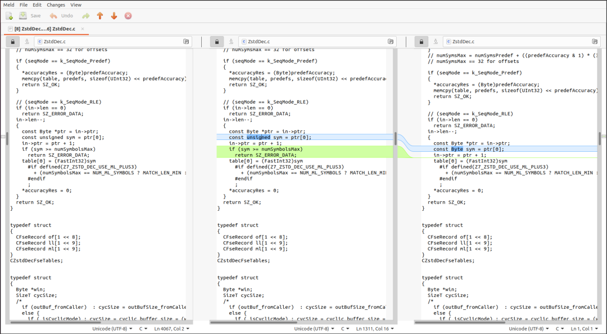  
  
seriously man  
  
哦。哈哈。让我们在 VSCode 中打开它。  
  
注意：24.08 在左侧，24.07 在中间，24.06 在右侧。  
  
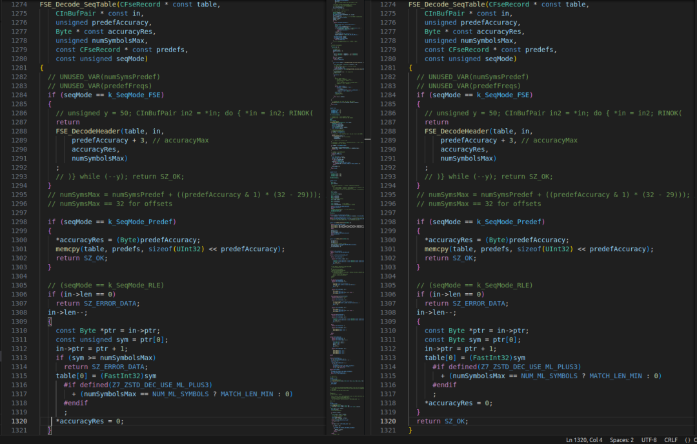  
  
both of them  
  
唯一的区别在于FSE_Decode_SeqTable  
 函数，它专注于对 Zstd 格式文件中存在的三种序列表进行某种处理（目前还不确定）——字面长度、偏移量和匹配长度，根据 RFC。您可以看到添加的代码只是检查大小，以确保一个神秘的sym  
 值不会超过允许的最大符号数量，同时将其数据类型从Byte  
（字符）更改为unsigned  
（4 字节无符号整数）。  
  
所以让我们加载一个 Zstd 加密文件，看看这个神秘的sym  
 值在我们的输入文件中被移除到哪里。  
## 进行实际工作  
  
下一个挑战是获取一个带符号的 7zip 副本，因为预编译的二进制文件已被剥离——这对可移植性很好，但对像我这样的逆向工程师来说却很糟糕，因为他们不喜欢编译东西，因为他们与复杂的构建系统有过太多的冲突，每次看到 Makefile 都会加重他们的 PTSD 和腕管综合症。  
  
咳咳  
，抱歉。我会停止这种投射。  
  
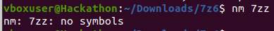  
  
:(  
  
幸运的是，过程很简单——要编译不剥离符号的 7zip，只需在7zip_gcc_c.mak  
 和7zip_gcc_cpp.mak  
 文件中更改“LSTRIP”标志。感谢  
Low Level Learning[2]  
 的指点。  
  
一旦处理完这些，我们就可以专注于在 gdb 会话中调用FSE_Decode_SeqTable  
 函数。我们将示例函数作为参数传入，并启用x  
 标志，如下所示：7zz x whatever.zstd  
。第一次运行时，在顶部设置了初始断点，似乎该函数在正常压缩的 Zstd 文件中被调用了 3 次。这有助于验证上面的序列表理论（以及函数明确命名它们，这也有帮助）。  
  
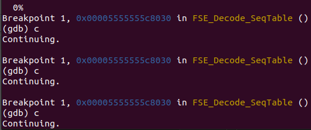  
  
i just saw 3 hits  
  
但看起来我们没有进入易受攻击的部分，因为设置在那里的断点似乎没有捕获到任何内容。回到源代码，有三条路径可以选择。传入的seqMode  
 变量控制它采取的路径。为了让我们进入想要的部分，我们需要确保该值不等于 0 或 2——分别是k_SeqMode_Predef  
 和k_SeqMode_FSE  
。  
  
幸运的是，这些值与 RFC 中的表 15 对应。这基本上描述了解压缩工具处理的表的格式，其中Predef  
 为 0，RLE  
 为 1，FSE  
 为 2。我们现在知道，达到易受攻击代码的模式是RLE  
，这是一种相对简单的表格式，使用一个字节表示表中的所有序列。这与目标代码（来自第 1310 行到第 1318 行）将一个值分配给表的第一个元素（第 1313 行）相符，接下来的字节来自文件。  
  
现在我们知道需要设置什么以进入该部分，让我们找出文件中需要更改的内容，以便到达我们的易受攻击代码。我再次在FSE_Decode_SeqTable  
 函数的开头设置了一个断点，但现在想看看in  
 值。如果我对这段代码的理解正确，in  
 值只是指向文件字节的指针。通过在开头断点并分析存储它的寄存器（rsi  
），我们可以找到它指向的这 4 个字节的文件。  
  
  
  
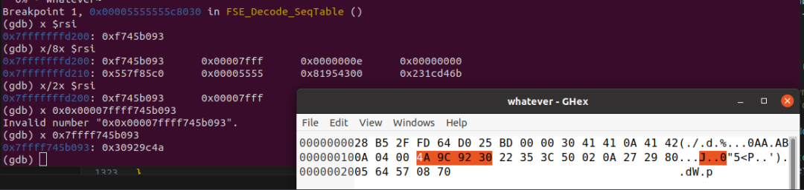  
  
 displayed in file and in memory  
  
现在知道我们调用函数时的位置，我们就可以找到seqMode  
 的来源！FSE_Decode_SeqTable  
 仅在一个函数中被调用的 3 个地方：ZStdDec1_DecodeBlock  
。seqMode  
 的祖先，恰如其分地命名为mode  
，是从in  
 变量的当前位置加载的，在第 2526 行（高亮显示），然后该值被后增量以跳过in  
 缓冲区中的单个值，然后将该缓冲区地址和seqMode  
 传递给FSE_Decode_SeqTable  
 函数的多个调用。  
  
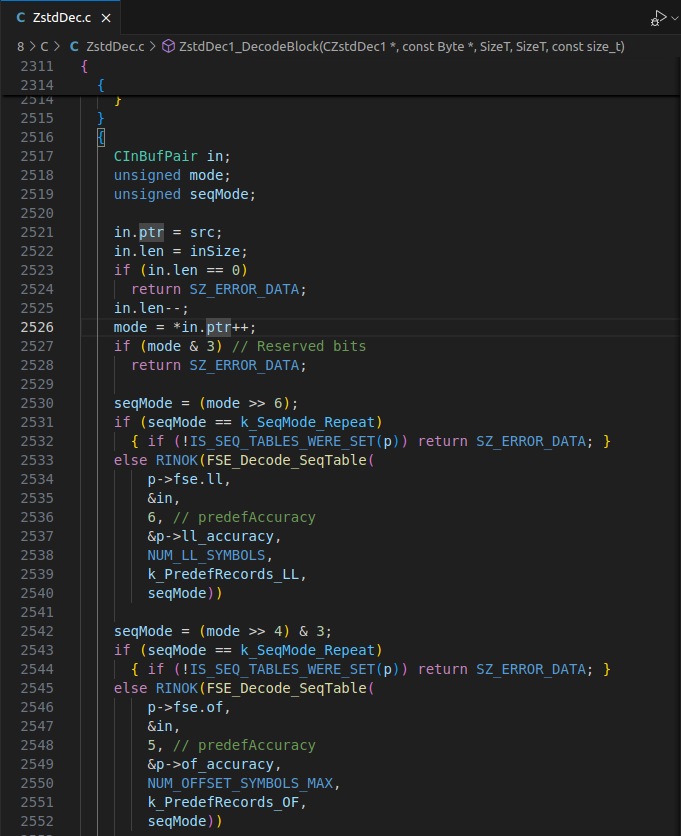  
  
the c source for what we're looking at  
  
但mode  
 只是战斗的一半，我们可以看到它将该值右移了 6 和 4 次（它也对 2 进行了相同的操作，但我无法在一台显示器上显示所有内容）。这也有意义，因为如果我们查看 RFC 中的表 14，这 3 种模式以 2 位值存储在一个字节中。这个字节就是我们的mode  
，然后我们通过拆分其部分将其转换为seqMode  
。这里有一个糟糕的图解来更好地解释它。  
  
  
  
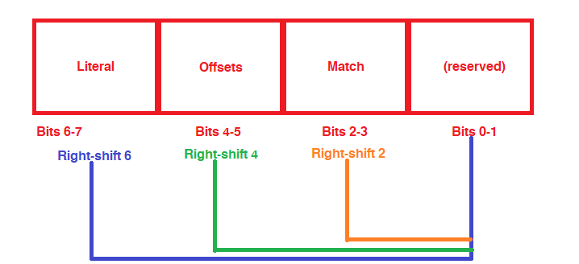  
  
shitting or shifting?  
  
让我们列出我们所知道的内容。我们有...  
- 文件中值的位置（在 GDB 中发现的表数据之前）  
  
- 每个 2 位字段的值（1，因此我们可以像RLE  
 文件一样操作）  
  
做一点数学告诉我们，我们需要将这个 00 字节交换为 0x54（这是 0b01010100）。所以让我们这样做，然后...  
  
  
  
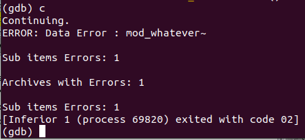  
  
new error new me  
  
不错！出现了一个错误！这很有道理，因为我们告诉它我们确实有一个 RLE 表，但实际上并没有。  
## 满足错误  
  
将其放回 GDB 中将显示我们通过了对FSE_Decode_SeqTable  
 的三次调用——在这方面成功！现在我们可以继续查看下一个调用的函数，即Decompress_Sequences  
（老实说，我们在这里失败是很有道理的）。  
  
为此，我们使用一个叫做“反向步进”的小技巧，自 GDB 版本 7.0 起就有了。为此，在Decompress_Sequence  
 的返回地址处设置一个断点，然后输入rs  
，直到您到达函数出错的地方。对我们来说，我们在Decompress_Sequences+0x204  
 附近出错。然后我们可以进入 Ghidra，突出显示我们失败的代码，并在反编译中看到它被突出显示，如下所示。  
  
  
  
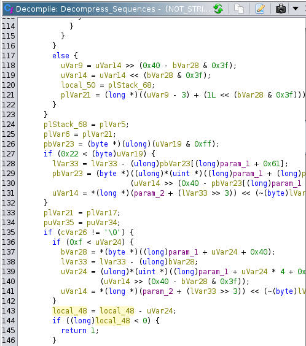  
  
I love ghidra  
  
从这里，我们可以浏览源代码，找到导致此问题的实际代码，我们在第 2227 行附近找到了它。  
  
  
  
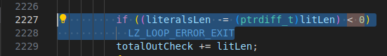  
  
Having source is nice though  
  
这一行是一个基本检查，检查literalsLen - litlen  
 是否会下溢（小于 0），确实会。litlen  
 是由几个函数设置的，最显著的是源代码第 2199 行的这个丑陋的“GET_FSE_REC_SYM”宏。这个宏扩展为结构体中的一个字段，但我宁愿在 GDB 中第 2199 行设置一个断点，看看里面有什么...  
  
  
  
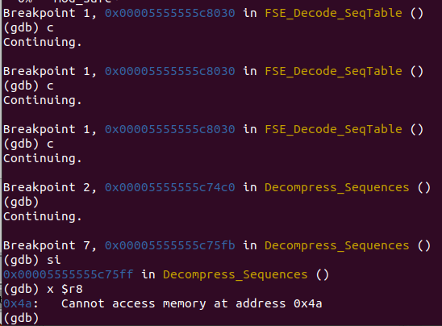  
  
Fascinating  
  
...嘿，看看这个！这是 0x4a。如果这看起来熟悉，你没错！它来自文件字节序列表头后面的字节。这是因为“表”正好位于我们之前发现的头部之后。  
  
一旦确认该值大于或等于 16，它将索引到字面长度基表中，使用第 2206 行的宏。  
  
  
  
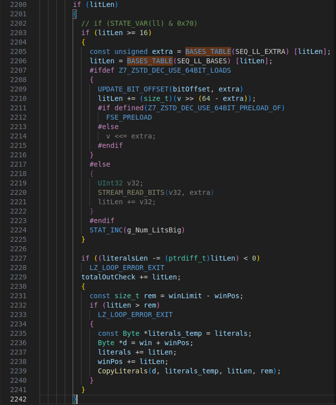  
  
Sorry for the large photo  
  
RFC 中存在此表的副本，但仅索引到 35，且索引没有上限...因此为了通过第 2225 行的检查，让我们强制进入表的未初始化部分，也许它会返回 0 作为litLen  
。值 0xff 应该很好...  
  
  
  
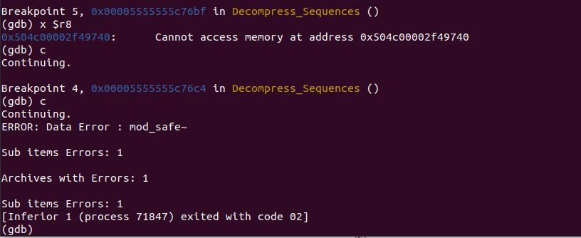  
  
Same error, different values  
  
哇，减去的值很奇怪（存储在 R8 中）。难怪它又出错了。但看到这一点告诉我们，我们在应该更改的内容上走在正确的轨道上，只是我们还没有远离表格足够远。  
  
在程序中，我们启用了USE_64BIT_LOADS  
，因此我们必须查看第 2209 行和 2210 行，因为这些行将超大值设置为litLen  
。SEQ_LL_EXTRA  
 表也使用litLen  
 进行索引，如第 2205 行所示，因此其来源至少是已知的...但在 RFC 中没有对此的引用。我唯一能想到的是，作为 64 位特定的并被称为“额外”，它可能与我们在文件中更改的字节有关？此时我很累，所以我去睡觉，第二天再回来。  
  
~在 RFC 中进一步查找（整整 4 行，昨天我没有看到），这个“额外”也可能是 RFC 中字面长度代码后面的“匹配长度代码”。所以，我很好奇，让我们将下一个字节设置为 0xff，以索引超出表的末尾。~  
  
**编辑：进一步显示我的愚蠢的是，litLen 值后面的字节不是匹配长度代码，而是源代码第 2069-2149 行处理的of_code。我们还关注在其后处理的matchLen，源代码在 2155-2188 行。以下是我们在此函数中调查的 3 个值的格式：**  
  
  
  
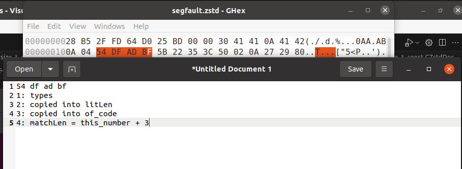  
  
bytes and annotation  
- B1：那个 0x54 值  
  
- B2：litLen  
  
- B3：of_code，偏移代码  
  
- B4：matchLen  
  
偏移代码在 RFC 中的定义在匹配长度字段之后，是“要读取的附加位数”，以“转换为偏移值”。其最大值在 RFC 中定义为 31，但在 7zip 中的检查被视为“可选”，如第 2137 行所示。这允许我们将其设置为 0xff。  
  
  
  
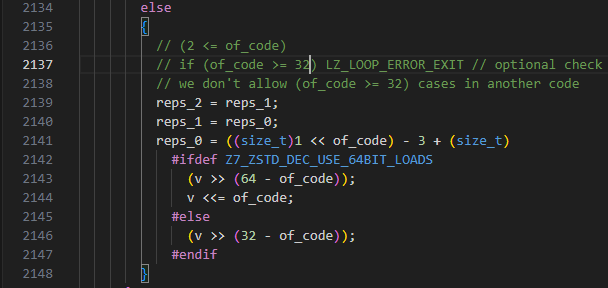  
  
code_2137_to_2148  
  
**编辑：今天早上回顾我的工作时，我发现我在初始提交中犯了一个大错误。我在修改文件时，在事后写作时，我没有记住我更改了我提到的字节_之后_（与matchLen 一起使用）。我非常抱歉，这很重要。今后我会更加小心，仔细校对我的工作。**  
  
所以现在我们已经控制了 litLen 和 of_code，我们遇到了一个错误。它与之前的错误相同，在同一位置，发生在第 2225 行的“数据错误”。所以现在，让我们仔细看看比较。  
  
  
  
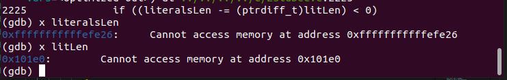  
  
comparison values  
  
有趣的是，literalsLen  
 在这里是一个相当疯狂的负数，而litLen  
 是一个相当大的数字。litLen  
 在源代码第 2208 行设置，其中一个随机的v  
 值右移了 64 -extra  
，将这个v  
 值右移了 64（因为extra  
 为 0）。  
```
ounter(lineounter(lineounter(lineounter(lineounter(lineounter(lineounter(lineounter(lineounter(lineounter(lineounter(lineounter(lineounter(lineounter(lineounter(lineounter(lineounter(lineounter(lineounter(lineounter(lineounter(lineounter(lineounter(line
if (litLen >= 16)
          {
            const unsigned extra = BASES_TABLE(SEQ_LL_EXTRA) [litLen];
            litLen = BASES_TABLE(SEQ_LL_BASES) [litLen];
            #ifdef Z7_ZSTD_DEC_USE_64BIT_LOADS
            {
              UPDATE_BIT_OFFSET(bitOffset, extra)
              litLen += (size_t)(v >> (64 - extra)); // 2208 here!
              #if defined(Z7_ZSTD_DEC_USE_64BIT_PRELOAD_OF)
                FSE_PRELOAD
              #else
                v <<= extra;
              #endif
            }
            #else
            {
              UInt32 v32;
              STREAM_READ_BITS(v32, extra)
              litLen += v32;
            }
            #endif
            STAT_INC(g_Num_LitsBig)
          }
```  
  
现在来看v  
，它是在定义了Z7_ZSTD_DEC_USE_64BIT_PRELOAD_OF  
 时设置的FSE_PRELOAD  
 宏中进行的。这个宏相当复杂，但让我们逐步分析它。  
```
ounter(lineounter(lineounter(lineounter(line
// FSE PRELOAD
const Byte *ptr = src - 4 + (7 - 3) + ((CBitCtr_signed)(bitOffset) >> 3);
v = (*(const UInt64 *)(const void *)(ptr));
v <<= (7 ^ (((unsigned)(bitOffset) & 7)));
```  
  
哎呀。现在我们需要知道ptr  
、src  
 和bitOffset  
 是什么。ptr  
 和src  
 都是指向 Zstd 文件缓冲区某个位置的指针，而bitOffset  
 是一个在开头由宏设置的魔法值。实际的宏本身也相当复杂（见下文），但从一开始读取它的值显示，在我们的情况下bitOffset  
 最初被设置为 0x5a。  
  
  
  
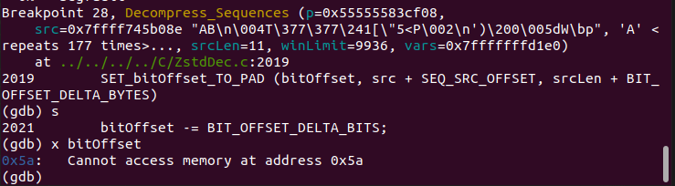  
  
设置为 0x5a 的证明  
```
ounter(lineounter(lineounter(lineounter(lineounter(line
unsigned lastByte = (src + 7)[(size_t)(srcLen + 1) - 1];
if (lastByte == 0)
 return 1;
bitOffset = (CBitCtr)((srcLen + 1) * 8);
bitOffset -= (CBitCtr)(((unsigned)__builtin_clz((UInt32)lastByte)) - 23);
```  
  
但重要的是，还有另一个宏叫做UPDATE_BIT_OFFSET  
，它从bitOffset  
 字段中减去一个传入的值，并将bitOffset  
 更新为这个新值——看起来就像bitOffset -= fieldPassed  
。查看对这个UPDATE_BIT_OFFSET  
 的调用，似乎在第 2069 行有一个使用了我们控制的of_code  
 的调用，还有一个在第 2170 行，使用了来自matchLen  
 表的extra  
 值。  
  
如果bitOffset  
 从 0x5a 开始，我们可以在第 2069 行的调用中使bitOffset  
 变为负值，这可能会在第 2152 行调用的宏FSE_PRELOAD  
 中产生一些有趣的行为，因此我们可以将 v 设置为 0。但要做到这一点，我们需要确保第 2170 行的UPDATE_BIT_OFFSET  
 不会发生。幸运的是，第 2170 行的坏宏受到我们在第 2162 行控制的matchLen  
 值的保护。只要它小于 35，我们就可以完全跳过那段代码，留下我们虚假的bitOffset  
 值。  
```
ounter(lineounter(lineounter(lineounter(lineounter(lineounter(lineounter(lineounter(lineounter(lineounter(lineounter(lineounter(lineounter(lineounter(lineounter(lineounter(lineounter(lineounter(lineounter(lineounter(lineounter(lineounter(lineounter(lineounter(lineounter(lineounter(lineounter(lineounter(lineounter(lineounter(lineounter(lineounter(lineounter(line
      #ifdef Z7_ZSTD_DEC_USE_64BIT_PRELOAD_ML
        FSE_PRELOAD // 2152 - target FSE_PRELOAD
      #endif

      matchLen = (size_t)GET_FSE_REC_SYM(STATE_VAR(ml))
          #ifndef Z7_ZSTD_DEC_USE_ML_PLUS3
            + MATCH_LEN_MIN
          #endif
          ;
      {
        {
          // 2162 - what we need to skip
          if (matchLen >= 32 + MATCH_LEN_MIN) // if (state_ml & 0x20)
          {
            const unsigned extra = BASES_TABLE(SEQ_ML_EXTRA) [(size_t)matchLen - MATCH_LEN_MIN];
            matchLen = BASES_TABLE(SEQ_ML_BASES) [(size_t)matchLen - MATCH_LEN_MIN];
            #if defined(Z7_ZSTD_DEC_USE_64BIT_LOADS) && \
               (defined(Z7_ZSTD_DEC_USE_64BIT_PRELOAD_ML) || \
                defined(Z7_ZSTD_DEC_USE_64BIT_PRELOAD_OF))
            {
              UPDATE_BIT_OFFSET(bitOffset, extra) // 2170 - a bad UPDATE_BIT_OFFSET to skip
              matchLen += (size_t)(v >> (64 - extra));
              #if defined(Z7_ZSTD_DEC_USE_64BIT_PRELOAD_OF)
                FSE_PRELOAD
              #else
                v <<= extra;
              #endif
            }
            //... removed unused else
            //...
          }
        }
      }
```  
  
让我们试试吧...  
  
  
  
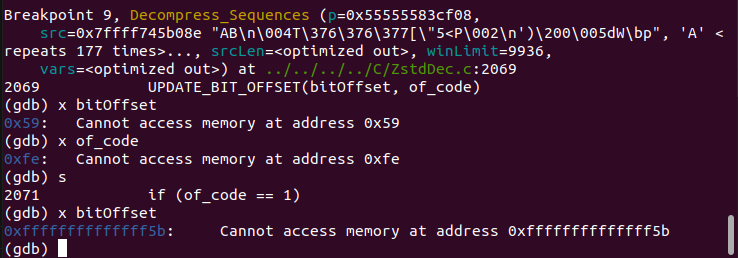  
  
bitOffset 下溢  
  
成功了！  
  
现在因为我们有点分散，让我们列出需要的值：  
- litLen  
 必须在其表中指向 0（0xff 可以做到这一点）  
  
- of_code  
 必须是一个大数字，以便我们有一个负的bitOffset  
（0xff 可以工作）  
  
- matchLen  
 必须小于 35，以便我们可以跳过对bitOffset  
 的修改（0x00 可以工作）。  
  
如果我们将bitOffset  
 设置为一个大的负数，我们可以调整ptr  
，因此可以修改v  
，这样我们就可以在第 2208 行修改litLen  
。因为请记住，我们的主要目标是修改v。  
  
那么让我们看看我们能做些什么！  
## 段错误  
  
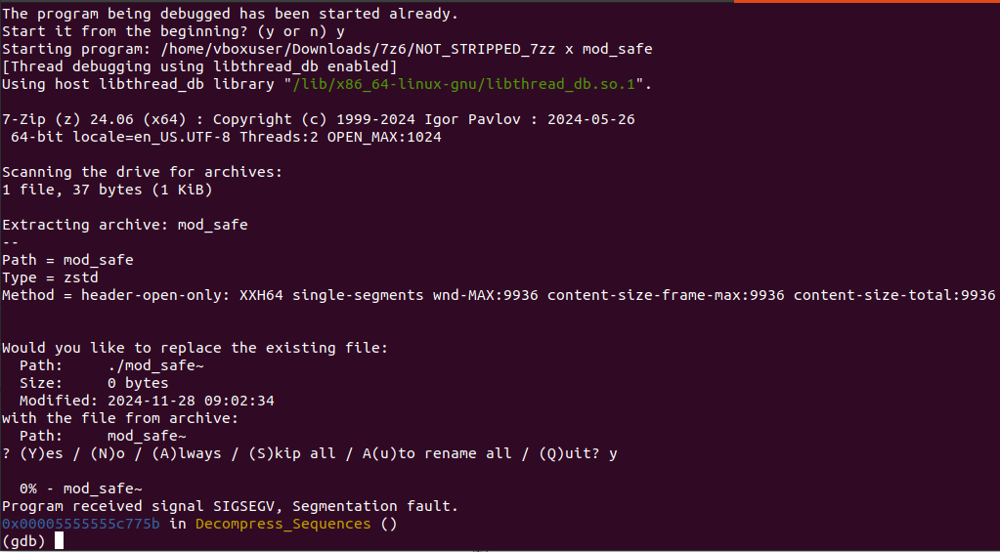  
  
  
哦，天哪！发生了段错误，太棒了！让我们做一些分析...  
  
  
  
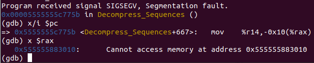  
  
代码  
  
...根据 gdb 的说法，初看CopyChunks  
 似乎是一个 ~读取~ 写入访问违规，这是从第 2237 行的CopyLiterals  
 调用的宏，我将在下面详细讨论。~但是... Ghidra 和 defuse.ca 在线反汇编工具对此截图提出了异议。我不确定为什么 GDB 以这种顺序读取参数，但操作数是交换的 -~ 我们看到的确切错误是将 r14 移动到$(rax)-0x10  
。~这使得这是一个写入访问违规。~  
  
编辑：感谢 Alex Chapman (alexchapman.bsky.social) 解释了为什么 GDB 会出现这些“反向”：GDB 的默认配置使用 att 语法，而不是 Intel 语法来打印指令。这意味着在 GDB 中操作数是反向的！老实说，我之前从未注意到这一点。  
  
执行info proc mappings  
 显示rax  
 指向堆的末尾，这让人惊讶它怎么会到达那里。这可能意味着我们有一个可控的堆写入？让我们在 Ghidra 中查看这段代码...  
  
  
  
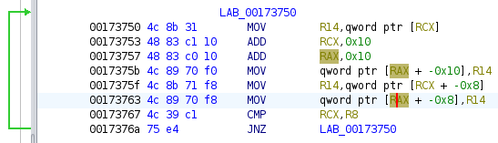  
  
循环  
  
...高亮的指令是失败的地方。似乎我们在这个宏循环中无限循环，使用我们虚假的表索引，这导致我们遍历整个堆，直到它崩溃，因为它试图写入堆的末尾。这很酷，但它试图写入什么？  
  
幸运的是，我们不需要费力去寻找它要写入的内容 - r14 是从地址 0x173750 由 rcx 指定的内存中“加载”的。所以让我们在这里设置一个断点并运行它。  
  
  
  
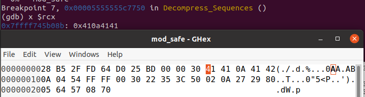  
  
我想我们找到了我们的 RCE 案例  
  
嘿，那些是文件字节！来自某个随机未命名的内存位置！  
  
  
  
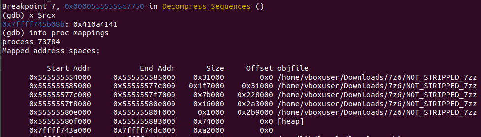  
  
一个奇怪的来源  
  
进一步循环，我们得到了更多的文件字节被复制！看起来整个文件都存储在这里。  
  
这意味着我们可能也超出了被复制的“表”的任何数据的边界，因为这些从文件中读取的值是 Zstd 解压缩用来重建二进制文件的。这份文件仅由 A、B 和换行符（0x0a）组成，因此在这里复制的字节中会看到 ASCII A 和 ASCII B。  
  
**编辑：根据这些新发现，我不喜欢我之前对wip.zstd 文件的处理。让我们专注于使这个特定的写入有界，因为现在我们有一个文件可以让我们将文件字节写入堆，我们可以简单地在末尾“附加”更多字节以进行利用。我将保留下面的旧工作，以防你想看看，但请知道这有点杂乱，并没有对结论增加太多。**  
## 限制写入？  
  
让我们看看如何限制这个写入，因为目前我们唯一能做的就是导致段错误，因为它试图超出堆的末尾。  
```
ounter(lineounter(lineounter(lineounter(lineounter(lineounter(lineounter(lineounter(lineounter(lineounter(lineounter(lineounter(lineounter(lineounter(lineounter(lineounter(lineounter(lineounter(lineounter(lineounter(line
// COPY_LITERALS
// first section is CopyPrepare
len += (16 - 1); // add 0xf as it copies 16 bytes at least once
len &= ~(size_t)(16 - 1); // strip to be 1 byte
if (len > rem) { // if len greater than remaining, fix that
 len = rem; rem &= (16 - 1);
 if (rem) {
  len -= rem;
   do *dest++ = *src++;
   while (--rem);
   if (len == 0) return;
 }
}
// this is COPY_CHUNKS, copies 0x10 bytes at a time from src to dst
do {
 ((UInt64 *)(void *)dest)[0] = ((const UInt64 *)(const void *)src)[0];
 ((UInt64 *)(void *)dest)[1] = ((const UInt64 *)(const void *)src)[1];
 src += 8 * 2;
 dest += 8 * 2;
} while (len -= 16);
```  
  
查看传递给CopyLiterals  
 的值，我们有一个目标缓冲区dest  
，源src  
（从literals_temp  
 传递过来），要复制的文字长度len  
（即litLen  
），以及一个剩余值rem  
，它是最大窗口大小的余数，以确保litLen  
 不会太大。我们确实传递了这个值，因为litLen  
 为 0，而CopyLiterals  
 函数并没有考虑到这一点！在代码中很难看出这一点，所以让我们看看反汇编的代码。  
  
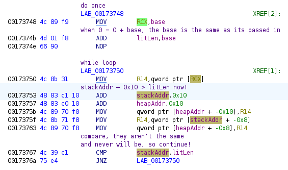  
  
annotated loop  
  
因为我们的起始值和stackAddress  
 是相同的（由于litLen  
 为 0），这两个值将永远无法匹配，倒数第二行的cmp  
 将始终失败。这就是我们得到无界堆复制的原因。  
  
**不过，这似乎没有现实的方法来设置复制的边界。**  
  
话虽如此，我不相信在当前的约束下，这个漏洞可以导致代码执行  
。希望阅读此内容的人能更好地理解我所看到的，或者找到绕过这个阻碍的方法，因为这只是对漏洞的一个非常快速的非正式分析。或者也许我完全在看错误的代码部分...  
  
为此，我附上了我在此使用的文件：segfault.zstd  
 是导致段错误的文件。  
  
我希望能被证明是错的，因为我对我遗漏的内容感到好奇。但在其他比我聪明的人能证明这一点或找到其他可能存在漏洞的地方之前...在我看来，这个漏洞被夸大了。  
### 参考资料  
  
[1]  
RFC 8878:https://datatracker.ietf.org/doc/html/rfc8878  
  
[2]  
Low Level Learning:https://x.com/LowLevelTweets  
  


---

> 来源：gelusus/wxvl（微信公众号漏洞文章自动归档，原始披露 URL 尚未确认，现有链接按来源追溯区分别标注）
